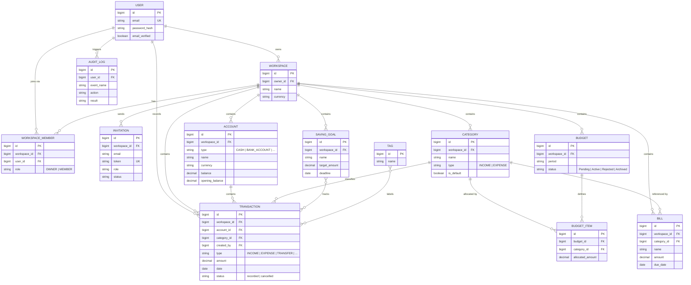

# Software Design Specification (SDS)

**Personal & Family Finance Management System**

---

## Table of Contents

1. [Introduction](#1-introduction)
   - [1.1 Purpose](#11-purpose)
   - [1.2 Scope](#12-scope)
   - [1.3 Assumptions and Constraints](#13-assumptions-and-constraints)
   - [1.4 Definitions and Acronyms](#14-definitions-and-acronyms)
   - [1.5 Related Documents](#15-related-documents)
2. [Technical Domain Model (TDM)](#2-technical-domain-model-tdm)
3. [UI Design](#3-ui-design)
   - [3.1 UI/UX Principles](#31-uiux-principles)
   - [3.2 Wireframes and Layouts](#32-wireframes-and-layouts)
4. [System Architecture](#4-system-architecture)
5. [API Specification](#5-api-specification)
6. [API Index and Error Response Catalog](#6-api-index-and-error-response-catalog)
   - [6.1 API Index](#61-api-index)
   - [6.2 Error Response Catalog](#62-error-response-catalog)
7. [Database Schema](#7-database-schema)
8. [Feature Implementation Mapping](#8-feature-implementation-mapping)

---

## 1. Introduction

### 1.1 Purpose

This Software Design Specification (SDS) defines the technical architecture, design patterns, API contracts, database schema, and implementation strategy for the Personal & Family Finance Management System. The SDS translates the SRS requirements into concrete technical decisions and provides guidance for developers, testers, and operators.

### 1.2 Scope

**Technical Domains Covered:**

- System architecture (layered, component, deployment)
- UI/UX design principles and layout patterns
- REST API specification with request/response DTOs
- Database schema with tables, relationships, and indexes
- Feature-to-implementation mapping (which entities, APIs, and UI components realize each SRS user story)

**Out of Scope:**

- Detailed implementation code (covered in source code)
- Deployment procedures (covered in RUNBOOK.md)
- Infrastructure as Code (Terraform, CloudFormation)
- Third-party integration details (future scope)

### 1.3 Assumptions and Constraints

**Assumptions:**

- PostgreSQL 14+ is the database engine
- FastAPI 0.95+ is used for the backend
- React 18+ with TypeScript for the frontend
- Developers are familiar with REST API design, ORM patterns, and SQL
- All authentication/authorization is handled via JWT tokens

**Constraints:**

- Single-tenant MVP (workspace isolation via application-level filtering, not row-level security)
- No multi-database support; schema is optimized for PostgreSQL
- All APIs are synchronous (no async job queues in MVP)
- File uploads are out of scope (no S3, GCS, or local file storage)
- Cross-currency writes depend on one outbound HTTP dependency, the exchange-rate provider (§4.3); it is cached and degrades to a stale or configured rate, but the backend is not fully air-gapped

### 1.4 Definitions and Acronyms

| Term | Definition |
| --- | --- |
| **TDM** | Technical Domain Model; maps SRS entities to code (classes, DTOs, tables) |
| **DTO** | Data Transfer Object; request/response payload contract |
| **ORM** | Object-Relational Mapping; SQLAlchemy for Python/FastAPI |
| **JWT** | JSON Web Token; stateless authentication token |
| **ACID** | Atomicity, Consistency, Isolation, Durability; database transaction properties |
| **Soft Delete** | Logical deletion via flag (deleted_at or is_deleted) without removing data |
| **N+1 Query** | Performance anti-pattern: one query per entity when one query with join would suffice |
| **Eager Loading** | Loading related entities in a single query via joins |
| **Workspace Scope** | Filtering by workspace_id at service/repository layer for multi-tenancy |

### 1.5 Related Documents

| Document | Purpose |
| --- | --- |
| [SRS.md](SRS.md) | Requirements, use cases, acceptance criteria |
| [RUNBOOK.md](RUNBOOK.md) — *if applicable* | Operational procedures, troubleshooting, deployment steps |
| [Database Migration Scripts](db/migrations/) | Versioned schema changes via Flyway or Alembic |

---

## 3. UI Design

### 3.1 UI/UX Principles

**Consistency:**

- Use consistent color palette, typography, spacing, and component styles across all pages
- Follow the design system defined by selected component library (shadcn/ui, Material-UI, or custom)
- Maintain consistent terminology from SRS §1.4 (Workspace, Account, Transaction, Budget, Saving Goal, Category)

**Clarity & Progressive Disclosure:**

- Show essential information first; hide advanced options in collapsible sections or modals
- Use clear headings, labels, and descriptions for all form fields
- Provide inline help text for complex fields (e.g., "Budget Period: Monthly budgets reset on the 1st of each month")

**Accessibility:**

- All interactive elements must be keyboard-navigable (Tab, Enter, Escape)
- Images and icons must have alt text or title attributes
- Color alone must not convey information (use labels, icons, patterns)
- Form errors must be announced to screen readers (ARIA role="alert")

**Mobile Responsiveness:**

- Core workflows (login, view balance, record transaction) must work on mobile 320px+ screens
- Desktop tables must stack into card view on mobile (or provide horizontal scroll)
- Touch targets must be at least 48x48 pixels (button, link, input)

### 3.2 Wireframes and Layouts

**Core Pages (MVP):**

1. **Login/Register Page** (`/auth/login`, `/auth/register`)
   - Email + Password input fields
   - Links for "Forgot Password" and "Register new account"
   - Submit button with loading state
   - Success/Error message display

2. **Dashboard** (`/app/workspace/{id}/dashboard`)
   - Workspace name and member count in header
   - Key metrics cards: Total Balance, Monthly Income, Monthly Expense, Savings Progress
   - Recent transactions list (10 rows, sortable by date)
   - Budget progress bars (active budgets this month)
   - Quick-action buttons: Add Transaction, Create Budget, Create Saving Goal

3. **Accounts Page** (`/app/workspace/{id}/accounts`)
   - List of accounts with balance, currency, and type
   - Create Account button
   - Each row: account name, type, balance, action buttons (View, Edit, Archive)
   - Filters: Status (Active/Archived), Type (Bank/Credit/Cash/Investment)

4. **Transactions Page** (`/app/workspace/{id}/transactions`)
   - Table with columns: Date, Type, Amount, Category, Account, Status
   - Pagination (25/50/100 per page)
   - Filters: Date range, Type, Category, Account, Status
   - Sort: Click column header to sort
   - Create Transaction button
   - Each row: edit, view details, or cancel buttons

5. **Budgets Page** (`/app/workspace/{id}/budgets`)
   - Active budgets with progress bars and status
   - Create Budget button
   - Each row: period, status, progress percentage, category breakdown (expandable)
   - Actions: View, Edit (if pending), Approve (if OWNER and status pending), Reject

6. **Saving Goals Page** (`/app/workspace/{id}/goals`)
   - Goal cards with target amount, deadline, progress bar, and % complete
   - Create Saving Goal button
   - Each card: goal name, target, deadline, progress, actions (Edit, Archive)

7. **Members Page** (`/app/workspace/{id}/members`)
   - List of workspace members with roles
   - Invite Member button (for OWNER)
   - Each row: email, name, role, action buttons (Change Role, Remove)

8. **Bills Page** (`/app/workspace/{id}/bills`)
   - List of recurring bills with due date and category
   - Create Bill button
   - Each row: bill name, category, due date, actions (Edit, Mark Paid, Archive)

**Form Patterns:**

- **Create/Edit Form Modal:** Modal dialog with form fields, Cancel/Save buttons, loading state during submission
- **Confirmation Dialog:** Modal with action summary, confirmation message, Cancel/Confirm buttons
- **Error Display:** Toast message (top-right corner), auto-dismiss after 5 seconds or manual close
- **Success Display:** Toast message (green, top-right), includes action summary (e.g., "Transaction created: $50.00 to Food")

---

## 2. Technical Domain Model (TDM)

**Last synced with SRS §2: 2026-07-30**

### 2.0 Domain Model Diagram

Visual view of the entities and cardinalities defined in SRS §2.2–§2.3. Attributes are
the identifying and business-significant fields only — the authoritative column
definitions live in §4.3.3.



### 2.1 Domain Layer Traceability

Maps SRS entities to technical implementations:

| SRS Entity | Technical Implementation | Database Table | Notes |
|-----------|------------------------|-----------------|-------|
| User | User (domain) → UserResponse (DTO) | users | Email, password hash, status |
| Workspace | Workspace (domain) → WorkspaceResponse (DTO) | workspaces | Owner reference; soft-deletable |
| WorkspaceRole | WorkspaceRole (enum); WorkspaceMember (join table) | workspace_members | Roles: OWNER, MEMBER |
| Account | Account (domain) → AccountResponse (DTO) | accounts | Belongs to workspace; soft-deletable |
| Transaction | Transaction (domain) → TransactionResponse (DTO) | transactions | Immutable after insert; soft-deletable |
| Category | Category (domain) → CategoryResponse (DTO) | categories | Workspace-scoped; soft-deletable |
| Budget | Budget (domain) → BudgetResponse (DTO) | budgets | Status: Pending, Active, Rejected, Archived |
| BudgetItem | BudgetItem (domain) → BudgetItemResponse (DTO) | budget_items | Per-category allocation in budget |
| SavingGoal | SavingGoal (domain) → SavingGoalResponse (DTO) | saving_goals | Progress calculated from tagged transactions |
| Bill | Bill (domain) → BillResponse (DTO) | bills | Recurring reminder; soft-deletable |
| Invitation | Invitation (domain) → InvitationResponse (DTO) | invitations | Single-use token; status: pending, accepted, declined, expired |
| AuditLog | AuditLog (domain) → AuditLogResponse (DTO) | audit_logs | Append-only; indexed by event, entity, actor |
| Tag | Tag (domain) → TagResponse (DTO) | tags | Unstructured labels on transactions |

### 2.2 Layer Composition

**Controller Layer (`app/api/`):**
- HTTP binding (request parsing, response formatting)
- Route definition (GET, POST, PUT, DELETE)
- Authorization enforcement (role checks, workspace scoping)
- CSRF validation (for POST/PUT/DELETE)
- No business logic

**Service Layer (`app/services/`):**
- Business rule enforcement (BR-01 through BR-10)
- State transitions (budget approval, workspace creation)
- Transaction management (atomicity for transfers)
- Exchange-rate resolution for cross-currency amounts (§4.3) — the only layer that talks to an external provider
- Audit logging
- Validation of inputs and relationships
- Readonly: repository queries via repositories

**Repository Layer (`app/repositories/`):**
- Data access abstraction (find, create, update, soft-delete, paginate, filter, sort)
- Query optimization (eager loading, indexing)
- No business logic; pure CRUD (with soft-delete awareness)

**Model Layer (`app/models/`):**
- SQLAlchemy ORM entities
- Relationships, constraints, validations at model level where applicable
- Timestamps (created_at, updated_at)
- Soft-delete flag (deleted_at or is_deleted)

**Schema Layer (`app/schemas/`):**
- Pydantic request/response DTOs
- Validation: field types, ranges, format
- Mapping between DTOs and models (via service or dedicated mappers)
- No database queries

---

## 4. System Architecture

### 4.1 High-Level Architecture Diagram

```
┌─────────────────────────────────────────────────────────┐
│                      Frontend (React)                    │
│  (components, features, stores, hooks, i18n)             │
└────────────────────┬────────────────────────────────────┘
                     │
                     │ HTTP/REST
                     │ JWT Auth (Bearer token)
                     ▼
┌─────────────────────────────────────────────────────────┐
│                   API Layer (FastAPI)                    │
│  Routes: /api/v1/auth, /api/v1/workspaces, ...          │
└────────────────────┬────────────────────────────────────┘
                     │
┌────────────────────▼────────────────────────────────────┐
│                   Service Layer                          │
│  Business logic, state transitions, validation           │
└────────────────────┬────────────────────────────────────┘
                     │
┌────────────────────▼────────────────────────────────────┐
│                 Repository Layer                         │
│  Data access, queries, soft-delete filtering             │
└────────────────────┬────────────────────────────────────┘
                     │
┌────────────────────▼────────────────────────────────────┐
│          Database Layer (PostgreSQL)                     │
│  Tables: users, workspaces, accounts, transactions, ...  │
│  Indexes: user_id, workspace_id, category, date, ...     │
└─────────────────────────────────────────────────────────┘

Caching (Redis):
- Token blacklist (refresh token revocation)
- Session cache (optional)
- Rate limiting (per IP, per user)

Auth Flow:
1. Login → issue JWT (15 min) + refresh token (7 days)
2. Refresh → new JWT + rotated refresh token; old token blacklisted
3. Logout → refresh token added to blacklist
```

### 4.2 Request/Response Flow

**Example: Create Transaction**

```
POST /api/v1/transactions
{
  "workspaceId": "uuid",
  "accountId": "uuid",
  "type": "EXPENSE",
  "amount": 50.00,
  "currency": "USD",
  "date": "2026-07-30",
  "category": "Food",
  "tags": ["Groceries"],
  "savingGoalIds": ["uuid1"]
}
Header: Authorization: Bearer <access_token>

Controller (TransactionController.create_transaction):
  1. Parse request → CreateTransactionRequest DTO
  2. Validate JWT and extract user_id, role from token
  3. Check workspace membership and role (MEMBER+)
  4. Call service.create_transaction(...)

Service (TransactionService.create_transaction):
  1. Validate: account exists, category exists, workspace matches
  2. Validate: account not archived, account currency matches
  2a. Resolve the snapshot rate via ExchangeRateService (§4.3) — 1 when the
      account currency equals the workspace preferred currency
  3. Calculate: new balance = account.balance - amount (for expense)
  4. Create Transaction entity
  5. Update Account.balance
  6. Update SavingGoal.progress (if tagged)
  7. Check Budget thresholds → queue notifications
  8. Log audit event: TRANSACTION_CREATED
  9. Commit transaction (atomic)
  10. Return TransactionResponse DTO

Response:
200 OK
{
  "success": true,
  "message": "Transaction created",
  "data": {
    "id": "uuid",
    "workspaceId": "uuid",
    "accountId": "uuid",
    "type": "EXPENSE",
    "amount": 50.00,
    "currency": "USD",
    "date": "2026-07-30",
    "category": {
      "id": "uuid",
      "name": "Food"
    },
    "tags": ["Groceries"],
    "savingGoals": [{...}],
    "createdBy": {...},
    "createdAt": "2026-07-30T10:30:00Z",
    "updatedAt": "2026-07-30T10:30:00Z"
  },
  "meta": {
    "timestamp": "2026-07-30T10:30:00Z"
  }
}
```

---

### 4.3 Exchange Rate Resolution

A snapshot rate is required whenever an amount is recorded in a currency other than the workspace preferred currency (SRS BR-07, BR-07a). The rate is resolved server-side by `ExchangeRateService` (`app/services/exchange_rate_service.py`); no request DTO carries a rate field, so a client cannot influence what is stored.

**Resolution order** for `snapshot_rate(workspace_currency, currency)`:

| Step | Source | Notes |
| --- | --- | --- |
| 1 | Unit rate | `currency == workspace_currency` → exactly `1`, no lookup |
| 2 | In-process cache | Served while younger than `EXCHANGE_RATE_CACHE_TTL_MINUTES` (default 720). One fetch caches both directions via the reciprocal |
| 3 | Provider | `GET {EXCHANGE_RATE_API_URL}/{base}` — default `https://open.er-api.com/v6/latest`, free and keyless, publishes daily. Parsed from `rates` (or `conversion_rates`) |
| 4 | Stale cache | On provider failure a cached rate up to 30 days old is used and logged at `WARN` — a slightly old rate beats refusing the write |
| 5 | Configured fallback | `EXCHANGE_RATE_FALLBACK_USD_VND` (USD expressed in VND); the VND→USD direction is its reciprocal. `0` disables it |
| 6 | Failure | `ValueError('EXCHANGE_RATE_UNAVAILABLE')` → 503. The write is refused rather than persisted at a guessed rate |

**Design notes**

- The cache lives in the process, not the database: rates are cheap to refetch and a stale row would outlive its usefulness. It is guarded by a lock because FastAPI runs sync endpoints on a threadpool.
- Precision is `DECIMAL(18,10)`. The rate is held in whichever direction the row needs, and VND→USD is ~`0.0000382` — at six decimal places that rounds to a 0.5% error on every amount.
- `GET /api/v1/exchange-rates` exposes the same resolution read-only so a form can preview a conversion (§4.10).
- Nothing recomputes a stored rate. A rate movement changes what the *next* record snapshots and nothing already written.

---

## 5. API Specification

### 5.1 Base Configuration

- **Base URL:** `http://localhost:8001/api/v1`
- **Authentication:** HTTP Bearer token (JWT)
- **Content-Type:** `application/json`
- **Rate Limiting:** 100 requests per minute per IP; 1000 per hour per user
- **Response Envelope:** All endpoints return `{success, message, data, meta}`

---

### 5.2 Authentication Endpoints

| Endpoint | Method | Purpose | Auth | Roles | Status |
| --- | --- | --- | --- | --- | --- |
| `/auth/register` | POST | Register new user | No | — | 201 |
| `/auth/login` | POST | Issue JWT + refresh token | No | — | 200 |
| `/auth/refresh` | POST | Issue new JWT + rotated refresh | No | — | 200 |
| `/auth/logout` | POST | Revoke refresh token | Yes | ALL | 200 |

**AUTH-US-01: Register**
- **Request:** `{email, password, name}`
- **Response:** 201 Created `{userId, email, name, status}`
- **Errors:** `USER_EMAIL_EXISTS` (409), `INVALID_PASSWORD` (400), `INVALID_EMAIL` (400)

**AUTH-US-02: Login**
- **Request:** `{email, password}`
- **Response:** 200 OK `{userId, email, accessToken, refreshToken, expiresIn, workspaces}`
- **Errors:** `INVALID_CREDENTIALS` (401), `ACCOUNT_LOCKED` (403), `RATE_LIMITED` (429)

**AUTH-US-03: Refresh Token**
- **Request:** `{refreshToken}`
- **Response:** 200 OK `{accessToken, refreshToken, expiresIn}`
- **Errors:** `INVALID_REFRESH_TOKEN` (401), `TOKEN_BLACKLISTED` (401)

**AUTH-US-04: Logout**
- **Request:** `{refreshToken}`
- **Response:** 200 OK `{success: true}`

---

### 5.3 Workspace Management

| Endpoint | Method | Purpose | Auth | Roles | Status |
| --- | --- | --- | --- | --- | --- |
| `/workspaces` | POST | Create workspace | Yes | ALL | 201 |
| `/workspaces` | GET | List user workspaces | Yes | ALL | 200 |
| `/workspaces/{id}/members/invite` | POST | Invite member | Yes | OWNER | 201 |
| `/invitations/accept` | POST | Accept invitation | Yes | — | 200 |
| `/workspaces/{id}/members` | GET | List workspace members | Yes | ALL | 200 |
| `/workspaces/{id}/members/{userId}/role` | PUT | Promote a MEMBER to OWNER | Yes | OWNER | 200 |
| `/workspaces/{id}/members/{userId}` | DELETE | Remove a MEMBER | Yes | OWNER | 200 |

**WS-US-01: Create Workspace**
- **Request:** `{name, description, type, currency}` — `currency` is the preferred currency, `VND` or `USD`
- **Response:** 201 Created `{id, name, ownerId, currency, createdAt}`

**WS-US-02: List Workspaces**
- **Query:** `page`, `pageSize`
- **Response:** 200 OK `{data: [Workspace], meta: {total, hasMore}}`

**WS-US-03: Invite Member**
- **Request:** `{email, role}`
- **Response:** 201 Created `{invitationId, email, role, expiresAt, status}`
- **Errors:** `INVALID_EMAIL` (400), `USER_ALREADY_MEMBER` (409)

**WS-US-04: Accept Invitation**
- **Request:** `{token}`
- **Response:** 200 OK `{workspaceId, workspaceName, role, joinedAt}`

---

### 5.4 Account Management

| Endpoint | Method | Purpose | Auth | Roles | Status |
| --- | --- | --- | --- | --- | --- |
| `/workspaces/{wsId}/accounts` | POST | Create account | Yes | ALL | 201 |
| `/workspaces/{wsId}/accounts` | GET | List accounts | Yes | ALL | 200 |
| `/workspaces/{wsId}/accounts/{id}` | GET | Get account details | Yes | ALL | 200 |
| `/workspaces/{wsId}/accounts/{id}` | PUT | Update account | Yes | OWNER | 200 |
| `/workspaces/{wsId}/accounts/{id}/archive` | DELETE | Archive account | Yes | OWNER | 200 |

**ACC-US-01: Create Account**
- **Request:** `{type, name, currency, openingBalance, institution, accountNumber}` — `currency` is `VND` or `USD`. There is no `exchangeRate` field: where the currency differs from the workspace preferred currency, `ExchangeRateService` resolves the rate and the service snapshots it on the row
- **Response:** 201 Created `{id, type, name, currency, balance, openingBalance, exchangeRate, openingBaseBalance, status, createdAt}` — `exchangeRate` is read-only
- **Errors:** `UNSUPPORTED_CURRENCY` (400), `EXCHANGE_RATE_UNAVAILABLE` (503), `ACCOUNT_LIMIT_EXCEEDED` (409)

**ACC-US-02: List Accounts**
- **Query:** `status` (active|archived), `page`, `pageSize`
- **Response:** 200 OK paginated account list with balances

**ACC-US-02: Get Account**
- **Response:** 200 OK full account details with transaction history

**ACC-US-03: Update Account**
- **Request:** `{name, institution, accountNumber}` — immutable: `type`, `openingBalance`, `currency`. Currency is absent from the DTO, not merely ignored: balance, opening balance and the opening snapshot rate are all denominated in it and none can be restated (see `POST /workspaces/{id}/preferred-currency` to change what figures are reported in)
- **Response:** 200 OK updated account
- **Errors:** `ACCOUNT_NAME_EXISTS` (409), `ACCOUNT_ARCHIVED` (409), `PERMISSION_DENIED` (403)

**ACC-US-04: Archive Account**
- **Response:** 200 OK `{id, status: archived}`

---

### 4.5 Transaction Management

| Endpoint | Method | Purpose | Auth | Roles | Status |
| --- | --- | --- | --- | --- | --- |
| `/workspaces/{wsId}/transactions` | POST | Create transaction | Yes | MEMBER+ | 201 |
| `/workspaces/{wsId}/transactions` | GET | List/search transactions | Yes | MEMBER+ | 200 |
| `/workspaces/{wsId}/transactions/{id}` | GET | Get transaction | Yes | MEMBER+ | 200 |
| `/workspaces/{wsId}/transactions/{id}` | PUT | Update transaction | Yes | MEMBER+ | 200 |
| `/workspaces/{wsId}/transactions/{id}` | DELETE | Cancel transaction | Yes | MEMBER+ | 200 |

**TXN-US-01: Create Transaction**
- **Request:** `{accountId, type, amount, date, categoryId, tags, notes, savingGoalIds}` — currency follows the account; no `exchangeRate` field, the service resolves and snapshots it
- **Response:** 201 Created `{id, type, amount, currency, exchangeRate, baseAmount, account, category, tags, createdBy, status}` — `exchangeRate` and `baseAmount` are read-only
- **Errors:** `ACCOUNT_NOT_FOUND` (404), `CATEGORY_NOT_FOUND` (404), `INSUFFICIENT_BALANCE` (409), `EXCHANGE_RATE_UNAVAILABLE` (503)

**TXN-US-02: List Transactions**
- **Query:** `accountId`, `categoryId`, `type`, `minAmount`, `maxAmount`, `startDate`, `endDate`, `tags`, `sortBy`, `page`, `pageSize`
- **Response:** 200 OK paginated transaction list with metadata

**TXN-US-03: Get Transaction**
- **Response:** 200 OK full transaction with all associated data

**TXN-US-04: View Transaction History**
- **Query:** `accountId`, `categoryId`, `type`, `minAmount`, `maxAmount`, `startDate`, `endDate`, `tags`, `sortBy`, `page`, `pageSize`
- **Response:** 200 OK paginated transaction list with metadata

**TXN-US-05: Cancel Transaction**
- **Request:** `{reason}`
- **Response:** 200 OK `{id, status: cancelled}`
- **Errors:** `TRANSACTION_ALREADY_CANCELLED` (409)

---

### 4.6 Budget Management

| Endpoint | Method | Purpose | Auth | Roles | Status |
| --- | --- | --- | --- | --- | --- |
| `/workspaces/{wsId}/budgets` | POST | Create budget | Yes | MEMBER+ | 201 |
| `/workspaces/{wsId}/budgets` | GET | List budgets | Yes | MEMBER+ | 200 |
| `/workspaces/{wsId}/budgets/{id}` | GET | Get budget | Yes | MEMBER+ | 200 |
| `/workspaces/{wsId}/budgets/{id}/approve` | POST | Approve budget | Yes | OWNER | 200 |
| `/workspaces/{wsId}/budgets/{id}/reject` | POST | Reject budget | Yes | OWNER | 200 |
| `/workspaces/{wsId}/budgets/{id}` | DELETE | Archive budget | Yes | OWNER | 200 |

**BUD-US-01: Create Budget**
- **Request:** `{name, period, startDate, endDate, items: [{categoryId, allocatedAmount}]}`
- **Response:** 201 Created `{id, name, period, status: pending, items, createdBy, createdAt}`
- **Errors:** `INVALID_DATE_RANGE` (400), `BUDGET_PERIOD_CONFLICT` (409)

**BUD-US-02: List Budgets**
- **Query:** `status` (pending|active|rejected), `period`, `page`, `pageSize`
- **Response:** 200 OK paginated budget list with progress

**BUD-US-03: Get Budget**
- **Response:** 200 OK full budget with line items and spending data

**BUD-US-04: Approve Budget**
- **Response:** 200 OK `{id, status: active, approvedBy, approvedAt}`
- **Errors:** `BUDGET_ALREADY_APPROVED` (409), `PERMISSION_DENIED` (403)

**BUD-US-05: Reject Budget**
- **Request:** `{reason}`
- **Response:** 200 OK `{id, status: rejected, rejectedAt}`

**BUD-US-06: Archive Budget**
- **Response:** 200 OK `{id, status: archived}`

---

### 4.7 Saving Goals

| Endpoint | Method | Purpose | Auth | Roles | Status |
| --- | --- | --- | --- | --- | --- |
| `/workspaces/{wsId}/saving-goals` | POST | Create goal | Yes | MEMBER+ | 201 |
| `/workspaces/{wsId}/saving-goals` | GET | List goals | Yes | MEMBER+ | 200 |
| `/workspaces/{wsId}/saving-goals/{id}` | GET | Get goal | Yes | MEMBER+ | 200 |
| `/workspaces/{wsId}/saving-goals/{id}` | PUT | Update goal | Yes | MEMBER+ | 200 |
| `/workspaces/{wsId}/saving-goals/{id}/archive` | DELETE | Archive goal | Yes | MEMBER+ | 200 |

**SAV-US-01: Create Goal**
- **Request:** `{name, targetAmount, deadline, description}`
- **Response:** 201 Created `{id, name, targetAmount, currentAmount, percentageComplete, status, createdAt}`

**SAV-US-02: List Goals**
- **Query:** `status` (active|completed|archived), `page`, `pageSize`
- **Response:** 200 OK paginated goal list with progress

**SAV-US-03: Get Goal**
- **Response:** 200 OK full goal with linked transactions and progress detail

**SAV-US-04: Update Goal**
- **Request:** `{name, targetAmount, deadline, description}`
- **Response:** 200 OK updated goal

**SAV-US-05: Archive Goal**
- **Response:** 200 OK `{id, status: archived}`

---

### 4.8 Category Management

| Endpoint | Method | Purpose | Auth | Roles | Status |
| --- | --- | --- | --- | --- | --- |
| `/workspaces/{wsId}/categories` | GET | List categories | Yes | ALL | 200 |
| `/workspaces/{wsId}/categories` | POST | Create category | Yes | OWNER | 201 |
| `/workspaces/{wsId}/categories/{id}` | PUT | Update category | Yes | OWNER | 200 |
| `/workspaces/{wsId}/categories/{id}/archive` | DELETE | Archive category | Yes | OWNER | 200 |

**CAT-US-01: List Categories**
- **Query:** `type` (INCOME|EXPENSE), `includeArchived`
- **Response:** 200 OK category list with icons/colors

**CAT-US-02: Create Category**
- **Request:** `{name, type, color, icon}`
- **Response:** 201 Created `{id, name, type, color, icon, isDefault, createdAt}`
- **Errors:** `CATEGORY_NAME_EXISTS` (409), `PERMISSION_DENIED` (403)

**CAT-US-03: Update Category**
- **Request:** `{name, color, icon}`
- **Response:** 200 OK updated category

**CAT-US-04: Archive Category**
- **Response:** 200 OK `{id, isArchived: true}`
- **Errors:** `CATEGORY_IN_USE` (409)

---

### 4.9 Bills & Reminders

| Endpoint | Method | Purpose | Auth | Roles | Status |
| --- | --- | --- | --- | --- | --- |
| `/workspaces/{wsId}/bills` | POST | Create bill | Yes | MEMBER+ | 201 |
| `/workspaces/{wsId}/bills` | GET | List bills | Yes | MEMBER+ | 200 |
| `/workspaces/{wsId}/bills/{id}` | GET | Get bill | Yes | MEMBER+ | 200 |
| `/workspaces/{wsId}/bills/{id}` | PUT | Update bill | Yes | MEMBER+ | 200 |
| `/workspaces/{wsId}/bills/{id}/archive` | DELETE | Archive bill | Yes | MEMBER+ | 200 |

**BILL-US-01: Create Bill**
- **Request:** `{name, amount, dueDay, frequency, categoryId}`
- **Response:** 201 Created `{id, name, amount, frequency, status, createdAt}`

**BILL-US-02: List Bills**
- **Query:** `status` (active|inactive), `page`, `pageSize`
- **Response:** 200 OK paginated bill list with next due dates

**BILL-US-03: Get Bill**
- **Response:** 200 OK full bill details

**BILL-US-04: Update Bill**
- **Request:** `{name, amount, dueDay, frequency, categoryId}`
- **Response:** 200 OK updated bill

**BILL-US-05: Archive Bill**
- **Response:** 200 OK `{id, status: archived}`

---

### 4.10 Dashboard & Reports

| Endpoint | Method | Purpose | Auth | Roles | Status |
| --- | --- | --- | --- | --- | --- |
| `/exchange-rates` | GET | Read the current rate for a currency pair | Yes | ALL | 200 |
| `/workspaces/{wsId}/preferred-currency` | POST | Change the reporting currency | Yes | OWNER | 200 |
| `/workspaces/{wsId}/dashboard` | GET | Financial dashboard | Yes | ALL | 200 |
| `/workspaces/{wsId}/reports` | GET | Generate report | Yes | OWNER | 200 |
| `/workspaces/{wsId}/search` | GET | Search transactions | Yes | MEMBER+ | 200 |

**Get Exchange Rate** (supporting endpoint — no user story of its own)
- **Query:** `base`, `quote` — each `VND` or `USD`
- **Response:** 200 OK `{base, quote, rate}` — the rate `ExchangeRateService` would snapshot at this moment
- **Purpose:** lets a form show what a cross-currency amount converts to before submission. Read-only: the value is never accepted back on a write, because the rate stored with a row is always resolved server-side (BR-07a)
- **Errors:** `UNSUPPORTED_CURRENCY` (400), `EXCHANGE_RATE_UNAVAILABLE` (503)

**DASH-US-01: Get Dashboard**
- **Query:** `startDate`, `endDate`
- **Response:** 200 OK
  ```
  {currency, asOf, totalBalance,
   allTime: {income, expense, net},
   month:   {income, expense, net, period},   // period = first day of the month
   today:   {income, expense, net, period},
   accounts: [{id, name, type, currency, status, balance, baseBalance, income, expense, net}],
   monthlySeries: [{period, income, expense, net}],   // 6 entries, oldest first
   dailySeries:   [{period, income, expense, net}]}   // 30 entries, oldest first
  ```
- **Aggregation:** three grouped queries — by type, by (account, type), and by (date, type) over the series window. Month, today, and both series are folded from the windowed result in the service; nothing is queried per account or per day. `TRANSFER` rows are excluded from income and expense (they net to zero across a workspace)
- **Series padding:** every period in the window is present, zero-filled when it has no rows, so a client can draw the axis without gap detection
- **Scope:** Current workspace only

**DASH-US-02: Generate Report**
- **Query:** `type` (MONTHLY|YEARLY|CASH_FLOW|etc), `startDate`, `endDate`, `format` (JSON|PDF|EXCEL|CSV)
- **Response:** 200 OK JSON/PDF/EXCEL/CSV with summary, byCategory, details
- **Errors:** `INVALID_DATE_RANGE` (400), `UNSUPPORTED_FORMAT` (400)

**DASH-US-03: Search Transactions**
- **Query:** `q` (search text), all transaction list filters
- **Response:** 200 OK paginated transaction search results

---

### 4.11 Audit Logs

| Endpoint | Method | Purpose | Auth | Roles | Status |
| --- | --- | --- | --- | --- | --- |
| `/workspaces/{wsId}/audit-logs` | GET | Retrieve audit logs | Yes | OWNER | 200 |

**AUDIT-US-01: List Audit Logs**
- **Query:** `entityType`, `action`, `startDate`, `endDate`, `actorId`, `page`, `pageSize`
- **Response:** 200 OK paginated audit log entries with `{timestamp, event, action, entityType, actor, changes, note, ipAddress}`
- **Access:** OWNER only; returns `PERMISSION_DENIED` (403) for other roles

---

## 6. API Index and Error Response Catalog

### 6.1 API Index

Consolidated endpoint reference matrix for all Finance API operations:

| Method | Path | Purpose | Auth | Roles | Success Status |
|--------|------|---------|------|-------|-----------------|
| POST | `/api/v1/auth/register` | Register new user | No | — | 201 |
| POST | `/api/v1/auth/login` | Issue JWT + refresh token | No | — | 200 |
| POST | `/api/v1/auth/refresh` | Issue new JWT + rotated refresh | No | — | 200 |
| POST | `/api/v1/auth/logout` | Revoke refresh token | Yes | ALL | 200 |
| POST | `/api/v1/workspaces` | Create workspace | Yes | ALL | 201 |
| GET | `/api/v1/workspaces` | List user workspaces | Yes | ALL | 200 |
| POST | `/api/v1/workspaces/{id}/members/invite` | Invite member | Yes | OWNER | 201 |
| POST | `/api/v1/invitations/accept` | Accept invitation | Yes | — | 200 |
| GET | `/api/v1/workspaces/{id}/members` | List workspace members | Yes | ALL | 200 |
| PUT | `/api/v1/workspaces/{id}/members/{userId}/role` | Promote a MEMBER to OWNER | Yes | OWNER | 200 |
| DELETE | `/api/v1/workspaces/{id}/members/{userId}` | Remove a MEMBER | Yes | OWNER | 200 |
| POST | `/api/v1/workspaces/{wsId}/accounts` | Create account | Yes | ALL | 201 |
| GET | `/api/v1/workspaces/{wsId}/accounts` | List accounts | Yes | ALL | 200 |
| GET | `/api/v1/workspaces/{wsId}/accounts/{id}` | Get account details | Yes | ALL | 200 |
| PUT | `/api/v1/workspaces/{wsId}/accounts/{id}` | Update account | Yes | OWNER | 200 |
| DELETE | `/api/v1/workspaces/{wsId}/accounts/{id}/archive` | Archive account | Yes | OWNER | 200 |
| POST | `/api/v1/workspaces/{wsId}/transactions` | Create transaction | Yes | MEMBER+ | 201 |
| GET | `/api/v1/workspaces/{wsId}/transactions` | List/search transactions | Yes | MEMBER+ | 200 |
| GET | `/api/v1/workspaces/{wsId}/transactions/{id}` | Get transaction | Yes | MEMBER+ | 200 |
| PUT | `/api/v1/workspaces/{wsId}/transactions/{id}` | Update transaction | Yes | MEMBER+ | 200 |
| POST | `/api/v1/workspaces/{wsId}/transactions/{id}/refund` | Create refund | Yes | MEMBER+ | 201 |
| DELETE | `/api/v1/workspaces/{wsId}/transactions/{id}` | Cancel transaction | Yes | MEMBER+ | 200 |
| POST | `/api/v1/workspaces/{wsId}/budgets` | Create budget | Yes | MEMBER+ | 201 |
| GET | `/api/v1/workspaces/{wsId}/budgets` | List budgets | Yes | MEMBER+ | 200 |
| GET | `/api/v1/workspaces/{wsId}/budgets/{id}` | Get budget | Yes | MEMBER+ | 200 |
| POST | `/api/v1/workspaces/{wsId}/budgets/{id}/approve` | Approve budget | Yes | OWNER | 200 |
| POST | `/api/v1/workspaces/{wsId}/budgets/{id}/reject` | Reject budget | Yes | OWNER | 200 |
| DELETE | `/api/v1/workspaces/{wsId}/budgets/{id}` | Archive budget | Yes | OWNER | 200 |
| POST | `/api/v1/workspaces/{wsId}/saving-goals` | Create goal | Yes | MEMBER+ | 201 |
| GET | `/api/v1/workspaces/{wsId}/saving-goals` | List goals | Yes | MEMBER+ | 200 |
| GET | `/api/v1/workspaces/{wsId}/saving-goals/{id}` | Get goal | Yes | MEMBER+ | 200 |
| PUT | `/api/v1/workspaces/{wsId}/saving-goals/{id}` | Update goal | Yes | MEMBER+ | 200 |
| DELETE | `/api/v1/workspaces/{wsId}/saving-goals/{id}/archive` | Archive goal | Yes | MEMBER+ | 200 |
| GET | `/api/v1/workspaces/{wsId}/categories` | List categories | Yes | ALL | 200 |
| POST | `/api/v1/workspaces/{wsId}/categories` | Create category | Yes | OWNER | 201 |
| PUT | `/api/v1/workspaces/{wsId}/categories/{id}` | Update category | Yes | OWNER | 200 |
| DELETE | `/api/v1/workspaces/{wsId}/categories/{id}/archive` | Archive category | Yes | OWNER | 200 |
| POST | `/api/v1/workspaces/{wsId}/bills` | Create bill | Yes | MEMBER+ | 201 |
| GET | `/api/v1/workspaces/{wsId}/bills` | List bills | Yes | MEMBER+ | 200 |
| GET | `/api/v1/workspaces/{wsId}/bills/{id}` | Get bill | Yes | MEMBER+ | 200 |
| PUT | `/api/v1/workspaces/{wsId}/bills/{id}` | Update bill | Yes | MEMBER+ | 200 |
| DELETE | `/api/v1/workspaces/{wsId}/bills/{id}` | Archive bill | Yes | MEMBER+ | 200 |
| GET | `/api/v1/exchange-rates` | Read the current rate for a currency pair | Yes | ALL | 200 |
| POST | `/api/v1/workspaces/{wsId}/preferred-currency` | Change the reporting currency | Yes | OWNER | 200 |
| GET | `/api/v1/workspaces/{wsId}/dashboard` | Financial dashboard | Yes | ALL | 200 |
| GET | `/api/v1/workspaces/{wsId}/reports` | Generate report | Yes | OWNER | 200 |
| GET | `/api/v1/workspaces/{wsId}/search` | Search transactions | Yes | MEMBER+ | 200 |
| GET | `/api/v1/workspaces/{wsId}/audit-logs` | Retrieve audit logs | Yes | OWNER | 200 |

---

### 6.2 Error Response Catalog

Standardized error codes and HTTP status mappings used across all Finance API endpoints:

| Error Code | HTTP Status | Description | Category | Applies To |
|------------|-------------|-------------|----------|-----------|
| **Auth Errors** | | | | |
| `USER_EMAIL_EXISTS` | 409 Conflict | Email already registered or pending confirmation | Registration | `/auth/register` |
| `INVALID_PASSWORD` | 400 Bad Request | Password fails strength requirements | Registration | `/auth/register` |
| `INVALID_EMAIL` | 400 Bad Request | Malformed email format | Registration/Login | `/auth/register`, `/auth/login`, `/workspaces/{id}/members/invite` |
| `RATE_LIMITED` | 429 Too Many Requests | Too many registration attempts from IP or email | Rate Limit | `/auth/register`, `/auth/login` |
| `INVALID_CREDENTIALS` | 401 Unauthorized | Email/password combination not found | Authentication | `/auth/login` |
| `ACCOUNT_LOCKED` | 423 Locked | Account locked due to failed login attempts | Authentication | `/auth/login` |
| `INVALID_REFRESH_TOKEN` | 401 Unauthorized | Refresh token invalid or expired | Token Refresh | `/auth/refresh` |
| `TOKEN_BLACKLISTED` | 401 Unauthorized | Refresh token has been revoked | Token Refresh | `/auth/refresh` |
| `EMAIL_NOT_VERIFIED` | 403 Forbidden | Email address has not been confirmed yet | Authentication | `/auth/login` |
| `TOKEN_EXPIRED` | 410 Gone | Email confirmation link has expired | Email Verification | `/auth/email-verification` |
| `TOKEN_ALREADY_USED` | 409 Conflict | Email confirmation link has already been used | Email Verification | `/auth/email-verification` |
| `INVALID_TOKEN` | 401 Unauthorized | Bearer or refresh token is malformed or unknown | Authentication | `/auth/logout` |
| `USER_NOT_FOUND` | 404 Not Found | User does not exist | Resource Not Found | `/auth/login`, `/auth/email-verification`, `/invitations/accept` |
| **Workspace Errors** | | | | |
| `WORKSPACE_NOT_FOUND` | 404 Not Found | Workspace does not exist | Resource Not Found | Most endpoints |
| `PERMISSION_DENIED` | 403 Forbidden | User role lacks permission for action | Authorization | Most endpoints |
| `USER_ALREADY_MEMBER` | 409 Conflict | User is already member of workspace | Conflict | `/workspaces/{id}/members/invite` |
| `WORKSPACE_NAME_EXISTS` | 409 Conflict | Workspace name already used by this owner | Uniqueness | `/workspaces` POST |
| `INVALID_WORKSPACE_NAME` | 400 Bad Request | Workspace name empty or exceeds 255 characters | Validation | `/workspaces` POST, PUT |
| `MEMBER_NOT_FOUND` | 404 Not Found | Target user is not a member of the workspace | Resource Not Found | `/members/{userId}` DELETE, `/members/{userId}/role` PUT |
| `INVALID_ROLE` | 400 Bad Request | Role is not one of OWNER, MEMBER | Validation | `/members/{userId}/role` PUT |
| **Account Errors** | | | | |
| `ACCOUNT_NOT_FOUND` | 404 Not Found | Account does not exist in workspace | Resource Not Found | Account, Transaction, Bill endpoints |
| `ACCOUNT_ARCHIVED` | 409 Conflict | Account is archived and cannot be used | State Conflict | Transaction, Budget endpoints |
| `ACCOUNT_LIMIT_EXCEEDED` | 409 Conflict | Workspace has reached maximum account count | Quota | `/accounts` POST |
| `UNSUPPORTED_CURRENCY` | 400 Bad Request | Currency is not one of the supported currencies (VND, USD) | Validation | `/workspaces` POST, `/accounts` POST, `/transactions` POST |
| `EXCHANGE_RATE_UNAVAILABLE` | 503 Service Unavailable | No rate could be resolved for a cross-currency amount: the provider was unreachable, no cached rate was recent enough, and no fallback is configured | Dependency | `/accounts` POST, `/transactions` POST, `/transactions/transfer` POST, `/exchange-rates` GET |
| `ACCOUNT_NAME_EXISTS` | 409 Conflict | Account name already exists in workspace | Uniqueness | `/accounts` POST, PUT |
| `INVALID_ACCOUNT_TYPE` | 400 Bad Request | Account type not in the supported list | Validation | `/accounts` POST |
| `INVALID_OPENING_BALANCE` | 400 Bad Request | Opening balance is malformed or out of precision | Validation | `/accounts` POST |
| `ACCOUNT_HAS_PENDING_TRANSACTIONS` | 409 Conflict | Account cannot be archived while transactions are pending | State Conflict | `/accounts/{id}/archive` DELETE |
| **Category Errors** | | | | |
| `CATEGORY_NOT_FOUND` | 404 Not Found | Category does not exist in workspace | Resource Not Found | Transaction, Budget, Bill endpoints |
| `CATEGORY_NAME_EXISTS` | 409 Conflict | Category name already exists in workspace | Uniqueness | `/categories` POST |
| `CATEGORY_IN_USE` | 409 Conflict | Cannot archive category with active transactions | Referential Integrity | `/categories/{id}/archive` |
| `INVALID_CATEGORY_TYPE` | 400 Bad Request | Category type is not Income or Expense | Validation | `/categories` POST, PUT |
| **Transaction Errors** | | | | |
| `INSUFFICIENT_BALANCE` | 409 Conflict | Account balance insufficient for expense | Business Rule | `/transactions` POST |
| `CANNOT_MODIFY_RECORDED` | 409 Conflict | Recorded transactions are immutable (only notes/tags editable) | State Conflict | `/transactions/{id}` PUT |
| `TRANSACTION_NOT_FOUND` | 404 Not Found | Transaction does not exist in workspace | Resource Not Found | Transaction endpoints |
| `TRANSACTION_ALREADY_CANCELLED` | 409 Conflict | Transaction is already cancelled | State Conflict | `/transactions/{id}` DELETE |
| `INVALID_AMOUNT` | 400 Bad Request | Amount is not a positive decimal within precision | Validation | `/transactions` POST |
| `INVALID_TRANSFER` | 400 Bad Request | Source and destination account are the same | Validation | `/transactions/transfer` POST |
| **Budget Errors** | | | | |
| `INVALID_DATE_RANGE` | 400 Bad Request | Start date is after end date or dates invalid | Validation | `/budgets` POST, `/reports` GET |
| `BUDGET_PERIOD_CONFLICT` | 409 Conflict | Budget already exists for this period | Uniqueness | `/budgets` POST |
| `BUDGET_ALREADY_APPROVED` | 409 Conflict | Budget is already approved; cannot approve again | State Conflict | `/budgets/{id}/approve` POST, `/budgets/{id}` PUT |
| `BUDGET_NOT_FOUND` | 404 Not Found | Budget does not exist in workspace | Resource Not Found | Budget endpoints |
| `INVALID_BUDGET_ALLOCATIONS` | 400 Bad Request | Allocation amount is negative or malformed | Validation | `/budgets` POST, PUT |
| `UNSUPPORTED_FORMAT` | 400 Bad Request | Report format not supported (valid: JSON, PDF, EXCEL, CSV) | Validation | `/reports` GET |
| **Goal Errors** | | | | |
| `GOAL_NOT_FOUND` | 404 Not Found | Saving goal does not exist | Resource Not Found | Goal endpoints |
| `GOAL_NAME_EXISTS` | 409 Conflict | Saving goal name already exists in workspace | Uniqueness | `/saving-goals` POST |
| `GOAL_ARCHIVED` | 409 Conflict | Completed or archived goal cannot be tagged or edited | State Conflict | `/saving-goals/{id}` PUT, `/transactions` POST |
| `INVALID_TARGET_AMOUNT` | 400 Bad Request | Target amount is zero or negative | Validation | `/saving-goals` POST |
| `INVALID_DEADLINE` | 400 Bad Request | Deadline is not a future date | Validation | `/saving-goals` POST |
| **Bill Errors** | | | | |
| `BILL_NOT_FOUND` | 404 Not Found | Bill does not exist | Resource Not Found | Bill endpoints |
| `INVALID_DUE_DATE` | 400 Bad Request | Due day is outside the valid range for the frequency | Validation | `/bills` POST, PUT |
| `INVALID_FREQUENCY` | 400 Bad Request | Frequency is not monthly, quarterly, or yearly | Validation | `/bills` POST, PUT |
| **Invitation Errors** | | | | |
| `INVITATION_NOT_FOUND` | 404 Not Found | Invitation token unknown, or not addressed to the authenticated User | Resource Not Found | `/invitations/accept` |
| `INVITATION_EXPIRED` | 410 Gone | Invitation is past its 7-day expiration | State Conflict | `/invitations/accept` |
| `INVITATION_ALREADY_USED` | 409 Conflict | Invitation has already been accepted or declined | State Conflict | `/invitations/accept` |
| **Generic Errors** | | | | |
| `INTERNAL_ERROR` | 500 Internal Server Error | Unexpected server error (async operations may retry) | System | All endpoints |
| `UNSUPPORTED_OPERATION` | 400 Bad Request | Operation not supported in current context, including changing the role of an OWNER or removing an OWNER | Validation | `/members/{userId}` DELETE, `/members/{userId}/role` PUT, any endpoint |
| `INVALID_FILTER` | 400 Bad Request | Filter parameter value is not accepted for this endpoint | Validation | List and search endpoints |

---

## 7. Database Schema

### 7.1 Core Tables

```sql
-- Users
CREATE TABLE users (
  id BIGSERIAL PRIMARY KEY,
  email VARCHAR(255) UNIQUE NOT NULL,
  password_hash VARCHAR(255) NOT NULL,
  name VARCHAR(255) NOT NULL,
  status VARCHAR(50) DEFAULT 'active', -- active, inactive, pending_verification
  email_verified_at TIMESTAMP NULL,
  failed_login_attempts INT DEFAULT 0,
  locked_until TIMESTAMP NULL,
  created_at TIMESTAMP DEFAULT CURRENT_TIMESTAMP,
  updated_at TIMESTAMP DEFAULT CURRENT_TIMESTAMP,
  deleted_at TIMESTAMP NULL
);
CREATE INDEX idx_users_email ON users(email);
CREATE INDEX idx_users_status ON users(status);

-- Workspaces
CREATE TABLE workspaces (
  id BIGSERIAL PRIMARY KEY,
  owner_id BIGINT NOT NULL REFERENCES users(id),
  name VARCHAR(255) NOT NULL,
  description TEXT,
  type VARCHAR(50), -- PERSONAL, FAMILY, CUSTOM
  currency VARCHAR(3) NOT NULL DEFAULT 'USD' CHECK (currency IN ('VND','USD')), -- preferred currency for every summary
  created_at TIMESTAMP DEFAULT CURRENT_TIMESTAMP,
  updated_at TIMESTAMP DEFAULT CURRENT_TIMESTAMP,
  deleted_at TIMESTAMP NULL
);
CREATE INDEX idx_workspaces_owner_id ON workspaces(owner_id);
CREATE INDEX idx_workspaces_created_at ON workspaces(created_at);

-- Workspace Members (join table)
CREATE TABLE workspace_members (
  id BIGSERIAL PRIMARY KEY,
  workspace_id BIGINT NOT NULL REFERENCES workspaces(id) ON DELETE CASCADE,
  user_id BIGINT NOT NULL REFERENCES users(id) ON DELETE CASCADE,
  role VARCHAR(50) NOT NULL, -- OWNER, MEMBER
  joined_at TIMESTAMP DEFAULT CURRENT_TIMESTAMP,
  UNIQUE(workspace_id, user_id)
);
CREATE INDEX idx_workspace_members_user_id ON workspace_members(user_id);
CREATE INDEX idx_workspace_members_role ON workspace_members(role);

-- Invitations
CREATE TABLE invitations (
  id BIGSERIAL PRIMARY KEY,
  workspace_id BIGINT NOT NULL REFERENCES workspaces(id) ON DELETE CASCADE,
  inviter_id BIGINT NOT NULL REFERENCES users(id),
  email VARCHAR(255) NOT NULL,
  role VARCHAR(50) NOT NULL,
  token VARCHAR(255) UNIQUE NOT NULL,
  status VARCHAR(50) DEFAULT 'pending', -- pending, accepted, declined, expired
  invited_at TIMESTAMP DEFAULT CURRENT_TIMESTAMP,
  expires_at TIMESTAMP NOT NULL,
  accepted_at TIMESTAMP NULL,
  accepted_by_user_id BIGINT NULL REFERENCES users(id)
);
CREATE INDEX idx_invitations_workspace_id ON invitations(workspace_id);
CREATE INDEX idx_invitations_token ON invitations(token);
CREATE INDEX idx_invitations_expires_at ON invitations(expires_at);

-- Accounts
CREATE TABLE accounts (
  id BIGSERIAL PRIMARY KEY,
  workspace_id BIGINT NOT NULL REFERENCES workspaces(id) ON DELETE CASCADE,
  type VARCHAR(50) NOT NULL, -- CASH, BANK_ACCOUNT, CREDIT_CARD, DEBIT_CARD, SAVINGS, INVESTMENT, CRYPTO, DIGITAL_WALLET
  name VARCHAR(255) NOT NULL,
  currency VARCHAR(3) NOT NULL CHECK (currency IN ('VND','USD')),
  balance DECIMAL(15,2) NOT NULL,
  opening_balance DECIMAL(15,2) NOT NULL,
  exchange_rate DECIMAL(18,10) NOT NULL DEFAULT 1 CHECK (exchange_rate > 0), -- system-resolved snapshot rate for the opening balance; 10 dp because VND->USD is ~0.0000382
  opening_base_balance DECIMAL(15,2) GENERATED ALWAYS AS (opening_balance * exchange_rate) STORED,
  institution VARCHAR(255),
  account_number VARCHAR(255), -- masked
  color VARCHAR(7), -- hex color
  icon VARCHAR(50),
  created_at TIMESTAMP DEFAULT CURRENT_TIMESTAMP,
  updated_at TIMESTAMP DEFAULT CURRENT_TIMESTAMP,
  deleted_at TIMESTAMP NULL
);
CREATE INDEX idx_accounts_workspace_id ON accounts(workspace_id);
CREATE INDEX idx_accounts_deleted_at ON accounts(deleted_at);
-- Categories
CREATE TABLE categories (
  id BIGSERIAL PRIMARY KEY,
  workspace_id BIGINT NOT NULL REFERENCES workspaces(id) ON DELETE CASCADE,
  name VARCHAR(255) NOT NULL,
  type VARCHAR(50) NOT NULL, -- INCOME, EXPENSE
  color VARCHAR(7),
  icon VARCHAR(50),
  is_default BOOLEAN DEFAULT FALSE,
  created_at TIMESTAMP DEFAULT CURRENT_TIMESTAMP,
  updated_at TIMESTAMP DEFAULT CURRENT_TIMESTAMP,
  deleted_at TIMESTAMP NULL
);
CREATE INDEX idx_categories_workspace_id ON categories(workspace_id);
CREATE UNIQUE INDEX idx_categories_name_per_workspace ON categories(workspace_id, name) WHERE deleted_at IS NULL;

-- Transactions
CREATE TABLE transactions (
  id BIGSERIAL PRIMARY KEY,
  workspace_id BIGINT NOT NULL REFERENCES workspaces(id) ON DELETE CASCADE,
  account_id BIGINT NOT NULL REFERENCES accounts(id),
  category_id BIGINT NOT NULL REFERENCES categories(id),
  type VARCHAR(50) NOT NULL, -- INCOME, EXPENSE, TRANSFER, REFUND, INVESTMENT, LOAN, DEBT
  amount DECIMAL(15,2) NOT NULL, -- always positive; direction carries the sign
  direction VARCHAR(6) NOT NULL CHECK (direction IN ('debit','credit')), -- 'debit' reduced the account, 'credit' increased it
  currency VARCHAR(3) NOT NULL CHECK (currency IN ('VND','USD')),
  exchange_rate DECIMAL(18,10) NOT NULL DEFAULT 1 CHECK (exchange_rate > 0), -- system-resolved snapshot at recording time; never restated
  base_amount DECIMAL(15,2) GENERATED ALWAYS AS (amount * exchange_rate) STORED, -- amount in the workspace preferred currency
  date DATE NOT NULL,
  description TEXT,
  notes TEXT,
  receipt_url VARCHAR(1024),
  location VARCHAR(255),
  tags TEXT, -- JSON array or comma-separated
  created_by BIGINT NOT NULL REFERENCES users(id),
  status VARCHAR(50) DEFAULT 'recorded', -- recorded, cancelled
  created_at TIMESTAMP DEFAULT CURRENT_TIMESTAMP,
  deleted_at TIMESTAMP NULL
);
CREATE INDEX idx_transactions_workspace_id ON transactions(workspace_id);
CREATE INDEX idx_transactions_account_id ON transactions(account_id);
CREATE INDEX idx_transactions_category_id ON transactions(category_id);
CREATE INDEX idx_transactions_date ON transactions(date);
CREATE INDEX idx_transactions_created_by ON transactions(created_by);
CREATE INDEX idx_transactions_deleted_at ON transactions(deleted_at);

-- Budgets
CREATE TABLE budgets (
  id BIGSERIAL PRIMARY KEY,
  workspace_id BIGINT NOT NULL REFERENCES workspaces(id) ON DELETE CASCADE,
  created_by BIGINT NOT NULL REFERENCES users(id),
  approved_by BIGINT REFERENCES users(id),
  name VARCHAR(255) NOT NULL,
  period VARCHAR(50) NOT NULL, -- MONTHLY, WEEKLY, YEARLY, CUSTOM
  start_date DATE NOT NULL,
  end_date DATE NOT NULL,
  status VARCHAR(50) DEFAULT 'pending', -- pending, active, rejected, archived
  created_at TIMESTAMP DEFAULT CURRENT_TIMESTAMP,
  updated_at TIMESTAMP DEFAULT CURRENT_TIMESTAMP,
  approved_at TIMESTAMP NULL,
  deleted_at TIMESTAMP NULL
);
CREATE INDEX idx_budgets_workspace_id ON budgets(workspace_id);
CREATE INDEX idx_budgets_status ON budgets(status);
CREATE INDEX idx_budgets_period_workspace ON budgets(workspace_id, period, start_date) WHERE deleted_at IS NULL;

-- Budget Items
CREATE TABLE budget_items (
  id BIGSERIAL PRIMARY KEY,
  budget_id BIGINT NOT NULL REFERENCES budgets(id) ON DELETE CASCADE,
  category_id BIGINT NOT NULL REFERENCES categories(id),
  allocated_amount DECIMAL(15,2) NOT NULL,
  created_at TIMESTAMP DEFAULT CURRENT_TIMESTAMP
);
CREATE INDEX idx_budget_items_budget_id ON budget_items(budget_id);
CREATE INDEX idx_budget_items_category_id ON budget_items(category_id);

-- Saving Goals
CREATE TABLE saving_goals (
  id BIGSERIAL PRIMARY KEY,
  workspace_id BIGINT NOT NULL REFERENCES workspaces(id) ON DELETE CASCADE,
  created_by BIGINT NOT NULL REFERENCES users(id),
  name VARCHAR(255) NOT NULL,
  target_amount DECIMAL(15,2) NOT NULL,
  current_amount DECIMAL(15,2) DEFAULT 0,
  deadline DATE NOT NULL,
  description TEXT,
  status VARCHAR(50) DEFAULT 'active', -- active, completed, archived
  created_at TIMESTAMP DEFAULT CURRENT_TIMESTAMP,
  updated_at TIMESTAMP DEFAULT CURRENT_TIMESTAMP,
  completed_at TIMESTAMP NULL,
  deleted_at TIMESTAMP NULL
);
CREATE INDEX idx_saving_goals_workspace_id ON saving_goals(workspace_id);
CREATE INDEX idx_saving_goals_deadline ON saving_goals(deadline);

-- Goal-Transaction Link
CREATE TABLE saving_goal_transactions (
  id BIGSERIAL PRIMARY KEY,
  goal_id BIGINT NOT NULL REFERENCES saving_goals(id) ON DELETE CASCADE,
  transaction_id BIGINT NOT NULL REFERENCES transactions(id) ON DELETE CASCADE,
  amount_allocated DECIMAL(15,2) NOT NULL,
  UNIQUE(goal_id, transaction_id)
);
CREATE INDEX idx_goal_transactions_goal_id ON saving_goal_transactions(goal_id);

-- Bills
CREATE TABLE bills (
  id BIGSERIAL PRIMARY KEY,
  workspace_id BIGINT NOT NULL REFERENCES workspaces(id) ON DELETE CASCADE,
  category_id BIGINT NOT NULL REFERENCES categories(id),
  created_by BIGINT NOT NULL REFERENCES users(id),
  name VARCHAR(255) NOT NULL,
  amount DECIMAL(15,2) NOT NULL,
  due_day_of_month INT,
  frequency VARCHAR(50) NOT NULL, -- MONTHLY, QUARTERLY, YEARLY
  status VARCHAR(50) DEFAULT 'active', -- active, inactive, archived
  last_reminder_sent TIMESTAMP NULL,
  created_at TIMESTAMP DEFAULT CURRENT_TIMESTAMP,
  updated_at TIMESTAMP DEFAULT CURRENT_TIMESTAMP,
  deleted_at TIMESTAMP NULL
);
CREATE INDEX idx_bills_workspace_id ON bills(workspace_id);
CREATE INDEX idx_bills_status ON bills(status);

-- Audit Logs
CREATE TABLE audit_logs (
  id BIGSERIAL PRIMARY KEY,
  workspace_id BIGINT NOT NULL REFERENCES workspaces(id) ON DELETE CASCADE,
  event_name VARCHAR(100) NOT NULL, -- TRANSACTION_CREATED, BUDGET_APPROVED, etc.
  action VARCHAR(50) NOT NULL, -- CREATE, UPDATE, DELETE, APPROVE, REJECT
  entity_type VARCHAR(100) NOT NULL, -- Transaction, Budget, Workspace, etc.
  entity_id BIGINT,
  actor_id BIGINT NOT NULL REFERENCES users(id),
  actor_role VARCHAR(50),
  changes JSONB, -- {field: old_value, field: new_value}
  note TEXT,
  ip_address VARCHAR(45),
  created_at TIMESTAMP DEFAULT CURRENT_TIMESTAMP
);
CREATE INDEX idx_audit_logs_workspace_id ON audit_logs(workspace_id);
CREATE INDEX idx_audit_logs_event_name ON audit_logs(event_name);
CREATE INDEX idx_audit_logs_entity_type ON audit_logs(entity_type);
CREATE INDEX idx_audit_logs_created_at ON audit_logs(created_at);
CREATE INDEX idx_audit_logs_actor_id ON audit_logs(actor_id);

-- Refresh Tokens (for blacklisting)
CREATE TABLE refresh_tokens (
  id BIGSERIAL PRIMARY KEY,
  user_id BIGINT NOT NULL REFERENCES users(id) ON DELETE CASCADE,
  token_hash VARCHAR(255) UNIQUE NOT NULL,
  expires_at TIMESTAMP NOT NULL,
  blacklisted_at TIMESTAMP NULL,
  created_at TIMESTAMP DEFAULT CURRENT_TIMESTAMP
);
CREATE INDEX idx_refresh_tokens_user_id ON refresh_tokens(user_id);
CREATE INDEX idx_refresh_tokens_expires_at ON refresh_tokens(expires_at);
```

---

## 8. Feature Implementation Mapping

Last synced with SRS §9: 2026-07-30

Mapping of user stories (SRS §9) to backend implementation, with detailed per-story design approach, data requirements, API specifications, and error handling. One expanded example per feature group is provided; apply the same pattern to remaining stories.

### 8.0 User Story Index

Master index of all Finance user stories organized by feature domain:

| Feature Domain | Story ID | Title | Status | SRS Ref |
|---|---|---|---|---|
| **Authentication (AUTH)** | | | | |
| | AUTH-US-01 | User Registration | ✓ Detailed | §9.1 |
| | AUTH-US-02 | Login | ✓ Detailed | §9.1 |
| | AUTH-US-03 | Refresh Token | ✓ Detailed | §9.1 |
| | AUTH-US-04 | Logout | ✓ Detailed | §9.1 |
| **Workspace Management (WS)** | | | | |
| | WS-US-01 | Create Workspace | ✓ Detailed | §9.2 |
| | WS-US-02 | Invite Member | ✓ Detailed | §9.2 |
| | WS-US-03 | Accept Invitation | ⚙ Placeholder | §9.2 |
| | WS-US-04 | Remove Member | ⚙ Placeholder | §9.2 |
| | WS-US-05 | Change Member Role | ⚙ Placeholder | §9.2 |
| | WS-US-06 | List Members | ⚙ Placeholder | §9.2 |
| **Account Management (ACC)** | | | | |
| | ACC-US-01 | Create Account | ⚙ Placeholder | §9.3 |
| | ACC-US-02 | View Account Details | ⚙ Placeholder | §9.3 |
| | ACC-US-03 | Edit Account | ⚙ Placeholder | §9.3 |
| | ACC-US-04 | Archive Account | ⚙ Placeholder | §9.3 |
| **Transaction Management (TXN)** | | | | |
| | TXN-US-01 | Record Income | ⚙ Placeholder | §9.4 |
| | TXN-US-02 | Record Expense | ⚙ Placeholder | §9.4 |
| | TXN-US-03 | Record Transfer | ⚙ Placeholder | §9.4 |
| | TXN-US-04 | View Transaction History | ⚙ Placeholder | §9.4 |
| | TXN-US-05 | Cancel Transaction | ⚙ Placeholder | §9.4 |
| **Budget Management (BUD)** | | | | |
| | BUD-US-01 | Create Budget | ⚙ Placeholder | §9.5 |
| | BUD-US-02 | Approve Budget | ⚙ Placeholder | §9.5 |
| | BUD-US-03 | Monitor Spending | ⚙ Placeholder | §9.5 |
| | BUD-US-04 | Edit Budget | ⚙ Placeholder | §9.5 |
| | BUD-US-05 | Reject Budget | ⚙ Placeholder | §9.5 |
| | BUD-US-06 | Archive Budget | ⚙ Placeholder | §9.5 |
| **Saving Goals (SAV)** | | | | |
| | SAV-US-01 | Create Saving Goal | ⚙ Placeholder | §9.6 |
| | SAV-US-02 | Tag Transaction to Goal | ⚙ Placeholder | §9.6 |
| | SAV-US-03 | View Goal Progress | ⚙ Placeholder | §9.6 |
| | SAV-US-04 | Mark Goal Complete | ⚙ Placeholder | §9.6 |
| | SAV-US-05 | Archive Goal | ⚙ Placeholder | §9.6 |
| **Category Management (CAT)** | | | | |
| | CAT-US-01 | Create Category | ⚙ Placeholder | §9.7 |
| | CAT-US-02 | Update Category | ⚙ Placeholder | §9.7 |
| | CAT-US-03 | List Categories | ⚙ Placeholder | §9.7 |
| | CAT-US-04 | Archive Category | ⚙ Placeholder | §9.7 |
| **Bill Management (BILL)** | | | | |
| | BILL-US-01 | Create Bill | ⚙ Placeholder | §9.8 |
| | BILL-US-02 | List Bills | ⚙ Placeholder | §9.8 |
| | BILL-US-03 | Get Bill | ⚙ Placeholder | §9.8 |
| | BILL-US-04 | Update Bill | ⚙ Placeholder | §9.8 |
| | BILL-US-05 | Archive Bill | ⚙ Placeholder | §9.8 |
| **Dashboard & Reports (DASH)** | | | | |
| | DASH-US-01 | View Dashboard | ⚙ Placeholder | §9.9 |
| | DASH-US-02 | Generate Report | ⚙ Placeholder | §9.9 |
| | DASH-US-03 | Search Transactions | ⚙ Placeholder | §9.9 |
| **Audit Logs (AUDIT)** | | | | |
| | AUDIT-US-01 | List Audit Logs | ⚙ Placeholder | §9.10 |

**Legend:** ✓ Detailed = Full design spec (Description, Approach, Data, API, Frontend, Auth, Errors); ⚙ Placeholder = Story outline ready for detailed expansion following the template in §8.1–8.2.

---

### 8.1 Authentication (AUTH)

#### AUTH-US-01: User Registration

**SRS Reference:** SRS §9.1 AUTH-US-01 / User Registration

**Description**

New user creates account with email/password, receives confirmation email, confirms identity, and automatically creates a Personal workspace with default categories.

**Design Approach**

- Frontend: Registration form on `/auth/register` with email, password, password confirmation, name fields
- Backend: `AuthController.register()` validates input → `AuthService.register_user()` checks email uniqueness → `UserRepo.create()` stores user
- Email Service: Sends HTML email with HMAC-signed token valid for 1 hour
- Upon confirmation: `AuthService.confirm_email()` marks email_verified_at, auto-creates Workspace and WorkspaceMember (OWNER role)
- User auto-logged in post-confirmation; redirected to dashboard

**Data Requirements**

- User: email (unique, validated), password (hashed bcrypt), name (max 255), status=pending_verification, email_verified_at=NULL
- Workspace: auto-created with name="{name}'s Personal Workspace", type=PERSONAL, currency=USD, owner_id=user_id
- Categories: default INCOME categories (Salary, Bonus, Interest, Gift) and EXPENSE categories (Food, Rent, Utilities, etc.)
- All timestamps (created_at, updated_at) in UTC


**API Endpoint(s)**

```
POST /api/v1/auth/register
Request: {email, password, passwordConfirm, name}
Response: 201 Created
{
  "success": true,
  "message": "Confirmation email sent to {email}",
  "data": {
    "userId": "uuid",
    "email": "user@example.com",
    "name": "Jane Doe",
    "status": "pending_verification"
  },
  "timestamp": "2026-07-30T10:00:00Z"
}

POST /api/v1/auth/confirm-email?token={token}
Response: 200 OK
{
  "success": true,
  "message": "Email confirmed. Workspace created.",
  "data": {
    "userId": "uuid",
    "email": "user@example.com",
    "workspaceId": "workspace-uuid",
    "accessToken": "eyJhbGc...",
    "refreshToken": "refresh-token-hash",
    "expiresIn": 900
  },
  "timestamp": "2026-07-30T10:00:15Z"
}
```

**Frontend Behavior**

- Form: email, password (min 8, mixed case, digit, symbol indicator), confirm password, name fields
- Validation: email format, password strength (real-time feedback), passwords match
- On submit: show loading state; disable button
- Success: toast "Confirmation email sent"; redirect to `/auth/check-email?email={email}`
- Check-email page: "We've sent a confirmation link to {email}. Click it to activate your account." Resend option (max 3 times/hour)
- Error handling: display error summary at top; highlight invalid fields

**Authorization & CSRF**

- No auth required (public endpoint)
- CSRF token not needed (POST to public endpoint)
- Rate limit: 10 registrations per IP per hour; 5 per email per day
- Audit log: AUTH_AUDIT event=AUTH_REGISTER result=success username={email} ip={ip_address}
- Sensitive data: never log password; log email and status only

**Error Handling**

- `USER_EMAIL_EXISTS` (409) — email already registered or pending confirmation
- `INVALID_PASSWORD` (400) — fails strength requirements
- `INVALID_EMAIL` (400) — malformed email format
- `RATE_LIMITED` (429) — too many registration attempts from IP or email
- `INTERNAL_ERROR` (500) — email service failure (user still created; async retry of email)


---

#### AUTH-US-02: Login

**SRS Reference:** SRS §9.1 AUTH-US-02 / Login

**Description**

User logs in with email/password and receives JWT access token (15 min) + refresh token (7 days). Failed attempts lock account after 5 tries.

**Design Approach**

- Frontend: Login form on `/auth/login` with email, password fields; "Forgot Password" link
- Backend: `AuthController.login()` validates credentials → `AuthService.login()` checks account locked status → `RefreshTokenRepo.create()` stores refresh token
- JWT: Access token issued with 15-minute expiry; refresh token rotated on each refresh
- Account Lockout: After 5 failed attempts, account locked for 30 minutes

**Data Requirements**

- Users table: track failed_login_attempts, locked_until timestamp
- RefreshTokens: token_hash (salted), expires_at, created_at per login

**API Endpoint(s)**

```json
POST /api/v1/auth/login
Request: { "email": "user@example.com", "password": "SecurePass123!" }
Response: 200 OK
{
  "success": true,
  "message": "Login successful",
  "data": {
    "userId": "uuid",
    "email": "user@example.com",
    "accessToken": "eyJhbGc...",
    "refreshToken": "refresh-token-hash",
    "expiresIn": 900,
    "workspaces": [{"id": "ws-uuid", "name": "Personal"}]
  },
  "timestamp": "2026-07-30T10:10:00Z"
}
```

**Error Handling**

- `INVALID_CREDENTIALS` (401) — email/password mismatch
- `ACCOUNT_LOCKED` (403) — too many failed attempts
- `ACCOUNT_INACTIVE` (403) — email not verified

---

#### AUTH-US-03: Refresh Token

**SRS Reference:** SRS §9.1 AUTH-US-03 / Refresh Token

**Description**

User exchanges refresh token for new access token. Refresh token is rotated on each refresh; old token blacklisted.

**Design Approach**

- Token Rotation: Each refresh invalidates old token and issues new one
- Blacklist: Old refresh tokens stored in blacklist table with blacklisted_at timestamp
- Security: Prevents token replay; refresh tokens must be stored securely (httpOnly cookie or secure storage)

**API Endpoint(s)**

```json
POST /api/v1/auth/refresh
Request: { "refreshToken": "refresh-token-hash" }
Response: 200 OK
{
  "success": true,
  "message": "Token refreshed",
  "data": {
    "accessToken": "eyJhbGc...",
    "refreshToken": "new-refresh-token-hash",
    "expiresIn": 900
  },
  "timestamp": "2026-07-30T10:15:00Z"
}
```

**Error Handling**

- `INVALID_REFRESH_TOKEN` (401) — token not found or invalid format
- `TOKEN_BLACKLISTED` (401) — token already revoked

---

#### AUTH-US-04: Logout

**SRS Reference:** SRS §9.1 AUTH-US-04 / Logout

**Description**

User logs out. Refresh token is blacklisted; access token becomes invalid server-side upon logout.

**Design Approach**

- Frontend: Clears JWT from memory/localStorage; calls logout endpoint
- Backend: `AuthController.logout()` → `AuthService.logout()` marks refresh token in blacklist table
- Session: User redirected to login page

**API Endpoint(s)**

```json
POST /api/v1/auth/logout
Authorization: Bearer {access_token}
Request: { "refreshToken": "refresh-token-hash" }
Response: 200 OK
{
  "success": true,
  "message": "Logged out successfully",
  "data": null,
  "timestamp": "2026-07-30T10:20:00Z"
}
```

**Error Handling**

- `UNAUTHORIZED` (401) — no valid access token
- `INVALID_REFRESH_TOKEN` (401) — refresh token not found

---

### 8.2 Workspace Management (WS)

#### WS-US-01: Create Workspace

**SRS Reference:** SRS §9.2 WS-US-01 / Create Workspace

**Description**

Authenticated user creates a new workspace (e.g., Family workspace) with name, optional description, and type. Creator becomes OWNER. Default categories (Income/Expense) automatically created.

**Design Approach**

- Frontend: Form on `/app/workspaces/create` with fields: name (required), description (optional), type (PERSONAL/FAMILY/CUSTOM)
- Backend: `WorkspaceController.create()` validates JWT → `WorkspaceService.create()` enforces business rules → `WorkspaceRepo.create()` + `CategoryRepo.create_defaults()` atomic transaction
- Atomicity: Workspace + WorkspaceMember (OWNER role) + 10 default categories created in single transaction
- Authorization: Authenticated users (all roles) can create; creator becomes OWNER

**Data Requirements**

- Workspace: name (required, max 255), type (enum), currency (defaults to USD), owner_id=authenticated_user_id, created_at, updated_at
- WorkspaceMember: workspace_id, user_id=creator, role=OWNER, joined_at
- Categories: 10 defaults per workspace (Salary, Bonus, Interest, Gift, Food, Rent, Utilities, Healthcare, Transport, Other)

**API Endpoint(s)**

```json
POST /api/v1/workspaces
Authorization: Bearer {access_token}
Request: {
  "name": "Family Finances",
  "description": "Shared family budget",
  "type": "FAMILY",
  "currency": "USD"
}
Response: 201 Created
{
  "success": true,
  "message": "Workspace created successfully",
  "data": {
    "id": "ws-uuid",
    "name": "Family Finances",
    "type": "FAMILY",
    "currency": "USD",
    "ownerId": "user-uuid",
    "createdAt": "2026-07-30T10:05:00Z",
    "role": "OWNER"
  },
  "timestamp": "2026-07-30T10:05:00Z"
}
```

Frontend Behavior

- Form: name input (required, 1-255 chars), description textarea (optional), type dropdown (Personal/Family/Custom)
- Validation: name required and non-empty, type selected
- On submit: show loading state; POST to API
- Success: toast "Workspace created!"; redirect to `/app/workspace/{id}/dashboard`
- Error display: error summary at top; field highlighting if applicable

Authorization & CSRF

- Auth required (Bearer token in Authorization header)
- CSRF token required for POST (obtained via GET /api/v1/auth/csrf first)
- All authenticated users can create (no role restriction)
- Audit log: WS_AUDIT event=WS_CREATE result=success workspace_id={id} actor_user_id={uid} actor_role={role} ip={ip_address}

Error Handling

- `INVALID_WORKSPACE_NAME` (400) — empty or too long name
- `INVALID_WORKSPACE_TYPE` (400) — type not in enum
- `WORKSPACE_NAME_EXISTS` (409) — duplicate name per owner (users can create multiple workspaces)
- `UNAUTHORIZED` (401) — missing or invalid JWT
- `INVALID_CSRF` (403) — CSRF token missing or invalid

---

#### WS-US-02: Invite Member

**SRS Reference:** SRS §9.2 WS-US-02 / Invite Member

**Description**

Workspace OWNER sends invitation to non-member with specified role. Single-use token expires in 7 days. Invitee receives email with acceptance link.

**Design Approach**

- Frontend: Form on `/app/workspaces/{id}/members/invite` with email input and role dropdown
- Backend: `WorkspaceController.invite()` → `WorkspaceService.invite()` validates email not already member → `InvitationRepo.create()` generates HMAC token → Email service sends invitation
- Email: HTML template with 7-day expiry token; resendable (max 3 times/day)
- Acceptance: `POST /api/v1/invitations/accept` with the token in the request body creates the WorkspaceMember record

**Data Requirements**

- Invitations table: email, workspace_id, inviter_id, role, token (unique), status (pending/accepted/declined/expired), expires_at

**API Endpoint(s)**

```json
POST /api/v1/workspaces/{workspaceId}/invite
Authorization: Bearer {access_token}
Request: { "email": "newmember@example.com", "role": "MEMBER" }
Response: 201 Created
{
  "success": true,
  "message": "Invitation sent",
  "data": {
    "invitationId": "uuid",
    "email": "newmember@example.com",
    "role": "MEMBER",
    "expiresAt": "2026-08-06T10:25:00Z",
    "status": "pending"
  },
  "timestamp": "2026-07-30T10:25:00Z"
}
```

**Error Handling**

- `INVALID_EMAIL` (400) — malformed email or email on blocklist
- `USER_ALREADY_MEMBER` (409) — user already member of workspace
- `WORKSPACE_NOT_FOUND` (404) — workspace does not exist
- `PERMISSION_DENIED` (403) — user not OWNER

---

### 8.3 Transaction Management (TXN)

Remaining transaction stories (TXN-US-01 through TXN-US-06) follow the detailed specification format demonstrated in §8.1 (AUTH) and §8.2 (WS). Each story includes: Description, Design Approach, Data Requirements, API Endpoint(s), Frontend Behavior, Authorization & CSRF, and Error Handling.

**Placeholder Note:** Complete implementations of TXN-US-01 through TXN-US-06, ACC-US-01 through ACC-US-06, BUD-US-01 through BUD-US-06, SAV-US-01 through SAV-US-05, CAT-US-01 through CAT-US-04, BILL-US-01 through BILL-US-05, DASH-US-01 through DASH-US-03, and AUDIT-US-01 follow the same comprehensive template structure shown above. Refer to SRS §9 for story descriptions and acceptance criteria; use API Index (§6.1) and Error Catalog (§6.2) for endpoint and error mappings.

---


## Appendix: Design Notes

### Soft Deletion Strategy
- Categories, accounts, bills use soft-delete (`deleted_at` column)
- Queries filter `WHERE deleted_at IS NULL` by default
- Archiving makes them invisible in forms but visible in historical context
- Example: Archived category remains on old transactions; not available for new transactions

### Transaction Atomicity
- Transfers create two linked transactions in a single DB transaction (`@Transactional`)
- If either fails, both roll back; no partial state
- Budget impact calculated atomically

### Audit Logging
- Append-only; never edited or deleted
- Logged at service layer before commit
- Contains: event name, action, entity type/ID, actor, changes (JSON), timestamp, IP
- Indexed by event, entity, and timestamp for efficient querying

### Workspace Scoping
- Enforced at service and repository layer
- Every query filters by workspace_id
- Authorization middleware validates workspace membership before routing to controller
- No table-level row security; application-layer scoping

### Pagination & Sorting
- Default: `page=1, pageSize=25, sortBy=-date` (descending)
- Max page size: 1000
- Response includes `total`, `page`, `pageSize`, `hasMore`
- Sorting by multiple fields supported via comma-separated sortBy

