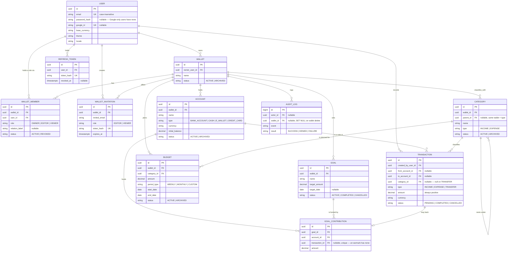

# Software Design Specification (SDS)

**Sora — wallet-model finance tracker**

**Last reconciled against code: 2026-08-25.** This revision replaces one written for the
superseded *workspace* model (FastAPI + SQLAlchemy + React, two roles, multi-currency
conversion, budget approval, bills, tag-based goal tracking). None of that exists in this
codebase. See [SRS.md §10](SRS.md#10-migration-note-v1--v2) for the full v1→v2 change list this
document now follows.

---

## Table of Contents

1. [Introduction](#1-introduction)
   - [1.1 Purpose](#11-purpose)
   - [1.2 Scope](#12-scope)
   - [1.3 Assumptions and Constraints](#13-assumptions-and-constraints)
   - [1.4 Definitions and Acronyms](#14-definitions-and-acronyms)
   - [1.5 Related Documents](#15-related-documents)
2. [Technical Domain Model (TDM)](#2-technical-domain-model-tdm)
3. [UI Design](#3-ui-design)
   - [3.1 UI/UX Principles](#31-uiux-principles)
   - [3.2 Screens](#32-screens)
4. [System Architecture](#4-system-architecture)
5. [API Specification](#5-api-specification)
6. [API Index and Error Response Catalog](#6-api-index-and-error-response-catalog)
   - [6.1 API Index](#61-api-index)
   - [6.2 Error Response Catalog](#62-error-response-catalog)
7. [Database Schema](#7-database-schema)
8. [Feature Implementation Mapping](#8-feature-implementation-mapping)

---

## 1. Introduction

### 1.1 Purpose

This Software Design Specification (SDS) defines the technical architecture, API contracts,
database schema, and story-to-implementation mapping for the wallet-model finance tracker. It
translates [SRS.md](SRS.md)'s requirements into the concrete decisions this codebase actually
embodies — it is a narrative document, and where it disagrees with the migration, the shared
contract, or the API specification, **those three win** (see [§1.5](#15-related-documents) and
`CLAUDE.md`'s Governing Documents section).

### 1.2 Scope

**Technical domains covered:**

- System architecture (mobile client, API, database)
- Mobile UI/UX principles and the app's actual screens
- REST API contract, organized by feature, with the full endpoint index and error catalog
- Database schema — entity summary; the migration files are the authoritative source
- Feature-to-implementation mapping (SRS user story → controller/service → API spec section)

**Out of scope:**

- Detailed implementation code (read the source)
- Deployment and operational procedures (`RUNBOOK.md`)
- Infrastructure as code
- Multi-currency conversion, budget approval workflows, bills/reminders, and report
  export — all withdrawn or retired in the v1→v2 pivot ([SRS.md §10](SRS.md#10-migration-note-v1--v2));
  do not reintroduce them here without a corresponding SRS change first

### 1.3 Assumptions and Constraints

**Assumptions:**

- PostgreSQL 17 is the database engine, accessed through Kysely (a typed SQL query builder, not
  an ORM — there is no schema-from-models layer to keep in sync with the migrations)
- NestJS 11 (Node 22, ESM) is the API framework
- The client is Expo + React Native (mobile); there is no web client in v1 (a parked Next.js app
  exists on disk for design reference only — `webpage/PARKED.md`)
- Every request/response DTO, enum, error code and route path is defined once in
  `@sora/contracts` and imported by both sides — nothing here should describe a shape that
  package doesn't also define
- All authentication is JWT-based: short-lived access tokens, longer-lived single-use rotated
  refresh tokens, hash-only storage

**Constraints:**

- Single currency per account/transaction/budget/goal; **no cross-currency conversion** in v1
  ([BR-13](SRS.md#4-business-rules)) — a wallet holding two currencies reports two totals, never one
- Wallet isolation is enforced at the service layer (role checks) **and** partially at the
  database layer (`uq_wallet_single_owner`, the budget-overlap exclusion constraint) — not by
  Postgres row-level security
- All APIs are synchronous; there is no job queue, and no cache layer (no Redis) sits between the
  API and Postgres
- No file uploads; no receipt/attachment storage
- The API is horizontally stateless — a request carries everything needed to authorize it (the
  bearer token); nothing about a session lives only in one process's memory

### 1.4 Definitions and Acronyms

| Term | Definition |
| --- | --- |
| **Wallet** | One person's finances — the sharing boundary. Not a renamed workspace: it has no type, and membership is a grant to an individual, not a seat in a group |
| **DTO** | Data Transfer Object; the request/response shapes in `packages/contracts/src/responses.ts` and `schemas.ts` |
| **JWT** | JSON Web Token; HS256, signed with `JWT_SECRET` |
| **Kysely** | The typed SQL query builder this API uses instead of an ORM — queries are written, not generated from a model that could drift from the schema |
| **Archival** | This system's only removal mechanism for wallets, accounts, categories, budgets and goals — a `status` column (`ACTIVE`/`ARCHIVED`), not a `deleted_at` timestamp. Nothing financial is hard-deleted; see [BR-09](SRS.md#4-business-rules) |
| **Cancellation** | The transaction-specific removal mechanism (`status = 'CANCELLED'`) — the row stays, visibly, alongside whatever corrected it |
| **Wallet scope** | Filtering by wallet membership (role ≥ required rank) at the service layer, via `RequireWalletRoleGuard` |
| **Envelope** | Every response body's `{success, message?, data, meta}` wrapper, defined once in `ApiEnvelope<T>` |

### 1.5 Related Documents

Precedence, highest first — reproduced from `CLAUDE.md`'s Governing Documents section so this
table doesn't drift from it:

| # | Document | Authority over |
| --- | --- | --- |
| 1 | [`db/migrations/`](db/migrations/) | The schema — what the database actually permits |
| 2 | [`packages/contracts/src/`](packages/contracts/src/) | Enums, validation, response shapes, error codes, route paths, money/derivation math |
| 3 | [`docs/API_SPECIFICATION.md`](docs/API_SPECIFICATION.md) | The endpoint-by-endpoint contract: auth, authorization, validation, errors, side effects |
| 4 | [`SRS.md`](SRS.md) | What the system does and why |
| 5 | This document | How it is designed — architecture, mapping, rationale |

This document summarizes and cross-references documents 1–3 rather than duplicating their
detail — a duplicated request/response body or DDL block is exactly what let the previous
revision drift out of sync with the code for over a year. `RUNBOOK.md` covers operational
procedures; `db/migrations/` is applied via `node scripts/migrate.mjs` (see `CLAUDE.md`, not
Flyway or Alembic — neither is used here).

---

## 2. Technical Domain Model (TDM)

**Last synced with the schema: 2026-08-25** (`db/migrations/001_initial_wallet_schema.sql`,
`002_google_auth_and_preferences.sql`).

### 2.0 Domain Model Diagram

Attributes shown are the identifying and business-significant columns only; the authoritative
column list is the migration itself ([§7](#7-database-schema)).



There is deliberately no entity above WALLET. A transaction's own wallet is **derived**, not
stored — `TRANSACTION` has no `wallet_id` column, because a cross-wallet transfer belongs to two
wallets at once and a single FK could only name one of them ([BR-03](SRS.md#4-business-rules)).

### 2.1 Domain Layer Traceability

| SRS Entity | Table | Notes |
| --- | --- | --- |
| User | `users` | `password_hash` nullable since migration 002 (Google-only accounts); `theme`/`locale` are display preferences, not business data |
| Wallet | `wallets` | Owner reference plus derived membership; archived, never deleted |
| WalletMember | `wallet_members` | Roles: `OWNER`, `EDITOR`, `VIEWER`. `uq_wallet_single_owner` (partial unique index) makes "exactly one active owner" a database-enforced invariant, not just a service check |
| WalletInvitation | `wallet_invitations` | Only the token hash is stored; `uq_wallet_invitation_open` allows at most one live invitation per wallet+email |
| Account | `accounts` | `initial_balance` has no `CHECK (>= 0)` — a credit card legitimately opens negative |
| Category | `categories` | Self-referencing `parent_id`; `chk_category_not_own_parent` blocks the one-hop cycle, deeper cycles are a service-layer check |
| Transaction | `transactions` | `chk_transaction_shape` enforces the account/category shape per type (income has no `from_account_id`, transfer has no `category_id`, etc.) at the database level |
| Budget | `budgets` | `excl_budget_overlap` is a GIST exclusion constraint over `daterange(start_date, end_date, '[]')` — a plain unique index cannot express "no overlapping window" |
| Goal | `goals` | No stored progress; see GoalContribution |
| GoalContribution | `goal_contributions` | `transaction_id` is nullable **and** unique — nullable because an earmark backs nothing, unique because one payment cannot fund two goals |
| AuditLog | `audit_logs` | Append-only by convention: no update/delete path exists in the API |
| — | `refresh_tokens` | Hash-only; `revoked_at` implements single-use-and-rotated, not a separate blacklist table |

### 2.2 Layer Composition

This is NestJS, not the layered Controller/Service/Repository/Model/Schema split a Python/FastAPI
stack would use. Each domain module (`server/src/{accounts,auth,budgets,categories,dashboard,
goals,transactions,wallets}/`) has:

**Controller** (`*.controller.ts`) — HTTP binding only: route decorators from `ROUTES`
(`@sora/contracts`), a Zod-validated body/query/param via `zodPipe`, a `@RequireWalletRole(...)`
decorator where a wallet-scoped role is needed, and delegation to a service. No business logic.

**Service** (`*.service.ts`) — business rules, Kysely queries, and derivation. There is no
separate repository layer: a service issues its own Kysely queries directly, since the query
builder already is the data-access abstraction and an extra layer over it would just forward
calls. `WalletsController` alone is backed by four services (`wallets.service.ts`,
`members.service.ts`, `invitations.service.ts`, `wallet-access.service.ts`) because membership,
invitations, and role-checking are distinct enough concerns to keep separate files, sharing one
controller because they're all wallet-scoped HTTP surface.

**Guards** (`common/`, `wallets/require-wallet-role.guard.ts`) — `RequireWalletRoleGuard` resolves
the 404-vs-403 distinction ([BR-05](SRS.md#4-business-rules)) before a handler body ever runs: no
membership → the wallet reads as not found; a membership below the required rank → forbidden.

**Contracts** (`packages/contracts/src/`) — every enum, Zod schema, response type, error code and
route path, imported by both `server/` and `mobile/`. A second definition of any of these is the
failure mode `scripts/check-contract-parity.mjs` exists to catch.

**Money** (`packages/contracts/src/money.ts`) — every amount travels as a string and is computed
as a scaled `bigint`, never a JS `number` ([CLAUDE.md](CLAUDE.md) Part 7, rule 1). `server/src/
database/pg-types.ts` overrides `node-postgres`'s default `NUMERIC`/`BIGINT` parsers to return
text instead of silently-rounded floats.

---

## 3. UI Design

The client is a phone app (Expo + React Native), used one-handed, often mid-transaction — see
[SRS.md §6](SRS.md#6-user-experience-requirements) for the requirements this section implements.
There is no web client shipping in v1; a parked Next.js app exists for its visual design and i18n
work only (`webpage/PARKED.md`) and is not part of this UI.

### 3.1 UI/UX Principles

**Recording is the primary path** ([SRS §6.1](SRS.md#61-recording-is-the-primary-path)) — the
bottom tab bar's center action is "Add," not a fifth destination among equals; the amount field
is focused first and takes a numeric keypad; the form never asks for a currency (the account
determines it) or an exchange rate (v1 has none).

**Roles are visible, not discovered by failure** ([SRS §6.3](SRS.md#63-roles-are-visible-not-discovered-by-failure))
— a VIEWER's screens render with no editing affordances at all, rather than buttons that produce
a `FORBIDDEN`. This is a real constraint on every screen, not a style preference: it means role is
read once per screen render and used to select which controls exist, not just whether they're
enabled.

**Whose money am I looking at** ([SRS §6.2](SRS.md#62-whose-money-am-i-looking-at)) — the wallet
in context is shown on every money-bearing screen; switching wallets is one action
(`WalletProvider`); a shared wallet is visually distinct from the user's own and shows the
viewer's own relation label.

**Money is unambiguous** ([SRS §6.4](SRS.md#64-money-is-unambiguous)) — every amount carries its
currency; per-currency totals are never summed or averaged into one figure; transfers are
visually distinct from income/expense everywhere they appear.

**Accessibility & mobile baseline** — dark mode is the default theme (`obsidian`, with `quartz`/
`sage`/`terracotta`/`violet` as alternatives — `ThemeProvider`); the app ships English and
Vietnamese (`LocaleProvider`, `react-i18next`); touch targets follow standard mobile sizing;
color is never the only signal (icons/labels accompany every status).

### 3.2 Screens

Real screens under `mobile/src/features/*/screens/`, grouped by feature:

| Feature | Screens |
| --- | --- |
| Dashboard | `HomeScreen` |
| Transactions | `TransactionsScreen`, `AddTransactionScreen`, `TransactionDetailScreen` |
| Budgets | `BudgetsScreen`, `AddBudgetScreen`, `BudgetDetailScreen` |
| Goals | `GoalsScreen`, `AddGoalScreen`, `GoalDetailScreen`, `AddContributionScreen` |
| Accounts | `AddAccountScreen`, `AccountDetailScreen` |
| Categories | `CategoryListScreen` |
| Wallets | `WalletListScreen`, `WalletDetailScreen`, `WalletMembersScreen`, `InviteMemberScreen` |
| Auth | `LoginScreen`, `RegisterScreen`, `AcceptInvitationScreen` |
| Settings | `SettingsScreen` |

**Bottom tab bar** (`MainTabNavigator`) — five tabs, center one an action rather than a
destination: **Home | Transactions | + (Add) | Budgets | Goals**. Accounts, categories, wallet
management and settings are reached from within these, not from the tab bar itself.

**Form patterns** — a destructive-looking action (archiving a wallet, revoking a member,
cancelling a transaction) confirms first and states the consequence rather than asking "are you
sure" ([SRS §6.5](SRS.md#65-corrections-are-honest)); a field that cannot change (an account's
currency, a transaction's amount) renders disabled with the reason shown, never hidden.

---

## 4. System Architecture

### 4.1 High-Level Architecture Diagram

```
┌─────────────────────────────────────────────────────────┐
│              Mobile client (Expo / React Native)         │
│  features/, navigation/, providers/ (auth, theme, locale, │
│  wallet), TanStack Query + Zustand                        │
└────────────────────┬───────────────────────────────────── ┘
                     │ HTTP/REST, JWT Bearer, envelope {success,data,meta}
                     ▼
┌─────────────────────────────────────────────────────────┐
│                  API (NestJS 11, ESM)                     │
│  Routes: /api/v1/auth, /api/v1/wallets, /api/v1/accounts,  │
│  /api/v1/categories, /api/v1/transactions, /api/v1/budgets,│
│  /api/v1/goals, /api/v1/dashboard, /api/v1/wallets/{id}/…  │
└────────────────────┬───────────────────────────────────── ┘
                     │ Kysely (typed SQL, no ORM)
                     ▼
┌─────────────────────────────────────────────────────────┐
│                    PostgreSQL 17                          │
│  wallets, wallet_members, wallet_invitations, accounts,    │
│  categories, transactions, budgets, goals,                 │
│  goal_contributions, audit_logs, refresh_tokens, users     │
└─────────────────────────────────────────────────────────┘
```

No cache layer, no message queue, no separate token-blacklist store — revocation is the
`refresh_tokens.revoked_at` column.

**Auth flow:**

1. Login (email/password) or Google Sign-In (`POST /auth/google`, ID token verified against
   `GOOGLE_CLIENT_ID`) → access token (15 min default, `ACCESS_TOKEN_TTL_SECONDS`) + refresh
   token (7 days default, `REFRESH_TOKEN_TTL_DAYS`), refresh stored hash-only.
2. Refresh → new access + refresh pair; the presented refresh token is marked used. Presenting an
   already-used refresh token is treated as theft evidence and revokes the entire token family
   ([AUTH-US-03](SRS.md#auth-us-03-stay-signed-in)) — this is stricter than a plain rotation
   scheme, and is not optional behavior to relax.
3. Logout → the current refresh token is revoked.

### 4.2 Request/Response Flow

**Example: record an expense** (`TXN-US-02`) — chosen because it is the most rule-dense write in
the product.

```
POST /api/v1/transactions
Authorization: Bearer <access_token>
{
  "type": "EXPENSE",
  "fromAccountId": "...",
  "categoryId": "...",
  "amount": "150000.0000",
  "currency": "VND",
  "transactionDate": "2026-08-25T09:00:00Z",
  "description": "Groceries"
}

TransactionsController.create:
  1. zodPipe validates the body against the contracts schema
  2. RequireWalletRoleGuard resolves the account's wallet and requires EDITOR — no membership on
     that wallet reads as ACCOUNT_NOT_FOUND, not FORBIDDEN (BR-05)
  3. TransactionsService.create:
     a. loads the account, refuses if ARCHIVED or its wallet is ARCHIVED
     b. loads the category, refuses unless it is EXPENSE-typed and in the account's wallet
     c. inserts the transaction row (status COMPLETED) — no balance write anywhere; balance is
        derived on every read from initial_balance + completed transactions (BR-06)
     d. writes an audit_logs row
  4. Returns the TransactionResponse DTO inside the envelope

200 OK
{
  "success": true,
  "data": {
    "id": "...", "type": "EXPENSE", "status": "COMPLETED",
    "amount": "150000.0000", "currency": "VND",
    "fromAccount": {"id": "...", "name": "Cash", "walletId": "...", "walletName": "..."},
    "toAccount": null,
    "category": {"id": "...", "name": "Groceries", "type": "EXPENSE"},
    "isCrossWallet": false,
    "createdBy": {"id": "...", "displayName": "..."},
    "createdAt": "...", "updatedAt": "..."
  },
  "meta": {"timestamp": "..."}
}
```

A cross-wallet transfer (`TXN-US-04`) follows the same shape with `type: "TRANSFER"`, no
`categoryId`, and the guard requiring EDITOR on **both** accounts' wallets rather than one.

---

## 5. API Specification

Full per-endpoint request/response detail — headers, every field, every error, side effects — is
**authoritative in [docs/API_SPECIFICATION.md](docs/API_SPECIFICATION.md)**, not reproduced here.
This section covers what that document doesn't: cross-cutting conventions.

### 5.1 Base Configuration

- **Base path:** `/api/v1` (`API_PREFIX` in `packages/contracts/src/routes.ts`)
- **Auth:** `Authorization: Bearer <accessToken>` — see [§4.1](#41-high-level-architecture-diagram)
- **Envelope:** every response is `{success, message?, data, meta: {timestamp, pagination?}}`
  (`ApiEnvelope<T>`); errors are `{success: false, message, error: {code, fields?}, meta}`
- **Money:** every amount is a string, never a JSON number (`MoneyString`)
- **Pagination:** `page`/`pageSize` query params; response `meta.pagination` carries
  `{page, pageSize, total, hasMore}`

### 5.2 Endpoints by feature

Method/path/minimum-role only — see [§6.1](#61-api-index) for the complete list and
`docs/API_SPECIFICATION.md` for full detail.

| Feature | Controller | Base path |
| --- | --- | --- |
| Auth & session | `AuthController` | `/auth/*` |
| Wallets, members, invitations, audit | `WalletsController` | `/wallets/*` |
| Accounts | `AccountsController` | `/accounts` |
| Categories | `CategoriesController` | `/categories` |
| Transactions | `TransactionsController` | `/transactions` |
| Budgets | `BudgetsController` | `/budgets` |
| Goals & contributions | `GoalsController` | `/goals` |
| Dashboard | `DashboardController` | `/dashboard` |
| Health | `HealthController` | `/health` |

**Known gap:** `POST /invitations/preview` and `POST /invitations/accept` are defined in
`ROUTES.invitations` (`@sora/contracts`) and specified in detail in
`docs/API_SPECIFICATION.md` §8.4–8.5, corresponding to
[WAL-US-04](SRS.md#wal-us-04-preview-an-invitation-before-committing) and
[WAL-US-05](SRS.md#wal-us-05-accept-an-invitation) — but **no controller implements either route**
(verified: neither path appears in any `@Get`/`@Post`/`@Patch`/`@Delete` decorator under
`server/src`). An invitation can currently be created and revoked (`WalletsController`), but not
previewed or accepted through the API. See [§8](#8-feature-implementation-mapping).

---

## 6. API Index and Error Response Catalog

### 6.1 API Index

The actually-implemented endpoints (verified against every `@Controller` in `server/src`, 2026-08-25)
— 50 routes. This supersedes `docs/API_SPECIFICATION.md` §3's index table, which still lists the
two unimplemented invitation routes ([§5.2](#52-endpoints-by-feature)) and predates the Google-auth
and preferences endpoints added in migration 002; that table is a documentation-maintenance gap
in that file, not a code issue, and is out of this document's authority to fix.

| Method | Path | Min role | Controller |
| --- | --- | --- | --- |
| GET | `/health` | public | `HealthController` |
| POST | `/auth/register` | public | `AuthController` |
| POST | `/auth/login` | public | `AuthController` |
| POST | `/auth/google` | public | `AuthController` |
| POST | `/auth/refresh` | public | `AuthController` |
| POST | `/auth/logout` | authed | `AuthController` |
| GET | `/auth/me` | authed | `AuthController` |
| PATCH | `/auth/me/preferences` | authed | `AuthController` |
| GET | `/wallets` | authed | `WalletsController` |
| POST | `/wallets` | authed | `WalletsController` |
| GET | `/wallets/{id}` | VIEWER | `WalletsController` |
| PATCH | `/wallets/{id}` | OWNER | `WalletsController` |
| DELETE | `/wallets/{id}` | OWNER | `WalletsController` |
| GET | `/wallets/{id}/members` | VIEWER | `WalletsController` |
| PATCH | `/wallets/{id}/members/{memberId}` | OWNER | `WalletsController` |
| DELETE | `/wallets/{id}/members/{memberId}` | OWNER | `WalletsController` |
| POST | `/wallets/{id}/transfer-ownership` | OWNER | `WalletsController` |
| POST | `/wallets/{id}/leave` | VIEWER | `WalletsController` |
| GET | `/wallets/{id}/invitations` | OWNER | `WalletsController` |
| POST | `/wallets/{id}/invitations` | OWNER | `WalletsController` |
| DELETE | `/wallets/{id}/invitations/{invitationId}` | OWNER | `WalletsController` |
| GET | `/wallets/{id}/audit-logs` | OWNER | `WalletsController` |
| GET | `/accounts` | VIEWER | `AccountsController` |
| POST | `/accounts` | EDITOR | `AccountsController` |
| GET | `/accounts/{id}` | VIEWER | `AccountsController` |
| PATCH | `/accounts/{id}` | EDITOR | `AccountsController` |
| DELETE | `/accounts/{id}` | EDITOR | `AccountsController` |
| GET | `/categories` | VIEWER | `CategoriesController` |
| POST | `/categories` | EDITOR | `CategoriesController` |
| PATCH | `/categories/{id}` | EDITOR | `CategoriesController` |
| DELETE | `/categories/{id}` | EDITOR | `CategoriesController` |
| GET | `/transactions` | VIEWER | `TransactionsController` |
| POST | `/transactions` | EDITOR | `TransactionsController` |
| GET | `/transactions/{id}` | VIEWER | `TransactionsController` |
| PATCH | `/transactions/{id}` | EDITOR | `TransactionsController` |
| POST | `/transactions/{id}/cancel` | EDITOR | `TransactionsController` |
| GET | `/budgets` | VIEWER | `BudgetsController` |
| POST | `/budgets` | EDITOR | `BudgetsController` |
| GET | `/budgets/{id}` | VIEWER | `BudgetsController` |
| PATCH | `/budgets/{id}` | EDITOR | `BudgetsController` |
| DELETE | `/budgets/{id}` | EDITOR | `BudgetsController` |
| GET | `/goals` | VIEWER | `GoalsController` |
| POST | `/goals` | EDITOR | `GoalsController` |
| GET | `/goals/{id}` | VIEWER | `GoalsController` |
| PATCH | `/goals/{id}` | EDITOR | `GoalsController` |
| DELETE | `/goals/{id}` | EDITOR | `GoalsController` |
| GET | `/goals/{id}/contributions` | VIEWER | `GoalsController` |
| POST | `/goals/{id}/contributions` | EDITOR | `GoalsController` |
| DELETE | `/goals/{id}/contributions/{contributionId}` | EDITOR | `GoalsController` |
| GET | `/dashboard` | VIEWER | `DashboardController` |

### 6.2 Error Response Catalog

The complete, current set — byte-identical to `ERROR_CODES`/`ERROR_STATUS` in
`packages/contracts/src/responses.ts` (`scripts/check-contract-parity.mjs` proves every code has a
status and vice versa). There is no separate "auth vs workspace vs account" split in the source;
grouped here for readability only.

| Error code | Status | Category |
| --- | --- | --- |
| `VALIDATION_FAILED` | 422 | Request validation |
| `UNAUTHENTICATED` | 401 | No/invalid bearer token |
| `TOKEN_EXPIRED` | 401 | Refresh token expired |
| `TOKEN_INVALID` | 401 | Refresh token malformed/unknown |
| `CREDENTIALS_INVALID` | 401 | Login — identical for unknown email and wrong password |
| `EMAIL_ALREADY_REGISTERED` | 409 | Registration |
| `FORBIDDEN` | 403 | Member, but role too low (never "no membership" — see `WALLET_NOT_FOUND`) |
| `WALLET_NOT_FOUND` | 404 | No such wallet, or no membership on it (BR-05) |
| `WALLET_ARCHIVED` | 409 | Write attempted on an archived wallet |
| `WALLET_LAST_OWNER` | 409 | Demote/revoke/leave attempted on the sole owner |
| `MEMBER_NOT_FOUND` | 404 | No such member |
| `MEMBER_ALREADY_EXISTS` | 409 | Invite/accept target is already a member |
| `INVITATION_NOT_FOUND` | 404 | No such invitation |
| `INVITATION_EXPIRED` | 410 | Past its 7-day expiry |
| `INVITATION_ALREADY_USED` | 409 | Already accepted or revoked |
| `INVITATION_EMAIL_MISMATCH` | 403 | Accepting as someone other than the invited address |
| `INVITATION_ALREADY_OPEN` | 409 | A live invitation already exists for this wallet+email |
| `ACCOUNT_NOT_FOUND` | 404 | No such account, or no membership on its wallet |
| `ACCOUNT_ARCHIVED` | 409 | Write attempted on an archived account |
| `ACCOUNT_CURRENCY_MISMATCH` | 422 | Transaction currency ≠ account currency |
| `ACCOUNT_LAST_ACTIVE` | 409 | (reserved) |
| `CATEGORY_NOT_FOUND` | 404 | No such category, or wrong wallet |
| `CATEGORY_WRONG_TYPE` | 422 | Income category on an expense (or vice versa) |
| `CATEGORY_WRONG_WALLET` | 403 | Category belongs to a different wallet |
| `CATEGORY_DUPLICATE_NAME` | 409 | Sibling name collision (case-insensitive) |
| `CATEGORY_CYCLE` | 422 | Parent assignment would create a cycle |
| `CATEGORY_IN_USE` | 409 | Archive refused — an active budget still plans for it |
| `CATEGORY_HAS_TRANSACTIONS` | 409 | (reserved) |
| `TRANSACTION_NOT_FOUND` | 404 | No such transaction |
| `TRANSACTION_IMMUTABLE` | 409 | Edit attempted on a field that cannot change |
| `TRANSACTION_ALREADY_CANCELLED` | 409 | Cancel attempted twice |
| `TRANSFER_SAME_ACCOUNT` | 422 | Transfer source and destination are the same account |
| `TRANSFER_CURRENCY_MISMATCH` | 422 | The two accounts don't share a currency |
| `BUDGET_NOT_FOUND` | 404 | No such budget |
| `BUDGET_PERIOD_OVERLAP` | 409 | Overlaps another active budget for the same category |
| `GOAL_NOT_FOUND` | 404 | No such goal |
| `GOAL_NOT_ACTIVE` | 409 | Contribution attempted on a completed/cancelled goal |
| `CONTRIBUTION_NOT_FOUND` | 404 | No such contribution |
| `RATE_LIMITED` | 429 | Auth rate limit or per-email lockout |
| `INTERNAL_ERROR` | 500 | Unexpected |
| `GOOGLE_TOKEN_INVALID` | 401 | Google ID token failed verification |

---

## 7. Database Schema

**The migration files are the schema.** This section is a readable summary; it is not copied
DDL, so it cannot itself drift from what `node scripts/migrate.mjs` actually applies — read
[`001_initial_wallet_schema.sql`](db/migrations/001_initial_wallet_schema.sql) and
[`002_google_auth_and_preferences.sql`](db/migrations/002_google_auth_and_preferences.sql) for
exact column types, defaults and constraint definitions.

**Tables (001):** `users`, `refresh_tokens`, `wallets`, `wallet_members`, `wallet_invitations`,
`accounts`, `categories`, `transactions`, `budgets`, `goals`, `goal_contributions`, `audit_logs`.

**Migration 002** makes `users.password_hash` nullable, adds `google_id` (unique where not null),
`theme` and `locale`, and adds `chk_user_has_credential` — a row must have a password **or** a
Google id, never neither.

**Constraints load-bearing enough that a service-layer check alone would not be safe to rely on:**

| Constraint | Table | What it actually prevents |
| --- | --- | --- |
| `uq_wallet_single_owner` | `wallet_members` | Two `ACTIVE` `OWNER` rows on one wallet, even momentarily — see [CLAUDE.md](CLAUDE.md) Part 7, rule 3 on why ownership transfer must demote before it promotes |
| `excl_budget_overlap` (GIST) | `budgets` | Two `ACTIVE` budgets for one category with overlapping `daterange(start_date, end_date, '[]')` — a plain unique index cannot express "overlap," only "identical" |
| `chk_transaction_shape` | `transactions` | A row whose account/category combination doesn't match its `type` (e.g. a `TRANSFER` with a `category_id`, or an `INCOME` with a `from_account_id`) |
| `uq_wallet_invitation_open` | `wallet_invitations` | Two live (unaccepted, unrevoked) invitations for the same wallet+email |
| `chk_user_has_credential` | `users` | A row with neither a password nor a Google identity — unable to authenticate through any path |

**No `deleted_at` column exists anywhere.** Archival is a `status` value; the one true row-level
deletion in the schema is `goal_contributions`, where `SAV-US-05` removes the row outright
(and cancels its backing transaction, if any, rather than deleting that).

---

## 8. Feature Implementation Mapping

Full traceability, all 46 stories from [SRS.md §9](SRS.md#9-features--user-stories). "Controller"
names the file whose HTTP surface realizes the story; this table is checked against the real
`@Controller`/`@Get`/`@Post`/etc. decorators listed in [§6.1](#61-api-index), not against prose —
regenerate it from the controllers, not from memory, the next time either drifts.

### AUTH-US — Authentication & Session

| Story | Title | Realized by |
| --- | --- | --- |
| AUTH-US-01 | Register | `POST /auth/register` — `AuthController` |
| AUTH-US-02 | Sign in | `POST /auth/login` — `AuthController` |
| AUTH-US-03 | Stay signed in | `POST /auth/refresh` — `AuthController`, `token.service.ts` |
| AUTH-US-04 | Sign out | `POST /auth/logout` — `AuthController` |

*Not a numbered SRS story, but live:* `POST /auth/google` (Google Sign-In), `GET /auth/me`,
`PATCH /auth/me/preferences` (theme/locale) — added in the Google-auth/preferences migration,
ahead of an SRS update for them.

### WAL-US — Wallets & Sharing

| Story | Title | Realized by |
| --- | --- | --- |
| WAL-US-01 | Create a wallet | `POST /wallets` |
| WAL-US-02 | See every wallet I can reach | `GET /wallets` |
| WAL-US-03 | Invite someone by email | `POST /wallets/{id}/invitations` |
| WAL-US-04 | Preview an invitation before committing | **Not implemented** — spec'd (`docs/API_SPECIFICATION.md` §8.4, `ROUTES.invitations.preview`), no controller route exists ([§5.2](#52-endpoints-by-feature)) |
| WAL-US-05 | Accept an invitation | **Not implemented** — same gap (`ROUTES.invitations.accept`, API spec §8.5) |
| WAL-US-06 | Revoke an open invitation | `DELETE /wallets/{id}/invitations/{invitationId}` |
| WAL-US-07 | See who can see this money | `GET /wallets/{id}/members` |
| WAL-US-08 | Change a member's role | `PATCH /wallets/{id}/members/{memberId}` |
| WAL-US-09 | Revoke a member's access | `DELETE /wallets/{id}/members/{memberId}` |
| WAL-US-10 | Hand ownership over | `POST /wallets/{id}/transfer-ownership` |
| WAL-US-11 | Leave a wallet | `POST /wallets/{id}/leave` |
| WAL-US-12 | Archive a wallet | `DELETE /wallets/{id}` (rename via `PATCH /wallets/{id}`) |
| WAL-US-13 | Read the audit trail | `GET /wallets/{id}/audit-logs` |

### ACC-US — Account Management

| Story | Title | Realized by |
| --- | --- | --- |
| ACC-US-01 | Create an account | `POST /accounts` |
| ACC-US-02 | See my accounts, across wallets | `GET /accounts` |
| ACC-US-03 | Read one account in detail | `GET /accounts/{id}` (`AccountDetailResponse`) |
| ACC-US-04 | Correct an account | `PATCH /accounts/{id}` |
| ACC-US-05 | Archive an account | `DELETE /accounts/{id}` |

### TXN-US — Transaction Management

| Story | Title | Realized by |
| --- | --- | --- |
| TXN-US-01 | Record income | `POST /transactions` (`type: INCOME`) |
| TXN-US-02 | Record an expense | `POST /transactions` (`type: EXPENSE`) |
| TXN-US-03 | Record a transfer within one wallet | `POST /transactions` (`type: TRANSFER`, same wallet) |
| TXN-US-04 | Record a transfer between two wallets | `POST /transactions` (`type: TRANSFER`, cross-wallet — same endpoint, guard checks both sides) |
| TXN-US-05 | Browse and filter history | `GET /transactions` |
| TXN-US-06 | Read one transaction | `GET /transactions/{id}` |
| TXN-US-07 | Correct a transaction's description | `PATCH /transactions/{id}` |
| TXN-US-08 | Cancel a transaction | `POST /transactions/{id}/cancel` |

### CAT-US — Categories

| Story | Title | Realized by |
| --- | --- | --- |
| CAT-US-01 | Read the category tree | `GET /categories` |
| CAT-US-02 | Add a category | `POST /categories` |
| CAT-US-03 | Rename or restyle a category | `PATCH /categories/{id}` |
| CAT-US-04 | Archive a category | `DELETE /categories/{id}` |

### BUD-US — Budgets

| Story | Title | Realized by |
| --- | --- | --- |
| BUD-US-01 | Create a budget | `POST /budgets` |
| BUD-US-02 | Watch a budget | `GET /budgets` / `GET /budgets/{id}` (derived `spent`/`remaining`/`usagePercentage`) |
| BUD-US-03 | Adjust a budget | `PATCH /budgets/{id}` |
| BUD-US-04 | Archive a budget | `DELETE /budgets/{id}` |

### SAV-US — Saving Goals

| Story | Title | Realized by |
| --- | --- | --- |
| SAV-US-01 | Create a goal | `POST /goals` |
| SAV-US-02 | Contribute to a goal | `POST /goals/{id}/contributions` |
| SAV-US-03 | Watch progress | `GET /goals` / `GET /goals/{id}` |
| SAV-US-04 | Adjust a goal | `PATCH /goals/{id}` |
| SAV-US-05 | Remove a contribution | `DELETE /goals/{id}/contributions/{contributionId}` |
| SAV-US-06 | Complete or cancel a goal | `PATCH /goals/{id}` (`status`) |

### DASH-US — Dashboard

| Story | Title | Realized by |
| --- | --- | --- |
| DASH-US-01 | Read a wallet's dashboard | `GET /dashboard` |
| DASH-US-02 | Compare the wallets I follow | `GET /wallets` (per-wallet balances) + client-side composition — there is no dedicated multi-wallet-comparison endpoint |

**Total: 46 stories, 44 realized, 2 not yet implemented** (WAL-US-04, WAL-US-05 — see above).

---

## Appendix: Design Notes

### Archival, not soft deletion

Wallets, accounts, categories, budgets and goals carry a `status` column and are archived, never
marked `deleted_at` and never row-deleted. Transactions are cancelled (a third status value, not
archival). The one true deletion is a goal contribution. See [BR-09](SRS.md#4-business-rules).

### Cross-wallet transfer atomicity

A transfer — same-wallet or cross-wallet — is **one row**, not a linked debit/credit pair. There
is nothing to leave half-committed, and cancelling it reverses both sides at once because there is
one row to cancel ([BR-03](SRS.md#4-business-rules), [BR-04](SRS.md#4-business-rules)).

### Audit logging

Append-only by convention — no update or delete path exists anywhere in the API. Denied attempts
are logged alongside successes ([BR-14](SRS.md#4-business-rules)); a cross-wallet transfer is
logged against both wallets.

### Wallet scoping

Enforced by `RequireWalletRoleGuard` before a controller method body runs, resolving the
404-vs-403 distinction ([BR-05](SRS.md#4-business-rules)) once rather than leaving each service to
reimplement it. There is no database row-level security; scoping is entirely at the guard/service
layer, backed by the FK structure (an account/category/budget/goal names its wallet directly; a
transaction's wallet is derived from its account(s)).

### Pagination

`page`/`pageSize` query params, `meta.pagination: {page, pageSize, total, hasMore}` in the
envelope. Page size is bounded server-side regardless of what a caller requests
([SRS §5](SRS.md#5-non-functional-considerations), Performance).
