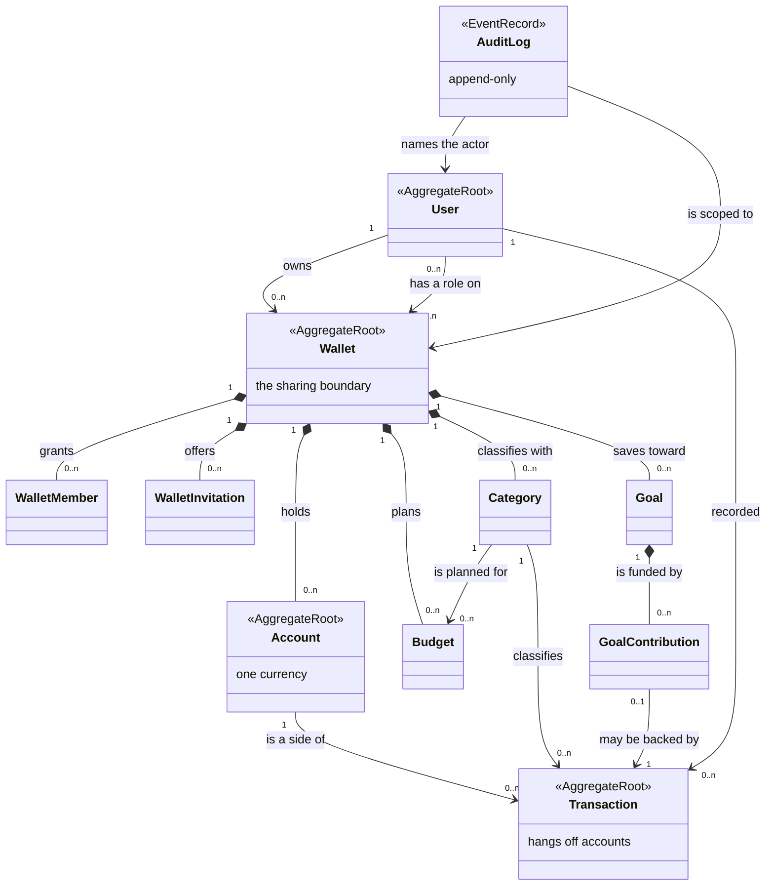

# Software Requirements Specification (SRS)

**Sora — Wallet Model**

**Version:** 2.0 · **Status:** current · **Supersedes:** v1 (see [§10 Migration note](#10-migration-note-v1--v2))

---

## Table of Contents

1. [Introduction](#1-introduction)
   - [1.1 Purpose](#11-purpose)
   - [1.2 Scope](#12-scope)
   - [1.3 Assumptions and Constraints](#13-assumptions-and-constraints)
   - [1.4 Definitions and Acronyms](#14-definitions-and-acronyms)
   - [1.5 Roles and Actors](#15-roles-and-actors)
   - [1.6 Out of Scope](#16-out-of-scope)
   - [1.7 Related Documents](#17-related-documents)
2. [Conceptual Domain Model (CDM)](#2-conceptual-domain-model-cdm)
3. [Functional Requirements](#3-functional-requirements)
4. [Business Rules](#4-business-rules)
5. [Non-Functional Considerations](#5-non-functional-considerations)
6. [User Experience Requirements](#6-user-experience-requirements)
7. [Access Control & Roles](#7-access-control--roles)
8. [Business Flows](#8-business-flows)
9. [Features & User Stories](#9-features--user-stories)
10. [Migration note (v1 → v2)](#10-migration-note-v1--v2)
11. [Appendix: Feature Summary](#11-appendix-feature-summary)

---

## 1. Introduction

### 1.1 Purpose

This SRS defines what Sora does and why, and is the single source of truth for acceptance. It states requirements in business terms only: entity names, rules, flows and user stories. Every technology name, interface path and storage detail belongs to [SDS.md](SDS.md) and [docs/API_SPECIFICATION.md](docs/API_SPECIFICATION.md), so that a design change that does not change behaviour does not touch this document.

### 1.2 Scope

The product answers one question repeatedly, for one person at a time: *where did this person's money go?* The headline capability is that "this person" need not be the signed-in user — the product exists to let someone track a partner's, a parent's or a friend's finances alongside their own, with that person's consent, at a role they granted.

**In scope for v1**

- Authentication with email and password, and session renewal.
- **Wallets** — one person's finances — created by any signed-in user, with a starter wallet created at registration so nobody lands on an unusable first screen.
- **Sharing** — granting another real user a role on a wallet, invited by email address, labelled with the subjective relationship the inviter uses for them ("Girlfriend", "Mom").
- Accounts: the places a wallet's money sits, each in a single currency.
- Categories: an income/expense/transfer classification tree, per wallet.
- Transactions: income, expense and transfer — including **transfers between two different wallets**, which is a first-class feature, not an edge case.
- Budgets: planned spend for one category, one goal, or the whole wallet over a date window, with spend derived from history.
- Saving goals and their contribution history.
- A dashboard answering balance, income, expense, net and spending-by-category.
- An append-only audit trail of financial and membership events, readable by a wallet's owner.

**Explicitly not in scope for v1** — see [§1.6](#16-out-of-scope).

### 1.3 Assumptions and Constraints

**Assumptions**

- Every participant in a shared wallet is a real, separately-authenticated person. The product never models a "family account" that several people sign into; that arrangement makes the audit trail useless, because every entry would name the same actor.
- An invitee may not have registered yet, so an invitation is addressed to an email address rather than to an existing user.
- Invitation delivery happens outside the system in v1: the inviter receives the invitation link once and passes it on themselves.
- Users can communicate out of band. The product therefore has no messaging, and declining an invitation is expressed by ignoring it until it expires.

**Constraints**

- **A wallet is one person, not a container of people.** It has no "personal versus family" type, because the distinction the old model drew that way is now expressed by who has a membership on it.
- **A wallet is the sharing boundary.** There is no larger grouping above it and no smaller one inside it; a role is granted on a wallet and everything in that wallet inherits it.
- Amounts are exact decimals to four places. No figure a user sees may be produced by binary floating-point arithmetic, because the resulting rounding error is untraceable once it has been added into a balance.
- Each account holds exactly one currency, and totals are reported per currency. The system never adds two currencies together.
- Sessions are short-lived and renewable: a signed-in session must be renewable without re-entering a password, and a renewal credential is single-use.
- Nothing financial is destroyed. Every "delete" a user performs is an archive, a cancellation or a revocation.

### 1.4 Definitions and Acronyms

| Term | Definition |
| --- | --- |
| **User** | A real person with a login. The only thing that authenticates. |
| **Wallet** | **One person's finances** ("Tam's Wallet", "Mom's Wallet"). Owned by exactly one user, shareable with others, and the boundary every access decision is made at. |
| **Wallet Member** | A grant of a role on a wallet to another user, carrying the inviter's own **relation label** for them. |
| **OWNER** | The one active administrator of a wallet: membership, roles, ownership handover, archival. |
| **EDITOR** | May record and correct financial data in the wallet, but not administer it. |
| **VIEWER** | Read-only. The role for "let me watch, don't let me touch". |
| **Relation label** | The inviter's subjective name for a relationship ("Girlfriend", "Mom"). Descriptive; it grants nothing. |
| **Invitation** | A single-use, expiring offer of membership addressed to an email address. |
| **Account** | Where a wallet's money physically sits (a bank account, cash, an e-wallet, a credit card). Holds one currency. |
| **Category** | An income, expense or transfer classification, arranged as a tree, scoped to one wallet. |
| **Transaction** | A recorded movement of money: income, expense, or transfer. Always a positive amount; direction comes from its type and from which account side it names. |
| **Transfer** | A movement between two accounts, whether in the same wallet or across two wallets. **Never spending and never income.** |
| **Cross-wallet transfer** | A transfer whose two accounts belong to different wallets — paying a partner back, or funding a parent's account. |
| **Budget** | A planned amount for one category, one goal, or the whole wallet over one inclusive date window. |
| **Saving Goal** | A target amount, optionally with a target date, funded by contributions. |
| **Goal Contribution** | One funding event on a goal, either an earmark or a record of money that actually left an account. |
| **Derived value** | A figure computed from history on every read — a balance, budget spend, goal progress. Never stored, never independently editable. |
| **Audit Log** | Append-only record of financial and membership events. |
| **SRS / SDS** | This document / the design document that realises it. |

### 1.5 Roles and Actors

| Actor | What they are | What they do |
| --- | --- | --- |
| **Wallet owner** | The one active OWNER of a wallet | Administers membership and roles, hands ownership over, archives the wallet, reads its audit trail — and everything an editor can do |
| **Invited editor** | A user granted EDITOR on someone else's wallet | Records and corrects that person's transactions, maintains their accounts, categories, budgets and goals |
| **Invited viewer** | A user granted VIEWER | Reads that wallet: balances, history, budgets, goals, and who else has access |
| **Invitee** | Someone holding an invitation, possibly not yet registered | Previews what they are being offered, registers if needed, accepts |
| **Non-member** | Any signed-in user with no membership on a wallet | Cannot distinguish that wallet from one that does not exist ([BR-05](#4-business-rules)) |
| **Guest** | Someone trying the product before creating an account | Records against a private, local-only starter wallet with no server presence; on registering or signing in, chooses a real wallet to receive everything they entered, or keeps trying it locally a while longer |

A single user is normally several of these at once: owner of their own wallet, editor on their partner's, viewer on a parent's.

### 1.6 Out of Scope

Deferred, with the reason, so a later reader can tell "not yet" from "no":

| Deferred | Reason |
| --- | --- |
| **Cross-currency transfer, and conversion as a stored/authoritative figure** | A transfer still requires both accounts to share one currency, refused otherwise. A converted total used as a *record* would only be as trustworthy as the rate behind it, and a stored rate is a second source of truth for every historical figure — so no amount, balance, or transaction is ever recorded, retried, or corrected in a currency other than its own. *The dashboard's own read-only, approximate, currency-converted total is a narrow, explicitly-marked exception — see [BR-16](#4-business-rules) and [DASH-US-03](#dash-us-03-see-an-approximate-total-in-one-currency) — not a reversal of this line.* |
| **Bills and recurring-payment reminders** | Nothing in v1 generates or reminds. The previous revision specified a bill entity; no part of it is built, so it is future scope rather than an unimplemented requirement. |
| **Offline entry and sync** | Requires conflict resolution over a ledger, which is a larger design problem than the ledger itself. |
| **Bank connections / automatic import** | Every transaction is entered by a person in v1. |
| **Receipt capture and OCR** | Depends on file storage, which v1 does not have. |
| **Automated analysis, forecasting, categorisation suggestions** | Needs history the product does not yet have. |
| **Notifications (push, email, in-app)** | Invitation delivery is manual in v1, and budget thresholds are read on the dashboard rather than pushed. |
| **Custom roles and per-record permissions** | The three fixed roles are the whole model; anything finer multiplies the access-control surface with no demonstrated need. |
| **Export (CSV / PDF), report generation** | Reading is served by the dashboard and transaction history in v1. |
| **Tax reporting, investment portfolio tracking, debt/loan modelling** | Out of the product's stated question. |

### 1.7 Related Documents

| Document | Purpose |
| --- | --- |
| [SDS.md](SDS.md) | How this is designed: schema, architecture, authorization, security, derivation |
| [docs/API_SPECIFICATION.md](docs/API_SPECIFICATION.md) | The authoritative interface contract, per operation |

---

## 2. Conceptual Domain Model (CDM)

**Last synced with SDS §2 and the applied schema: 2026-09-16**

### 2.1 Domain Diagram

Two shapes in that diagram carry most of the model's meaning:

- **Transaction hangs off accounts, not off a wallet.** A cross-wallet transfer belongs to two wallets at once, and an entity that named a single owning wallet could only ever record one side of it. Everything wallet-scoped in a transaction is therefore derived by asking which wallets its accounts belong to.
- **WalletMember is a relationship between two users**, not a seat in a group. That is what makes "track my partner's wallet" expressible: the wallet stays *hers*, and the grant is *to me*.

### 2.2 Domain Entities

| Entity | Definition | Lifecycle |
| --- | --- | --- |
| **User** | A person who can sign in. Identified by email, case-insensitively. | Created at registration, together with a starter wallet, its OWNER membership and a starter category tree. |
| **Wallet** | One person's finances. Has exactly one active OWNER at all times, and one IANA time zone its calendar is read in. | Created by any signed-in user; archived, never deleted — archiving stops new writes and leaves everything readable, because deleting it would rewrite the other side of every cross-wallet transfer it took part in. Its time zone starts as the creator's device zone and only the owner changes it; a change re-reads every recorded moment and rewrites none. |
| **WalletMember** | A user's role on a wallet, plus the relation label. | Created by accepting an invitation, or alongside the wallet for its creator; role changed by the owner; revoked rather than deleted, so a former member's past entries still name a person instead of going anonymous. |
| **WalletInvitation** | An offer of EDITOR or VIEWER addressed to an email address. | Created by the owner and shown its single-use credential exactly once; accepted, revoked, or left to expire after seven days. At most one live invitation per wallet and email at a time. |
| **Account** | Where money sits, in one currency. | Created by an editor; its type and opening amount are fixed for life, and its currency once anything names it; archived when closed, keeping its history and every transfer it is a side of. |
| **Category** | An income, expense or transfer classification, optionally nested under a parent of the same wallet and the same type. A seeded (starter) category reads in each reader's language; a category an editor creates or renames reads exactly as typed. | Seeded at registration, extended by editors; type and parent are fixed once transactions classify against it; archived, with its children, and cannot be archived while a budget still plans for it. |
| **Transaction** | A recorded movement of money: INCOME, EXPENSE or TRANSFER, always a positive amount. | Recorded by an editor; only its description, date, category and reference are ever correctable; cancelled rather than deleted, so a mistake and its correction are both visible. |
| **Budget** | A planned amount for one category (including its subcategories), one goal, or the whole wallet: every day, week, month or year from its start until deleted, or over one fixed inclusive window. | Created by an editor; its category, start, window and period type are fixed, because moving them changes which history it covers and is therefore a different budget; deleted outright, which releases its slot in the no-overlap rule. |
| **Goal** | A savings target, optionally dated. | Created by an editor; completed when reached, or cancelled — and cancelling keeps the contributions, which record money that really was set aside. |
| **GoalContribution** | One funding event: either an earmark, or a record of money that actually left an account. | Created by an editor; at most one contribution may point at any one transaction, so a single payment cannot be counted toward a goal twice; removed, which cancels its backing transaction rather than erasing it. |
| **AuditLog** | Append-only record of a financial or membership event, with actor, role, target and outcome. | Written by the system, never edited or deleted, readable by the wallet's owner. |

### 2.3 Entity Relationships & Cardinality

| Subject | Verb phrase | Object | Cardinality | Constraint the business demands |
| --- | --- | --- | --- | --- |
| User | owns | Wallet | 1:N | A user may own many wallets; a wallet names exactly one owning user, and exactly one active OWNER membership backs it |
| User | has a role on | Wallet | M:N | Via WalletMember; at most one membership per user per wallet, in any state |
| Wallet | offers | WalletInvitation | 1:N | At most one *live* invitation per email address at a time; re-inviting revokes first |
| Wallet | holds | Account | 1:N | An account belongs to exactly one wallet for life |
| Wallet | classifies with | Category | 1:N | A category belongs to one wallet; a parent must be in the same wallet and of the same type |
| Account | is a side of | Transaction | 1:N per side | A transaction names one or two accounts depending on its type; **the two accounts of a transfer may belong to different wallets** |
| Category | classifies | Transaction | 1:N | Required on income and expense, optional on a transfer — where a transfer-typed category only labels the movement ("Savings", "Debt Repayment") |
| Category | is planned for | Budget | 1:N | At most one budget per category per overlapping window |
| Goal | is funded by | GoalContribution | 1:N | Progress is the sum of contributions, never a stored running total |
| GoalContribution | may be backed by | Transaction | 0..1 : 1 | A transaction backs at most one contribution |
| User | recorded | Transaction | 1:N | Every transaction names the person who entered it, for the life of the record |
| AuditLog | names | User, Wallet | N:1 | A cross-wallet transfer is audited once against each wallet, so it appears in both trails |

---

## 3. Functional Requirements

Field-level rules. Each is a requirement on what the system accepts and refuses, not on how it stores it.

### 3.1 User

| No. | Field | Rule | Why |
| --- | --- | --- | --- |
| FR-01 | Email | Required, valid, unique **case-insensitively**; the login identifier | Signing up as `Foo@x.com` when `foo@x.com` exists must collide, or two accounts answer to one address and neither user can be sure which they are in |
| FR-02 | Password | Required, 12–200 characters. Length is the only rule — no composition requirements | Mandated symbol/digit mixes measurably push people toward predictable substitutions; length is the property that resists guessing |
| FR-03 | Display name | Required, 1–100 characters after trimming | Shown as the actor on every transaction a shared wallet's members read |
| FR-04 | Base currency | Required three-letter uppercase code, defaulting to VND | A default the user's first account inherits; it is a preference, not a conversion target ([BR-13](#4-business-rules)) |
| FR-05 | Registration outcome | One indivisible act: the user, a starter wallet, its OWNER membership and a starter category tree either all exist or none do | A user with no wallet cannot record anything, so a partial registration strands them on a screen with no valid next action |

### 3.2 Wallet

| No. | Field | Rule | Why |
| --- | --- | --- | --- |
| FR-06 | Name | Required, 1–100 characters. Free text, **not unique** | It names a person ("Mom's Wallet"), and two users may legitimately each track a wallet by the same label |
| FR-07 | Owner | Exactly one active OWNER at every instant, including during handover | A wallet whose last owner left can never have its membership administered again through any offered operation — an unrecoverable state, so the rule is absolute rather than best-effort |
| FR-08 | Status | Active or archived | Archived stops new writes and keeps all reads working |
| FR-09 | *No type* | A wallet has no "personal / family / custom" classification | Who can see a wallet is expressed by its memberships; a second, parallel expression of the same thing can only drift out of agreement with it |

### 3.3 Membership & Invitation

| No. | Field | Rule | Why |
| --- | --- | --- | --- |
| FR-10 | Role | One of OWNER, EDITOR, VIEWER | Three ranks, each a superset of the next; see [§7](#7-access-control--roles) |
| FR-11 | Relation label | Optional, ≤ 50 characters | The inviter's own word for the person. Descriptive only: it grants and restricts nothing, so it can be as informal as the user likes |
| FR-12 | Membership status | Active or revoked. Revoked, never removed | A revoked member's past transactions must still name them; an erased membership makes historical entries anonymous |
| FR-13 | Invited email | Required, valid, matched case-insensitively | The invitee may not have registered yet, so the offer is addressed to an address rather than to an account |
| FR-14 | Invited role | EDITOR or VIEWER only | Ownership is a handover of the single owner slot, not an additional grant, so it cannot be issued by invitation |
| FR-15 | Invitation credential | Single-use, shown to the inviter exactly once at creation, never re-readable | An offer that could be re-read from the invitation list would make read access to that list equivalent to the ability to join the wallet |
| FR-16 | Expiry | Seven days from creation | Bounds how long a forwarded link stays usable |
| FR-17 | Acceptance | The accepting user's own email must equal the invited email | Without this, the credential is a bearer token anyone holding it could redeem, rather than an invitation to a person |

### 3.4 Account

| No. | Field | Rule | Why |
| --- | --- | --- | --- |
| FR-18 | Name | Required, 1–100 characters | — |
| FR-19 | Type | One of: bank account, cash, e-wallet, credit card | Fixed set; the four places money actually sits for the product's users |
| FR-20 | Currency | Required three-letter code, **fixed for the account's life** | Every amount on the account is denominated in it; relabelling the code alone would silently restate every stored figure |
| FR-21 | Opening amount | Required, **may be negative** | A credit card legitimately opens in debt, so the system must not treat a negative opening amount as invalid input |
| FR-22 | Balance | **Derived** from the opening amount plus completed transactions on either side | A stored balance is a second source of truth that can silently disagree with the history it summarises |
| FR-23 | Editability | Name and status only | Currency, type and opening amount are what later balances are layered on; changing one retroactively rewrites every derived figure with no trace |
| FR-24 | Archival | Archived accounts leave the pickers, keep their history, and remain a valid side of existing transfers | Hard deletion would orphan the other side of every transfer they took part in |

### 3.5 Transaction

| No. | Field | Rule | Why |
| --- | --- | --- | --- |
| FR-25 | Type | INCOME, EXPENSE or TRANSFER | Three types, not seven. Refund, loan, debt and investment were modelled as types in the previous revision; each is expressible as an income or expense against an appropriate category, and each extra type multiplied the direction rules every report had to reason about |
| FR-26 | Amount | Required, strictly positive, exact to four decimal places | Direction never lives in the sign, so no reader has to know a convention to interpret a figure |
| FR-27 | Shape | Income: destination account and a category, no source. Expense: source account and a category, no destination. Transfer: two **different** accounts and an **optional** transfer-typed category | A transfer takes only a transfer category, so no income or expense category report can ever count it as earning or spending |
| FR-28 | Currency | Must equal the currency of every account named | Recording an amount in a currency the account does not hold makes its balance meaningless |
| FR-29 | Transfer currency | The two accounts must share a currency | Converting between them requires a rate, which is out of scope for v1 ([§1.6](#16-out-of-scope)) |
| FR-30 | Category agreement | An income transaction takes an income category, an expense an expense category, a transfer (if categorised) a transfer category; the category must belong to the wallet of the account named — for a transfer, the source account | Otherwise a category tree cannot be summed, and one wallet's classification would leak into another's reports |
| FR-31 | Status | `PENDING`, `COMPLETED` or `DELETED` (a cancelled entry; the row stays). **Only completed transactions count** toward any derived figure | Pending records an intention and cancelled records a mistake; counting either makes the app disagree with the bank |
| FR-32 | Correctable fields | Description, date, category and reference only | See [BR-08](#4-business-rules) |
| FR-33 | Immutable fields | Amount, type, source account, destination account | A recorded movement of money is a historical fact |
| FR-34 | Recorded by | The user who entered it, fixed for life | The audit question "who entered this" has exactly one answer forever |

### 3.6 Budget

| No. | Field | Rule | Why |
| --- | --- | --- | --- |
| FR-35 | Category | Required, exactly one, expense-typed, in the same wallet | A budget answers "how much may go to *this*"; a multi-category budget cannot answer it per category without becoming several budgets |
| FR-36 | Amount, currency | Required, positive; currency fixed | — |
| FR-37 | Window | Start and end dates, **inclusive on both ends**, end not before start, compared by calendar day in the wallet's time zone | An expense late on the last day of the month belongs to that month's budget; comparing instants would drop it, and comparing UTC days would file early-morning spending under the day before for anyone east of UTC |
| FR-38 | Period type | Weekly, monthly or custom — a label on the window, fixed for life | Descriptive; the window is what is actually enforced |
| FR-39 | Overlap | At most one budget per category per overlapping window; a repeating budget covers every day from its start | Two plans for the same category and days give a spend figure two different meanings |
| FR-40 | Spend, remaining, usage | **Derived** from completed expenses in that category and window. Remaining may go negative; usage may read above 100% | "You are 400,000 over" is precisely the number a budget exists to surface, and clamping it hides the case it was built for |
| FR-41 | Editability | Name, amount and status only | Moving a window changes which history the budget ever covered, which makes it a different budget |
| FR-42 | Creation mid-window | A budget created mid-window immediately shows what has already been spent in it | A budget that starts at zero on the 20th of the month reports a fiction for the rest of that month |

### 3.7 Saving Goal & Contribution

| No. | Field | Rule | Why |
| --- | --- | --- | --- |
| FR-43 | Target amount | Required, positive; currency fixed once contributions exist | Contributions are already denominated in it |
| FR-44 | Target date | Optional | A goal with no deadline is a normal goal, not an incomplete one |
| FR-45 | Progress, remaining | **Derived** by summing contributions. Remaining floored at zero, progress capped at 100% | Overshooting a savings target does not leave a negative gap, and a progress display must not exceed full |
| FR-46 | Contribution amount | Required, positive; must match both the goal's and the account's currency | — |
| FR-47 | Recorded contribution | A contribution may optionally record that the money actually left an account, as an expense transaction the contribution then points at; the two are created together or not at all | Otherwise the account balance and the goal's progress can disagree about the same money |
| FR-48 | Earmark contribution | A contribution that records no transaction advances the goal without asserting money moved | "I intend this to be holiday money" is a real and different statement from "I moved it" |
| FR-49 | One backing transaction | At most one contribution may point at any one transaction | Otherwise one payment could be counted toward a goal twice |
| FR-50 | Removal | Removing a contribution marks its backing transaction `DELETED`; the transaction row is never removed | The ledger stays complete |

---

## 4. Business Rules

**BR-01: The wallet is the sharing boundary.**
Every access decision is made against a wallet. Accounts, categories, transactions, budgets, goals and audit entries inherit the role the caller holds on the wallet they belong to; there is no grouping above a wallet and no per-record override inside one. A wallet represents one person's finances, so "who may see this money" and "whose money is this" are the same question, asked once.

**BR-02: A wallet has exactly one active owner, at every instant.**
Handing ownership over demotes the outgoing owner and promotes the incoming one as one indivisible act. There is no moment — not even a transient one — at which a wallet has two owners or none. Two owners means the wallet's administration has no single answer; none means it can never be administered again.

**BR-03: Cross-wallet transfers are permitted, and require editor rights on *both* wallets.**
Paying a partner back, or funding a parent's account, is one transaction between two accounts in two wallets — not two disconnected entries that a reader must recognise as a pair. Both sides genuinely had money move, so members of either wallet can see it, and it is audited against both.

> **This rule reverses the previous revision, deliberately.** v1 stated that transfers between accounts in different sharing boundaries were *not permitted*. That rule is withdrawn: it is the exact operation the product now exists to support. Do not reinstate it. The safeguard against abuse is the dual-role requirement, not a prohibition: read-only access to someone's wallet must never let you push money into it, and being an editor on your own wallet must never let you pull money out of someone else's. Requiring EDITOR or above on **both** sides is therefore strictly stricter than a same-wallet transfer, not a loosening.

**BR-04: A transfer is never spending, and never income.**
This is the most consequential rule in the product. A transfer must not appear in any expense total, any income total, any budget's spend, or any dashboard income/expense/net figure, and it can only carry a transfer-typed category, so no income or expense category report can pick it up. A wallet that moved 2,000,000 from a bank account to cash has neither earned nor spent anything; a system that reports otherwise makes every other number it shows untrustworthy. Where transfers matter — an account's own detail view — they are reported as their own figures, separately from income and expense, never folded into them.

**BR-05: A wallet a user has no membership on is indistinguishable from one that does not exist.**
Reading, or attempting to act on, a wallet-scoped thing without a membership is answered as *not found* (`WALLET_NOT_FOUND`, `ACCOUNT_NOT_FOUND`, …) — never as a refusal. A refusal would confirm the thing exists, which tells a stranger whether a given wallet or account identifier is real. `FORBIDDEN` is reserved for the genuinely different case: the caller **is** a member, and their role is too low for what they asked. That distinction is observable and testable, and it is a requirement rather than an implementation nicety.

**BR-06: Every derived figure is derived, on every read.**
Balances, budget spend/remaining/usage, and goal progress are computed from transaction and contribution history. None of them is stored as an independently editable value, and no operation exists to set one directly. A stored total is a second source of truth, and the two only have to disagree once for every figure downstream to become unreliable.

**BR-07: Only completed transactions count.**
Pending and cancelled transactions are visible records — of an intention and of a mistake respectively — and contribute to no derived figure. Cancelling a transaction therefore drops its amount out of every balance, budget and dashboard total on the next read, while the cancelled row remains as the record of what happened.

**BR-08: Transactions are editable in place.**
Every field a transaction was recorded with can be corrected, amount, type and accounts included. A correction that moves money is checked exactly as recording the corrected transaction would be, and is audited against every wallet it touched before and after; every derived figure follows on the next read. A goal contribution the transaction backs moves with it, and that payment must stay an expense from the goal's wallet. A cancelled transaction cannot be edited at all, and cancelling one twice is refused rather than silently repeated.

**BR-09: Nothing financial is hard-deleted.**
Wallets, accounts and categories are archived; transactions are cancelled; members and invitations are revoked. The true deletions are a goal contribution (removing one cancels its backing transaction rather than erasing it), an unused category, and a budget, which only plans and from which nothing is derived. Transactions are the source of truth for every derived figure, so a destroyed row silently changes answers about the past.

**BR-10: At most one budget per category per overlapping window.**
Two budgets for the same category over overlapping days would give "spent" two different meanings at once. Note that two windows can overlap without sharing a start or end date, so this is a genuine overlap rule and not a uniqueness rule on the dates. Deleting a budget frees its days for a new one.

**BR-11: Invitations are single-use, expiring, and addressed to a person.**
An invitation names an email address, grants EDITOR or VIEWER only, expires after seven days, and can be redeemed exactly once — and only by a signed-in user whose own email matches the invited address. At most one live invitation exists per wallet and address, so re-inviting revokes the previous offer rather than leaving two credentials that both work. Its credential is shown once, at creation, and never again.

**BR-12: Amounts are exact.**
Every monetary figure is an exact decimal to four places, and no figure the system reports is produced by binary floating-point arithmetic. The values involved exceed the range in which a double-precision float represents integers exactly, and even inside that range familiar sums do not come out right; either failure produces a balance that is wrong by an amount nobody can trace back to a cause.

**BR-13: Totals are per currency, never across currencies.**
Each account holds one currency; a transaction matches its accounts' currency; a transfer's two accounts must share one. Wallet, account and dashboard totals are reported once per currency present. A wallet holding a VND account and a USD account has no single total, and producing one by adding the two numbers together yields a figure that is silently meaningless. Conversion is out of scope for v1 ([§1.6](#16-out-of-scope)).

**BR-14: The audit trail is append-only.**
Financial mutations and every membership or role change are recorded with actor, role, target and outcome, including denials. No operation to edit or delete an entry exists. A wallet's owner can read its trail.

**BR-15: A member's history outlives their membership.**
Revoking a member, or their leaving, never removes what they recorded, and never makes it anonymous. A shared wallet's history has to remain answerable to "who entered this" long after the person stopped having access.

**BR-16: A dashboard's converted total is an approximate estimate, never a source of truth.**
Reading a dashboard may optionally ask for its total balance converted into one display currency, on top of (not instead of) the normal per-currency figures BR-13 requires. That converted figure is always marked as an estimate, is never stored, never feeds a balance/budget/goal calculation, and never overrides a native amount anywhere in the product — it exists only to answer "roughly how much, all together" for a wallet holding several currencies. It carries its own freshness: fresh (converted just now), stale (the best available rate is older than the system would like, and the figure says so), or unavailable (no usable rate exists, in which case the system says so rather than guessing or showing a partial sum across only the currencies it could convert). Recording, correcting, or retrying a transaction is never affected by this figure or by whether a rate is available at all.

---

## 5. Non-Functional Considerations

**Correctness of money** — the load-bearing quality attribute, and the reason for most of §4:

- Every reported balance must equal the account's opening amount plus its completed transactions. This is checkable at any time, from data the system already keeps, and it is checkable *because* nothing is stored redundantly.
- A transfer must be absent from every income and expense figure the system produces, at every grain.
- Cancelling a transaction must change every figure derived from it, in one direction, immediately on the next read.
- Multi-part operations complete entirely or not at all: registration and its starter wallet; a wallet and its owner membership; an invitation acceptance; an ownership handover; a contribution and its backing transaction.
- Two people acting on the same wallet at the same time must not be able to produce a state the rules forbid — in particular two active owners, or two overlapping budgets for one category.

**Security & privacy:**

- Identity is proved by a password that is never stored recoverably, and by short-lived session credentials that are renewable without re-entering it.
- A renewal credential is single-use. Presenting one twice is treated as evidence it was stolen, and ends every session for that user rather than serving the second request.
- A failed sign-in must not reveal whether the address is registered.
- Passwords, session credentials and invitation credentials are never written to any log or diagnostic output.
- Every denied access is recorded with who was denied, at what role, on what.

**Performance:**

- The dashboard is one request answering all its figures, not one per tile.
- Transaction history is paged; a page is bounded in size regardless of what a caller asks for.
- Derived figures are computed by aggregate queries over history rather than by walking rows in application code.

**Reliability & retention:**

- A repeated submission of the same financial entry — the ordinary consequence of a mobile client retrying over a poor connection — must be recognisable as a repeat and must not create a second transaction. A duplicated payment is a real financial error, not a cosmetic one.
- An entry made while the device has no connectivity is held locally and submitted once connectivity returns, under the same one-submission guarantee as an ordinary retry — a user who records an expense on the subway must not lose it, and must not have it recorded twice when the app comes back online.
- Audit entries are retained indefinitely.
- Archived and cancelled records are retained indefinitely; there is no purge.

---

## 6. User Experience Requirements

The client is a phone app used one-handed, often standing at a till. The requirements below follow from that, not from a generic usability checklist.

### 6.1 Recording is the primary path

- Recording an expense is reachable from the first screen in one action, and is the shortest path in the product.
- The amount field is the first thing focused, and takes a numeric keypad.
- Type, account, category and date carry sensible defaults so a routine expense needs only an amount and a category.
- The form never asks for a currency when the chosen account determines it, and never asks for an exchange rate at all.

### 6.2 Whose money am I looking at

- The wallet currently in context is visible on every screen that shows money, never inferred from memory. Recording a partner's expense into your own wallet is the single most damaging mistake a user can make with the product.
- Switching between the wallets a user can reach is one action.
- A wallet shared with the user is visually distinct from their own and shows the wallet's own name with the user's role. The relation label is the inviter's word for the member (FR-11), so it appears in the owner's member list, never as a wallet's name.
- A cross-wallet transfer shows *both* wallet names in history, so a reader can see whose account each side touched.

### 6.3 Roles are visible, not discovered by failure

- Actions a user's role does not permit are absent, not present-and-failing.
- A viewer sees a wallet with no editing affordances at all, rather than buttons that produce a refusal.
- The member list is readable by every member: a person whose money is being tracked must be able to see who is tracking it, without asking the owner.

### 6.4 Money is unambiguous

- Every amount is displayed with its currency. Per-currency totals are shown as separate figures, never added together and never averaged.
- Income, expense and net for a period are shown together; a period is never reported by one of the three alone.
- Transfers are visually distinct from income and expense wherever the three appear, since they are the one movement that changes no position.
- A period with no activity appears as zero rather than being omitted, so a gap reads as a gap rather than as missing data.

### 6.5 Corrections are honest

- Cancelling a transaction is offered where editing an amount would be, and is described as what it is: the original stays visible, cancelled.
- Fields that cannot change are shown, disabled, with the reason — not hidden, which reads as a missing feature.
- Destructive-looking actions (archiving a wallet, revoking a member, cancelling a transaction) confirm first, and the confirmation states the consequence rather than asking "are you sure".

### 6.6 Failures are legible

- Every error the user sees names what to do about it. A refusal caused by role says which role is required; a validation failure marks the field.
- The app never reports a wallet as forbidden when the system reported it as absent ([BR-05](#4-business-rules)) — the user-facing message follows the system's answer.
- Submitting the same entry twice over a flaky connection results in one transaction, and the app says so rather than showing an ambiguous error.

---

## 7. Access Control & Roles

**Last synced: 2026-08-22**

| Role | Rank | May do |
| --- | --- | --- |
| **VIEWER** | 1 | Read everything in the wallet: accounts and balances, transaction history, categories, budgets, goals, and the member list |
| **EDITOR** | 2 | Everything a viewer may, plus create and correct accounts, categories, transactions, budgets, goals and contributions |
| **OWNER** | 3 | Everything an editor may, plus invite, revoke, change roles, hand ownership over, archive the wallet, and read its audit trail |

Ranks are cumulative: a required role is satisfied by any role of at least that rank, so a rule reads "editor or above" rather than enumerating role combinations.

**Rules:**

- **Membership is per wallet.** A user's role on one wallet says nothing about their role on another, including wallets belonging to the same people.
- **No membership means not found**, never forbidden ([BR-05](#4-business-rules)).
- **Forbidden means "member, but not enough"** — the only case where the system confirms a thing exists while refusing the action.
- **Cross-wallet transfers require editor or above on both wallets** ([BR-03](#4-business-rules)).
- **Only an owner administers membership**, and cannot demote themselves while sole owner; they hand ownership over or archive the wallet instead.
- **Any member may leave**, except a sole owner, who would leave the wallet unadministrable.
- **Reading the member list is a viewer right, deliberately.** The person whose finances a wallet describes must be able to see who has access to it.

---

## 8. Business Flows

### 8.1 Registration, sign-in and session renewal

**Actors:** anonymous visitor, registered user
**Preconditions:** the email address is not registered
**Postconditions:** the user exists, owns a starter wallet holding a starter category tree, and holds a live session

1. The visitor submits display name, email, password and base currency.
2. The system validates the address's form and its case-insensitive availability, and the password's length.
3. The system creates, as one indivisible act: the user; a wallet named for them; their OWNER membership on it; and a starter category tree (see `packages/contracts/src/starter-categories.ts` for the current set).
4. The system issues a session and records the registration in the audit trail.
5. The app opens on the new wallet's dashboard, which is empty but usable — the user can record an expense immediately.
6. On a later visit the user submits email and password.
7. The system verifies them and issues a session, recording the outcome either way.
8. Before the session's access credential expires, the app renews it by presenting its renewal credential; the system issues a fresh pair and retires the presented one.
9. The user signs out; the session's renewal credential is retired.

**Negative flows**

- An address already registered → `EMAIL_ALREADY_REGISTERED`.
- A password shorter than the minimum, or a malformed address → `VALIDATION_FAILED`, with the offending field named.
- Wrong password, or an address with no account → `CREDENTIALS_INVALID`, **identically in both cases**, so the response cannot be used to discover who has an account.
- Too many attempts from one source, or repeated failures against one address → `RATE_LIMITED`, with how long to wait.
- An expired or unknown renewal credential → `TOKEN_EXPIRED` / `TOKEN_INVALID`.
- A renewal credential presented after it was already used → every session for that user ends and the event is audited. Replay is evidence of theft, and serving it would be serving the thief.

---

### 8.2 Main business flow — tracking a partner's wallet end to end

**Actors:** Tam (U1), Linh (U2)
**Preconditions:** neither address is registered
**Postconditions:** Tam owns his own wallet and holds EDITOR on Linh's; both wallets hold accounts, categories, transactions, an active budget and a goal; a cross-wallet transfer links them; every state change is in the audit trail

1. Tam registers; wallet W1 "Tam's Wallet" and its starter categories are created (§8.1).
2. Tam creates accounts in W1: A1 "Vietcombank VND" (bank, VND) and A2 "Cash" (cash, VND), each with its opening amount. A2 opens at zero; a credit card he adds later opens negative, which is accepted.
3. Tam records an income transaction — salary into A1 — and several expenses from A1 and A2 against the starter categories.
4. Tam records a **transfer** from A1 to A2: cash withdrawal. His balances move; his expense total does not ([BR-04](#4-business-rules)).
5. Linh registers independently; wallet W2 "Linh's Wallet" is created for her.
6. Linh invites Tam to W2 as EDITOR with the relation label "Boyfriend". She receives the invitation credential once and sends it to him.
7. Tam previews the invitation, sees W2's name, the role offered and his own masked address, and accepts. He now holds EDITOR on W2 while owning W1.
8. Tam lists his wallets and sees both: W1 as his own, W2 as shared, labelled, with its own per-currency balances.
9. Tam records an expense in W2 on Linh's behalf — a grocery run he paid for from her cash account. The audit trail for W2 records him as the actor.
10. Tam records a **cross-wallet transfer** from A1 (in W1) to Linh's bank account (in W2): paying her back. The system checks he holds EDITOR or above on **both** wallets, and records it as one transaction visible from either side, showing both wallet names ([BR-03](#4-business-rules)).
11. Linh creates a monthly budget in W2 for the food category. It immediately shows what has already been spent this month, not zero ([FR-42](#36-budget)).
12. Linh watches the budget's spend and remaining as Tam and she both record expenses; the cross-wallet transfer of step 10 appears in neither figure.
13. Linh creates a goal "Da Nang trip" in W2 and contributes to it from her bank account, choosing to record the movement as a real expense; her balance drops and the goal advances, together.
14. Linh adds a second contribution as an earmark instead: the goal advances, her balance does not, and the difference is visible in the contribution list.
15. Tam notices one of his expenses in W2 had the wrong amount. He cancels it and records a corrected one; both rows remain visible, and the balance, the budget's spend and the dashboard all move by the difference.
16. Linh corrects the description and category of another transaction; the amount and accounts are shown disabled with the reason.
17. Linh reads W2's dashboard: per-currency balance, income, expense, net, spending by category, recent transactions, active budgets and goals. Neither transfer appears in income or expense.
18. Linh reads W2's member list and confirms who has access, at what role, since when.
19. Linh promotes Tam from EDITOR to VIEWER and back as their arrangement changes; each change is audited with the old and new role.
20. Linh archives a bank account she has closed. Its history stays readable, it leaves the pickers, and the cross-wallet transfer it was a side of is unaffected.
21. Linh reads W2's audit trail as its owner: every entry above, with actor, role and outcome.
22. Later, Linh hands ownership of W2 to Tam: she is demoted and he is promoted in one act. She remains an editor.
23. Linh leaves W2, which she may now that she is no longer its owner. Her past entries remain, still naming her.
24. Tam archives W2 when it is no longer in use. Everything stays readable; nothing new can be written.

**Alternative flows**

- Tam ignores the invitation at step 7: it expires after seven days and no membership is created. Linh can invite him again, which requires revoking the expired offer's slot first.
- Linh revokes Tam's membership instead of his leaving at step 23: he loses access immediately, his entries remain and still name him.

**Negative flows**

- Tam, holding only VIEWER on W2, attempts step 9 → `FORBIDDEN`: he *is* a member, and the system says so.
- A stranger attempts step 9 → `WALLET_NOT_FOUND`, not `FORBIDDEN` ([BR-05](#4-business-rules)).
- Tam attempts the step 10 transfer while holding only VIEWER on W2 → `FORBIDDEN`. Being an editor on the source wallet alone is not sufficient.
- A transfer between two accounts of different currencies → `TRANSFER_CURRENCY_MISMATCH`.
- A second active food budget for W2 overlapping the first → `BUDGET_PERIOD_OVERLAP`.
- Linh attempts to leave W2 at step 22 while still its sole owner → `WALLET_LAST_OWNER`.
- Correcting a transaction's amount, type or accounts into a shape a new transaction couldn't take (a missing account side, a category of the wrong type, a currency the account doesn't hold) → the same error that create would give.

---

### 8.3 Sharing a wallet: invite and accept

**Actors:** wallet owner, invitee (registered or not)
**Preconditions:** the owner is signed in; the invitee's email address is known
**Postconditions:** the invitee holds the offered role on the wallet; the invitation is spent

1. The owner opens the wallet's member list and chooses to invite.
2. The owner submits the invitee's email address, a role (EDITOR or VIEWER), and optionally a relation label.
3. The system refuses if that address already belongs to an active member, or if a live invitation for it already exists on this wallet.
4. The system creates a single-use invitation expiring in seven days and returns its credential **once**. The owner delivers it themselves; the system sends nothing in v1.
5. The invitee opens the invitation and previews it without signing in: the wallet's name, the role offered, their own address **masked**, and the expiry.
6. If not registered, the invitee registers (§8.1) — which gives them their own starter wallet — and returns.
7. The invitee, signed in as the invited address, accepts.
8. The system creates their membership with the invitation's role and label and marks the invitation spent, as one act.
9. The invitee's wallet list now includes the shared wallet, labelled, alongside their own.
10. The owner's member list shows the new member, their role and when they joined.

**Alternative flows**

- The owner revokes an open invitation before it is accepted; its credential stops working and the address becomes free to invite again.
- The invitee never accepts; the invitation expires.

**Negative flows**

- Unknown or already-spent credential → `INVITATION_NOT_FOUND` / `INVITATION_ALREADY_USED`.
- Past its expiry → `INVITATION_EXPIRED`.
- Accepted while signed in as a *different* address than the one invited → `INVITATION_EMAIL_MISMATCH`. This is the check that makes it an invitation rather than a bearer credential.
- The address is already an active member → `MEMBER_ALREADY_EXISTS`.
- A live invitation for that address already exists → `INVITATION_ALREADY_OPEN`.
- An attempt to invite straight to OWNER → refused; ownership is handed over, not granted ([FR-14](#33-membership--invitation)).

---

### 8.4 Recording income and expense

**Actors:** any member with EDITOR or above
**Preconditions:** an active account exists in the wallet; a category of the matching type exists in that wallet
**Postconditions:** the transaction is recorded; every figure derived from it reflects it on the next read

1. The member opens the record form with the wallet in context clearly shown.
2. The member enters the amount, and picks the type, the account, the category and the date.
3. The system validates: the amount is positive; the shape matches the type; the currency equals the account's; the category's type matches the transaction's and belongs to the account's wallet; neither account is archived; and the caller holds EDITOR or above on the wallet.
4. The system records the transaction — one entry — and audits it. **No balance is written**, because balances are derived; there is nothing to update and therefore nothing that can drift.
5. Reading the account, the budget for that category, or the dashboard reflects the new transaction immediately.

**Alternative flows**

- The member corrects the description, date, category or reference afterwards; the amount, type and accounts are shown disabled with the reason.
- The member cancels a transaction: it stays visible as cancelled, and every derived figure drops it. Any goal contribution backed by it is removed at the same time, so a cancelled payment cannot keep crediting a goal.
- The same submission arrives twice after a connection failure: the system recognises the repeat and reports the original transaction rather than creating a second.

**Negative flows**

- Non-positive or malformed amount → `VALIDATION_FAILED`.
- Currency differing from the account's → `ACCOUNT_CURRENCY_MISMATCH`.
- Expense category on an income transaction, or vice versa → `CATEGORY_WRONG_TYPE`.
- Category from another wallet → `CATEGORY_WRONG_WALLET`.
- Archived account → `ACCOUNT_ARCHIVED`; unknown account → `ACCOUNT_NOT_FOUND`.
- Archived wallet → `WALLET_ARCHIVED`.
- Caller holds only VIEWER → `FORBIDDEN`; caller holds nothing → `..._NOT_FOUND`.
- Cancelling an already-cancelled transaction → `TRANSACTION_ALREADY_DELETED`.

---

### 8.5 Cross-wallet transfer

**Actors:** a user holding EDITOR or above on **both** wallets
**Preconditions:** two active accounts, in two different wallets, sharing one currency
**Postconditions:** one transaction exists, visible from both wallets, counted as spending by neither

1. The member chooses transfer and picks a source account and a destination account. The picker offers accounts from **every** wallet they can reach, so a cross-wallet transfer is an ordinary selection rather than a special mode.
2. The system detects that the two accounts sit in different wallets and requires EDITOR or above on **both**, refusing otherwise.
3. The system validates that the accounts differ, share a currency, and are both active; and that any category supplied is a transfer category of the source account's wallet — optional, since a transfer is neither income nor expense.
4. The system records **one** transaction naming both accounts, and audits it against **both** wallets so it appears in both trails.
5. Both accounts' balances move on the next read: one down, one up.
6. Neither wallet's income, expense or net changes. No budget's spend changes. ([BR-04](#4-business-rules))
7. History in either wallet shows the transaction with both wallet names, so a reader can see whose account each side was.

**Negative flows**

- Source and destination the same → `VALIDATION_FAILED` on the destination (the shared schema refuses it before any lookup).
- The two accounts hold different currencies → `TRANSFER_CURRENCY_MISMATCH`. Converting needs a rate, which v1 does not have.
- EDITOR on only one of the two wallets → `FORBIDDEN`. In particular, VIEWER on the destination is not enough to push money into it, and EDITOR on the source is not enough to pull money out of the other.
- No membership at all on one of the two wallets → that side reads as absent (`ACCOUNT_NOT_FOUND`), which is also what a fabricated identifier produces.
- Cancelling later reverses both sides at once, because there is only one row to cancel.

---

### 8.6 Budget lifecycle

**Actors:** any member with EDITOR or above; any member for reading
**Preconditions:** an expense category exists in the wallet
**Postconditions:** an active budget reports its own spend, remaining and usage, derived from history

1. The member picks one expense category, an amount, and a window with inclusive start and end dates.
2. The system validates the amount, that the end is not before the start, that the category is expense-typed and in this wallet, and that no **active** budget for that category overlaps the window.
3. The budget is created and **immediately reports the spend already recorded inside its window**, not zero.
4. As expenses are recorded in that category, spend, remaining and usage change on the next read. Remaining goes negative once overspent, and usage reads above 100% — the numbers a user needs at exactly that moment.
5. Transfers never contribute, whatever their accounts ([BR-04](#4-business-rules)).
6. Cancelling an expense reduces the spend on the next read.
7. The member may change the budget's name, amount or status. The category and the window cannot change.
8. Deleting the budget releases its slot, so a fresh budget may be created over the same or an overlapping window.

**Negative flows**

- Overlapping budget for the same category → `BUDGET_PERIOD_OVERLAP`. Note this triggers on genuine overlap, not only on identical dates.
- End before start, or a non-positive amount → `VALIDATION_FAILED`.
- Income category → `CATEGORY_WRONG_TYPE`; category from another wallet → `CATEGORY_WRONG_WALLET`.
- Attempting to move the window or change the category → refused; delete and create instead.
- Archiving a category a budget still plans for → `CATEGORY_IN_USE`, because that budget could never compute its period again.

---

### 8.7 Saving goal and contributions

**Actors:** any member with EDITOR or above; any member for reading
**Postconditions:** the goal's progress equals the sum of its contributions

1. The member creates a goal with a name, a target amount, a currency, and optionally a target date.
2. The member contributes: an amount, an account, a date, and a choice — **record the money as actually leaving the account, or earmark it**.
3. Recording it creates an expense transaction and the contribution pointing at it, together, so the balance and the goal cannot disagree about the same money. Recording requires an expense category.
4. Earmarking creates the contribution alone: the goal advances without asserting money moved.
5. Progress and remaining are the sum of contributions and the gap to the target; remaining floors at zero and progress caps at 100%.
6. The member reviews the contribution list and can see which entries moved money and which were earmarks.
7. Removing a contribution marks its backing transaction `DELETED`; the transaction row is never removed.
8. Completing or cancelling the goal keeps its contributions: they record money that really was set aside.

**Negative flows**

- Contributing to a completed or cancelled goal → `GOAL_NOT_ACTIVE`.
- An account from another wallet → `FORBIDDEN`.
- Currency differing from the goal's or the account's → `ACCOUNT_CURRENCY_MISMATCH`.
- Recording as a transaction without an expense category → `VALIDATION_FAILED`.
- Pointing a second contribution at one transaction → refused ([FR-49](#37-saving-goal--contribution)).

---

### 8.8 Reading: dashboard and history

**Actors:** any member, VIEWER upward
**Postconditions:** none — reading changes nothing

1. The member opens the wallet's dashboard for a period, defaulting to the current calendar month.
2. The dashboard reports, **per currency**: total balance, income, expense and net; plus spending by category descending with percentages, the most recent transactions, and the active budgets and goals.
3. **Transfers are excluded from income and expense entirely** ([BR-04](#4-business-rules)).
4. Currencies are never combined: a wallet holding two currencies shows two sets of figures.
5. The member opens history and filters by account, category, type, status, date range, amount range or free text, sorted by date descending by default, paged.
6. History spans every account in the wallet, and a cross-wallet transfer appears for members of either side, showing both wallet names.
7. Opening an account shows its derived balance, its income and expense totals, and its transferred-in and transferred-out figures **as separate figures** — a transfer is reported, never folded into spending.
8. The member switches to another wallet they can reach and reads the same views for it, with the wallet in context always visible.

**Alternative flows**

- A wallet with no transactions shows an empty state explaining what to record first, not an error.
- A period with no activity reports zeros rather than omitting the period.

**Negative flows**

- A wallet the caller has no membership on → `WALLET_NOT_FOUND` ([BR-05](#4-business-rules)).
- An inverted or malformed date range → `VALIDATION_FAILED`.

---

### 8.9 Ownership handover, leaving, and archival

**Actors:** wallet owner, member
**Postconditions:** the wallet has exactly one active owner, or is archived

1. The owner picks an active member of the wallet and hands ownership over.
2. The system demotes the outgoing owner and promotes the incoming one as one indivisible act, in that order, and audits it. There is no instant at which the wallet has two owners.
3. The outgoing owner remains a member, as an editor.
4. Any member may leave a wallet at any time — except a sole owner, who must hand ownership over or archive the wallet first.
5. An owner may revoke another member: access ends immediately, the membership is marked revoked rather than removed, and everything that member recorded remains and still names them.
6. An owner may archive the wallet: everything stays readable, nothing new can be written.

**Negative flows**

- Handing ownership to a non-member, or to the current owner → `MEMBER_NOT_FOUND` / `VALIDATION_FAILED`.
- Promoting someone to OWNER as an ordinary role change → refused; ownership is a handover ([BR-02](#4-business-rules)).
- A sole owner demoting themselves, revoking themselves, or leaving → `WALLET_LAST_OWNER`.
- Any of these attempted by a non-owner member → `FORBIDDEN`.

---

### 8.10 Trying the app as a guest, then keeping the data

**Actors:** guest, registering or signing-in user
**Preconditions:** the visitor has not registered
**Postconditions:** either the guest's local entries exist nowhere but the device, or they have been recorded into a real wallet exactly once each

1. A visitor declines to register and continues as a guest instead. The app seeds a private starter wallet that exists only on the device — categories, accounts, transactions, budgets and goals all work exactly as they do for a registered user, with no server request involved.
2. The guest uses the app as long as they like. Nothing they enter is visible to, or recoverable by, anyone else, because nothing has left the device.
3. The guest decides to keep what they entered, and registers or signs in.
4. The system asks which of the user's real wallets should receive the guest data — the wallet they just registered with if there is only one, or a choice among several, including creating a new one.
5. Every guest entry is recorded into the chosen wallet through the ordinary paths in this document — a guest category becomes a real category, a guest transaction a real transaction, and so on — in an order that respects what each depends on (a transaction cannot be recorded before its account and category exist). A guest goal contribution that recorded money leaving an account becomes exactly one real contribution and one real transaction, never two.
6. Each entry is recorded **at most once**, even if the process is interrupted and resumed — closing the app mid-upload and reopening it continues rather than repeating what already succeeded, the same guarantee an ordinary retried submission gets.
7. Once every entry has a real counterpart, the local guest data is discarded. The user proceeds into the app on the wallet they chose, seeing everything they entered as a guest, now indistinguishable from anything they would have entered signed in.

**Alternative flows**

- The guest signs in or registers, then backs out of choosing a wallet without completing the upload: the local guest data is kept, untouched, and the same choice is offered again next time.

**Negative flows**

- The device has no connectivity partway through the upload: whatever already succeeded is not repeated when it resumes; nothing already recorded is duplicated.

---

## 9. Features & User Stories

Story-ID prefixes: **AUTH-US**, **WAL-US** (wallets & sharing), **ACC-US**, **TXN-US**, **BUD-US**, **SAV-US**, **CAT-US**, **DASH-US**, **GST-US** (guest mode). See [§10](#10-migration-note-v1--v2) for what **WAL-US** supersedes and which prefix was retired.

### Feature: AUTH-US — Authentication & Session

**Traceability:** CDM §2.2 (User), Flows §8.1
**Roles:** all

#### AUTH-US-01: Register

**As a** new user, **I want to** register with an email address and password, **so that** I can start recording my finances immediately.

**Acceptance criteria**

- Email and password are required; the address must be available **case-insensitively** (`Foo@x.com` collides with `foo@x.com`).
- The password must be 12–200 characters. No composition rules are imposed, and none are hinted at in the form.
- A base currency is captured, defaulting to VND.
- A preferred language (English or Vietnamese) is chosen on the sign-up screen, preselected to the app's current language; it names the new wallet and its Cash account and becomes the account's saved language.
- On success, all of the following exist or none do: the user; a wallet named for their display name; their OWNER membership on it; a starter category tree.
- The user is signed in on completion and lands on a usable, empty dashboard for their new wallet — they can record an expense without any further setup.
- The registration is audited.

**Error cases:** `EMAIL_ALREADY_REGISTERED` · `VALIDATION_FAILED` (with the failing field named) · `RATE_LIMITED`

---

#### AUTH-US-02: Sign in

**As a** registered user, **I want to** sign in, **so that** I can reach my own wallet and the ones shared with me.

**Acceptance criteria**

- Email and password are both required and are validated only for presence — an existing password that predates a rule change must still work.
- On success a session is issued: a short-lived access credential and a longer-lived, single-use renewal credential.
- **An unknown address and a wrong password produce the identical response**, so the form cannot be used to discover who has an account.
- Repeated failures are throttled, per source and per address, with the wait stated.
- Both success and denial are audited.

**Error cases:** `CREDENTIALS_INVALID` · `RATE_LIMITED`

---

#### AUTH-US-03: Stay signed in

**As a** signed-in user, **I want** my session renewed without re-entering my password, **so that** recording an expense at a till never stops to ask me to log in.

**Acceptance criteria**

- Presenting a valid renewal credential yields a fresh pair and retires the presented one.
- A renewal credential works **once**. Presenting one that was already used ends every session for that user and audits the event — a replay means the credential was copied, and serving it would serve the copier.
- An expired or unknown credential is refused without ending other sessions.

**Error cases:** `TOKEN_EXPIRED` · `TOKEN_INVALID`

---

#### AUTH-US-04: Sign out

**As a** signed-in user, **I want to** sign out, **so that** my session cannot be resumed on this device.

**Acceptance criteria**

- The session's renewal credential is retired; the app discards its local copy.
- Signing out twice succeeds both times rather than reporting an error — the desired end state is already true.
- The sign-out is audited.

**Error cases:** unauthenticated caller is refused.

---

### Feature: WAL-US — Wallets & Sharing

**Traceability:** CDM §2.2 (Wallet, WalletMember, WalletInvitation), Flows §8.2, §8.3, §8.9; BR-01, BR-02, BR-03, BR-05, BR-11, BR-15
**Roles:** any signed-in user may create a wallet; everything else is role-scoped per wallet

This is the feature the product exists for. Its density reflects that.

#### WAL-US-01: Create a wallet

**As a** signed-in user, **I want to** create a wallet for one person's finances, **so that** I can track my mother's money separately from my own.

**Acceptance criteria**

- The form captures a name, 1–100 characters, and nothing else. There is **no type to choose**: a wallet is a person, not a category of container.
- Names are not required to be unique, including within one user's own set.
- The wallet and the creator's OWNER membership are created together or not at all — a wallet with no owner could never be administered again.
- The creator can immediately add accounts and record transactions in it.
- The creation is audited.

**Error cases:** `VALIDATION_FAILED`

---

#### WAL-US-02: See every wallet I can reach

**As a** user with wallets of my own and wallets shared with me, **I want** one list of all of them, **so that** I can see my whole picture and switch between them.

**Acceptance criteria**

- The list contains wallets the user owns **and** wallets they hold any role on, distinguished from one another.
- Each entry carries the caller's **own** role and the relation label that applies to them ("Girlfriend"), not another member's.
- Each entry carries balances **per currency**, as a set of figures. A wallet holding VND and USD accounts shows two figures and no total.
- Active and archived wallets can be listed separately; active is the default.
- Wallets the user has no membership on never appear, and are never counted in anything the list reports.

---

#### WAL-US-03: Invite someone by email

**As a** wallet owner, **I want to** invite another person by email address with a role and my own label for them, **so that** they can help me track this money or watch it.

**Acceptance criteria**

- The form captures an email address, a role of **EDITOR or VIEWER only**, and an optional relation label of up to 50 characters.
- Inviting straight to OWNER is refused: ownership is a handover of the single owner slot, not an additional grant.
- The invitee need not be registered — the offer is addressed to an address.
- The invitation is single-use and expires after seven days.
- Its credential is returned **exactly once**, at creation, and is never readable again from any list. The owner delivers it themselves; the system sends no mail in v1.
- Re-inviting the same address requires revoking the live offer first, so two working credentials never exist for one address.
- Only an owner may invite. The invitation is audited.

**Error cases:** `MEMBER_ALREADY_EXISTS` · `INVITATION_ALREADY_OPEN` · `FORBIDDEN` · `VALIDATION_FAILED`

---

#### WAL-US-04: Preview an invitation before committing

**As** someone who received an invitation link, **I want to** see what I am being offered before signing up, **so that** I am not asked to create an account on faith.

**Acceptance criteria**

- Previewing requires no sign-in.
- The preview shows the wallet's name, the role offered and the expiry.
- The invited address is shown **masked**. The credential may have been forwarded anywhere, and the preview must not hand a full address to whoever holds it.
- An expired, unknown or spent invitation is reported as such rather than previewed.

**Error cases:** `INVITATION_NOT_FOUND` · `INVITATION_EXPIRED` · `INVITATION_ALREADY_USED`

---

#### WAL-US-05: Accept an invitation

**As an** invitee, **I want to** accept and gain the offered role, **so that** I can start tracking that person's wallet.

**Acceptance criteria**

- Accepting requires being signed in **as the invited address**; a mismatch is refused. Without that check the credential would be a bearer capability anyone could redeem.
- The membership is created with the invitation's role and relation label, and the invitation is marked spent, together or not at all.
- The shared wallet appears in the accepter's wallet list immediately, marked as shared and labelled.
- An unregistered invitee can register first — which gives them their own starter wallet — and then accept.
- Acceptance is audited against the wallet.

**Error cases:** `INVITATION_NOT_FOUND` · `INVITATION_EXPIRED` · `INVITATION_ALREADY_USED` · `INVITATION_EMAIL_MISMATCH` · `MEMBER_ALREADY_EXISTS`

---

#### WAL-US-06: Revoke an open invitation

**As a** wallet owner, **I want to** withdraw an invitation I sent, **so that** a link I sent to the wrong address stops working.

**Acceptance criteria**

- Revoking makes the credential unusable from that moment.
- The address becomes free to invite again.
- An invitation already accepted cannot be revoked — the membership is revoked instead (WAL-US-09).
- The revocation is audited.

**Error cases:** `INVITATION_NOT_FOUND` · `INVITATION_ALREADY_USED` · `FORBIDDEN`

---

#### WAL-US-07: See who can see this money

**As** any member of a wallet, **I want to** see everyone who has access and at what role, **so that** I know who is watching this money.

**Acceptance criteria**

- **Every member, VIEWER upward, can read the member list.** The person whose finances the wallet describes must not have to ask the owner who has access.
- Each entry shows the member's name and address, their role, their relation label, their status and when they joined.
- Revoked members can be listed separately; active is the default.
- No credential of any kind appears in the list.

**Error cases:** the wallet reads as absent to a non-member ([BR-05](#4-business-rules))

---

#### WAL-US-08: Change a member's role

**As a** wallet owner, **I want to** raise or lower a member's role, **so that** access matches how the arrangement has changed.

**Acceptance criteria**

- Only an owner may change roles, and only for an active member of that wallet.
- Promotion to OWNER through this path is **refused** — ownership is a handover (WAL-US-10), because it must demote the outgoing owner in the same act.
- An owner cannot demote themselves while sole owner.
- The change takes effect on the member's next action; nothing is cached past it.
- The change is audited **with both the old and the new role** — "changed role" alone does not answer the question anyone asks of an audit trail.

**Error cases:** `MEMBER_NOT_FOUND` · `WALLET_LAST_OWNER` · `FORBIDDEN` · `VALIDATION_FAILED`

---

#### WAL-US-09: Revoke a member's access

**As a** wallet owner, **I want to** remove someone's access, **so that** they can no longer see or change this money.

**Acceptance criteria**

- Access ends immediately.
- The membership is marked revoked, **not removed**: everything that member recorded remains, and still names them. A shared wallet's history must stay answerable to "who entered this".
- A sole owner cannot be revoked.
- The revocation is audited.

**Error cases:** `MEMBER_NOT_FOUND` · `WALLET_LAST_OWNER` · `FORBIDDEN`

---

#### WAL-US-10: Hand ownership over

**As a** wallet owner, **I want to** make another member the owner, **so that** someone else can administer it — or so that I can then leave.

**Acceptance criteria**

- The target must be an active member of this wallet and not already the owner.
- The demotion of the outgoing owner and the promotion of the incoming one happen as **one indivisible act, demotion first**. At no instant does the wallet have two active owners, and at no instant does it have none.
- The outgoing owner remains a member as an editor, rather than losing access to a wallet they may still be tracking.
- The handover is audited.

**Error cases:** `MEMBER_NOT_FOUND` · `FORBIDDEN` · `VALIDATION_FAILED`

---

#### WAL-US-11: Leave a wallet

**As** someone who was given access to another person's wallet, **I want to** leave it, **so that** I stop seeing finances that are not mine to follow.

**Acceptance criteria**

- Any member may leave, at any role.
- A **sole owner may not** leave: they hand ownership over or archive the wallet first, or the wallet becomes permanently unadministrable.
- Leaving revokes the caller's own membership; their past entries remain and still name them.
- The wallet leaves the caller's list immediately.
- Leaving is audited.

**Error cases:** `WALLET_LAST_OWNER`

---

#### WAL-US-12: Archive a wallet

**As a** wallet owner, **I want to** archive a wallet I no longer use, **so that** it stops appearing as current without losing its history.

**Acceptance criteria**

- Archiving is the only removal offered; **there is no delete**.
- Accounts, categories, transactions, budgets and goals stay intact and readable.
- The archived wallet rejects new writes: no new account, category, budget or goal, and no transaction is recorded, edited or deleted. Existing entries can still be edited or archived, so the owner can tidy what is left.
- Cross-wallet transfers it took part in are unaffected and still readable from the other side — which is precisely why hard deletion is not offered: destroying one wallet's rows would silently rewrite the other side of every such transfer.
- Renaming a wallet is available to the owner alongside archiving.
- Both are audited.

**Error cases:** `FORBIDDEN` · `WALLET_NOT_FOUND` · `WALLET_ARCHIVED` (a refused write afterwards)

---

#### WAL-US-13: Read the audit trail

**As a** wallet owner, **I want to** read every financial and membership event on this wallet, **so that** I can answer who did what to money I am responsible for.

**Acceptance criteria**

- Owner-only.
- Each entry carries the event, the target, the actor, the actor's role at the time, the outcome, and when it happened.
- Denied attempts appear alongside successful ones — a trail that records only successes cannot show that someone tried.
- The trail is **append-only**: no operation to edit or delete an entry exists anywhere in the product.
- A cross-wallet transfer appears in the trails of **both** wallets.
- Entries can be filtered by event and date range, and are paged.

**Error cases:** `FORBIDDEN` · `WALLET_NOT_FOUND`

---

### Feature: ACC-US — Account Management

**Traceability:** CDM §2.2 (Account), Flows §8.4; FR-18–FR-24, BR-06, BR-13
**Roles:** VIEWER reads, EDITOR writes

#### ACC-US-01: Create an account

**As a** member with editing rights, **I want to** add a place money sits, **so that** transactions have somewhere to come from and go to.

**Acceptance criteria**

- The form captures name, type (bank account, cash, e-wallet, credit card), currency and opening amount.
- The opening amount **may be negative** — a credit card legitimately opens in debt, and refusing that would make the product unable to describe one.
- Currency is a three-letter code and is fixed from here on.
- The account belongs to exactly one wallet, and the caller needs EDITOR or above on it.
- An archived wallet accepts no new accounts.
- Creation is audited.

**Error cases:** `FORBIDDEN` · `WALLET_NOT_FOUND` · `WALLET_ARCHIVED` · `VALIDATION_FAILED`

---

#### ACC-US-02: See my accounts, across wallets

**As a** user tracking more than one person's money, **I want to** list accounts either for one wallet or across every wallet I can reach, **so that** I can pick a transfer's other side without switching context.

**Acceptance criteria**

- Listing without naming a wallet returns accounts from every wallet the caller can reach; naming one restricts to it.
- Each account reports a **derived** balance, computed from its opening amount and its completed transactions.
- Accounts can be filtered by status and type.
- Naming a wallet the caller has no membership on reads as absent, not as refused.

---

#### ACC-US-03: Read one account in detail

**As a** member, **I want to** see an account's balance and how it got there, **so that** I can reconcile it against the real one.

**Acceptance criteria**

- Shows the derived balance, the opening amount, currency, type and status.
- Shows total income and total expense, and **separately** total transferred in and total transferred out. Transfers are never folded into the income or expense figures: `total expense` must answer "what did this person spend", and money moved to their own cash account or to a partner's wallet is not spending ([BR-04](#4-business-rules)).
- Shows how many transactions the account is a side of.
- Balance equals opening amount plus completed transactions in, minus completed transactions out — checkable by hand from the same screen.

**Error cases:** `ACCOUNT_NOT_FOUND`

---

#### ACC-US-04: Correct an account

**As a** member with editing rights, **I want to** fix an account's name or mark it archived, **so that** the list stays accurate as banks rename things.

**Acceptance criteria**

- Editable: name, status, and currency while the account is still empty (no transaction and no goal contribution names it). Nothing else.
- **Not editable: type, opening amount, and currency once anything names the account.** Each is either part of what the account is, or the figure every later balance is layered on; changing one retroactively restates history with no trace. The form shows them, disabled, with that reason.
- A member wanting different figures creates a new account rather than restating an existing one.
- The change is audited.

**Error cases:** `ACCOUNT_CURRENCY_MISMATCH` · `ACCOUNT_NOT_FOUND` · `FORBIDDEN` · `VALIDATION_FAILED`

---

#### ACC-US-05: Archive an account

**As a** member with editing rights, **I want to** archive a closed account, **so that** it stops appearing in pickers without losing its history.

**Acceptance criteria**

- Archived accounts disappear from the pickers and stay in the list, marked.
- Their transactions remain readable, and they remain a valid side of every transfer they took part in — including cross-wallet ones.
- No hard delete is offered: it would orphan the other side of every transfer.
- New transactions against an archived account are refused.
- Archiving is audited.

**Error cases:** `ACCOUNT_NOT_FOUND` · `FORBIDDEN`

---

### Feature: TXN-US — Transaction Management

**Traceability:** CDM §2.2 (Transaction), Flows §8.4, §8.5; FR-25–FR-34, BR-03, BR-04, BR-07, BR-08
**Roles:** VIEWER reads, EDITOR writes

The most rule-dense feature in the product, because a transaction is the only thing that moves money and the only source every derived figure is computed from.

#### TXN-US-01: Record income

**As a** member with editing rights, **I want to** record money arriving, **so that** the balance and the income figures are right.

**Acceptance criteria**

- Captures a positive amount, a destination account, an **income** category, a date, and optionally a description and reference. No source account.
- The currency must equal the destination account's; the form does not offer a choice when the account determines it, and never asks for an exchange rate.
- The category must be income-typed and belong to the account's wallet.
- Neither the account nor the wallet may be archived.
- The balance moves on the next read. **No balance is stored or updated** — there is nothing to drift.
- The record is audited.

**Error cases:** `VALIDATION_FAILED` · `ACCOUNT_CURRENCY_MISMATCH` · `CATEGORY_WRONG_TYPE` · `CATEGORY_WRONG_WALLET` · `ACCOUNT_ARCHIVED` · `WALLET_ARCHIVED` · `FORBIDDEN`

---

#### TXN-US-02: Record an expense

**As a** member with editing rights, **I want to** record money leaving, **so that** spending, budgets and the dashboard are right.

**Acceptance criteria**

- Captures a positive amount, a source account, an **expense** category, a date, and optionally a description and reference. No destination account.
- Same currency, category-type, category-wallet and archival rules as TXN-US-01, mirrored.
- The expense immediately affects: the account's balance and expense total; the spend of any active budget for that category whose window contains the date (compared by calendar day in the wallet's time zone, so an expense late on the window's last day is inside it); and the wallet's dashboard expense and net.
- Recording is available on wallets the member does not own — recording a partner's expense on their behalf is an ordinary action, and the audit trail names who did it.
- An expense may optionally be **tagged with one of the wallet's saving goals**, so the goal's budget counts it. Only an expense can carry a goal, and the goal must belong to the paying account's wallet.
- The record is audited.

**Error cases:** as TXN-US-01

---

#### TXN-US-03: Record a transfer within one wallet

**As a** member with editing rights, **I want to** move money between two of the same person's accounts, **so that** both balances are right without inventing an expense.

**Acceptance criteria**

- Captures a positive amount, two **different** accounts, and a date. **No category** is captured, offered, or accepted.
- Both accounts must hold the same currency.
- **One** transaction is recorded, not a debit/credit pair. One row means one thing to cancel, and no possibility of a half-cancelled transfer.
- The source balance falls and the destination balance rises on the next read.
- **Neither income, expense, net, nor any budget's spend changes** ([BR-04](#4-business-rules)).
- The transfer is visually distinct from income and expense everywhere it appears.

**Error cases:** `TRANSFER_CURRENCY_MISMATCH` · `ACCOUNT_ARCHIVED` · `VALIDATION_FAILED` (including source = destination)

---

#### TXN-US-04: Record a transfer between two wallets

**As** someone who paid their partner back, **I want to** record one transfer from my account to hers, **so that** both of us see the money move and neither of us sees it as spending.

**Acceptance criteria**

- The account picker offers accounts from **every** wallet the caller can reach, so this is an ordinary selection rather than a special mode.
- **This is permitted.** The prohibition in the previous revision on transfers across a sharing boundary is withdrawn; see [BR-03](#4-business-rules) and [§10](#10-migration-note-v1--v2). It must not be reinstated.
- The caller must hold **EDITOR or above on both wallets**. Specifically:
  - VIEWER on the destination wallet is **not** sufficient — read access to someone's money must not let you push money into it.
  - EDITOR on the source wallet alone is **not** sufficient — it must not let you pull money out of someone else's.
  - Holding no membership at all on one side makes that side read as absent, exactly as a fabricated identifier would ([BR-05](#4-business-rules)).
- Both accounts must share a currency; a cross-currency transfer is refused, because converting needs a rate that v1 does not have.
- **One** transaction is recorded, visible from **either** wallet, showing **both** wallet names so a reader can tell whose account each side was.
- It is audited **against both wallets**, appearing in both trails.
- It counts as spending or income for **neither** wallet, at any grain — not in either dashboard's expense, not in either wallet's net, not in any budget's spend.
- Cancelling it later reverses both sides at once, because there is one row.

**Error cases:** `FORBIDDEN` (insufficient on either side) · `ACCOUNT_NOT_FOUND` (no membership on a side) · `TRANSFER_CURRENCY_MISMATCH` · `ACCOUNT_ARCHIVED` · `VALIDATION_FAILED` (source = destination)

---

#### TXN-US-05: Browse and filter history

**As a** member, **I want to** find a transaction by whatever I remember about it, **so that** I can check or correct it.

**Acceptance criteria**

- Filterable by wallet, account, category, type, status, date range, amount range and free text over the description.
- Sorted by date descending by default; other sorts available; results are paged with a bounded page size regardless of what is requested.
- Results are restricted to transactions touching an account in a wallet the caller can read.
- A cross-wallet transfer appears for members of **either** side — each of them genuinely had money move — and shows both wallet names.
- Each row shows its amount with its currency, its type, its category (blank for a transfer), its account(s), and who recorded it.
- Cancelled transactions appear, marked, and are excluded from every total shown alongside the list.

**Error cases:** `WALLET_NOT_FOUND` · `VALIDATION_FAILED`

---

#### TXN-US-06: Read one transaction

**As a** member, **I want** the full detail of one transaction, **so that** I can see exactly what was recorded and by whom.

**Acceptance criteria**

- Shows type, status, amount and currency, both account sides with their wallet names, category, date, description, reference, who recorded it and when.
- Marks explicitly whether it crosses two wallets.
- Readable by a viewer on **either** side of a cross-wallet transfer.

**Error cases:** `TRANSACTION_NOT_FOUND`

---

#### TXN-US-07: Edit a transaction

**As a** member with editing rights, **I want to** correct anything about a transaction, **so that** a wrong amount, type or account is fixed where it is rather than re-recorded.

**Acceptance criteria**

- Editable: every field the transaction was recorded with — type, amount, accounts, category, goal tag (an expense only), description, date, reference.
- The edit uses the same form as recording a transaction, filled with the current values.
- The corrected transaction meets every rule a new one would: the account side and category its type needs, editor rights on every wallet named before and after, matching currency, accounts not archived.
- A goal contribution the transaction backs follows its new amount and account; it must stay an expense from the goal's wallet.
- A cancelled transaction cannot be edited at all.
- The correction is audited **naming which fields changed**, against every wallet it touched.

**Error cases:** `TRANSACTION_ALREADY_DELETED` · `VALIDATION_FAILED` · `CATEGORY_WRONG_TYPE` · `CATEGORY_WRONG_WALLET` · `ACCOUNT_CURRENCY_MISMATCH` · `ACCOUNT_ARCHIVED` · `TRANSACTION_NOT_FOUND` · `FORBIDDEN`

---

#### TXN-US-08: Cancel a transaction

**As a** member with editing rights, **I want to** cancel a transaction I recorded wrongly, **so that** it stops counting — while the record of my having recorded it remains.

**Acceptance criteria**

- Cancelling sets the status to `DELETED`; **the record stays visible**. No transaction row is ever removed.
- Every figure derived from it drops the amount on the next read: the account balance, the budget's spend, the dashboard's income/expense/net, the account's totals.
- Any goal contribution backed by it is removed at the same time — a cancelled payment must not keep crediting a savings goal.
- Correcting a mistake is cancel-then-record-again, which leaves **both** rows visible. That visibility is the reason editing an amount is not offered.
- Cancelling an already-cancelled transaction is refused rather than repeated.
- A cross-wallet transfer requires EDITOR or above on **both** wallets to cancel, exactly as to create.
- An optional reason may be given, and is audited with the cancellation.

**Error cases:** `TRANSACTION_ALREADY_DELETED` · `TRANSACTION_NOT_FOUND` · `FORBIDDEN`

---

### Feature: CAT-US — Categories

**Traceability:** CDM §2.2 (Category), Flows §8.4, §8.6; FR-30
**Roles:** VIEWER reads, EDITOR writes

#### CAT-US-01: Read the category tree

**As a** member, **I want to** see a wallet's categories, **so that** I can classify a transaction or read a report by category.

**Acceptance criteria**

- Categories are per wallet; one wallet's tree never appears in another's.
- Filterable by income/expense and by status; requestable flat or as a tree with children under their parents.
- Archived categories are left out when the caller asks for `ACTIVE` only (every picker and the category screen do), but still render on the historical transactions that reference them.
- Starter categories read in the reader's language (the app's, else their saved one, else English) everywhere a category is named, so two members of one wallet can each read them in their own language; a category someone created or renamed reads exactly as typed.

---

#### CAT-US-02: Add a category

**As a** member with editing rights, **I want to** add my own categories, **so that** classification matches how this person actually spends.

**Acceptance criteria**

- Captures name, type (income or expense), an optional parent, and optional icon and colour.
- A parent must be **in the same wallet and of the same type**. An expense nested under an income parent produces a tree that cannot be summed.
- A category cannot be its own parent, and no cycle of any length is accepted.
- Names are unique among siblings, case-insensitively — two "Food" categories under one parent make every category report ambiguous. That includes a starter category's name as the creator reads it: "Ăn uống" is refused beside the starter Food read in Vietnamese.
- Creation is audited.

**Error cases:** `CATEGORY_DUPLICATE_NAME` · `CATEGORY_WRONG_TYPE` · `CATEGORY_WRONG_WALLET` · `CATEGORY_CYCLE` · `CATEGORY_NOT_FOUND` (unknown parent)

---

#### CAT-US-03: Rename or restyle a category

**As a** member with editing rights, **I want to** fix a category's name, icon or colour, **so that** the tree stays legible.

**Acceptance criteria**

- Editable: name, icon, colour, status.
- **Type is immutable**: flipping a category from expense to income would invert the meaning of every transaction already classified under it.
- **Parent is immutable**, because budgets aggregate by category and moving one changes what every past budget covered.
- Sibling name uniqueness still applies.
- Renaming a starter category makes it the wallet's own: it reads as typed in every language from then on. Saving an edit that leaves the shown name unchanged is not a rename.
- Restoring a child is refused while its parent is still archived; the parent comes back first.

**Error cases:** `CATEGORY_DUPLICATE_NAME` · `CATEGORY_IN_USE` · `CATEGORY_PARENT_ARCHIVED` · `CATEGORY_NOT_FOUND` · `FORBIDDEN`

---

#### CAT-US-04: Archive a category

**As a** member with editing rights, **I want to** retire a category I no longer use, **so that** it leaves the pickers without breaking history.

**Acceptance criteria**

- Archiving removes it from the pickers; historical transactions keep pointing at it and still render.
- Child categories are archived with it — leaving a child selectable under an archived parent produces a tree with a hole in it.
- **Archiving is refused while an active budget still plans for it**, because that budget could never compute its period again.
- Setting the status to archived in an edit (CAT-US-03) is the same archive, with the same refusal and cascade.
- Permanent removal is offered only when nothing in its subtree has a transaction (API spec §10.4); otherwise archive is the only removal.

**Error cases:** `CATEGORY_NOT_FOUND` · `CATEGORY_IN_USE` · `CATEGORY_HAS_TRANSACTIONS` · `FORBIDDEN`

---

### Feature: BUD-US — Budgets

**Traceability:** CDM §2.2 (Budget), Flows §8.6; FR-35–FR-42, BR-04, BR-06, BR-10
**Roles:** VIEWER reads, EDITOR writes

#### BUD-US-01: Create a budget

**As a** member with editing rights, **I want to** plan how much goes to one category, one goal, or the whole wallet over a period, **so that** I can tell whether spending is on track.

**Acceptance criteria**

- A budget is **exactly one kind**:
  - a **category budget** — one expense category, with a daily, weekly, monthly, yearly or custom period;
  - a **goal budget** — one saving goal, with the goal period;
  - a **wallet-wide budget** — neither, with a daily, weekly, monthly, yearly or custom period.
  Naming both a category and a goal, or pairing the goal period with anything but a goal, is refused.
- Captures a positive amount and currency, and a start date. A **daily, weekly, monthly or yearly budget repeats from its start until deleted** and has no end date; a monthly budget begun on the 1st follows calendar months. A custom or goal budget also has an end date, **inclusive on both ends**, which may not precede the start date.
- A category must be expense-typed and belong to the named wallet. A goal must belong to the named wallet and still be active.
- **No other budget of the same kind and target may overlap it** — the same category, the same goal, or (for wallet-wide budgets) the same wallet. Two windows can overlap without sharing an endpoint, and that too is refused; a repeating budget covers every day from its start. Budgets of different kinds never block each other.
- The new budget **immediately reports the spend already recorded inside its window**, not zero — a budget created on the 20th that reads zero misrepresents the month.
- Creation is audited.

**Error cases:** `BUDGET_PERIOD_OVERLAP` · `CATEGORY_WRONG_TYPE` · `CATEGORY_WRONG_WALLET` · `GOAL_NOT_FOUND` · `GOAL_NOT_ACTIVE` · `VALIDATION_FAILED` · `FORBIDDEN`

---

#### BUD-US-02: Watch a budget

**As a** member, **I want to** see what a budget has consumed, **so that** I can change behaviour before the period ends.

**Acceptance criteria**

- Reports spend, remaining, usage as a percentage, and whether it is over — all **derived** from completed expenses in the budget's currency and window, never stored. Which expenses count depends on the kind:
  - a category budget: expenses in that category or any subcategory beneath it;
  - a goal budget: expenses tagged with that goal, including the expense a contribution records when money actually left an account;
  - a wallet-wide budget: every expense paid from any of the wallet's accounts.
- **Remaining goes negative once overspent, and usage reads above 100%.** "You are 400,000 over" is exactly the number a budget exists to surface; clamping either figure hides the case it was built for.
- **Transfers never contribute**, whatever accounts they touch — including a transfer to a partner's wallet ([BR-04](#4-business-rules)).
- Cancelled and pending transactions never contribute.
- A repeating budget reports **the current period** (this month, this week…), and each new period starts again from zero; the period shown is named ("Oct 2026"), not a date range.
- The window is compared by **calendar day in the wallet's time zone**, so an expense stamped late on the last day of the window is inside it, and one just after local midnight is not.
- Budgets can be listed for a wallet, and asked for by "active on this day", which also picks the period a repeating budget reports.
- The app lists every budget, grouped as **Current**, **Upcoming** (starts after today) and **Ended** (a fixed window that finished before today), with today read in the wallet's zone. A past or future budget stays reachable rather than disappearing from the list. A repeating budget is current from its start date until it's deleted.

**Error cases:** `BUDGET_NOT_FOUND` · `WALLET_NOT_FOUND`

---

#### BUD-US-03: Adjust a budget

**As a** member with editing rights, **I want to** revise a budget's amount, **so that** a plan that was wrong can be corrected without losing what it tracked.

**Acceptance criteria**

- Editable: name, amount.
- **Category, period, start date and end date are immutable.** Moving a window changes which history the budget ever covered, which makes it a different budget; delete this one and create that one.
- Changing the amount changes remaining and usage on the next read, and never changes spend.
- The change is audited.

**Error cases:** `BUDGET_NOT_FOUND` · `VALIDATION_FAILED` · `FORBIDDEN`

---

#### BUD-US-04: Delete a budget

**As a** member with editing rights, **I want to** delete a budget, **so that** it is gone and stops blocking a replacement.

**Acceptance criteria**

- Deleting removes the budget outright; no transaction, balance or goal changes, since a budget only plans.
- It **releases the budget's slot in the overlap rule**, so a fresh budget may cover the same or an overlapping window.
- There is no archived state.
- Deleting is audited, and the audit entry stays.

**Error cases:** `BUDGET_NOT_FOUND` · `FORBIDDEN`

---

### Feature: SAV-US — Saving Goals

**Traceability:** CDM §2.2 (Goal, GoalContribution), Flows §8.7; FR-43–FR-50, BR-06
**Roles:** VIEWER reads, EDITOR writes

#### SAV-US-01: Create a goal

**As a** member with editing rights, **I want to** set a savings target, **so that** progress toward it is visible.

**Acceptance criteria**

- Captures a name, a positive target amount, a currency, and an optional description and target date.
- **A goal with no target date is valid** — an undated intention is a real goal, not an incomplete form.
- The app offers the target date as quick options counted from today (end of this month, in 3 or 6
  months, end of this year, in 1 or 2 years) or any custom day; a past deadline is allowed.
- The goal starts with no contributions and therefore zero progress.
- Creation is audited.

**Error cases:** `VALIDATION_FAILED` · `WALLET_NOT_FOUND` · `FORBIDDEN`

---

#### SAV-US-02: Contribute to a goal

**As a** member with editing rights, **I want to** record money going toward a goal, **so that** progress reflects what I actually set aside.

**Acceptance criteria**

- Captures an amount, an account, a date, an optional note, and the choice of **whether the money actually left the account**.
- Choosing to record the movement creates an expense transaction and the contribution pointing at it, **together or not at all** — otherwise the balance and the goal can disagree about the same money. That choice requires an expense category.
- Choosing not to makes the contribution an **earmark**: the goal advances without asserting money moved. Both statements are real and different, and the contribution list shows which is which.
- The account must belong to the goal's wallet, and the currency must match both the goal and the account.
- **At most one contribution may point at any one transaction**, so a single payment cannot be counted toward a goal twice.
- Contributing to a completed or cancelled goal is refused.
- The contribution is audited.

**Error cases:** `GOAL_NOT_ACTIVE` · `FORBIDDEN` · `ACCOUNT_CURRENCY_MISMATCH` · `VALIDATION_FAILED`

---

#### SAV-US-03: Watch progress

**As a** member, **I want to** see how close a goal is, **so that** I know whether to keep going.

**Acceptance criteria**

- Reports current amount, remaining and progress percentage, all **derived** by summing contributions; there is no stored running total.
- **Remaining floors at zero** — overshooting a target does not leave a negative gap — and **progress caps at 100%**, so a display cannot exceed full.
- Reports how many contributions there are, and lists them paged, each showing whether it moved money.
- Goals can be listed for a wallet and filtered by status.
- The app lists every goal, grouped as **In progress**, **Completed** and **Cancelled**, so a finished goal stays visible. An active goal whose target date has passed in the wallet's zone is marked **Overdue**; the API has no such field, so the app derives it.

**Error cases:** `GOAL_NOT_FOUND` · `WALLET_NOT_FOUND`

---

#### SAV-US-04: Adjust a goal

**As a** member with editing rights, **I want to** revise a goal's target or date, **so that** a changed plan stays trackable.

**Acceptance criteria**

- Editable: name, description, target amount, target date, status.
- **Currency is immutable** — contributions are already denominated in it.
- Changing the target changes remaining and progress on the next read, never the contributions.

**Error cases:** `GOAL_NOT_FOUND` · `VALIDATION_FAILED` · `FORBIDDEN`

---

#### SAV-US-05: Remove a contribution

**As a** member with editing rights, **I want to** undo a contribution I recorded wrongly, **so that** progress is right again.

**Acceptance criteria**

- The contribution is removed and progress falls on the next read.
- If it was backed by a transaction, that transaction is **marked `DELETED`, never removed** — the ledger stays complete and the cancellation is visible.
- The removal is audited.

**Error cases:** `CONTRIBUTION_NOT_FOUND` · `GOAL_NOT_FOUND` · `FORBIDDEN`

---

#### SAV-US-06: Complete or cancel a goal

**As a** member with editing rights, **I want to** close a goal out, **so that** it leaves the active list.

**Acceptance criteria**

- A goal can be marked completed, or cancelled.
- **Contributions are retained either way**: they record money that really was set aside, and erasing them would restate the accounts they came from.
- A closed goal accepts no further contributions.
- Closing is audited.

**Error cases:** `GOAL_NOT_FOUND` · `FORBIDDEN`

---

### Feature: DASH-US — Dashboard

**Traceability:** CDM §2.2 (all), Flows §8.8; BR-04, BR-06, BR-13
**Roles:** VIEWER upward

#### DASH-US-01: Read a wallet's dashboard

**As a** member, **I want** one screen answering how much there is, what came in, what went out and where it went, **so that** I understand this person's position without assembling it myself.

**Acceptance criteria**

- One request, for one wallet, over a period defaulting to the current calendar month.
- Reports, **per currency**: total balance, income, expense and net.
- **Income and expense exclude transfers entirely** — at every grain, including a transfer to another wallet. A wallet that moved 2,000,000 from bank to cash has neither earned nor spent anything, and a dashboard that says otherwise makes every other figure on the screen untrustworthy ([BR-04](#4-business-rules)).
- Reports spending by category, descending, with each slice's share of the total.
- Reports the most recent transactions, the active budgets with their derived figures, and the active goals with their derived progress.
- **Currencies are never summed.** A wallet holding two currencies reports two sets of figures, and no combined total appears anywhere.
- Income, expense and net are always shown together; a period is never reported by one of the three alone.
- A period with no activity reports zeros rather than being omitted.
- A wallet with no transactions shows an empty state explaining what to record first, not an error.
- Reading changes nothing and is not audited.

**Error cases:** `WALLET_NOT_FOUND` (including for a non-member) · `VALIDATION_FAILED`

---

#### DASH-US-02: Compare the wallets I follow

**As** someone tracking several people's finances, **I want** each wallet's own totals side by side, **so that** I can see where attention is needed without opening each one.

**Acceptance criteria**

- Every wallet the caller can reach appears with its own per-currency balances, its own role and its own relation label.
- Figures are **per wallet**; nothing is aggregated across wallets. Two people's money summed into one number answers no question anyone has.
- Owned and shared wallets are distinguishable at a glance.
- Selecting one opens its dashboard (DASH-US-01) with that wallet in context.

---

#### DASH-US-03: See an approximate total in one currency

**As a** member of a wallet holding accounts in more than one currency, **I want to** optionally see everything added up into one currency, **so that** I have a rough sense of the whole without doing the arithmetic myself.

**Acceptance criteria**

- Asking for a dashboard in one display currency is optional; without it, the dashboard behaves exactly as DASH-US-01 describes, with no converted figure at all.
- When asked for, the converted total sits **alongside**, never instead of, the per-currency figures — BR-13 still applies to those.
- The figure is always marked **approximate**, never treated as, or reused as, an authoritative balance.
- If every account is already in the requested currency, the figure is exact, since no conversion happened — this is not a contradiction of "approximate," it is the one case where no rate was needed at all.
- The figure carries a freshness state: **fresh**, **stale** (a rate older than the system would prefer, shown anyway with that noted), or **unavailable**. An unavailable rate for even one contributing currency means the whole figure is unavailable — the system never publishes a total that silently excluded a currency it couldn't convert.
- Nothing about recording, correcting, retrying or reading any other figure depends on this succeeding.

**Error cases:** none — a conversion that cannot be performed is reported as an unavailable estimate, not as a request failure.

---

#### DASH-US-04: Read one account's dashboard

**As a** member of a wallet, **I want to** narrow the dashboard to one of its accounts, **so that** I can see what went in and out of that account alone.

**Acceptance criteria**

- The account view shows that account's balance and the period's income, expense, category split and recent transactions touching it.
- A transfer between that account and a sibling account in the same wallet appears as money in or out of the account. It is still never income or expense (BR-04). At wallet level the same transfer appears in neither figure.
- Budgets and goals belong to the wallet, not to an account, so the account view omits them rather than showing wallet figures as if they were the account's.
- The wallet's accounts are listed and managed from the dashboard's wallet view. There is no separate Accounts tab.

**Error cases:** an account outside the wallet reads as not found (BR-05).

---

### Feature: GST-US — Guest Mode

**Traceability:** Flow §8.10
**Roles:** guest (unauthenticated, local-only)

#### GST-US-01: Try the app without an account

**As** someone evaluating the product, **I want to** use it fully before creating an account, **so that** I can decide whether it's worth the commitment of signing up.

**Acceptance criteria**

- Continuing as a guest requires no email, password, or network request.
- A guest can create accounts, categories, transactions, budgets and goals, and read a dashboard, exactly as a registered user would, all held locally on the device.
- Nothing a guest enters is visible to, retrievable by, or attributable to anyone else — there is no server-side record of it at all.
- Closing and reopening the app preserves the guest's local data.

---

#### GST-US-02: Bring my guest data into a real wallet

**As a** guest who has decided to keep using the product, **I want to** register or sign in and keep everything I already entered, **so that** trying it first costs me nothing if I stay.

**Acceptance criteria**

- Registering or signing in while local guest data exists offers a choice of which real wallet should receive it, defaulting automatically when there is exactly one candidate.
- Every guest entry becomes a real one of the same kind, recorded in the dependency order that recording it directly would have required (categories and accounts before the transactions that reference them, and so on).
- A guest goal contribution that recorded money leaving an account becomes one real contribution and one real transaction, never two, and never just one when it should have been both.
- The process is safe to interrupt and resume: an entry already recorded is never recorded a second time if the app is closed and reopened mid-upload.
- Local guest data is discarded only once every entry has a real counterpart.
- Declining to complete the upload immediately leaves the local data intact and offers the same choice again later.
- While it runs, the upload can be cancelled or moved to the background. Cancelling stops it before its next entry; what already landed stays, and resuming continues from there. In the background the app is usable and a small indicator at the top shows the progress and reopens the upload.

**Error cases:** a failed request pauses the upload with the reason and a resume; nothing is lost or recorded twice, since an interruption resumes rather than restarts.

---

### Feature: AI-US — AI Assistant

**Traceability:** [API spec §17](docs/API_SPECIFICATION.md#17-ai-assistant); BR-04, BR-05, BR-13
**Roles:** any signed-in member; `EDITOR` or above to confirm a proposal

#### AI-US-01: Ask about a wallet in plain words

**As a** member of a wallet, **I want to** ask about balances, this month's spending, budgets and goals in plain English or Vietnamese, **so that** I get the answer without navigating to it.

**Acceptance criteria**

- Every figure in an answer comes from the wallet's own derived values, the same ones its dashboard shows. The assistant never does its own arithmetic.
- Totals are stated per currency and never summed across currencies (BR-13). Transfers are never counted as spending (BR-04).
- The assistant reads only the wallet the question is about, and only while the asker is a member of it.
- A conversation is private to the user who started it. Chat history stays readable offline; sending needs a connection.
- A guest is told the assistant needs an account and is offered sign-in.

**Error cases:** a wallet the asker is not a member of reads as not found (BR-05), as does another user's conversation.

---

#### AI-US-02: Record a spend by describing it

**As an** editor of a wallet, **I want to** type "Spent 65k on lunch from Cash" and get a ready-made transaction, **so that** recording it takes one tap.

**Acceptance criteria**

- The assistant only proposes. Nothing is recorded until I confirm, and confirming goes through exactly the checks the transaction form does.
- A proposal names one of the wallet's active accounts and a category of the matching type, in that account's currency. When the account is ambiguous, or the stated currency is not the account's, it asks or explains instead of proposing.
- A viewer, or anyone on an archived wallet, is never offered a proposal.
- Confirming twice records one transaction. A proposal can be dismissed, and a confirmed or dismissed one cannot be acted on again.

**Error cases:** a proposal already confirmed or dismissed is a conflict; every error of recording a transaction applies to confirming one (for example, a role lowered since the proposal was made).

---

#### AI-US-03: Keep and remove conversations

**As a** user of the assistant, **I want to** return to earlier conversations and delete ones I no longer need, **so that** my history stays useful.

**Acceptance criteria**

- Conversations are listed most recent first, and the latest one reopens by default.
- Deleting a conversation removes it and its messages. A transaction confirmed from it stays recorded.

**Error cases:** another user's conversation reads as not found.

---

## 10. Migration note (v1 → v2)

**History — the concept this revision removed.** v1 of this SRS was built on a *workspace*: a named container that held members, accounts, categories, transactions, budgets, goals and bills, typed Personal / Family / Custom, with a single preferred currency and a snapshot-rate conversion feature. That container has been removed from the product. Its sharing role is taken by the **Wallet**, which is not a renamed container: a wallet is **one person's finances**, it has no type, and membership on it is a grant to another individual rather than a seat in a group. Nothing above the wallet exists, and nothing below it overrides its role. The word above appears in this document only in this paragraph, as the record of what changed.

**Story-ID changes:**

| v1 | v2 | Note |
| --- | --- | --- |
| `WS-US-01 … WS-US-06` | **`WAL-US-01 … WAL-US-13`** | Superseded, not renamed. The new feature covers create, list own + shared, invite by email, preview, accept, revoke an invitation, read the member list, change a role, revoke a member, hand ownership over, leave, archive, and read the audit trail. `WS-US` is retired and must not be cited by new work. |
| `AUTH-US-01 … 04` | `AUTH-US-01 … 04` | Retargeted: registration now creates the user's starter wallet, its owner membership and its starter categories as one act; email verification and account-lockout-by-counter are replaced by rate limiting and identical-response sign-in failures. |
| `ACC-US-01 … 04` | `ACC-US-01 … 05` | Retargeted to wallet-scoped accounts, a fixed four types, and a negative opening amount being valid. |
| `TXN-US-01 … 06` | `TXN-US-01 … 08` | Retargeted. Seven transaction types collapse to three. Cross-wallet transfer is added as `TXN-US-04`. |
| `BUD-US-01 … 04` | `BUD-US-01 … 04` | Retargeted: one category per budget, no approval workflow, overlap enforced as genuine window overlap. |
| `SAV-US-01 … 04` | `SAV-US-01 … 06` | Retargeted: progress comes from explicit contributions rather than from tagging transactions. |
| `CAT-US-01` | `CAT-US-01 … 04` | Expanded: hierarchical, editor-managed rather than owner-only. |
| `DASH-US-01 … 03` | `DASH-US-01 … 02` | Reduced: report generation and export are out of scope; transaction search moved to `TXN-US-05` where it belongs. |
| `BILL-US-01 … 02` | *retired* | Bills and reminders are future scope ([§1.6](#16-out-of-scope)). No requirement is carried forward. |

**Rules reversed or withdrawn — read these before reinstating anything from v1:**

| v1 rule | v2 |
| --- | --- |
| "Transfers between accounts in different sharing boundaries are not permitted." | **Reversed.** Cross-wallet transfer is a core feature, guarded by requiring editor rights on **both** wallets ([BR-03](#4-business-rules)). Do not reinstate the prohibition. |
| Budget approval workflow (pending → approved by owner → active). | **Withdrawn.** A budget is a plan one person writes for one category; an approval step added a state machine and a second role interaction without changing any figure. |
| Multi-currency conversion with a snapshot rate on every transaction and account, and every total reported in a preferred currency. | **Withdrawn to future scope.** v1.0 reports per currency and never converts ([BR-13](#4-business-rules)). The rate was a second source of truth for every historical figure, and an unavailable rate blocked recording money that had already moved. |
| Seven transaction types (income, expense, transfer, refund, investment, loan, debt). | **Reduced to three.** Each removed type is expressible as income or expense against a category, and each one multiplied the direction rules every report had to reason about ([FR-25](#35-transaction)). |
| Two roles (OWNER, MEMBER), with owners unremovable and unchangeable. | **Three ranked roles**, with ownership handed over rather than added, and exactly one active owner at all times ([BR-02](#4-business-rules)). VIEWER did not exist, so "let someone watch without touching" was unexpressible. |
| Goal progress by tagging transactions, many-to-many. | **Explicit contributions**, each optionally backed by exactly one transaction ([FR-47](#37-saving-goal--contribution)–[FR-49](#37-saving-goal--contribution)). Tagging could credit one payment to several goals and made progress unauditable. |
| Balances stored and updated on write. | **Every derived figure is derived on read** ([BR-06](#4-business-rules)). |
| Web-only, mobile deferred. | **Reversed.** The client is a mobile app; there is no web client in v1. |

---

## 11. Appendix: Feature Summary

| Feature | Prefix | Stories | Traceability |
| --- | --- | --- | --- |
| Authentication & Session | `AUTH-US` | 4 | Flows §8.1; CDM §2.2 |
| Wallets & Sharing | `WAL-US` | 13 | Flows §8.2, §8.3, §8.9; BR-01, BR-02, BR-05, BR-11, BR-15 |
| Account Management | `ACC-US` | 5 | Flows §8.4; FR-18–FR-24 |
| Transaction Management | `TXN-US` | 8 | Flows §8.4, §8.5; BR-03, BR-04, BR-07, BR-08 |
| Categories | `CAT-US` | 4 | Flows §8.4, §8.6; FR-30 |
| Budgets | `BUD-US` | 4 | Flows §8.6; BR-10, FR-35–FR-42 |
| Saving Goals | `SAV-US` | 6 | Flows §8.7; FR-43–FR-50 |
| Dashboard | `DASH-US` | 4 | Flows §8.8; BR-04, BR-13, BR-16 |
| Guest Mode | `GST-US` | 2 | Flow §8.10 |
| AI Assistant | `AI-US` | 3 | API spec §17; BR-04, BR-05, BR-13 |
| **Total** | — | **53** | — |

**Rule coverage** — the rules that most often get lost in implementation, and where their acceptance criteria live:

| Rule | Stated | Made testable in |
| --- | --- | --- |
| A transfer is never spending | BR-04 | TXN-US-03, TXN-US-04, BUD-US-02, ACC-US-03, DASH-US-01 |
| Cross-wallet transfer permitted, both-wallet editor required (reversal) | BR-03, §10 | TXN-US-04, Flow §8.5 |
| No membership reads as not-found, never forbidden | BR-05 | WAL-US-02, WAL-US-07, TXN-US-04, DASH-US-01, Flows §8.2, §8.4 |
| One active owner, always | BR-02 | WAL-US-08, WAL-US-10, WAL-US-11, Flow §8.9 |
| Derived figures are never stored | BR-06 | ACC-US-02, ACC-US-03, BUD-US-02, SAV-US-03 |
| Transactions are editable in place | BR-08 | TXN-US-07, TXN-US-08 |
| Nothing financial is hard-deleted | BR-09 | ACC-US-05, CAT-US-04, BUD-US-04, SAV-US-05, SAV-US-06, WAL-US-12, TXN-US-08 |
| Totals are per currency, never summed across | BR-13 | WAL-US-02, DASH-US-01, DASH-US-02 |
| A converted dashboard total is approximate, optional, and never authoritative | BR-16 | DASH-US-03 |
| Budget windows may not overlap while active | BR-10 | BUD-US-01, BUD-US-04 |
| Invitations are single-use, expiring, person-addressed | BR-11 | WAL-US-03, WAL-US-04, WAL-US-05, WAL-US-06 |
</content>
</invoke>
