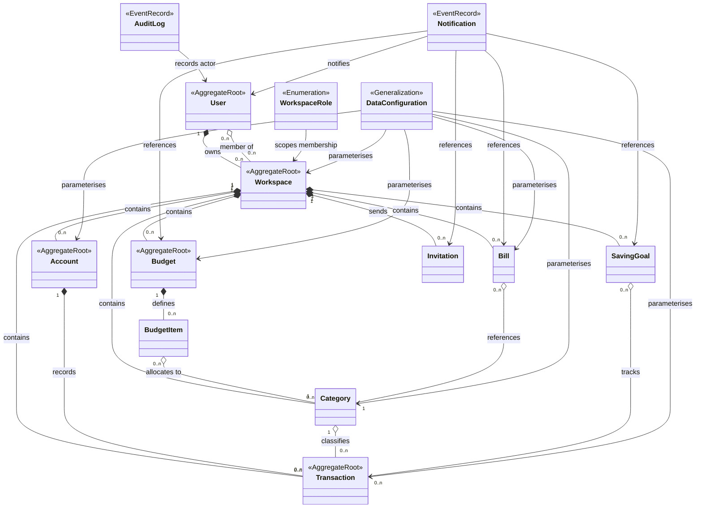

# Software Requirements Specification (SRS)

**Personal & Family Finance Management System**

---

## Table of Contents

1. [Introduction](#1-introduction)
   - [1.1 Purpose](#11-purpose)
   - [1.2 Scope](#12-scope)
   - [1.3 Assumptions and Constraints](#13-assumptions-and-constraints)
   - [1.4 Definitions and Acronyms](#14-definitions-and-acronyms)
   - [1.5 Roles and Actors](#15-roles-and-actors)
   - [1.6 Out of Scope](#16-out-of-scope)
   - [1.7 Related Documents](#17-related-documents)
2. [Conceptual Domain Model (CDM)](#2-conceptual-domain-model-cdm)
3. [Functional Requirements (Optional)](#3-functional-requirements-optional)
4. [Business Rules](#4-business-rules)
5. [Non-Functional Considerations (Optional)](#5-non-functional-considerations-optional)
6. [User Experience Requirements](#6-user-experience-requirements)
7. [Access Control & Roles](#7-access-control--roles)
8. [Business Flows](#8-business-flows)
9. [Features & User Stories](#9-features--user-stories)

---

## 1. Introduction

### 1.1 Purpose

This Software Requirements Specification (SRS) defines the functional and non-functional requirements for the Personal & Family Finance Management System. It serves as the single source of truth for what the system does, why it exists, and how actors interact with it. The SRS guides design decisions, development, testing, and acceptance criteria.

### 1.2 Scope

**In Scope:**

**In Scope:**
- User authentication and account management (email/password registration, email verification, password reset)
- Multi-user workspace creation and member management with role-based access
- Financial account tracking (bank accounts, credit cards, cash, investment accounts)
- Transaction recording and management (income, expenses, transfers, refunds, investments, loans, debt)
- Budget creation, tracking, and approval workflows
- Saving goal definition, progress tracking, and deadline enforcement
- Category management with workspace scope
- Bill reminders (recurring payments, no auto-generation)
- Audit logging for compliance and financial audit trails
- Financial reporting and dashboard analytics
- Invitation system with single-use tokens and expiration

**Out of Scope:**
- Mobile app (web-only MVP)
- Currencies beyond VND and USD
- Automatic transaction imports from external banks
- Tax calculation and filing assistance
- Investment portfolio management (basic tracking only)
- Bill payment automation (manual recording required)
- Third-party integrations (bank APIs, payment processors)
- Machine learning or predictive analytics

### 1.3 Assumptions and Constraints

**Assumptions:**

- Users have stable email addresses and can access email for verification
- Workspace members can be invited and have access to communicate outside the system
- PostgreSQL is the primary database
- FastAPI and React are the chosen tech stack
- All financial amounts are in supported ISO-4217 currencies

**Constraints:**

- Single-currency per workspace (changeable only through an explicit restatement of every stored rate)
- Maximum 100,000 transactions per workspace before performance degradation
- JWT tokens expire in 15 minutes; refresh tokens in 7 days
- Maximum 1000 budget items per workspace
- Audit logs retained indefinitely (storage constraint on database growth)

### 1.4 Definitions and Acronyms

| Term | Definition |
| --- | --- |
| **OWNER** | Workspace owner; full control over workspace settings, members, and approvals |
| **MEMBER** | Regular contributor to workspace; can create transactions, budgets, and goals |
| **Workspace** | Financial namespace owned by a user; contains accounts, transactions, members, and configurations |
| **Account** | Formal financial account (Bank Account, Credit Card, Cash, Investment); belongs to one workspace |
| **Transaction** | Financial event: income, expense, transfer, refund, investment, loan, or debt; immutable after creation |
| **Category** | Classification for transactions (Salary, Food, Rent, etc.); workspace-scoped |
| **Budget** | Spending plan with per-category allocations; has status lifecycle (Pending → Active → Archived) |
| **Saving Goal** | Target savings amount with deadline; progress tracked by tagged transactions |
| **Bill** | Recurring expense reminder (not auto-paid); manual payment recording required |
| **Audit Log** | Immutable record of all state-changing operations; retained indefinitely |
| **Notification** | User-scoped message raised by a system event; read/unread per recipient |
| **Data Configuration** | Generalization over the reference-data domains that parameterise forms and validation; not a standalone entity |
| **SRS** | Software Requirements Specification; this document |
| **SDS** | Software Design Specification; technical implementation guide |
| **JWT** | JSON Web Token; used for authentication and authorization |
| **DTO** | Data Transfer Object; request/response payload schema |
| **CRUD** | Create, Read, Update, Delete operations |

### 1.5 Roles and Actors

| Actor | Role Scope | Responsibilities |
| --- | --- | --- |
| **Individual User** | Self-owned workspace (OWNER) | Create Personal workspace, manage own finances, invite family members, view reports |
| **Family Member** | Shared workspace (MEMBER) | Record transactions, create budgets, view shared data, participate in goals |
| **Workspace OWNER** | Workspace-scoped | Invite/remove members, change member roles, delete workspace, approve budgets, view audit logs |
| **Workspace MEMBER** | Workspace-scoped | Create/cancel transactions, create budgets, create goals, view workspace data |
| **System Administrator** | System-wide (not yet in MVP) | Manage users, audit logs, system configuration (future feature) |

### 1.6 Out of Scope

The following are explicitly **not** included in the MVP and are captured as future enhancements:

- **Mobile Application** — Web interface only; native mobile apps deferred
- **Bank Data Integration** — No automatic transaction imports; manual entry required
- **Multi-currency Transactions** — Only VND and USD are supported; a workspace has one preferred currency and cross-currency amounts are converted at the rate the system retrieves when the amount is recorded
- **Scheduled/Automatic Payments** — Bills are reminders only; no auto-execution
- **Tax Reporting** — Categorization support only; no tax forms or calculations
- **Advanced Analytics** — Dashboards and reports scope limited to basic summaries
- **Third-party Integrations** — No Plaid, Stripe, or external payment processor integrations
- **Role Customization** — Fixed roles (OWNER, MEMBER) only; no custom permission sets

### 1.7 Related Documents

| Document | Purpose |
| --- | --- |
| [SDS.md](SDS.md) | Technical design, architecture, API specifications, database schema |
| [Plan.md](specs/plan.md) — *if applicable* | Development roadmap, milestone schedule, team assignments |
| [Test Plan](testing/) | Test cases, acceptance criteria, Playwright test automation |

---

## 2. Conceptual Domain Model (CDM)

**Last synced with SDS §2: 2026-07-30**

### 2.1 Domain Diagram

### 2.2 Domain Entity

| Entity | Definition | Lifecycle |
|--------|-----------|-----------|
| **User** | Individual with email, password, authentication credentials | Created at signup; can be inactive; deleted with all owned workspaces |
| **Workspace** | Financial namespace (Personal, Family); contains members, accounts, transactions | Created by user; can be archived or deleted |
| **WorkspaceRole** | OWNER, MEMBER role per workspace | Assigned at invitation; can be changed by OWNER |
| **Account** | Formal financial account (Bank Account, Credit Card, Cash, etc.); belongs to one workspace | Created by MEMBER+; can be archived |
| **Transaction** | Income, Expense, Transfer, Refund, Investment, Loan, or Debt; immutable once recorded | Created by MEMBER+; can only be refunded/cancelled, not edited |
| **Category** | Classification for transactions (Salary, Groceries, Rent, etc.); default + custom | Created by OWNER; scope to workspace |
| **Budget** | Spending limit per period (monthly, weekly, yearly, custom); tracks progress | Created by MEMBER; owned by creator; OWNER can approve |
| **BudgetItem** | Per-category allocation within a Budget | Defined at budget creation |
| **SavingGoal** | Target amount with deadline (e.g., "Vacation: $2000 by Dec 2026") | Created by MEMBER; progress tracked via tagged transactions |
| **Bill** | Recurring expense reminder (e.g., "Rent: due 1st of month") | Created by MEMBER; no auto-generation; manual payment recording |
| **Invitation** | Email-based workspace invitation with secure token and expiration | Issued by OWNER; single-use; expires 7 days |
| **AuditLog** | Event record for all state-changing operations (created/edited/deleted) | Auto-generated; immutable; retained indefinitely |
| **Notification** | User-scoped message raised by a system event (invitation received, budget approved or rejected, bill due, saving goal reached) | Auto-generated on the triggering event; read/unread per recipient |
| **DataConfiguration** | Generalization over the reference-data domains that parameterise forms and validation (AccountType, CategoryType, TransactionType, BudgetPeriod, Currency, WorkspaceRole); not a standalone entity | Generalization over independent reference-data domains; no single shared table |

### 2.3 Entity Relationships & Cardinality

| Subject | Verb Phrase | Object | Type | Cardinality | Constraint |
| --- | --- | --- | --- | --- | --- |
| User | owns | Workspace | Ownership | 1:N | User can own multiple workspaces; Workspace has one owner |
| User | is member of | Workspace | Membership | M:N | User joins workspaces; Workspace has multiple members via WorkspaceMember |
| User | creates | AuditLog | Reference | 1:N | User can create audit events; AuditLog records one actor |
| Workspace | contains | Account | Containment | 1:N | Workspace has multiple accounts; Account belongs to one workspace |
| Workspace | contains | Category | Containment | 1:N | Workspace has multiple categories; Category scoped to one workspace |
| Workspace | contains | Budget | Containment | 1:N | Workspace has multiple budgets; Budget belongs to one workspace |
| Workspace | contains | SavingGoal | Containment | 1:N | Workspace has multiple saving goals; Goal belongs to one workspace |
| Workspace | contains | Bill | Containment | 1:N | Workspace has multiple bills; Bill belongs to one workspace |
| Workspace | contains | Transaction | Containment | 1:N | Workspace has multiple transactions; Transaction belongs to one workspace |
| Workspace | sends | Invitation | Reference | 1:N | Workspace issues multiple invitations; Invitation tied to one workspace |
| Account | contains | Transaction | Containment | 1:N | Account has multiple transactions; Transaction belongs to one account (primary) |
| Category | classifies | Transaction | Classification | 1:N | Category classifies many transactions; Transaction has one primary category |
| Transaction | contributes to | SavingGoal | Contribution | M:N | Transaction may contribute to multiple goals; Goal tracks multiple transactions |
| Budget | defines | BudgetItem | Decomposition | 1:N | Budget has multiple line items; BudgetItem belongs to one budget |
| BudgetItem | allocates to | Category | Allocation | N:1 | BudgetItem allocates amount to one category; Category may be in multiple budgets |
| SavingGoal | tracks | Transaction | Tracking | M:N | Goal tracks contributing transactions; Transaction may contribute to multiple goals |
| Bill | references | Category | Classification | N:1 | Bill references one category; Category may be referenced by multiple bills |
| Notification | notifies | User | Association | N:1 | Notification targets exactly one recipient; User receives multiple notifications |
| Notification | references | Invitation / Budget / Bill / SavingGoal | Association | 0..n | Notification targets must align to the triggering business event |
| DataConfiguration | parameterises | Business entities and forms | Association | 0..n | Inactive values remain visible on existing records but are not selectable for new input |

---

## 3. Functional Requirements (Optional)

**Note:** This section documents field-level requirements, validation rules, and business constraints for key entities. It is optional for MVP but recommended as complexity grows.

### 3.1 User

| No. | Field | Description | Business Rules | Example |
| --- | --- | --- | --- | --- |
| FR-01 | Email | User login identifier | Unique; valid email format; immutable after creation | `user@example.com` |
| FR-02 | Password | Authentication credential | Min 8 chars; must contain uppercase, lowercase, digit, symbol; hashed with bcrypt | `SecurePass123!` |
| FR-03 | Name | Display name | Required; max 255 chars | `Jane Doe` |
| FR-04 | Status | Account state | Values: active, inactive, pending_verification; newly registered = pending until email confirmed | `active` |
| FR-05 | Email Verified At | Confirmation timestamp | NULL until email link clicked; used to enforce 24-hr confirmation window | `2026-07-30T10:00:00Z` |
| FR-06 | Failed Login Attempts | Brute-force counter | Increments on failed login; resets to 0 on success; triggers account lock at 10 attempts | `5` |
| FR-07 | Locked Until | Lock expiration | Set when failed_login_attempts >= 10; account unusable until timestamp passed | `2026-07-30T10:45:00Z` |

### 3.2 Workspace

| No. | Field | Description | Business Rules | Example |
| --- | --- | --- | --- | --- |
| FR-08 | Name | Workspace identifier | Required; max 255 chars; unique per owner (users can have multiple workspaces with same name in different accounts) | `Family Finances` |
| FR-09 | Type | Classification | Values: PERSONAL, FAMILY, CUSTOM; affects default categories and member limits | `PERSONAL` |
| FR-10 | Preferred Currency | Currency every summary and report is expressed in | One of `VND`, `USD`; set at creation; all new accounts default to this; changeable afterwards only by an OWNER, and only as an explicit operation that restates the snapshot rate on every Account and Transaction in the Workspace | `VND` |
| FR-11 | Owner | Workspace creator | Immutable; creator is the first OWNER; cannot be removed while sole OWNER | User ID `42` |
| FR-12 | Status | Workspace state | active, archived, deleted; soft-delete via deleted_at timestamp | `active` |

### 3.3 Transaction

| No. | Field | Description | Business Rules | Example |
| --- | --- | --- | --- | --- |
| FR-13 | Amount | Monetary value | Required; positive decimal (15,2 precision); must match account currency | `150.50` |
| FR-13a | Currency | Transaction currency | Required; one of `VND`, `USD`; must equal the account's currency | `USD` |
| FR-13b | Exchange Rate | Rate to the workspace preferred currency, retrieved by the system when the transaction is recorded | Never entered or chosen by a member; greater than 0 when the transaction currency differs from the workspace preferred currency; exactly 1 when they match; immutable after creation | `26183.58` |
| FR-14 | Type | Transaction classification | Values: INCOME, EXPENSE, TRANSFER, REFUND, INVESTMENT, LOAN, DEBT | `EXPENSE` |
| FR-15 | Date | Transaction date | Required; immutable after creation; used for budget period matching and reporting | `2026-07-30` |
| FR-16 | Account | Primary account | Required; transaction account_id must exist and not be archived; determines currency | Account `789` |
| FR-17 | Category | Primary classification | Required; category must exist in same workspace; soft-deleted categories unavailable for new transactions | `Food` |
| FR-18 | Status | Transaction state | Values: recorded, cancelled; cancelled = soft-deleted (balance impact reversed) | `recorded` |
| FR-19 | Created By | Actor | Required; references user who recorded transaction; immutable; used for audit | User `42` |

Every recorded transaction keeps the exchange rate that applied at the moment it was recorded. The system retrieves that rate itself — a member chooses the currency, never the rate — and later rate movements never restate transactions that are already recorded.

### 3.4 Budget

| No. | Field | Description | Business Rules | Example |
| --- | --- | --- | --- | --- |
| FR-20 | Period | Frequency | Values: MONTHLY, WEEKLY, YEARLY, CUSTOM; determines overlap-check scope | `MONTHLY` |
| FR-21 | Start/End Date | Validity window | Required; start <= end; overlap validation: no two active budgets with same period and overlapping dates in same workspace | `2026-07-01` / `2026-07-31` |
| FR-22 | Status | Approval state | Values: PENDING (awaiting approval), ACTIVE (approved, tracking), REJECTED (denied, no impact), ARCHIVED (historical) | `PENDING` |
| FR-23 | Allocations | Per-category limits | List of {category_id, allocated_amount}; amount >= 0; categories must exist in workspace | `Food: 300, Transport: 100` |
| FR-24 | Spending | Current total | Calculated as: sum of transactions in period matching budget's categories; read-only; updated in real-time | `245.75` |

### 3.5 Saving Goal

| No. | Field | Description | Business Rules | Example |
| --- | --- | --- | --- | --- |
| FR-25 | Target Amount | Goal value | Required; positive decimal; immutable after creation | `2000.00` |
| FR-26 | Deadline | Target date | Required; must be future date at creation; goal status = complete if progress >= target AND deadline passed | `2026-12-31` |
| FR-27 | Progress | Current total | Calculated as: sum of transaction amounts tagged with this goal; read-only; decrements if tagged transaction refunded | `1500.00` |
| FR-28 | Status | Goal state | Values: ACTIVE (in progress), COMPLETED (reached or manually marked), ARCHIVED (hidden from active list) | `ACTIVE` |

---

## 4. Business Rules

**BR-01: Workspace Membership**
A member can join multiple workspaces. A workspace must have at least one OWNER. An OWNER's role cannot be changed and an OWNER cannot be removed from a workspace; only MEMBERs can be removed.

**BR-02: Account Ownership**
An account belongs to exactly one workspace. Transfers between accounts in different workspaces are not permitted.

**BR-03: Transaction Immutability**
Once a transaction is recorded, its account and amount cannot be changed. Edits are performed via refund (negative transaction) + new transaction.

**BR-04: Budget Period Uniqueness**
A workspace can have at most one active budget per period (monthly, weekly, yearly). Overlapping budgets of the same period are rejected.

**BR-05: Saving Goal Tracking**
Transactions tagged with a saving goal increment the goal's progress. Refunded transactions decrement progress.

**BR-06: Bill Reminders**
Recurring bills generate reminders; no automatic transaction generation. Members must manually record bill payments.

**BR-07: Currency Consistency**
`VND` and `USD` are the only supported currencies. All transactions in an account must use the account's currency, and multi-currency transfers credit the destination in the destination account's currency. Every transaction and every account opening balance stores the exchange rate to the workspace preferred currency that applied when it was recorded; that snapshot is immutable.

The rate is the system's to determine, not a member's: a member chooses a workspace preferred currency and an account or transaction currency, and nothing more. The system retrieves the prevailing rate at the moment the amount is recorded, stores it on the record, and uses it solely for calculation. When no rate can be retrieved the record is refused rather than stored at a guessed rate.

**BR-07a: Summaries Are Expressed in the Preferred Currency**
Every aggregate the system reports — total balance, monthly income, monthly expense, cash flow, budget spending, saving goal progress, net worth and every report — converts each contributing transaction with that transaction's own snapshot exchange rate and presents the total in the workspace preferred currency. Aggregates are never produced by mixing raw amounts of different currencies.

**BR-08: Workspace Invitations**
Invitations are single-use tokens with 7-day default expiration. Only OWNER can send invitations. Recipient must accept to join workspace.

**BR-09: Role Assignment on Invitation**
A user accepts an invitation with the assigned role; role change requires OWNER action.

**BR-10: Audit Trail Immutability**
Audit logs are append-only. No edits or deletions. Retained indefinitely for compliance.

---

## 5. Non-Functional Considerations (Optional)

This section documents non-functional requirements relevant to a financial application handling real money and sensitive user data.

**Data Integrity:**

- Transaction amounts and account balances must always remain reconcilable (balance = opening_balance + sum of all transactions)
- Soft-delete flags must never affect balance calculations; cancelled transactions are reversed before marking as deleted
- Concurrent transaction recording must be atomic; no race conditions on account balance updates
- Budget spending calculations must match transaction sums within the budget period scope

**Audit Trail & Compliance:**

- All money movements (transaction creation, refund, budget approval, goal tagging) must be immutable and logged
- Audit logs are append-only; no edits or deletions permitted
- Audit events must include timestamp, actor, action, entity type/ID, IP address, and changes (for updates)
- Invitation tokens must be single-use and expire after 7 days

**Performance:**

- Dashboard metrics (balance, income, expense, savings) must load in <2 seconds for workspaces with <100K transactions
- Transaction list pagination must support 25/50/100 items per page and complete in <300ms
- Report generation (monthly, yearly, cash flow) must complete in <5 seconds for standard date ranges
- Budget progress recalculation must happen in <500ms per category per workspace

**Availability & Reliability:**

- No downtime during backup windows; backup operations must not block user transactions
- Transaction refund operations must be reversible within 30 days of original recording (audit only; cannot undo refund itself)
- Failed invitation emails must be retried up to 3 times over 1 hour

**Data Retention:**

- Audit logs retained indefinitely for compliance
- Deleted workspaces: soft-deleted; recoverable for 90 days before hard deletion
- User accounts: soft-deleted; recoverable for 30 days; all owned workspaces deleted with account

---

## 6. User Experience Requirements

This section defines how the system should behave from a user perspective to ensure clarity, responsiveness, and intuitive interaction.

### 6.1 Clarity

- **Consistent Terminology** — All UI labels, help text, and messages must use the terminology defined in SRS §1.4
- **Visual Hierarchy** — Key information (account balance, budget status, goal progress) must be immediately visible without scrolling
- **Error Messages** — All error messages must be clear, actionable, and specific (e.g., "Email already registered" not "Error 409")
- **Confirmation Dialogs** — Destructive actions (delete account, workspace, transaction) require explicit confirmation with a summary of consequences
- **Status Indicators** — Transaction status, budget approval state, and saving goal progress must use consistent visual cues (badges, progress bars, icons)

### 6.2 Responsiveness

- **Page Load Time** — Core pages (login, dashboard, transaction list) must load in <2 seconds over 3G
- **Form Submission Feedback** — Forms must show loading state during submission; success/error toast within 500ms of response
- **Real-time Updates** — When one member records a transaction, others viewing the shared workspace should see the update within 5 seconds (polling or WebSocket)
- **Pagination** — List pages (transactions, accounts, budgets) must support pagination with default 25 items per page
- **Search** — Search inputs must return results within 500ms; debounce rapid typing (300ms)

### 6.3 Immediate Feedback

- **Input Validation** — Form fields must show validation errors on blur (frontend) or submit (backend)
- **Success Confirmation** — After successful action (create, update, delete), display a success toast with action summary
- **Undo/Redo** — Transaction cancellation should be reversible; offer 30-second undo window or explicit "Undo" button
- **Loading States** — During async operations, disable form buttons and show loading spinner
- **Conflict Handling** — If a member edits data while another is editing (concurrent update), show merge conflict UI or reload required message

### 6.4 Role-aware Navigation

- **Permission-based Visibility** — Hide menu items and action buttons for roles that lack permission (e.g., MEMBER cannot see "Delete Workspace")
- **Workspace Switcher** — If user belongs to multiple workspaces, provide quick-access switcher in header
- **Breadcrumbs** — Show navigation path: Home > Workspace Name > Section (e.g., Home > Family Finances > Transactions)
- **Back Navigation** — All modal dialogs and forms must have a clear back/cancel button

### 6.5 Data-heavy Page Usability

- **Table Sorting** — Transaction and account lists must support click-to-sort by column (date, amount, category)
- **Filtering** — Provide filters for status, date range, category, and amount range without requiring page reload
- **Column Customization** — Allow users to show/hide columns in tables (optional MVP enhancement)
- **Bulk Actions** — Allow selecting multiple transactions for bulk tagging or categorization (if time permits)
- **Export** — Provide CSV/PDF export of transactions and reports for accounting and record-keeping

---

## 7. Access Control & Roles

**Last synced: 2026-07-30**

| Role | Scope | Features |
| --- | --- | --- |
| **OWNER** | Workspace owner; full control | Create workspace, invite/remove members, delete workspace, approve budgets, change member roles, view audit logs, view all data |
| **MEMBER** | Regular contributor | Create/edit/cancel transactions, create budgets, create saving goals, view workspace data |

**Key Rules:**

- OWNER can invite members and assign roles
- OWNER can delete workspace
- OWNER can view audit logs
- MEMBER can create budgets and transactions
- Only the workspace creator (first OWNER) has full deletion rights

---

## 8. Business Flows

### 8.1 User Registration & Authentication

**Actors:** Anonymous user, registered User  
**Preconditions:** The email address is not registered  
**Postconditions:** The User is active, a Personal Workspace exists with default Categories, and the User is authenticated

1. An anonymous user opens the registration form.
2. The user submits name, email, and password.
3. The system validates email format, email uniqueness, and password strength.
4. The system creates the User with status `pending_verification` and sends a confirmation email containing a single-use link.
5. The user opens the confirmation link within the confirmation window.
6. The system sets the User status to `active` and stamps the email verification timestamp.
7. The system auto-creates a `PERSONAL` Workspace for the User together with its default Categories.
8. The system authenticates the User, issues the session credentials, and records the login in the AuditLog.
9. The frontend redirects the User to the Dashboard of the Personal Workspace.
10. On a later visit, the User submits email and password on the login form.
11. The system checks the account status, the rate limit, and the lock policy.
12. The system authenticates the credentials, resets the failed-attempt counter, and issues the session credentials.
13. The system renews the session credentials transparently while the User remains active.
14. The User logs out; the system invalidates the session credentials and records the logout in the AuditLog.

#### Alternative Flows

- The invitee of a Workspace Invitation registers through steps 1–9 and then continues the Invitation flow (§8.3) from step 7.

#### Negative Flows

- An already registered email returns `USER_EMAIL_EXISTS`.
- A password below the strength policy returns `INVALID_PASSWORD`.
- A malformed email returns `INVALID_EMAIL`.
- A confirmation link opened after its window returns `TOKEN_EXPIRED`; one that was already used returns `TOKEN_ALREADY_USED`.
- An email address with no account returns `USER_NOT_FOUND`, and the attempt is not counted towards any lockout.
- A wrong password on an existing account returns `INVALID_CREDENTIALS`.
- Login before the email is confirmed returns `EMAIL_NOT_VERIFIED`.
- More than 5 login attempts within 15 minutes return `RATE_LIMITED`.
- 10 failed login attempts lock the account for 30 minutes and return `ACCOUNT_LOCKED`.
- An expired or invalid session renewal returns `INVALID_REFRESH_TOKEN`; a revoked one returns `TOKEN_BLACKLISTED`.
- Logout with an invalid token returns `INVALID_TOKEN`.

---

### 8.2 Main Business Flow - End-to-End User Journey

**Actors:** Workspace OWNER (U1), Workspace MEMBER (U2)  
**Preconditions:** U1's email address is not registered  
**Postconditions:** Workspace W2 holds Categories, Accounts, Transactions, an `ACTIVE` Budget, a `COMPLETED` SavingGoal, and an active Bill; every state-changing step is recorded in the AuditLog

1. A user U1 registers, confirms the verification email, and logs in; a `PERSONAL` Workspace W1 is auto-created.
2. U1 creates a `FAMILY` Workspace W2 `Family Finances` with base currency `USD` and becomes its OWNER.
3. U1 reviews W2's default Categories and adds custom Categories `Salary`, `Groceries`, and `Rent`.
4. U1 creates Accounts A1 `Joint Bank Account` and A2 `Cash` in W2 with their opening balances.
5. U1 invites U2 to W2 with the MEMBER role.
6. U2 accepts the Invitation and joins W2 as MEMBER.
7. U1 views W2's member list and confirms U2's role and join date.
8. U2 records an `INCOME` Transaction (`Salary`) into A1.
9. U2 records `EXPENSE` Transactions against `Groceries` and `Rent` from A1.
10. U2 records a `TRANSFER` Transaction from A1 to A2.
11. U2 creates a `MONTHLY` Budget B1 for W2 with BudgetItem allocations for `Groceries` and `Rent`; B1 is `PENDING`.
12. U2 refines B1's allocations while B1 is still `PENDING`.
13. U1 approves B1; B1 becomes `ACTIVE` and spending tracking begins.
14. U2 records further `EXPENSE` Transactions and monitors B1's spending as it crosses the 80% alert threshold.
15. U2 creates a SavingGoal G1 `Vacation` with a target amount and a future deadline.
16. U2 tags a Transaction with G1; G1's progress is recalculated.
17. U2 views G1's progress, milestones, and contributing Transactions.
18. U2 creates a recurring Bill `Rent` referencing Category `Rent`.
19. U2 views the Bill reminders due in the current period and manually records the Bill payment as an `EXPENSE` Transaction.
20. U2 cancels an incorrectly recorded Transaction; the A1 balance, B1 spending, and G1 progress are reversed.
21. U1 searches and filters W2's Transaction history by date range, Category, Account, and member.
22. U1 views W2's Dashboard: balances, monthly income versus expense, Budget progress, upcoming Bills, and SavingGoal progress.
23. U1 generates a monthly financial report for W2 and exports it.
24. U1 views A2's details and archives A2 once it is no longer in use.
25. U1 marks G1 as `COMPLETED` and archives it.
26. U1 promotes U2 from MEMBER to OWNER so that U2 can approve Budgets.
27. U1 removes a departing MEMBER from W2; the OWNERs of W2 are unaffected.
28. U1 logs out.

#### Alternative Flows

- U2 declines the Invitation at step 6: no membership record is created and U2 does not appear in W2's member list.
- U1 rejects B1 at step 13: B1 becomes `REJECTED`, no spending is tracked against it, and U2 is notified.

#### Negative Flows

- A second Budget for W2 with the same period and overlapping dates is rejected with `BUDGET_PERIOD_CONFLICT`.
- Editing B1 after approval is rejected with `BUDGET_ALREADY_APPROVED`.
- A Transaction recorded against an archived Account is rejected with `ACCOUNT_ARCHIVED`; a Transaction referencing an archived Category is rejected with `CATEGORY_NOT_FOUND`.
- Cancelling an already cancelled Transaction is rejected with `TRANSACTION_ALREADY_CANCELLED`; a member who is neither the creator nor an OWNER is rejected with `PERMISSION_DENIED`.
- Changing the role of an OWNER of W2, or removing an OWNER of W2, is rejected with `UNSUPPORTED_OPERATION`.
- Archiving an Account that still has pending Transactions is rejected with `ACCOUNT_HAS_PENDING_TRANSACTIONS`.

---

### 8.3 Workspace Invitation Flow

**Actors:** Workspace OWNER, invitee (existing or new user)  
**Preconditions:** The OWNER is authenticated in the Workspace; an invitee email is provided  
**Postconditions:** The invitee is a Workspace member with the assigned role and the Invitation token is consumed

1. An OWNER opens the member list of a Workspace.
2. The OWNER submits the invitee's email address and the role to assign.
3. The system validates the email format and that the invitee is not already a member.
4. The system creates an Invitation with a single-use token and a 7-day expiration.
5. The system sends the invitation email with accept and decline links and records the invitation in the AuditLog.
6. The system raises a Notification for the invitee where the invitee is an existing User.
7. The invitee opens the invitation link.
8. The invitee accepts the Invitation.
9. The system adds the invitee to the Workspace with the assigned role, consumes the token, and records the acceptance in the AuditLog.
10. The OWNER views the member list and sees the new member, role, and join date.

#### Alternative Flows

- The invitee declines at step 8: the Invitation is marked declined, the token is consumed, and no membership record is created.
- The invitee has no account: the invitee is redirected to the registration flow (§8.1) and returns to step 7 after confirming the account.

#### Negative Flows

- An unknown invitation token, or one that does not match the authenticated User's email, returns `INVITATION_NOT_FOUND`.
- An Invitation opened more than 7 days after issue returns `INVITATION_EXPIRED`.
- A token that was already accepted or declined returns `INVITATION_ALREADY_USED`.
- An invitee who is already a member returns `USER_ALREADY_MEMBER`.
- A malformed invitee email returns `INVALID_EMAIL`.

---

### 8.4 Transaction Recording

**Actors:** Workspace MEMBER, Workspace OWNER  
**Preconditions:** The Account exists and is not archived; the Category exists in the same Workspace  
**Postconditions:** The Transaction is recorded, the Account balance is updated, Budget spending and SavingGoal progress reflect the Transaction, and Notifications are raised for crossed Budget thresholds

1. A MEMBER creates an Account with its type, name, currency, and opening balance where no suitable Account exists.
2. The MEMBER opens the transaction form and selects the transaction type: `INCOME`, `EXPENSE`, `TRANSFER`, `REFUND`, `INVESTMENT`, `LOAN`, or `DEBT`.
3. The MEMBER selects the Account and, for a `TRANSFER`, the destination Account.
4. The MEMBER enters the amount, date, Category, and optional tags, notes, and receipt attachment.
5. Where the Account's currency differs from the Workspace preferred currency, the system retrieves the prevailing exchange rate and shows the MEMBER what the amount converts to; where they match, the rate is 1 and no lookup happens.
6. The MEMBER optionally tags the Transaction with one or more SavingGoals.
7. The system validates the amount, the Category, and that the Account is not archived.
8. The system records the Transaction with its snapshot exchange rate and updates the Account balance immediately; a `TRANSFER` creates the debit and credit pair in one atomic operation, each leg carrying its own snapshot rate.
9. The system recalculates the spending of any `ACTIVE` Budget covering the Transaction's period and Category in the Workspace preferred currency, and raises Notifications for crossed thresholds.
10. The system recalculates the progress of every tagged SavingGoal in the Workspace preferred currency.
11. The system records the Transaction in the AuditLog.
12. The MEMBER views the Transaction in the Account's transaction history, showing the transaction currency amount and its preferred-currency equivalent.

#### Alternative Flows

- The MEMBER cancels a recorded Transaction: its status becomes cancelled and its balance, Budget spending, and SavingGoal impact are reversed. A cancelled Transaction cannot be reinstated — a `REFUND` Transaction is recorded instead.
- The MEMBER archives an Account that is no longer used: the Account stays visible in the Account list and on historical Transactions but is not selectable for new Transactions.

#### Negative Flows

- A non-positive or malformed amount returns `INVALID_AMOUNT`.
- A currency other than `VND` or `USD` returns `UNSUPPORTED_CURRENCY`.
- An exchange rate the system cannot retrieve, where the currencies differ, returns `EXCHANGE_RATE_UNAVAILABLE`; the Transaction is not recorded and the MEMBER may retry.
- A Category that does not exist in the Workspace returns `CATEGORY_NOT_FOUND`.
- An archived source Account returns `ACCOUNT_ARCHIVED`; an unknown Account returns `ACCOUNT_NOT_FOUND`.
- A `TRANSFER` with the same source and destination Account returns `INVALID_TRANSFER`.
- A duplicate Account name within the Workspace returns `ACCOUNT_NAME_EXISTS`; an invalid type or opening balance returns `INVALID_ACCOUNT_TYPE` or `INVALID_OPENING_BALANCE`.
- Cancelling a Transaction as neither its creator nor an OWNER returns `PERMISSION_DENIED`; cancelling it twice returns `TRANSACTION_ALREADY_CANCELLED`.
- Tagging a completed or archived SavingGoal returns `GOAL_ARCHIVED`.

---

### 8.5 Budget Management

**Actors:** Workspace MEMBER (creator), Workspace OWNER (approver)  
**Preconditions:** Categories are defined in the Workspace; no overlapping active Budget of the same period exists  
**Postconditions:** The Budget is `ACTIVE` and frozen against edits; spending is tracked per Category and threshold Notifications are raised

1. A MEMBER opens the budget form.
2. The MEMBER enters the budget name, period (`MONTHLY`, `WEEKLY`, `YEARLY`, or `CUSTOM`), and start and end dates.
3. The MEMBER allocates a non-negative amount per Category as BudgetItems.
4. The system validates the date range, the allocations, the Categories, and that no active Budget of the same period overlaps in the Workspace.
5. The system creates the Budget with status `PENDING` and the creator as its owner, and records it in the AuditLog.
6. The MEMBER edits the allocations while the Budget is still `PENDING`.
7. The OWNER reviews the pending Budget.
8. The OWNER approves the Budget; its status becomes `ACTIVE` and tracking begins.
9. The system calculates spending as the sum of all members' Transactions in the period matching the Budget's Categories.
10. The system raises Notifications when spending crosses 50%, 80%, 100%, and exceeded.
11. Members view the Budget detail with allocation, spending, percentage, and status per Category.

#### Alternative Flows

- The OWNER rejects the Budget at step 8: its status becomes `REJECTED`, no spending is tracked, and the creator is notified.
- The Budget's validity window ends: the Budget moves to `ARCHIVED` and remains available as history.

#### Negative Flows

- An overlapping Budget of the same period returns `BUDGET_PERIOD_CONFLICT`.
- An allocation referencing an unknown Category returns `CATEGORY_NOT_FOUND`; negative or malformed allocations return `INVALID_BUDGET_ALLOCATIONS`.
- Approving or rejecting a Budget that is not pending returns `BUDGET_ALREADY_APPROVED`; an unknown Budget returns `BUDGET_NOT_FOUND`.
- Editing an approved Budget returns `BUDGET_ALREADY_APPROVED`; editing as a member other than the creator returns `PERMISSION_DENIED`.

---

### 8.6 Saving Goal Tracking

**Actors:** Workspace MEMBER  
**Preconditions:** The target amount is positive and the deadline is a future date at creation  
**Postconditions:** Goal progress reflects all tagged Transactions; the goal is `COMPLETED` or `ARCHIVED` and no longer editable

1. A MEMBER opens the saving goal form.
2. The MEMBER enters the goal name, target amount, deadline, and optional description.
3. The system validates the target amount, the deadline, and the uniqueness of the goal name within the Workspace.
4. The system creates the SavingGoal with status `ACTIVE` and progress `0`, and records it in the AuditLog.
5. The MEMBER tags a Transaction with the SavingGoal when recording or reviewing that Transaction.
6. The system credits the Transaction amount to the goal's progress immediately.
7. The system raises Notifications when progress reaches the 25%, 50%, 75%, and 100% milestones.
8. The MEMBER views the goal list and the goal detail with progress, percentage, deadline, status, and contributing Transactions.
9. The MEMBER marks the SavingGoal as `COMPLETED` once the target is reached or the goal is met manually.
10. The MEMBER archives the SavingGoal to remove it from the active list.

#### Alternative Flows

- A tagged Transaction is refunded or cancelled: the goal's progress is decremented accordingly.
- The deadline passes before the target is reached: the goal is reported as behind and stays `ACTIVE` until it is completed or archived.

#### Negative Flows

- A target amount of zero or less returns `INVALID_TARGET_AMOUNT`.
- A deadline in the past returns `INVALID_DEADLINE`.
- A duplicate goal name within the Workspace returns `GOAL_NAME_EXISTS`.
- Tagging an unknown goal returns `GOAL_NOT_FOUND`; tagging a completed or archived goal returns `GOAL_ARCHIVED`.

---

### 8.7 Bill Reminder Flow

**Actors:** Workspace MEMBER  
**Preconditions:** The Category referenced by the Bill exists in the Workspace  
**Postconditions:** The Bill reminder is active for each occurrence of its frequency; payments exist only as manually recorded Transactions

1. A MEMBER opens the bill form.
2. The MEMBER enters the bill name, amount, Category, due day, frequency (monthly, quarterly, or yearly), and status.
3. The system validates the due date, the frequency, and the Category.
4. The system creates the Bill, sets its reminder, and records it in the AuditLog.
5. The system raises a Notification for the recipient as the due date approaches.
6. The MEMBER views the upcoming and overdue Bills sorted by due date.
7. The MEMBER records the Bill payment manually as an `EXPENSE` Transaction (§8.4); the system does not generate it automatically.
8. The Dashboard shows the Bills due within the next 7 days.

#### Alternative Flows

- The MEMBER sets the Bill to inactive: reminders stop and the Bill remains visible as history.

#### Negative Flows

- An invalid due date returns `INVALID_DUE_DATE`.
- An invalid frequency returns `INVALID_FREQUENCY`.
- A Category that does not exist in the Workspace returns `CATEGORY_NOT_FOUND`.

---

### 8.8 Financial Reporting

**Actors:** Any authenticated Workspace member  
**Preconditions:** The member is authenticated in the Workspace  
**Postconditions:** The report is generated and exported, and the export is recorded in the AuditLog

1. A member opens the Workspace Dashboard.
2. The system shows current balance, monthly income, monthly expense, cash flow, Budget progress, recent Transactions, upcoming Bills, and net worth, each converted to the Workspace preferred currency using every contributing Transaction's snapshot exchange rate.
3. The member applies the Dashboard filters: date range, Account, and member.
4. The member searches and filters the Transaction history by text, date range, amount range, Category, Account, member, and tag.
5. The member opens the reports screen and selects a report type: monthly, yearly, cash flow, income versus expense, category analysis, member analysis, budget analysis, or net worth.
6. The member sets the date range and the optional Account, member, and Category filters.
7. The system generates the report in the Workspace preferred currency and streams it to the member as PDF, Excel, or CSV.
8. The system records the export in the AuditLog.

#### Alternative Flows

- The Workspace has no Transactions: the Dashboard shows an empty state with guidance.
- The selected date range contains no Transactions: an empty report is generated rather than an error.

#### Negative Flows

- An invalid or inverted date range returns `INVALID_DATE_RANGE`.
- Invalid filter values return `INVALID_FILTER`.

---

## 9. Features & User Stories

### Feature: Auth-US — Authentication & Authorization

**Traceability:** CDM §2.2 (User entity), Flows §8.1  
**Roles:** ALL

#### Auth-US-01: User Registration
**As a** new user, **I want to** register with email and password, **so that** I can create a personal finance workspace.

**Acceptance Criteria:**
- Form validates email uniqueness and password strength (min 8 chars, mixed case, digit, symbol)
- Confirmation email sent with secure link
- Email must be confirmed within 1 hour
- Personal workspace auto-created on confirmation
- User logged in automatically post-confirmation

**Error Cases:**
- Email already registered → `USER_EMAIL_EXISTS`
- Weak password → `INVALID_PASSWORD`
- Invalid email format → `INVALID_EMAIL`
- Confirmation link expired → `TOKEN_EXPIRED`
- Confirmation link already used → `TOKEN_ALREADY_USED`

---

#### Auth-US-02: User Login
**As a** registered user, **I want to** log in with email/password, **so that** I can access my workspaces and financial data.

**Acceptance Criteria:**
- Form accepts email and password
- JWT access token (15 min) and refresh token (7 days) issued on success
- An address with no account behind it is rejected as not found; it is never counted towards a lockout, because there is no account to protect
- A wrong password on an existing account is rejected as invalid credentials and counted (rate-limited to 5 attempts/15 min)
- Brute-force protection: lock the account after the attempt limit is reached, for the lockout window
- Audit log created for successful login

**Error Cases:**
- Email address has no account → `USER_NOT_FOUND`
- Existing account, wrong password → `INVALID_CREDENTIALS`
- Email not confirmed → `EMAIL_NOT_VERIFIED`
- Account locked → `ACCOUNT_LOCKED`
- Rate limited → `RATE_LIMITED`

---

#### Auth-US-03: Token Refresh
**As a** logged-in user, **I want to** refresh my access token before it expires, **so that** I stay logged in without re-entering credentials.

**Acceptance Criteria:**
- Refresh token endpoint accepts valid refresh token
- New access token issued; refresh token rotation (new refresh token also issued)
- Old refresh token invalidated (stored in Redis blacklist)
- Expired refresh token rejected

**Error Cases:**
- Invalid/expired refresh token → `INVALID_REFRESH_TOKEN`
- Token blacklisted → `TOKEN_BLACKLISTED`

---

#### Auth-US-04: Logout
**As a** logged-in user, **I want to** log out, **so that** my session is terminated and my tokens are invalidated.

**Acceptance Criteria:**
- Logout endpoint accepts access token
- Refresh token added to Redis blacklist (expiration = original expiration time)
- Frontend clears session/tokens
- Audit log created for logout

**Error Cases:**
- Invalid token → `INVALID_TOKEN`

---

### Feature: WS-US — Workspace Management

**Traceability:** CDM §2.2 (Workspace, WorkspaceMember, Invitation), Flows §8.2, §8.3  
**Roles:** ALL (access scoped to workspace role)

#### WS-US-01: Create Workspace
**As a** registered user, **I want to** create a new workspace (e.g., Family workspace) with a name and description, **so that** I can organize finances separately from personal.

**Acceptance Criteria:**
- Form captures workspace name (required), description (optional), type (Personal/Family/Custom), preferred currency (`VND` or `USD`, required)
- Creator becomes OWNER of new workspace
- Workspace created and activated immediately
- Default categories (Income/Expense) created for workspace
- Audit log created

**Error Cases:**
- Duplicate workspace name (per user) → `WORKSPACE_NAME_EXISTS`
- Invalid name (empty, too long) → `INVALID_WORKSPACE_NAME`
- Currency other than `VND` or `USD` → `UNSUPPORTED_CURRENCY`

---

#### WS-US-02: Invite Member
**As a** workspace OWNER, **I want to** invite another user by email with a specific role, **so that** they can collaborate in my workspace.

**Acceptance Criteria:**
- Form accepts invitee email and role (OWNER, MEMBER)
- Invitation email sent with secure accept/decline link
- Invitation token expires after 7 days
- Invitee can accept (joins with assigned role) or decline (no record created)
- Audit log created for invitation sent

**Error Cases:**
- User already a member → `USER_ALREADY_MEMBER`
- Invalid email → `INVALID_EMAIL`
- Invitee email not found (for existing users) → optional; allow "send to unknown email"

---

#### WS-US-03: Accept/Decline Invitation
**As an** invitee, **I want to** accept or decline a workspace invitation via email link, **so that** I can join or opt out without logging in first.

**Acceptance Criteria:**
- Invitation link opens in browser (with or without logged-in session)
- If not logged in, redirect to register/login flow before accepting
- Accept → User joins workspace with assigned role
- Decline → Invitation marked declined; no workspace member record created
- Audit log created for acceptance/decline

**Error Cases:**
- Invitation token unknown or not addressed to the authenticated User → `INVITATION_NOT_FOUND`
- Invitation expired → `INVITATION_EXPIRED`
- Invitation already used → `INVITATION_ALREADY_USED`
- User already a member → `USER_ALREADY_MEMBER`

---

#### WS-US-04: Remove Member
**As a** workspace OWNER, **I want to** remove a member from the workspace, **so that** they lose access to financial data.

**Acceptance Criteria:**
- Only OWNER can remove members
- Only members holding the MEMBER role can be removed; an OWNER cannot be removed
- Member loses access immediately
- Transactions recorded by removed member remain (for audit)
- Audit log created for removal

**Error Cases:**
- Target holds the OWNER role → `UNSUPPORTED_OPERATION`
- Member not found → `MEMBER_NOT_FOUND`

---

#### WS-US-05: Change Member Role
**As a** workspace OWNER, **I want to** promote a MEMBER to OWNER, **so that** I can adjust permissions.

**Acceptance Criteria:**
- Only OWNER can change roles
- New role immediately takes effect
- Only promotion from MEMBER to OWNER is supported; an OWNER's role cannot be changed
- Audit log created with old role → new role

**Error Cases:**
- Target holds the OWNER role → `UNSUPPORTED_OPERATION`
- Invalid role → `INVALID_ROLE`

---

#### WS-US-06: View Workspace Members
**As a** workspace member, **I want to** see all members, their roles, and join dates, **so that** I know who has access.

**Acceptance Criteria:**

- List shows: email, role, join date, status (active/invited/declined)
- All members can view the member list (read-only)
- Sortable by name, role, date
- Paginable (25 per page default)

---

### Feature: ACC-US — Account Management

**Traceability:** CDM §2.2 (Account), Flows §8.2, §8.4  
**Roles:** MEMBER, OWNER

#### ACC-US-01: Create Account
**As a** workspace MEMBER, **I want to** create a financial account (Bank, Cash, Credit Card, etc.) with opening balance and currency, **so that** I can track money in that account.

**Acceptance Criteria:**
- Form captures: account type, name, currency (`VND` or `USD`), opening balance, institution (optional), account number (masked, e.g., last 4 digits) — the form never asks for an exchange rate
- Account created with balance = opening balance
- Where the currency differs from the workspace preferred currency, the system retrieves the prevailing exchange rate itself; the rate applied to the opening balance is stored as a snapshot and is immutable
- Transactions can be recorded against the account
- Audit log created

**Account Types:** Cash, Bank Account, Credit Card, Debit Card, Savings, Investment, Crypto, Digital Wallet

**Error Cases:**
- Invalid account type → `INVALID_ACCOUNT_TYPE`
- Duplicate account name (per workspace) → `ACCOUNT_NAME_EXISTS`
- Invalid opening balance → `INVALID_OPENING_BALANCE`
- Currency other than `VND` or `USD` → `UNSUPPORTED_CURRENCY`
- Exchange rate could not be retrieved where currencies differ → `EXCHANGE_RATE_UNAVAILABLE`

---

#### ACC-US-02: View Account Details
**As a** workspace member, **I want to** view an account's balance, transaction history, and settings, **so that** I understand my financial position.

**Acceptance Criteria:**
- Account detail page shows: current balance, opening balance, currency, account type, recent transactions (10), account settings
- Transactions sortable by date (newest first) or amount
- Paginable (25 per page default)
- Balance calculation: opening balance + sum of all transactions

---

#### ACC-US-03: Edit Account
**As a** workspace OWNER, **I want to** correct an account's name, institution, or masked number, **so that** the account list stays accurate as banks and labels change.

**Acceptance Criteria:**
- Editable: name, institution, account number (masked)
- Not editable: type, currency, opening balance — each is either part of what the account is or a figure later balances are layered on top of. The form shows them, disabled, with the reason
- Changing the currency is not offered at all: the balance, the opening balance and the opening snapshot rate are all denominated in it and none can be restated, so relabelling the code alone would silently multiply the balance. A member wanting figures in another currency changes the Workspace preferred currency (FR-10) instead
- Name must remain unique within the Workspace
- Audit log created, recording the old and new name

**Error Cases:**
- Duplicate account name → `ACCOUNT_NAME_EXISTS`
- Not an OWNER → `PERMISSION_DENIED`
- Account archived → `ACCOUNT_ARCHIVED`

---

#### ACC-US-04: Archive Account
**As a** workspace MEMBER, **I want to** archive an account (e.g., closed bank account), **so that** it no longer appears in the active list but history remains.

**Acceptance Criteria:**
- Archived accounts do not appear in "Create Transaction" dropdown (historical only)
- Archived accounts still visible in account list with "Archived" badge
- Cannot un-archive; only create new account

**Error Cases:**
- Account has pending transactions → `ACCOUNT_HAS_PENDING_TRANSACTIONS` (if applicable)

---

### Feature: TXN-US — Transaction Management

**Traceability:** CDM §2.2 (Transaction), Flows §8.4  
**Roles:** MEMBER, OWNER

#### TXN-US-01: Record Income Transaction
**As a** workspace MEMBER, **I want to** record income (salary, bonus, gift) with amount, date, and category, **so that** I track money coming in.

**Acceptance Criteria:**
- Form captures: amount (required, positive), currency (`VND` or `USD`, matching the account), date (required), category (e.g., Salary), optional tags and notes — the form never asks for an exchange rate
- Where the account currency differs from the workspace preferred currency, the form shows the rate the system retrieved and the resulting preferred-currency amount before submission
- Transaction recorded with its snapshot exchange rate; account balance incremented immediately
- Audit log created

**Income Categories:** Salary, Bonus, Interest, Investment, Gift, Other

**Error Cases:**
- Invalid amount → `INVALID_AMOUNT`
- Amount ≤ 0 → `INVALID_AMOUNT`
- Category not found → `CATEGORY_NOT_FOUND`
- Account archived → `ACCOUNT_ARCHIVED`
- Unsupported currency → `UNSUPPORTED_CURRENCY`
- Exchange rate could not be retrieved → `EXCHANGE_RATE_UNAVAILABLE`

---

#### TXN-US-02: Record Expense Transaction
**As a** workspace MEMBER, **I want to** record an expense with amount, category, date, and optional receipt, **so that** I track spending.

**Acceptance Criteria:**
- Form captures: amount (required, positive), currency (`VND` or `USD`, matching the account), date, category, tags, notes, receipt image/attachment — the form never asks for an exchange rate
- Where the account currency differs from the workspace preferred currency, the form shows the rate the system retrieved and the resulting preferred-currency amount before submission
- Transaction recorded with its snapshot exchange rate; account balance decremented immediately
- Budget impact calculated in the workspace preferred currency (if active budget exists for category)
- Audit log created

**Expense Categories:** Food, Grocery, Rent, Mortgage, Utilities, Healthcare, Entertainment, Shopping, Education, Transportation, Travel, Insurance, Pet, Subscription, Other

**Error Cases:**
- Invalid amount → `INVALID_AMOUNT`
- Category not found → `CATEGORY_NOT_FOUND`
- Account archived → `ACCOUNT_ARCHIVED`
- Unsupported currency → `UNSUPPORTED_CURRENCY`
- Exchange rate could not be retrieved → `EXCHANGE_RATE_UNAVAILABLE`

---

#### TXN-US-03: Record Transfer Transaction
**As a** workspace MEMBER, **I want to** transfer money between two accounts in the same workspace, **so that** I track internal movements.

**Acceptance Criteria:**
- Form captures: source account, destination account, amount, date, optional note
- Two transactions created (debit from source, credit to destination) in same atomic operation
- Source account balance decremented; destination balance incremented
- Transactions linked as a transfer pair
- Cross-currency transfers supported (use destination account currency for credit); each leg stores its own snapshot exchange rate to the workspace preferred currency
- Audit log created

**Error Cases:**
- Source and destination are the same → `INVALID_TRANSFER`
- Account not found → `ACCOUNT_NOT_FOUND`
- Source account archived → `ACCOUNT_ARCHIVED`

---

#### TXN-US-04: View Transaction History
**As a** workspace member, **I want to** view all transactions filtered by date, category, account, amount range, **so that** I find and review specific transactions.

**Acceptance Criteria:**
- Transaction list shows: date, amount with its currency, equivalent in the workspace preferred currency, category, account, description, tags
- Filters: date range, category, account, amount range, member (in family workspace)
- Sortable: date (default), amount, category
- Paginable: 25 per page default; max 1000
- Export option: CSV, Excel, PDF

**Error Cases:**
- Invalid date range → `INVALID_DATE_RANGE`
- Invalid filter values → `INVALID_FILTER`

---

#### TXN-US-05: Cancel Transaction
**As a** workspace MEMBER, **I want to** cancel a transaction, **so that** it no longer impacts my balance or budgets.

**Acceptance Criteria:**
- Only creator or OWNER can cancel transactions
- Cancelled transaction marked as "Cancelled" (soft-delete); balance reversed immediately
- Cannot un-cancel; must create refund transaction instead
- Audit log created with reason (optional)

**Error Cases:**
- Transaction already cancelled → `TRANSACTION_ALREADY_CANCELLED`
- User lacks permission → `PERMISSION_DENIED`

---

### Feature: BUD-US — Budget Management

**Traceability:** CDM §2.2 (Budget, BudgetItem), Flows §8.5  
**Roles:** MEMBER (creator), OWNER (approver)

#### BUD-US-01: Create Budget
**As a** workspace MEMBER, **I want to** create a monthly budget with category allocations and spending limits, **so that** I can track spending against a plan.

**Acceptance Criteria:**
- Form captures: budget name, period (monthly/weekly/yearly/custom), start/end dates, category allocations (amount per category)
- Budget created in "Pending" status
- Creator is budget owner; OWNER must approve
- Default status of new budgets: Pending (awaiting approval)
- Audit log created

**Validation:**
- No overlapping budget for same period and workspace
- All categories allocated must exist in workspace
- Allocations must be non-negative

**Error Cases:**
- Period conflict → `BUDGET_PERIOD_CONFLICT`
- Invalid category → `CATEGORY_NOT_FOUND`
- Invalid allocations → `INVALID_BUDGET_ALLOCATIONS`

---

#### BUD-US-02: Approve/Reject Budget
**As a** workspace OWNER, **I want to** approve or reject a pending budget, **so that** spending is only tracked against approved budgets.

**Acceptance Criteria:**
- Only OWNER can approve/reject
- Approve → Budget status = "Active"; tracking begins
- Reject → Budget status = "Rejected"; no spending tracked; notifications sent to creator
- Audit log created with approver and reason (optional)

**Error Cases:**
- Budget not found → `BUDGET_NOT_FOUND`
- Budget already approved/rejected → `BUDGET_ALREADY_APPROVED`

---

#### BUD-US-03: Monitor Budget Spending
**As a** workspace member, **I want to** view budget progress (spent vs allocated) with alerts at 50%, 80%, 100%, and exceeded, **so that** I stay within limits.

**Acceptance Criteria:**
- Budget detail shows: category allocations, current spending per category, percentage, status (on-track/warning/exceeded)
- Notifications triggered at thresholds: 50%, 80%, 100%, exceeded
- Spending = sum of transactions for the period matching the budget's categories
- Spending includes all transactions in workspace (all members) for the category

**Error Cases:**
- Budget not found → `BUDGET_NOT_FOUND`

---

#### BUD-US-04: Edit Budget (Before Approval)
**As a** budget creator, **I want to** edit budget allocations before approval, **so that** I can refine spending limits.

**Acceptance Criteria:**
- Only creator can edit pending budget
- Once approved, budget is frozen (cannot edit)
- Audit log created for each edit

**Error Cases:**
- Budget already approved → `BUDGET_ALREADY_APPROVED`
- User lacks permission → `PERMISSION_DENIED`

---

### Feature: SAV-US — Saving Goals

**Traceability:** CDM §2.2 (SavingGoal), Flows §8.6  
**Roles:** MEMBER, OWNER

#### SAV-US-01: Create Saving Goal
**As a** workspace MEMBER, **I want to** create a saving goal with target amount, deadline, and optional description, **so that** I can track progress toward long-term objectives.

**Acceptance Criteria:**
- Form captures: goal name, target amount, deadline (date), description (optional)
- Goal created with progress = 0
- Progress updated automatically when transactions are tagged with this goal
- Audit log created

**Error Cases:**
- Invalid target amount (≤ 0) → `INVALID_TARGET_AMOUNT`
- Deadline in the past → `INVALID_DEADLINE`
- Duplicate goal name (per workspace) → `GOAL_NAME_EXISTS`

---

#### SAV-US-02: Tag Transaction with Goal
**As a** workspace MEMBER, **I want to** tag a transaction as contributing to a saving goal, **so that** goal progress is tracked.

**Acceptance Criteria:**
- When recording a transaction, can select zero or more saving goals
- Transaction amount credited to goal progress immediately
- Multiple goals can be tagged per transaction (split allocation TBD in design)
- Audit log created

**Error Cases:**
- Saving goal not found → `GOAL_NOT_FOUND`
- Goal already reached/archived → `GOAL_ARCHIVED`

---

#### SAV-US-03: View Goal Progress
**As a** workspace member, **I want to** view my saving goals with current progress, percentage complete, and deadline, **so that** I stay motivated.

**Acceptance Criteria:**
- Goal list shows: goal name, target, current progress, percentage, deadline, status (on-track/behind/complete)
- Goal detail shows: all tagged transactions, deadline, milestones (25%, 50%, 75%, 100%)
- Sortable by deadline, target, progress
- Paginable: 25 per page default

---

#### SAV-US-04: Mark Goal Complete/Archive
**As a** workspace MEMBER, **I want to** mark a saving goal as complete or archive it, **so that** it no longer appears in active goals.

**Acceptance Criteria:**
- Complete: goal reached or manually marked complete (audit logged)
- Archive: goal removed from active list (historical only)
- Cannot edit completed/archived goals

---

### Feature: CAT-US — Categories & Configuration

**Traceability:** CDM §2.2 (Category), Flows §8.2  
**Roles:** OWNER

#### CAT-US-01: Manage Categories
**As a** workspace OWNER, **I want to** view, create, edit, and delete categories, **so that** transactions are properly classified.

**Acceptance Criteria:**
- Default categories provided (Income: Salary, Bonus, etc.; Expense: Food, Groceries, etc.)
- OWNER can create custom categories (workspace-scoped)
- Category has: name, type (Income/Expense), color (optional), icon (optional)
- Soft-delete: archived categories remain on existing transactions but unavailable for new transactions
- Audit log created for create/update/delete

**Error Cases:**
- Duplicate category name → `CATEGORY_NAME_EXISTS`
- Invalid category type → `INVALID_CATEGORY_TYPE`
- Cannot delete category with active transactions (only archive) → `CATEGORY_IN_USE`

---

### Feature: BILL-US — Bills & Reminders

**Traceability:** CDM §2.2 (Bill), Flows §8.7  
**Roles:** MEMBER, OWNER

#### BILL-US-01: Create Recurring Bill
**As a** workspace MEMBER, **I want to** create a recurring bill reminder (e.g., "Rent due 1st of month"), **so that** I don't forget regular payments.

**Acceptance Criteria:**
- Form captures: bill name, amount, category, due date (day of month), frequency (monthly/quarterly/yearly), status (active/inactive)
- Bill created; reminder set for due date
- No automatic transaction generation; MEMBER must manually record payment
- Audit log created

**Error Cases:**
- Invalid due date → `INVALID_DUE_DATE`
- Invalid frequency → `INVALID_FREQUENCY`
- Category not found → `CATEGORY_NOT_FOUND`

---

#### BILL-US-02: View Bill Reminders
**As a** workspace member, **I want to** see upcoming bills and their due dates, **so that** I plan for expenses.

**Acceptance Criteria:**
- Bill list shows: name, amount, due date, frequency, status
- Filter: active/inactive, overdue
- Sortable by due date
- Paginable: 25 per page default

---

### Feature: DASH-US — Dashboard & Reports

**Traceability:** CDM §2.2 (all entities), Flows §8.8  
**Roles:** OWNER, MEMBER

#### DASH-US-01: View Financial Dashboard
**As a** workspace member, **I want to** see a comprehensive financial dashboard with key metrics and charts, **so that** I understand my financial health.

All metrics below are expressed in the workspace preferred currency; each contributing transaction is converted with its own snapshot exchange rate (BR-07a).

Income, expense and net are reported at four grains, so a member can see the same three figures for the whole history, for the current month, for today, and for each individual Account. A `TRANSFER` is excluded from every income and expense figure: it moves money between two Accounts in the same Workspace and changes no position.

**Dashboard Metrics:**
- Current balance (sum of all accounts)
- All-time income, expense, and net (every recorded transaction)
- Monthly income (sum of income transactions this month)
- Monthly expense (sum of expense transactions this month)
- Daily income, expense, and net (today)
- Per-account balance, income, expense, and net — balance stated in the Account's own currency, flows in the preferred currency
- Daily series (trailing 30 days) and monthly series (trailing 6 months) of income against expense
- Savings (current balance - sum of debts/loans; optional calculation)
- Cash flow (income - expenses)
- Budget progress (% of allocated categories spent)
- Recent transactions (last 10)
- Upcoming bills (next 7 days)
- Expense breakdown (pie chart: top categories)
- Income breakdown (pie chart: top sources)
- Top spending categories (bar chart)
- Net worth (sum of asset accounts - sum of liability accounts)
- Spending trend (line chart: last 6 months)
- Monthly comparison (year-over-year income/expense)

**Acceptance Criteria:**
- Dashboard loads in <2s
- Charts render correctly and are responsive
- Filters: date range (default: current month), account, member (family workspace)
- Metrics update in real-time as transactions are recorded
- Income, expense and net appear together at each grain — a period is never reported by one figure alone
- Periods with no activity appear in the series as zero rather than being omitted, so a gap is visible as a gap
- The transaction list is grouped by calendar day, newest first, each day labelled and subtotalled

**Error Cases:**
- Workspace has no transactions → show empty state with guidance

---

#### DASH-US-02: Generate Financial Reports
**As a** workspace member, **I want to** generate detailed reports (monthly, yearly, cash flow, category analysis) and export them, **so that** I can analyze spending patterns.

**Report Types:**
- Monthly Report: income, expenses, net, savings, budget compliance
- Yearly Report: same as monthly but aggregated per month
- Cash Flow Report: monthly income and expense trends
- Income vs Expense: detailed breakdown by category
- Category Analysis: top spending categories with trends
- Member Analysis (family workspace): spending per member
- Budget Analysis: budget vs actual per category
- Net Worth: asset and liability breakdown

**Export Formats:** PDF, Excel, CSV

**Acceptance Criteria:**
- Report form accepts: report type, date range, filters (optional: account, member, category)
- Report generated server-side; streamed to client
- Exported file includes: title, date range, data, charts (if PDF/Excel)

**Error Cases:**
- No transactions in date range → empty report (not an error)
- Invalid date range → `INVALID_DATE_RANGE`

---

#### DASH-US-03: Search & Filter Transactions
**As a** workspace member, **I want to** search and filter transactions by date, amount, category, member, tag, **so that** I find specific transactions quickly.

**Acceptance Criteria:**
- Global search: text search on transaction description/notes
- Filters: date range, amount range, category, member, account, tag
- Filter combinations: AND logic (all conditions must match)
- Results: paginated, sortable by date/amount/category
- Save filters (optional): user can save favorite filter sets

---

## Appendix: Feature Summary

| Feature | Prefix | US Count | Traceability |
|---------|--------|----------|--------------|
| Authentication & Authorization | AUTH | 4 | Flows §8.1, CDM §2.2 |
| Workspace Management | WS | 6 | Flows §8.2, §8.3, CDM §2.2 |
| Account Management | ACC | 4 | Flows §8.2, §8.4, CDM §2.2 |
| Transaction Management | TXN | 6 | Flows §8.4, CDM §2.2 |
| Budget Management | BUD | 4 | Flows §8.5, CDM §2.2 |
| Saving Goals | SAV | 4 | Flows §8.6, CDM §2.2 |
| Categories & Configuration | CAT | 1 | Flows §8.2, CDM §2.2 |
| Bills & Reminders | BILL | 2 | Flows §8.7, CDM §2.2 |
| Dashboard & Reports | DASH | 3 | Flows §8.8, CDM §2.2 |
| **Total** | — | **34** | — |
