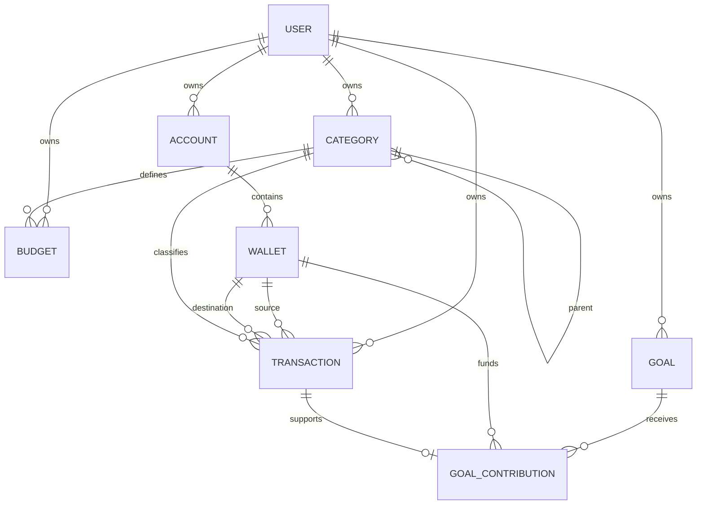
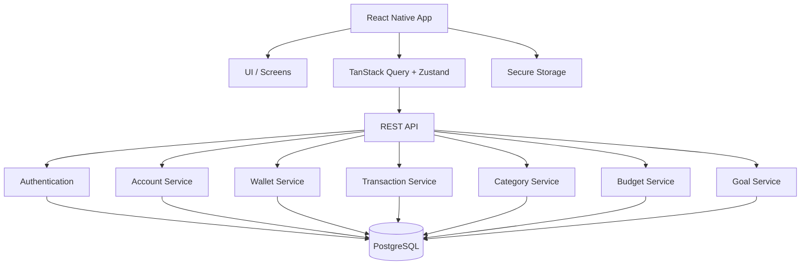

# Sora — Full React Native Development Plan

## 1. Product Goal

Build a mobile-first personal finance tracker using React Native and TypeScript.

MVP capabilities:

- Authentication
- Account and wallet management
- Income, expense, and transfer transactions
- Category management
- Budgets
- Financial goals
- Dashboard and spending summaries

Keep bank synchronization, investments, AI analysis, OCR, shared/family accounts, and full offline synchronization out of the MVP.

---

## 2. Technology Stack

### Mobile

- React Native
- TypeScript
- React Navigation
- TanStack Query for server state
- Zustand for client/UI state
- React Hook Form
- Zod
- Secure storage for authentication credentials
- A reusable design system

### Backend

Recommended:

- NestJS + TypeScript, or
- Spring Boot

The mobile app must communicate through an API.

```text
React Native
    ↓ HTTPS / REST
Backend API
    ↓
PostgreSQL
```

The mobile app should never connect directly to PostgreSQL.

---

## 3. Database Strategy

Use **PostgreSQL as the server-side source of truth**.

The finance domain is highly relational:

```text
User
 ├── Account
 │    └── Wallet
 │         └── Transaction
 ├── Category
 │    └── Transaction
 ├── Budget
 │    └── Category
 └── Goal
      └── Goal Contribution
```

PostgreSQL provides:

- foreign keys
- constraints
- transactions
- strong consistency
- joins
- aggregation
- indexes
- relational integrity

### SQLite

Do not add SQLite to the MVP.

Introduce SQLite later only if offline-first behavior becomes necessary:

```text
React Native
   ├── SQLite ← local/offline
   └── REST API
          ↓
      PostgreSQL
```

Offline mode adds:

- local persistence
- sync queues
- retry
- conflict handling
- reconciliation

---

# 4. Domain Model

Core entities:

```text
User
Account
Wallet
Transaction
Category
Budget
Goal
GoalContribution
```

| Entity | Responsibility |
|---|---|
| User | Owns finance data |
| Account | Groups financial accounts |
| Wallet | Represents an actual money-holding source |
| Transaction | Records money movement |
| Category | Classifies income/expenses |
| Budget | Defines planned spending |
| Goal | Defines a financial target |
| GoalContribution | Records money allocated toward a goal |

## ERD



---

# 5. Entity Design

## User

```text
id
email
display_name
base_currency
created_at
updated_at
```

Rules:

- email is unique
- currency uses a 3-letter code
- all finance records are owned by a user

## Account

```text
id
user_id
name
type
institution_name
description
status
created_at
updated_at
```

Relationship:

```text
User 1 ─── N Account
Account 1 ─── N Wallet
```

## Wallet

```text
id
account_id
name
type
currency
initial_balance
status
created_at
updated_at
```

Examples:

```text
Vietcombank VND
Vietcombank USD
Cash
MoMo
Credit Card
```

Balance:

```text
initial_balance
+ completed income
- completed expenses
+ transfers in
- transfers out
```

Transactions remain the source of truth.

## Category

```text
id
user_id
parent_id
name
type
icon
color
status
created_at
updated_at
```

Types:

```text
INCOME
EXPENSE
```

Categories may be hierarchical:

```text
Food
├── Restaurant
├── Groceries
├── Coffee
└── Delivery
```

Archive categories instead of deleting those referenced by historical transactions.

## Transaction

```text
id
user_id
from_wallet_id
to_wallet_id
category_id
type
amount
currency
description
transaction_date
status
reference
created_at
updated_at
```

Types:

```text
INCOME
EXPENSE
TRANSFER
```

### Income

```text
from_wallet = NULL
to_wallet = required
category = income category
amount > 0
```

### Expense

```text
from_wallet = required
to_wallet = NULL
category = expense category
amount > 0
```

### Transfer

```text
from_wallet = required
to_wallet = required
from_wallet != to_wallet
category = NULL
amount > 0
```

**Critical rule:** transfers are not expenses.

## Budget

```text
id
user_id
category_id
name
amount
currency
period_type
start_date
end_date
status
created_at
updated_at
```

Calculation:

```text
spent =
SUM(completed expense transactions
    matching category
    within budget period)

remaining = budget.amount - spent
```

Do not use a mutable `spent_amount` as the source of truth.

## Goal

```text
id
user_id
name
description
target_amount
currency
target_date
status
created_at
updated_at
```

## GoalContribution

```text
id
goal_id
wallet_id
transaction_id
amount
currency
contribution_date
note
created_at
```

Calculation:

```text
current_amount = SUM(contributions)
remaining = MAX(target_amount - current_amount, 0)
progress = MIN(current_amount / target_amount * 100, 100)
```

---

# 6. Authentication

Flow:

```text
Login
 ↓
POST /auth/login
 ↓
Access Token + Refresh Token
 ↓
Secure Storage
 ↓
Authenticated App
```

Use platform-secure storage:

```text
iOS → Keychain-backed storage
Android → Keystore-backed storage
```

Do not store sensitive authentication tokens in ordinary local storage.

---

# 7. API Plan

Suggested endpoints:

```text
/auth/login
/auth/register
/auth/refresh
/auth/logout

/accounts
/accounts/{id}

/wallets
/wallets/{id}

/transactions
/transactions/{id}

/categories
/categories/{id}

/budgets
/budgets/{id}

/goals
/goals/{id}

/goals/{id}/contributions
```

Every endpoint should document:

```text
Method
URL
Authentication
Authorization
Request
Validation
Response
Errors
Side Effects
```

Backend must verify resource ownership.

---

# 8. React Native Structure

```text
src/
├── app/
│   ├── navigation/
│   ├── providers/
│   └── config/
│
├── features/
│   ├── auth/
│   ├── dashboard/
│   ├── accounts/
│   ├── wallets/
│   ├── transactions/
│   ├── categories/
│   ├── budgets/
│   └── goals/
│
├── components/
│   ├── Button/
│   ├── Input/
│   ├── Card/
│   ├── Modal/
│   ├── BottomSheet/
│   ├── EmptyState/
│   └── LoadingState/
│
├── design-system/
│   ├── colors.ts
│   ├── typography.ts
│   ├── spacing.ts
│   ├── radius.ts
│   └── shadows.ts
│
├── services/
│   ├── api/
│   ├── auth/
│   └── storage/
│
├── hooks/
├── utils/
└── types/
```

Organize by domain instead of one giant components directory.

---

# 9. Navigation

```text
Root
├── Auth Stack
│   ├── Login
│   └── Register
│
└── App
    ├── Home
    ├── Transactions
    ├── Wallets
    ├── Budgets
    └── Goals
```

Recommended bottom navigation:

```text
Home | Transactions | + | Budgets | Goals
```

The center `+` action opens transaction creation.

---

# 10. Screen Plan

### Authentication

```text
Login
Register
Forgot Password
```

### Main

```text
Dashboard
Transactions
Wallets
Budgets
Goals
```

### Details

```text
Account Detail
Wallet Detail
Transaction Detail
Budget Detail
Goal Detail
```

### Management

```text
Category Management
Settings
```

### Forms

```text
Add Transaction
Add Account
Add Wallet
Add Budget
Add Goal
Add Contribution
```

---

# 11. Dashboard

The dashboard should answer:

1. How much money do I have?
2. How much income did I receive?
3. How much did I spend?
4. Where did I spend it?

Example:

```text
TOTAL BALANCE

₫24,580,000

Income              Expenses
+₫15,000,000        -₫4,200,000

Spending
Food                 42%
Transportation       21%
Shopping             18%
Other                19%

Recent Transactions
...
```

Keep it focused rather than displaying every metric.

---

# 12. Transaction UI

One reusable form should support all transaction types.

```text
Add Transaction

Type
[ Expense ] [ Income ] [ Transfer ]

Amount
₫150,000

Wallet
Vietcombank

Category
Restaurant

Date
22 Aug 2026

Note
Dinner

[ Save ]
```

Transfer:

```text
From
Vietcombank

To
MoMo

Amount
₫2,000,000
```

Fields should dynamically change according to transaction type.

---

# 13. Transaction List

```text
August 22

Restaurant
Dinner
             -₫150,000

Groceries
Supermarket
             -₫800,000

Salary
             +₫15,000,000
```

Filters:

```text
Search
Date range
Wallet
Category
Transaction type
Amount range
```

---

# 14. Wallet UI

Wallet detail:

```text
Vietcombank VND

₫24,580,000

Income
+₫35,000,000

Expenses
-₫10,420,000

Recent Transactions
...
```

Archive wallets with historical transactions rather than permanently deleting them.

---

# 15. Budget UI

```text
August Budget

Food

₫2,400,000 / ₫3,000,000
████████████████░░░░ 80%

₫600,000 remaining
```

Support:

- active budgets
- progress
- remaining amount
- over-budget state
- history

---

# 16. Goal UI

```text
New Laptop

₫12M / ₫30M

████████░░░░░░░░ 40%

₫18M remaining

Target: January 2027

[ + Add Contribution ]
```

Show contribution history in the goal detail screen.

---

# 17. Design System

Establish the visual system before polishing screens.

```text
Design System
├── Colors
│   ├── Background
│   ├── Surface
│   ├── Primary
│   ├── Income
│   ├── Expense
│   ├── Warning
│   └── Error
├── Typography
├── Spacing
├── Radius
├── Shadows
└── Components
```

Important reusable finance components:

```text
AmountInput
CategoryPicker
WalletPicker
TransactionRow
WalletCard
BudgetCard
GoalCard
ProgressBar
```

---

# 18. State Management

### TanStack Query

Server state:

```text
transactions
wallets
accounts
categories
budgets
goals
dashboard
```

### Zustand

Client state:

```text
filters
selected wallet
selected date range
modal state
theme
temporary UI state
```

Do not duplicate all API data inside Zustand.

---

# 19. Data Refresh

When a transaction is created:

```text
POST /transactions
       ↓
Invalidate
├── transactions
├── wallets
├── dashboard
└── budgets
```

The application should not manually maintain five unrelated copies of the same financial data.

---

# 20. Loading, Empty, Error, Success

Every screen must handle:

```text
Loading
Empty
Success
Error
```

Example:

```text
Transactions

Loading
→ Skeleton

Empty
→ No transactions yet
→ Add Transaction

Error
→ Unable to load transactions
→ Try Again
```

---

# 21. Validation

Transaction:

```text
amount > 0

EXPENSE:
    source wallet required
    expense category required

INCOME:
    destination wallet required
    income category required

TRANSFER:
    source required
    destination required
    source != destination
```

Budget:

```text
amount > 0
end_date >= start_date
category must be EXPENSE
```

Goal:

```text
target_amount > 0
```

Validate both frontend and backend.

---

# 22. Testing Strategy

## Unit

```text
calculateWalletBalance()
calculateBudgetSpent()
calculateBudgetRemaining()
calculateBudgetUsage()
calculateGoalProgress()
calculateGoalRemaining()
validateTransaction()
```

## Component

```text
TransactionForm
WalletCard
BudgetCard
GoalCard
CategoryPicker
AmountInput
```

## Integration

```text
Login
Create wallet
Create category
Create transaction
Create budget
Create goal
Add contribution
```

## E2E

### Main flow

```text
Register
 ↓
Login
 ↓
Create Wallet
 ↓
Create Category
 ↓
Create Expense
 ↓
Dashboard updates
 ↓
Budget updates
```

### Transfer flow

```text
Wallet A
 ↓
Transfer 2M
 ↓
Wallet B

A decreases
B increases
Expense total stays unchanged
```

---

# 23. Phase 0 — Foundation

```text
[ ] Finalize requirements
[ ] Finalize domain model
[ ] Finalize ERD
[ ] Finalize PostgreSQL schema
[ ] Define API contract
[ ] Define transaction rules
[ ] Define balance rules
[ ] Define budget rules
[ ] Define goal rules
[ ] Create React Native project
[ ] Configure TypeScript
[ ] Configure linting
[ ] Configure formatting
[ ] Configure environment variables
[ ] Configure navigation
[ ] Create design tokens
[ ] Create base components
```

Deliverable:

> Running React Native application with stable architecture and agreed domain/API contracts.

---

# 24. Phase 1 — Authentication

```text
[ ] Register
[ ] Login
[ ] Logout
[ ] Access token
[ ] Refresh token
[ ] Secure storage
[ ] Session restoration
[ ] Auth navigation
[ ] Error handling
[ ] Loading states
```

Deliverable:

> User can register, login, restart the app, and remain authenticated.

---

# 25. Phase 2 — Accounts & Wallets

```text
[ ] Account API
[ ] Account list
[ ] Account detail
[ ] Create account
[ ] Edit account
[ ] Archive account

[ ] Wallet API
[ ] Wallet list
[ ] Wallet detail
[ ] Create wallet
[ ] Edit wallet
[ ] Archive wallet
[ ] Initial balance
[ ] Balance calculation
```

Deliverable:

> User can create financial containers and see their balances.

---

# 26. Phase 3 — Categories

```text
[ ] Category API
[ ] Category list
[ ] Income categories
[ ] Expense categories
[ ] Parent categories
[ ] Child categories
[ ] Create category
[ ] Edit category
[ ] Archive category
[ ] Category picker
```

Deliverable:

> Transactions can be accurately classified.

---

# 27. Phase 4 — Transactions

This is the most important MVP phase.

```text
[ ] Transaction API
[ ] Transaction list
[ ] Transaction detail
[ ] Create expense
[ ] Create income
[ ] Create transfer
[ ] Edit transaction
[ ] Cancel/delete transaction
[ ] Search
[ ] Date filtering
[ ] Wallet filtering
[ ] Category filtering
[ ] Type filtering
[ ] Amount validation
[ ] Balance updates
[ ] Dashboard updates
[ ] Budget updates
```

Deliverable:

> User can accurately record and review money movement.

---

# 28. Phase 5 — Dashboard

```text
[ ] Total balance
[ ] Income summary
[ ] Expense summary
[ ] Spending by category
[ ] Recent transactions
[ ] Monthly summary
[ ] Loading state
[ ] Empty state
[ ] Error state
```

Deliverable:

> User immediately understands their financial position.

---

# 29. Phase 6 — Budgets

```text
[ ] Budget API
[ ] Create budget
[ ] Edit budget
[ ] Archive budget
[ ] Budget list
[ ] Budget detail
[ ] Spending calculation
[ ] Remaining calculation
[ ] Usage percentage
[ ] Over-budget state
[ ] Budget history
```

Deliverable:

> User can plan and monitor spending.

---

# 30. Phase 7 — Goals

```text
[ ] Goal API
[ ] Create goal
[ ] Edit goal
[ ] Goal list
[ ] Goal detail
[ ] Add contribution
[ ] Contribution history
[ ] Progress calculation
[ ] Remaining calculation
[ ] Completion state
```

Deliverable:

> User can track financial targets.

---

# 31. Phase 8 — Quality & Polish

```text
[ ] Animations
[ ] Haptics
[ ] Pull to refresh
[ ] Skeleton loading
[ ] Empty states
[ ] Error states
[ ] Accessibility
[ ] Dark mode
[ ] Keyboard behavior
[ ] iOS-specific behavior
[ ] Android-specific behavior
[ ] Performance review
[ ] Crash/error monitoring
```

---

# 32. MVP Definition of Done

MVP requires:

```text
Authentication
✓

Accounts / Wallets
✓

Categories
✓

Transactions
✓

Dashboard
✓

Budgets
✓

Goals
✓
```

Every feature must have:

```text
Database
API
Authorization
Validation
UI
Loading
Empty
Error
Tests
```

A completed screen is not a completed feature.

---

# 33. Feature Definition of Done

Example: Create Transaction

```text
[ ] Database model
[ ] Migration
[ ] API endpoint
[ ] Authorization
[ ] Backend validation
[ ] Frontend validation
[ ] API integration
[ ] UI
[ ] Loading state
[ ] Error state
[ ] Success feedback
[ ] Wallet balance update
[ ] Dashboard update
[ ] Budget update
[ ] Unit test
[ ] Integration test
[ ] E2E test
```

---

# 34. Recommended Development Order

Build vertically instead of building the entire frontend first.

```text
Authentication
      ↓
Wallet
      ↓
Category
      ↓
Transaction
      ↓
Dashboard
      ↓
Budget
      ↓
Goal
```

For every feature:

```text
Domain
 ↓
Database
 ↓
API
 ↓
Backend
 ↓
API tests
 ↓
React Native data layer
 ↓
UI
 ↓
Validation
 ↓
Loading/Error/Empty
 ↓
Integration tests
 ↓
E2E
 ↓
Polish
```

---

# 35. First Vertical Slice

The first end-to-end slice should be:

```text
Register
 ↓
Login
 ↓
Create Wallet
 ↓
Create Category
 ↓
Create Expense
 ↓
View Transaction
 ↓
Wallet Balance Updates
 ↓
Dashboard Updates
```

Then add:

```text
Income
 ↓
Transfer
 ↓
Budget
 ↓
Goal
```

This validates the architecture before the application becomes large.

---

# 36. Phase 2 Features

After MVP:

```text
[ ] Recurring transactions
[ ] CSV import
[ ] CSV export
[ ] Monthly reports
[ ] Advanced charts
[ ] Spending alerts
[ ] Budget notifications
[ ] Goal reminders
[ ] Subscriptions
[ ] Debt tracking
[ ] Investment tracking
[ ] Multi-currency conversion
[ ] Shared wallets
[ ] Family accounts
[ ] Receipt OCR
[ ] Bank synchronization
[ ] AI spending analysis
```

---

# 37. Offline Phase

Only introduce after the online system is stable.

```text
React Native
      │
      ├── SQLite
      │     └── Local database
      │
      └── REST API
            ↓
        PostgreSQL
```

Tasks:

```text
[ ] SQLite schema
[ ] Local repositories
[ ] Sync queue
[ ] Offline transaction creation
[ ] Retry mechanism
[ ] Conflict handling
[ ] Server reconciliation
[ ] Sync status UI
[ ] Offline indicator
```

Do not add SQLite without defining synchronization behavior.

---

# 38. Final Architecture



---

# 39. Final Domain Architecture

```text
                    FINANCE TRACKER
                           │
          ┌────────────────┼────────────────┐
          │                │                │
        MONEY           PLANNING       CLASSIFICATION
          │                │                │
     ┌────┴────┐       ┌───┴───┐            │
     ↓         ↓       ↓       ↓            ↓
  Account    Wallet  Budget   Goal        Category
     │         │                │
     └─────────┴───────┐        ↓
                       ↓   Contribution
                   Transaction
```

Core concepts:

> **Account = logical grouping of financial accounts**

> **Wallet = where money is held**

> **Transaction = how money moves**

> **Category = what the transaction means**

> **Budget = what the user planned to spend**

> **Goal = what the user wants to accumulate**

> **Goal Contribution = actual allocation toward the goal**

---

# 40. Final Technology Decision

## MVP

```text
Mobile
    React Native
    TypeScript

State
    TanStack Query
    Zustand

Forms
    React Hook Form
    Zod

Backend
    NestJS or Spring Boot
    REST API

Database
    PostgreSQL

Authentication
    Access Token
    Refresh Token
    Secure Storage

Local Database
    None initially

Testing
    Unit
    Component
    Integration
    E2E
```

## Later

```text
SQLite
    ↓
Offline mode
    ↓
Sync engine
```

The guiding principle:

> **Start with a reliable online architecture. Add offline capability only when the product actually requires it.**
