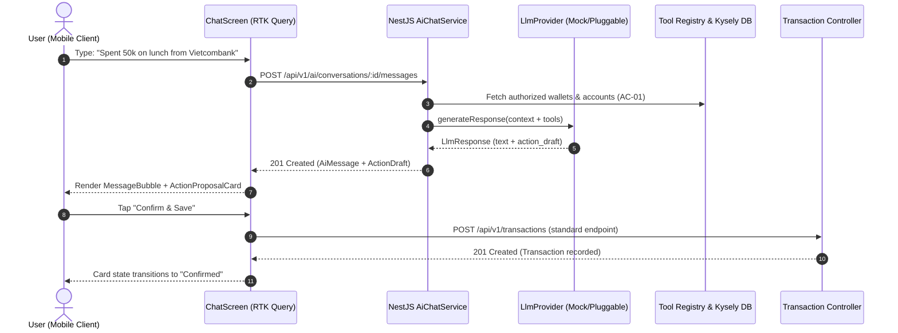

# Financial Assistant AI Chat — Architecture & Implementation Plan

> **Status**: Implemented, with the changes listed in §0.  
> **Domain**: AI Conversational Finance Assistant  
> **Affected Packages**: `packages/contracts/`, `db/migrations/`, `server/src/`, `mobile/src/`  
> **Governing Rules**: [`AGENTS.md`](../../AGENTS.md), [`SRS.md`](../../SRS.md), [`SDS.md`](../../SDS.md)

---

## 0. As built (differs from the sections below)

The authoritative contract is [API spec §17](../../docs/API_SPECIFICATION.md#17-ai-assistant); where this plan disagrees, the spec wins.

- **Roles are `USER`/`ASSISTANT`**, uppercase like every other enum, so `check-contract-parity.mjs` checks them against `chk_ai_message_role`. No `SYSTEM` rows: the system prompt is built per request.
- **The proposal is columns, not one JSONB draft**: `action_type`, `action_payload` (JSONB), `action_status` (`PENDING`/`CONFIRMED`/`DISMISSED`), `action_transaction_id`, with `chk_ai_message_action_shape` tying them together.
- **Confirm is a server endpoint** (`POST …/messages/{id}/confirm`) that locks the message and calls `TransactionsService.create`, so the draft's status and the transaction cannot disagree and a double tap records once. It is not a client-side call to `POST /transactions`.
- **The draft is the §11.2 request shape** (`aiTransactionDraftSchema` = income | expense), with `transactionDate`, not `date`. It is always in the account's currency: a message naming another currency gets an explanation, not a draft (BR-07). §7's "preserve USD in a VND wallet" row is wrong and was not built.
- **`walletId` is required on every send**, and read access is checked each time. Budgets and goals are read through `DashboardService`, not new calc helpers.
- **No `ai.repository.ts`**: services query Kysely directly, like every other module. The tools are `AiToolsService.toolbox()`: `walletSnapshot` and `monthSummary`.
- **Mobile**: one `AiChatScreen` (history is a bottom sheet, not `AiChatListScreen`) in the centre tab; no `TypingIndicator` component (a "Thinking…" line instead).

## 1. Executive Summary & Context

Sora is a personal and shared finance tracker whose headline differentiator is **tracking someone else's money alongside your own** (a partner, a parent, a dependent) with strictly enforced per-person roles (`OWNER`, `EDITOR`, `VIEWER`) on each wallet.

The **AI Chat Assistant** adds natural-language financial intelligence to Sora. Users can:
1. Query balances, categorical spend, budget statuses, and savings goals across permitted wallets in natural language.
2. Quickly draft transactions via conversational text (e.g., *"Spent 65k on lunch from Vietcombank"*).
3. Gain comparative cross-wallet insights (e.g., *"How much did we spend on groceries between my wallet and Mom's wallet this month?"*).

### Non-Negotiable Operational Principle: Decoupled Model & Action Safety
- **Model Pluggability**: The LLM provider (OpenAI, Anthropic Claude, Google Gemini, or local models) will be selected and provided later. The server layer must use a clean **Provider Strategy Pattern** with a deterministic `MockLlmProvider` as the default development implementation.
- **Draft-and-Confirm Paradigm**: The AI **never directly executes mutations** (creating transactions, modifying budgets, deleting records). The AI generates a structured `action_draft` payload that renders as an interactive card in the mobile UI. The user reviews the details and must explicitly tap to submit the action via standard, existing API endpoints.



---

## 2. Core Invariants & Architectural Rules

| Rule | Enforcement in AI Chat |
|---|---|
| **No "backend" / "frontend"** | Code lives in `server/` (NestJS 11 ESM, Kysely), `mobile/` (Expo RN, RTK Query, NativeWind v4), and `packages/contracts/`. |
| **Money is Never a JS Number** | All monetary amounts returned or processed by AI tools and contracts are transported as strings (e.g., `"65000.0000"`) and calculated via scaled `bigint` using [`@sora/contracts/money.ts`](../../packages/contracts/src/money.ts). |
| **Strict Authorization (404 vs 403)** | AI prompt context builders only retrieve data for wallets where the user has an active membership row. If a user asks about an unpermitted wallet ID, the server treats it as non-existent and returns a polite `404` or neutral *"Wallet not found"* response, preventing metadata leaks (AC-01 through AC-05). |
| **Derived Values are Calculated Dynamically** | The AI never guesses balances or caches them. Balances and budget spend passed to the AI context are derived via [`@sora/contracts/calc.ts`](../../packages/contracts/src/calc.ts). |
| **Active Locales Only** | English (`en`) and Vietnamese (`vi`) only. Prompts, error messages, and UI strings must support both. |
| **NativeWind v4 Pressable Rule** | In mobile chat bubbles and action buttons, never pass a function to `style` (`style={({ pressed }) => ...}`). Use local state with `onPressIn`/`onPressOut`. |
| **Barrel Import Boundaries** | Use `@/...` barrel aliases outside the directory; use direct relative paths for siblings inside the same directory. |

---

## 3. Domain Model & Database Schema

### Database schema: `ai_conversations`/`ai_messages` in `db/migrations/001_schema.sql`

```sql
BEGIN;

-- ---------------------------------------------------------------------------
-- ai_conversations
-- Scoped to a user, optionally pinned to a specific wallet context.
-- ---------------------------------------------------------------------------
CREATE TABLE IF NOT EXISTS ai_conversations (
    id            UUID PRIMARY KEY DEFAULT gen_random_uuid(),
    user_id       UUID NOT NULL REFERENCES users(id) ON DELETE CASCADE,
    wallet_id     UUID REFERENCES wallets(id) ON DELETE SET NULL,
    title         VARCHAR(150) NOT NULL DEFAULT 'New Conversation',
    created_at    TIMESTAMPTZ NOT NULL DEFAULT NOW(),
    updated_at    TIMESTAMPTZ NOT NULL DEFAULT NOW()
);

CREATE INDEX IF NOT EXISTS idx_ai_conversations_user
    ON ai_conversations (user_id, updated_at DESC);

-- ---------------------------------------------------------------------------
-- ai_messages
-- Chronological conversation logs including assistant responses and action drafts.
-- ---------------------------------------------------------------------------
CREATE TABLE IF NOT EXISTS ai_messages (
    id              UUID PRIMARY KEY DEFAULT gen_random_uuid(),
    conversation_id UUID NOT NULL REFERENCES ai_conversations(id) ON DELETE CASCADE,
    role            VARCHAR(20) NOT NULL, -- 'user', 'assistant', 'system'
    content         TEXT NOT NULL,
    action_draft    JSONB, -- Optional structured action proposal
    tokens_used     INTEGER,
    created_at      TIMESTAMPTZ NOT NULL DEFAULT NOW(),

    CONSTRAINT chk_ai_message_role CHECK (role IN ('user', 'assistant', 'system'))
);

CREATE INDEX IF NOT EXISTS idx_ai_messages_conversation
    ON ai_messages (conversation_id, created_at ASC);

COMMIT;
```

---

## 4. Contracts & Shared Schemas (`packages/contracts/`)

### 4.1 Enums & Types (`packages/contracts/src/enums.ts`)

```typescript
export const AiRole = {
  USER: 'user',
  ASSISTANT: 'assistant',
  SYSTEM: 'system',
} as const;
export type AiRole = (typeof AiRole)[keyof typeof AiRole];

export const AiActionType = {
  CREATE_TRANSACTION: 'CREATE_TRANSACTION',
  CREATE_BUDGET: 'CREATE_BUDGET',
  CREATE_GOAL: 'CREATE_GOAL',
} as const;
export type AiActionType = (typeof AiActionType)[keyof typeof AiActionType];
```

### 4.2 DTO & Action Draft Schemas (`packages/contracts/src/schemas.ts`)

```typescript
import { z } from 'zod';
import { TransactionType } from './enums.js';

export const TransactionDraftPayloadSchema = z.object({
  walletId: z.string().uuid(),
  accountId: z.string().uuid(),
  categoryId: z.string().uuid().nullable().optional(),
  type: z.nativeEnum(TransactionType),
  amount: z.string().regex(/^\d+(\.\d{1,4})?$/), // Strict string money
  currency: z.string().length(3),
  description: z.string().max(255).optional(),
  date: z.string().datetime(), // ISO 8601
});
export type TransactionDraftPayload = z.infer<typeof TransactionDraftPayloadSchema>;

export const AiActionDraftSchema = z.discriminatedUnion('actionType', [
  z.object({
    actionType: z.literal('CREATE_TRANSACTION'),
    payload: TransactionDraftPayloadSchema,
    summary: z.string(), // Human readable summary e.g. "Expense of 65,000 VND for Lunch"
  }),
]);
export type AiActionDraft = z.infer<typeof AiActionDraftSchema>;

export const SendMessageRequestSchema = z.object({
  walletId: z.string().uuid().optional(),
  message: z.string().min(1).max(2000),
});
export type SendMessageRequest = z.infer<typeof SendMessageRequestSchema>;
```

### 4.3 Routes (`packages/contracts/src/routes.ts`)

```typescript
ai: {
  conversations: () => '/ai/conversations',
  conversation: (id: string) => `/ai/conversations/${id}`,
  messages: (conversationId: string) => `/ai/conversations/${conversationId}/messages`,
  sendMessage: (conversationId: string) => `/ai/conversations/${conversationId}/messages`,
}
```

---

## 5. Server Architecture & Pluggable Provider (`server/src/ai/`)

### 5.1 Provider Interface (`server/src/ai/provider/llm-provider.interface.ts`)

```typescript
export interface LlmToolCall {
  name: string;
  arguments: Record<string, unknown>;
}

export interface LlmMessage {
  role: 'user' | 'assistant' | 'system';
  content: string;
}

export interface LlmContext {
  userId: string;
  systemPrompt: string;
  messages: LlmMessage[];
  availableTools: LlmToolDefinition[];
}

export interface LlmResponse {
  content: string;
  toolCalls?: LlmToolCall[];
  actionDraft?: AiActionDraft;
  tokensUsed?: number;
}

export interface LlmProvider {
  readonly providerName: string;
  generateResponse(context: LlmContext): Promise<LlmResponse>;
}
```

### 5.2 Deterministic `MockLlmProvider`
Implements regex/keyword pattern matching to simulate:
1. **Spending queries**: *"How much did I spend on dining this month?"* -> executes simulated `get_category_spending` tool and formats string-based currency response.
2. **Transaction drafts**: *"Spent 45,000 VND on coffee"* -> constructs a valid `CREATE_TRANSACTION` draft targeting the user's primary wallet/account.
3. **Budget status**: *"Check my budgets"* -> reads live budget summaries and reports utilization.

### 5.3 Financial Tool Registry (Server-Side Execution)
When the LLM triggers a tool call, the server executes it using existing typed repositories:
- `get_wallets_summary(userId)`: Returns wallet names, currencies, and roles.
- `get_recent_transactions(userId, walletId, limit)`: Returns recent transactions for permitted wallets.
- `get_budget_status(userId, walletId)`: Returns budget limits vs computed spend via `calc.ts`.
- `resolve_category_and_account(userId, walletId, textQuery)`: Matches user text (e.g., "Vietcombank", "Coffee") to existing IDs.

---

## 6. End-to-End Use Cases

### UC-1: Conversational Transaction Logging (Draft & Confirm)
1. **User input**: *"Log 50,000 VND for Pho breakfast from Vietcombank cash account."*
2. **Server processing**:
   - `AiChatService` fetches user's active wallets and accounts where role is `OWNER` or `EDITOR`.
   - Provider matches "Pho" -> "Food & Dining" category, "Vietcombank" -> matching Account ID.
   - Provider emits an `AiActionDraft` of type `CREATE_TRANSACTION`.
3. **Mobile response**:
   - Displays assistant message: *"I've prepared this transaction draft for you:"*
   - Renders `ActionProposalCard` with amount (`50,000 VND`), category icon, account, and date.
   - User taps **"Confirm & Save"**.
   - Mobile calls existing `POST /api/v1/transactions` endpoint using RTK Query.
   - On success, the card state updates to *"Recorded"*.

### UC-2: Cross-Wallet Spending Comparison
1. **User input**: *"Compare grocery spending between My Personal Wallet and Family Wallet this month."*
2. **Access validation**: Verifies user has at least `VIEWER` access on both wallets.
3. **Financial computation**:
   - Queries `Groceries` category transactions for both wallets in current date window.
   - Computes scaled totals with `sumScaled` from `money.ts`.
4. **Assistant reply**:
   - Generates a clear comparative breakdown in English or Vietnamese without hallucinating math.

### UC-3: Budget Status & Spend Alert Query
1. **User input**: *"How much budget do I have left for Dining Out this month?"*
2. **Server processing**:
   - `AiChatService` fetches the active budget for `Dining Out` category covering current date.
   - Executes dynamic derivation via `calculateBudgetStatus` from `@sora/contracts/calc.ts`.
3. **Assistant reply**:
   - Summarizes: *"You have spent 1,200,000 VND of your 2,000,000 VND dining budget (60% used, 800,000 VND remaining with 11 days left in the month)."*

### UC-4: Savings Goal Advisory & Contribution Feasibility
1. **User input**: *"Can I afford to save 3,000,000 VND for Japan Trip this month?"*
2. **Server processing**:
   - Fetches goal target, current progress, and projected net cashflow (Income - Expenses) across permitted accounts.
3. **Assistant reply**:
   - Contextual advisory: *"Your net surplus so far this month is 4,500,000 VND. Contributing 3,000,000 VND to 'Japan Trip' would bring your progress to 65% while leaving 1,500,000 VND buffer."*
   - Offers an optional quick action draft: *"Would you like me to draft a transfer into your Savings account?"*

---

## 7. Edge Cases & Resilience Strategy

| Edge Case | Failure Mode | Mitigation & System Behavior |
|---|---|---|
| **Unauthorized Wallet Query** | User asks about a wallet ID they are not a member of. | Tool executor returns empty/not found. Assistant states the wallet cannot be found. Never leaks that the wallet exists (AC-01, 404 rule). |
| **Vague / Incomplete Transaction Request** | User says: *"Spent 100k yesterday"*, but has 3 wallets and 5 accounts. | LLM returns conversational follow-up asking which wallet/account was used; does **not** create a broken or hallucinated draft. |
| **Role Restriction (Viewer Attempting Action)** | A `VIEWER` asks the assistant to log an expense in that wallet. | Action builder checks role. If `VIEWER`, assistant replies: *"You only have Viewer access to Mom's Wallet, so transactions cannot be created here."* |
| **Deleted Target Entity** | User views an old conversation and taps "Confirm" on a draft whose account or category was deleted. | Mobile verifies entity existence before sending, or server returns standard `404 Not Found` for the deleted account, displaying a clear error snackbar. |
| **Multi-Currency Transactions** | User logs *"Spent 20 USD"* in a VND wallet. | Draft preserves `USD` as native currency on the transaction; FX rate valuation is derived dynamically per Sora's multi-currency architecture. |
| **Hallucinated Math** | LLM attempts to add numbers internally. | System prompt instructs LLM to **never** perform mental arithmetic. Calculations are performed strictly by server tool functions via `contracts/calc.ts` and `contracts/money.ts`. |
| **Excessive Conversation Length** | Chat reaches 50+ messages, exceeding prompt token limits. | Sliding window: server loads only the system prompt + last 15 messages for LLM context, keeping database history intact. |
| **Network Loss in Mobile** | User submits a prompt while offline. | RTK Query marks message as pending with offline indicator; disables send button until connection recovers. |

---

## 8. Mobile Client Implementation (`mobile/src/`)

### 8.1 State & API Layer (`mobile/src/services/api/ai.ts`)
- Implements RTK Query endpoints:
  - `useGetAiConversationsQuery`
  - `useGetAiMessagesQuery`
  - `useSendMessageMutation`
  - `useDeleteAiConversationMutation`
- Tag invalidation for `AiConversations` and `AiMessages`.

### 8.2 Component Hierarchy (`mobile/src/features/chat/`)
```text
mobile/src/features/chat/
├── index.ts
├── screens/
│   ├── AiChatListScreen.tsx       # Conversation history & new chat CTA
│   └── AiChatScreen.tsx           # Active chat conversation
└── components/
    ├── ChatMessageItem.tsx        # Bubble for user/assistant messages
    ├── ActionProposalCard.tsx     # Interactive draft card (Confirm / Edit / Dismiss)
    ├── ChatInputBar.tsx           # Auto-expanding text input with send button
    ├── SuggestedPromptChips.tsx   # Fast one-tap prompts (e.g., "Monthly spending")
    └── TypingIndicator.tsx        # Pulsing indicator while awaiting response
```

### 8.3 NativeWind v4 Button Compliance
```tsx
// Correct NativeWind v4 pattern:
const [isPressed, setIsPressed] = useState(false);

<Pressable
  onPressIn={() => setIsPressed(true)}
  onPressOut={() => setIsPressed(false)}
  className={`px-4 py-2 rounded-lg ${isPressed ? 'bg-primary-dark' : 'bg-primary'}`}
  onPress={handleConfirm}
>
  <Text className="text-white font-medium">{t('chat.confirmAction')}</Text>
</Pressable>
```

---

## 9. Step-by-Step Implementation Roadmap

### Phase 1: Database Migration & Schema
- [x] Add `ai_conversations`/`ai_messages` to the schema.
- [x] Execute `npm run db:migrate` (scratch database; `db:test` probes pass).
- [x] Add probe tests in `db/tests/` to verify foreign key cascades and role checks.

### Phase 2: Contracts & Shared Schemas
- [x] Update `packages/contracts/src/enums.ts` (`AiRole`, `AiActionType`).
- [x] Update `packages/contracts/src/schemas.ts` (Zod schemas for DTOs and drafts).
- [x] Update `packages/contracts/src/routes.ts` (`ROUTES.ai`).
- [x] Run `npm run build -w @sora/contracts`.

### Phase 3: Server AI Module & Mock Provider
- [x] Create `server/src/ai/provider/llm-provider.interface.ts` (as `server/src/ai/llm-provider.ts`).
- [x] Implement `server/src/ai/provider/mock-llm.provider.ts` (as `server/src/ai/mock-llm.provider.ts`).
- [x] ~~`ai.repository.ts`~~: not built; see §0.
- [x] Implement `server/src/ai/ai.service.ts` (orchestration, message logging, authorization).
- [x] Implement `server/src/ai/ai.controller.ts` with route guards.
- [x] Register `AiModule` into `server/src/app.module.ts`.

### Phase 4: Financial Tool Registry & Context Builder
- [x] Implement read-only data fetchers for wallet summary, category spending, and budgets.
- [x] Wire tool dispatch inside `AiService`.
- [x] Enforce strict permission boundaries: verify `membership` before reading data.

### Phase 5: Mobile API & State Integration
- [x] Create `mobile/src/services/api/ai.ts` using RTK Query.
- [x] Add localization keys in `mobile/src/app/i18n/locales/en.ts` and `vi.ts`.

### Phase 6: Mobile UI & Interaction Design
- [x] Build `ChatMessageItem` and `ActionProposalCard`.
- [x] Build `AiChatScreen` with keyboard avoiding view and auto-scroll.
- [x] Connect action draft confirmation (to the confirm endpoint, not `useCreateTransactionMutation`; see §0).
- [x] Mount chat screen into app navigation.

### Phase 7: Verification & Audit Sweep
- [x] Run `npm test -w @sora/contracts`
- [x] Run `npm test -w @sora/server` (85 pass against a scratch Postgres 17, including `integration.ai.test.ts`)
- [x] Run `node scripts/check-contract-parity.mjs`
- [x] Run `npm run typecheck` across all workspaces.

---

## 10. Acceptance Criteria

### Contracts & Database
- [ ] `npm run build -w @sora/contracts` succeeds without type errors.
- [x] The schema applies cleanly to an empty database (`npm run db:test`).
- [ ] Deleting a user cascades and deletes all associated AI conversations and messages.
- [ ] Deleting a wallet sets `wallet_id` on associated conversations to `NULL` without deleting the chat.

### Server API & Access Control
- [ ] `POST /api/v1/ai/conversations/:id/messages` returns a 201 response with assistant message.
- [ ] Non-members attempting to query an unpermitted wallet receive no unauthorized data and no `403` leakage.
- [ ] Any monetary values in action drafts are valid numeric strings with max 4 decimal places.
- [ ] The server works seamlessly with `MockLlmProvider` without requiring live API keys.

### Mobile UI & UX
- [ ] Messages render properly in chronological order with distinct user and assistant styling.
- [ ] Transaction action drafts display account, amount, category, and date with a 1-tap "Confirm" button.
- [ ] Tapping "Confirm" initiates a transaction creation, disables button during loading, and marks the draft as confirmed on success.
- [ ] Full English and Vietnamese translations exist for all labels, empty states, and errors.
- [ ] No NativeWind v4 pressable style regressions.

---

## 11. Self-Review & Design Rationale

During design evaluation, the following critical alternatives were analyzed and resolved:

1. **Why not allow the AI to directly create transactions via server tools?**
   - *Rationale*: Financial transactions must have zero tolerance for unintended mutations. A conversational misunderstanding (e.g., misinterpreting "I will pay 50k tomorrow" as an immediate expense) could compromise ledger integrity. The Draft-and-Confirm pattern guarantees user intent and retains auditability.
2. **Why store conversations in Postgres instead of mobile device local storage?**
   - *Rationale*: Storing conversations server-side allows cross-device continuity (e.g., mobile tablet vs. phone) and ensures tool execution has access to historical context without transferring large payloads back and forth from mobile clients.
3. **How is the "model provided later" promise future-proofed?**
   - *Rationale*: The `LlmProvider` interface abstracts away vendor-specific schemas (e.g. OpenAI function calling vs Anthropic tools). When the model is selected, adding a new provider requires creating one class implementing `LlmProvider` without altering controllers, repositories, or mobile clients.
