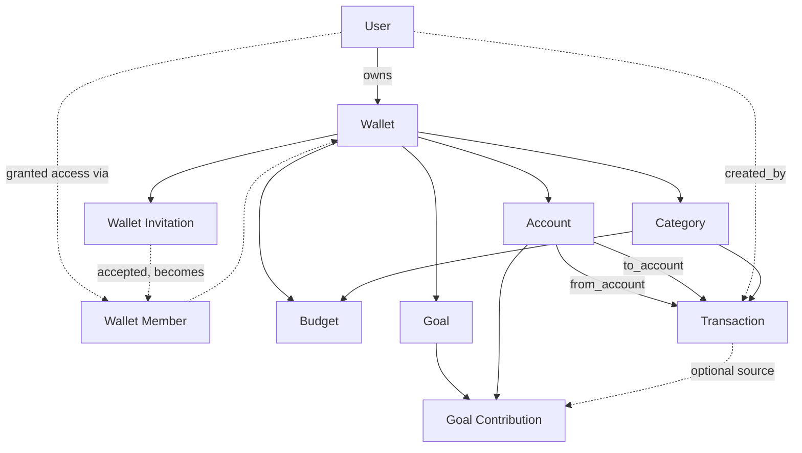
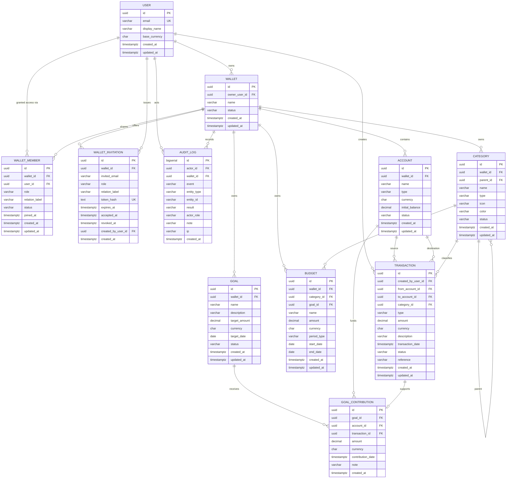
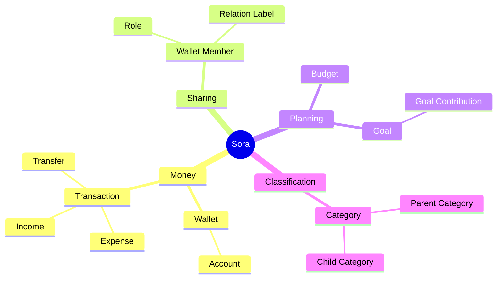

# Sora — Domain & Database Design

## 1. Purpose

This document defines the domain model, ERD, database schema, constraints, indexes, and core business rules for a personal finance tracker where a wallet can be shared across real users — tracking your own money and a friend's/family's/lover's money side by side, with per-user roles.

> **Authority:** [`db/migrations/001_schema.sql`](../../db/migrations/001_schema.sql) is the schema. This document explains *why* it is shaped that way; where the two ever disagree, the migration is right and this file is stale. The SQL quoted below is reproduced from it, not authored here.

Core entities:

- User
- Wallet
- Wallet Member
- Wallet Invitation
- Account
- Transaction
- Category
- Budget
- Goal
- Goal Contribution
- Audit Log

> **Design principle:** `Transaction` is still the central operational entity. `Wallet` is *whose* money it is (you, a partner, a family member — each a real `User`); `Account` is *where* that person's money is held; `WalletMember` is *who else* may see or act on it. Categories/budgets/goals belong to the wallet, not to whichever user is looking.

---

## 2. Domain Overview



| Entity | Responsibility |
|---|---|
| User | A real login — you, or the friend/family/lover whose wallet you track |
| Wallet | Represents one person's (or entity's) finances as a whole |
| Wallet Member | Grants a user (other than the owner) a role on a wallet |
| Wallet Invitation | A pending offer of membership, addressed to an email rather than a user |
| Account | Represents an actual money-holding source within a wallet |
| Transaction | Records money movement |
| Category | Classifies income and expenses, scoped to a wallet |
| Budget | Defines planned spending for a category/time period, scoped to a wallet |
| Goal | Defines a financial target, scoped to a wallet |
| Goal Contribution | Records money allocated toward a goal |
| Audit Log | Append-only record of financial mutations and membership changes |

---

## 3. User

A real login — either you, or someone whose wallet you've been given access to (friend, family, lover).

| Field | Type | Required | Description |
|---|---|---:|---|
| id | UUID | Yes | Primary key |
| email | VARCHAR(255) | Yes | Unique login/contact email |
| display_name | VARCHAR(100) | Yes | User-facing name |
| base_currency | CHAR(3) | Yes | Default display currency, e.g. VND |
| created_at | TIMESTAMPTZ | Yes | Creation timestamp |
| updated_at | TIMESTAMPTZ | Yes | Last update timestamp |

Rules:
- Email is unique.
- Currency uses a 3-letter currency code.
- A `User` row carries no finance data itself — everything lives under a `Wallet`, reached either by ownership or by `WalletMember`.

---

## 4. Wallet

Represents one person's (or tracked entity's) finances as a whole — "Tâm's Wallet", "Girlfriend's Wallet", "Mom's Wallet". This is the level that used to be an institution grouping; it's now a person.

| Field | Type | Required | Description |
|---|---|---:|---|
| id | UUID | Yes | Primary key |
| owner_user_id | UUID | Yes | The `User` whose money this is |
| name | VARCHAR(100) | Yes | Wallet name |
| status | VARCHAR(20) | Yes | ACTIVE, ARCHIVED |
| created_at | TIMESTAMPTZ | Yes | Creation timestamp |
| updated_at | TIMESTAMPTZ | Yes | Last update |

Relationship: `User 1:N Wallet` (as owner), `Wallet 1:N Account`.

`owner_user_id` answers "whose money is this" — it does **not** by itself grant every access check; see [Wallet Member](#5-wallet-member) and [§17 Ownership & Security](#17-ownership--security).

---

## 5. Wallet Member

Grants a `User` other than the owner a role on a `Wallet` — this is what makes "tracking a friend's wallet" possible: they invite you (or you invite them), and access is a role, not a boolean.

| Field | Type | Required | Description |
|---|---|---:|---|
| id | UUID | Yes | Primary key |
| wallet_id | UUID | Yes | The shared wallet |
| user_id | UUID | Yes | The user being granted access |
| role | VARCHAR(20) | Yes | OWNER, EDITOR, VIEWER |
| relation_label | VARCHAR(50) | No | The inviter's word for this member, e.g. "Girlfriend", "Mom" (SRS FR-11) — descriptive, shown in the member list, never used as the wallet's name |
| status | VARCHAR(20) | Yes | ACTIVE, REVOKED |
| joined_at | TIMESTAMPTZ | Yes | When the membership took effect |
| created_at | TIMESTAMPTZ | Yes | Creation timestamp |
| updated_at | TIMESTAMPTZ | Yes | Last update |

Roles:

```text
OWNER   full control: manage membership, archive the wallet, everything EDITOR can do
EDITOR  create/edit accounts, categories, transactions, budgets, goals
VIEWER  read-only
```

Rules:
- `(wallet_id, user_id)` is unique — one role per user per wallet.
- Exactly one `ACTIVE` `OWNER` row per wallet (the wallet's `owner_user_id` and that row's `user_id` must agree). Enforced with a partial unique index (§14).
- A `WalletMember` row is visible to every member of the wallet — you can see who else can see your money — and manageable only by the OWNER, plus by the member themself to leave.
- Removal sets `status = REVOKED` and keeps the row, so `transactions.created_by_user_id` still resolves to a name. A removed member's past entries must not become anonymous.

### Why there is no PENDING status

An earlier draft of this document had `status IN ('PENDING', 'ACCEPTED', 'REVOKED')` and modelled an invitation as a member row awaiting acceptance. **That is wrong, and the schema does not do it.**

An invitation is addressed to an *email address*, which may have no `users` row at all — inviting someone who has not signed up yet is the normal case. A `PENDING` member row for that person would need a `NULL user_id`, and `user_id` is the column every single access check joins on. Making it nullable to model an invite weakens the foreign key that authorizes every request in the system, in exchange for avoiding one extra table.

So the states collapse to `ACTIVE` and `REVOKED`: a `wallet_members` row exists only once there is a real user to point at. Pending offers live in [`wallet_invitations`](#51-wallet-invitation), keyed by email.

---

## 5.1 Wallet Invitation

A pending offer of membership. Separate from `wallet_members` for the reason above.

| Field | Type | Required | Description |
|---|---|---:|---|
| id | UUID | Yes | Primary key |
| wallet_id | UUID | Yes | The wallet being shared |
| invited_email | VARCHAR(255) | Yes | Who is being invited — may not have a `users` row yet |
| role | VARCHAR(20) | Yes | EDITOR or VIEWER |
| relation_label | VARCHAR(50) | No | Carried onto the member row on acceptance |
| token_hash | TEXT | Yes | SHA-256 of the invitation token. Unique |
| expires_at | TIMESTAMPTZ | Yes | 7 days from issue by default |
| accepted_at | TIMESTAMPTZ | No | Set on acceptance; also marks the token spent |
| revoked_at | TIMESTAMPTZ | No | Set on revocation |
| created_by_user_id | UUID | Yes | The OWNER who issued it |
| created_at | TIMESTAMPTZ | Yes | Creation timestamp |

Rules:

- **Only the token hash is stored.** The plaintext token is returned exactly once, in the creation response. The invitation *list* endpoint deliberately never re-emits it: doing so would turn read access to the list into the ability to join the wallet.
- `role` is restricted to `EDITOR`/`VIEWER` by `chk_invitation_role`. Ownership is a transfer, not an additive grant, so it cannot be handed out by invitation.
- **At most one live invitation per `(wallet_id, invited_email)`**, enforced by a partial unique index over the rows where `accepted_at IS NULL AND revoked_at IS NULL`. Re-inviting must revoke or reuse the existing one rather than stacking up tokens that all still work.
- On acceptance the caller's own email must equal `invited_email` case-insensitively. Without that check the token would be a bearer capability — anyone who found it could join — rather than an invitation addressed to a person.
- Acceptance creates the `wallet_members` row and sets `accepted_at` in one transaction.

---

## 6. Account

Represents the concrete place where a wallet's money is held.

Examples:
- Vietcombank VND
- Cash
- MoMo
- Visa Credit Card

A wallet can contain multiple accounts, for example separate currencies.

| Field | Type | Required | Description |
|---|---|---:|---|
| id | UUID | Yes | Primary key |
| wallet_id | UUID | Yes | Parent wallet |
| name | VARCHAR(100) | Yes | Account name |
| type | VARCHAR(30) | Yes | BANK_ACCOUNT, CASH, E_WALLET, CREDIT_CARD |
| currency | CHAR(3) | Yes | Account currency |
| initial_balance | DECIMAL(19,4) | Yes | Opening balance |
| status | VARCHAR(20) | Yes | ACTIVE, ARCHIVED |
| created_at | TIMESTAMPTZ | Yes | Creation timestamp |
| updated_at | TIMESTAMPTZ | Yes | Last update |

### Balance

Prefer transactions as the source of truth:

```text
current_balance =
    initial_balance
  + completed income
  - completed expense
  + transfers in
  - transfers out
```

If `current_balance` is cached, it must not become an independent source of truth.

---

## 7. Category

Classifies income and expenses and can be hierarchical. Scoped to a wallet — a shared wallet has one category tree every member sees, not one per viewer.

```text
Food
├── Restaurant
├── Groceries
├── Coffee
└── Delivery

Transportation
├── Fuel
├── Taxi
└── Parking

Income
├── Salary
├── Bonus
└── Freelance
```

| Field | Type | Required | Description |
|---|---|---:|---|
| id | UUID | Yes | Primary key |
| wallet_id | UUID | Yes | Owning wallet |
| parent_id | UUID | No | Parent category |
| system_key | VARCHAR(50) | No | Starter category's key into `category_translations`; null for a custom category (`uq_category_system_key`: one per wallet) |
| name | VARCHAR(100) | Yes | Category name — the English fallback for a starter category, the typed text for a custom one |
| type | VARCHAR(20) | Yes | INCOME or EXPENSE |
| icon | VARCHAR(50) | No | UI icon |
| color | VARCHAR(20) | No | UI color |
| status | VARCHAR(20) | Yes | ACTIVE, ARCHIVED |
| created_at | TIMESTAMPTZ | Yes | Creation timestamp |
| updated_at | TIMESTAMPTZ | Yes | Last update |

Rules:
- Parent and child categories must belong to the same wallet.
- A category cannot be its own parent.
- Expense transactions use expense categories; income transactions use income categories.
- Transfer transactions may optionally use a transfer category; they never count as income or expense.
- A starter category is read in the reader's locale from `category_translations` (one row per `system_key` and locale, mirroring `STARTER_CATEGORIES`), falling back to English; renaming it clears `system_key` and makes it custom. Two members of one wallet can therefore read its starter categories in different languages.

---

## 8. Transaction

The central money-movement entity. Hangs off `Account` (and therefore off whichever `Wallet` that account belongs to); `created_by_user_id` records who actually entered it, which on a shared wallet can differ from the wallet's owner.

Types:

```text
INCOME
EXPENSE
TRANSFER
```

| Field | Type | Required | Description |
|---|---|---:|---|
| id | UUID | Yes | Primary key |
| created_by_user_id | UUID | Yes | User who recorded this transaction |
| from_account_id | UUID | Conditional | Source account |
| to_account_id | UUID | Conditional | Destination account |
| category_id | UUID | Conditional | Income/expense category |
| type | VARCHAR(20) | Yes | INCOME, EXPENSE, TRANSFER |
| amount | DECIMAL(19,4) | Yes | Positive amount |
| currency | CHAR(3) | Yes | Transaction currency |
| description | VARCHAR(500) | No | User note |
| transaction_date | TIMESTAMPTZ | Yes | Occurrence time |
| status | VARCHAR(20) | Yes | PENDING, COMPLETED, CANCELLED |
| reference | VARCHAR(100) | No | External/reference ID |
| created_at | TIMESTAMPTZ | Yes | Creation time |
| updated_at | TIMESTAMPTZ | Yes | Update time |

### Expense

```text
type = EXPENSE
from_account_id = account
to_account_id = NULL
category_id = expense category
amount = positive
```

### Income

```text
type = INCOME
from_account_id = NULL
to_account_id = account
category_id = income category
amount = positive
```

### Transfer

```text
type = TRANSFER
from_account_id = account A
to_account_id = account B
category_id = NULL
amount = positive
```

**Critical rule:** transfers must not count as expenses.

**Cross-wallet transfers are allowed** — account A and account B don't have to belong to the same wallet. This is the mechanism for recording a loan, a repayment, or settling a shared expense as real money movement rather than two disconnected entries. See §17 for the access rule that gates it.

---

## 9. Budget

Defines planned spending for a category, a goal or the whole wallet. Scoped to a wallet. A DAILY,
WEEKLY, MONTHLY or YEARLY budget repeats from `start_date` until deleted; CUSTOM and GOAL cover a
fixed window. Budgets are deleted outright: nothing is derived from them.

| Field | Type | Required | Description |
|---|---|---:|---|
| id | UUID | Yes | Primary key |
| wallet_id | UUID | Yes | Owning wallet |
| category_id | UUID | No | Budget category; null for a goal or wallet-wide budget |
| goal_id | UUID | No | Goal of a GOAL budget (`chk_budget_kind`) |
| name | VARCHAR(100) | Yes | Budget name |
| amount | DECIMAL(19,4) | Yes | Planned amount per period |
| currency | CHAR(3) | Yes | Budget currency |
| period_type | VARCHAR(20) | Yes | DAILY, WEEKLY, MONTHLY, YEARLY, CUSTOM, GOAL |
| start_date | DATE | Yes | First day; a repeating budget's periods step from it |
| end_date | DATE | No | Last day of a CUSTOM/GOAL window; null for a repeating period (`chk_budget_end`) |
| created_at | TIMESTAMPTZ | Yes | Creation time |
| updated_at | TIMESTAMPTZ | Yes | Update time |

Do not make `spent_amount` the authoritative field. Calculate it from completed expense transactions.

```text
spent =
SUM(completed EXPENSE transactions
    in the category or any of its subcategories
    within the budget's current period)

remaining = budget.amount - spent
```

---

## 10. Goal

Represents a financial target. Scoped to a wallet.

Example:

```text
New Laptop
Target: 30,000,000 VND
Current: 12,000,000 VND
Target Date: 2027-01-01
```

| Field | Type | Required | Description |
|---|---|---:|---|
| id | UUID | Yes | Primary key |
| wallet_id | UUID | Yes | Owning wallet |
| name | VARCHAR(150) | Yes | Goal name |
| description | VARCHAR(500) | No | Details |
| target_amount | DECIMAL(19,4) | Yes | Required amount |
| currency | CHAR(3) | Yes | Goal currency |
| target_date | DATE | No | Target completion date |
| status | VARCHAR(20) | Yes | ACTIVE, COMPLETED, CANCELLED |
| created_at | TIMESTAMPTZ | Yes | Creation time |
| updated_at | TIMESTAMPTZ | Yes | Update time |

Avoid storing `current_amount` as an independently editable source of truth.

---

## 11. Goal Contribution

Records actual money allocated toward a goal.

| Field | Type | Required | Description |
|---|---|---:|---|
| id | UUID | Yes | Primary key |
| goal_id | UUID | Yes | Target goal |
| account_id | UUID | Yes | Funding account |
| transaction_id | UUID | No | Related transaction |
| amount | DECIMAL(19,4) | Yes | Contribution amount |
| currency | CHAR(3) | Yes | Contribution currency |
| contribution_date | TIMESTAMPTZ | Yes | Contribution date |
| note | VARCHAR(500) | No | Optional note |
| created_at | TIMESTAMPTZ | Yes | Creation time |

```text
current_amount = SUM(goal_contributions.amount)
remaining = MAX(target_amount - current_amount, 0)
progress = MIN(current_amount / target_amount * 100, 100)
```

If every contribution must correspond to a real transaction, make `transaction_id NOT NULL`.

---

# 12. Complete ERD



---

# 13. Relationship & Cardinality

| Parent | Relationship | Child | Cardinality |
|---|---|---|---|
| User | owns | Wallet | 1:N |
| User | granted access via | Wallet Member | 1:N |
| User | creates | Transaction | 1:N |
| Wallet | shares with | Wallet Member | 1:N |
| Wallet | offers | Wallet Invitation | 1:N |
| User | issues | Wallet Invitation | 1:N |
| Wallet | contains | Account | 1:N |
| Wallet | owns | Category | 1:N |
| Wallet | owns | Budget | 1:N |
| Wallet | owns | Goal | 1:N |
| Account | sends | Transaction | 1:N |
| Account | receives | Transaction | 1:N |
| Category | classifies | Transaction | 1:N |
| Category | defines | Budget | 1:N |
| Category | contains | Category | 1:N |
| Goal | receives | Goal Contribution | 1:N |
| Account | funds | Goal Contribution | 1:N |
| Transaction | optionally supports | Goal Contribution | 1:0..1 |
| Wallet | records | Audit Log | 1:N |
| User | acts in | Audit Log | 1:N |

---

# 14. PostgreSQL Schema

Reproduced from [`db/migrations/001_schema.sql`](../../db/migrations/001_schema.sql), which is the authority. Column defaults (`gen_random_uuid()`, `NOW()`) and the `pgcrypto`/`btree_gist` extension setup are in the migration and omitted here for readability.

## Users

```sql
CREATE TABLE users (
    id UUID PRIMARY KEY,
    email VARCHAR(255) NOT NULL,
    password_hash TEXT NOT NULL,
    display_name VARCHAR(100) NOT NULL,
    base_currency CHAR(3) NOT NULL,
    email_verified_at TIMESTAMPTZ,
    created_at TIMESTAMPTZ NOT NULL DEFAULT NOW(),
    updated_at TIMESTAMPTZ NOT NULL DEFAULT NOW(),

    CONSTRAINT chk_user_currency CHECK (base_currency ~ '^[A-Z]{3}$')
);

-- Case-insensitive, so signing up as Foo@x.com collides with foo@x.com. A plain
-- UNIQUE on the column would let both exist and leave login ambiguous.
CREATE UNIQUE INDEX uq_users_email ON users (LOWER(email));
```

## Refresh Tokens

```sql
CREATE TABLE refresh_tokens (
    id UUID PRIMARY KEY,
    user_id UUID NOT NULL REFERENCES users(id) ON DELETE CASCADE,
    token_hash TEXT NOT NULL UNIQUE,
    expires_at TIMESTAMPTZ NOT NULL,
    revoked_at TIMESTAMPTZ,
    created_at TIMESTAMPTZ NOT NULL DEFAULT NOW()
);
```

Only the hash is stored, so a database read cannot mint a session.

## Wallets

```sql
CREATE TABLE wallets (
    id UUID PRIMARY KEY,
    owner_user_id UUID NOT NULL REFERENCES users(id),
    name VARCHAR(100) NOT NULL,
    status VARCHAR(20) NOT NULL DEFAULT 'ACTIVE',
    time_zone VARCHAR(64) NOT NULL,
    created_at TIMESTAMPTZ NOT NULL DEFAULT NOW(),
    updated_at TIMESTAMPTZ NOT NULL DEFAULT NOW(),

    CONSTRAINT chk_wallet_status
        CHECK (status IN ('ACTIVE', 'ARCHIVED')),
    CONSTRAINT chk_wallet_time_zone
        CHECK (is_iana_time_zone(time_zone))
);
```

`time_zone` is the IANA zone the wallet's calendar is read in: which day and month each `TIMESTAMPTZ` instant belongs to, and what "today" is, for every member alike (API spec §2.12). Instants are never rewritten and no local date is stored, so changing the zone only re-reads them. `is_iana_time_zone()` checks the name against `pg_timezone_names`.

## Wallet Members

```sql
CREATE TABLE wallet_members (
    id UUID PRIMARY KEY,
    wallet_id UUID NOT NULL REFERENCES wallets(id),
    user_id UUID NOT NULL REFERENCES users(id),

    role VARCHAR(20) NOT NULL,
    relation_label VARCHAR(50),
    status VARCHAR(20) NOT NULL DEFAULT 'PENDING',

    invited_at TIMESTAMPTZ NOT NULL DEFAULT NOW(),
    accepted_at TIMESTAMPTZ,

    created_at TIMESTAMPTZ NOT NULL DEFAULT NOW(),
    updated_at TIMESTAMPTZ NOT NULL DEFAULT NOW(),

    CONSTRAINT uq_wallet_member UNIQUE (wallet_id, user_id),
    CONSTRAINT chk_wallet_member_role
        CHECK (role IN ('OWNER', 'EDITOR', 'VIEWER')),
    CONSTRAINT chk_wallet_member_status
        CHECK (status IN ('PENDING', 'ACCEPTED', 'REVOKED'))
);

-- Exactly one accepted OWNER per wallet.
CREATE UNIQUE INDEX uq_wallet_single_owner
    ON wallet_members(wallet_id)
    WHERE role = 'OWNER' AND status = 'ACCEPTED';
```

## Accounts

```sql
CREATE TABLE accounts (
    id UUID PRIMARY KEY,
    wallet_id UUID NOT NULL REFERENCES wallets(id),
    name VARCHAR(100) NOT NULL,
    type VARCHAR(30) NOT NULL,
    currency CHAR(3) NOT NULL,
    initial_balance DECIMAL(19,4) NOT NULL DEFAULT 0,
    status VARCHAR(20) NOT NULL DEFAULT 'ACTIVE',
    created_at TIMESTAMPTZ NOT NULL DEFAULT NOW(),
    updated_at TIMESTAMPTZ NOT NULL DEFAULT NOW(),

    CONSTRAINT chk_account_balance
        CHECK (initial_balance >= 0),

    CONSTRAINT chk_account_status
        CHECK (status IN ('ACTIVE', 'ARCHIVED'))
);
```

## Categories

```sql
CREATE TABLE categories (
    id UUID PRIMARY KEY,
    wallet_id UUID NOT NULL REFERENCES wallets(id),
    parent_id UUID REFERENCES categories(id),
    name VARCHAR(100) NOT NULL,
    type VARCHAR(20) NOT NULL,
    icon VARCHAR(50),
    color VARCHAR(20),
    status VARCHAR(20) NOT NULL DEFAULT 'ACTIVE',
    created_at TIMESTAMPTZ NOT NULL DEFAULT NOW(),
    updated_at TIMESTAMPTZ NOT NULL DEFAULT NOW(),

    CONSTRAINT chk_category_type
        CHECK (type IN ('INCOME', 'EXPENSE')),

    CONSTRAINT chk_category_status
        CHECK (status IN ('ACTIVE', 'ARCHIVED'))
);
```

## Transactions

```sql
CREATE TABLE transactions (
    id UUID PRIMARY KEY,
    created_by_user_id UUID NOT NULL REFERENCES users(id),

    from_account_id UUID REFERENCES accounts(id),
    to_account_id UUID REFERENCES accounts(id),
    category_id UUID REFERENCES categories(id),

    type VARCHAR(20) NOT NULL,
    amount DECIMAL(19,4) NOT NULL,
    currency CHAR(3) NOT NULL,

    description VARCHAR(500),
    transaction_date TIMESTAMPTZ NOT NULL,

    status VARCHAR(20) NOT NULL DEFAULT 'COMPLETED',
    reference VARCHAR(100),

    created_at TIMESTAMPTZ NOT NULL DEFAULT NOW(),
    updated_at TIMESTAMPTZ NOT NULL DEFAULT NOW(),

    CONSTRAINT chk_transaction_type
        CHECK (type IN ('INCOME', 'EXPENSE', 'TRANSFER')),

    CONSTRAINT chk_transaction_amount
        CHECK (amount > 0),

    CONSTRAINT chk_transaction_status
        CHECK (status IN ('PENDING', 'COMPLETED', 'CANCELLED')),

    CONSTRAINT chk_transaction_accounts
        CHECK (
            (type = 'INCOME'
                AND from_account_id IS NULL
                AND to_account_id IS NOT NULL)
            OR
            (type = 'EXPENSE'
                AND from_account_id IS NOT NULL
                AND to_account_id IS NULL)
            OR
            (type = 'TRANSFER'
                AND from_account_id IS NOT NULL
                AND to_account_id IS NOT NULL
                AND from_account_id <> to_account_id)
        )
);
```

`category_id` must belong to the same wallet as the transaction's account(s) — this can't be expressed as a single-table `CHECK`, so the service layer must verify it before insert/update.

## Budgets

```sql
-- Abridged from db/migrations/001_schema.sql, which is authoritative.
CREATE TABLE budgets (
    id UUID PRIMARY KEY,
    wallet_id UUID NOT NULL REFERENCES wallets(id),
    category_id UUID REFERENCES categories(id),
    goal_id UUID REFERENCES goals(id),

    name VARCHAR(100) NOT NULL,
    amount DECIMAL(19,4) NOT NULL,
    currency CHAR(3) NOT NULL,

    period_type VARCHAR(20) NOT NULL,
    start_date DATE NOT NULL,
    end_date DATE,

    created_at TIMESTAMPTZ NOT NULL DEFAULT NOW(),
    updated_at TIMESTAMPTZ NOT NULL DEFAULT NOW(),

    CONSTRAINT chk_budget_amount CHECK (amount > 0),
    CONSTRAINT chk_budget_period
        CHECK (period_type IN ('DAILY', 'WEEKLY', 'MONTHLY', 'YEARLY', 'CUSTOM', 'GOAL')),
    CONSTRAINT chk_budget_dates
        CHECK (end_date >= start_date),
    CONSTRAINT chk_budget_end
        CHECK ((period_type IN ('DAILY', 'WEEKLY', 'MONTHLY', 'YEARLY')) = (end_date IS NULL))
);
-- Plus chk_budget_kind and the excl_budget_{category,goal,overall}_overlap GIST exclusions.
```

## Goals

```sql
CREATE TABLE goals (
    id UUID PRIMARY KEY,
    wallet_id UUID NOT NULL REFERENCES wallets(id),

    name VARCHAR(150) NOT NULL,
    description VARCHAR(500),

    target_amount DECIMAL(19,4) NOT NULL,
    currency CHAR(3) NOT NULL,
    target_date DATE,

    status VARCHAR(20) NOT NULL DEFAULT 'ACTIVE',

    created_at TIMESTAMPTZ NOT NULL DEFAULT NOW(),
    updated_at TIMESTAMPTZ NOT NULL DEFAULT NOW(),

    CONSTRAINT chk_goal_target CHECK (target_amount > 0),
    CONSTRAINT chk_goal_status
        CHECK (status IN ('ACTIVE', 'COMPLETED', 'CANCELLED'))
);
```

## Goal Contributions

```sql
CREATE TABLE goal_contributions (
    id UUID PRIMARY KEY,

    goal_id UUID NOT NULL REFERENCES goals(id),
    account_id UUID NOT NULL REFERENCES accounts(id),
    transaction_id UUID UNIQUE REFERENCES transactions(id),

    amount DECIMAL(19,4) NOT NULL,
    currency CHAR(3) NOT NULL,

    contribution_date TIMESTAMPTZ NOT NULL,
    note VARCHAR(500),

    created_at TIMESTAMPTZ NOT NULL DEFAULT NOW(),

    CONSTRAINT chk_goal_contribution_amount
        CHECK (amount > 0)
);
```

---

# 15. Indexes

```sql
CREATE INDEX idx_wallets_owner
    ON wallets(owner_user_id);

CREATE INDEX idx_wallet_members_wallet
    ON wallet_members(wallet_id);

CREATE INDEX idx_wallet_members_user
    ON wallet_members(user_id);

CREATE INDEX idx_accounts_wallet
    ON accounts(wallet_id);

CREATE INDEX idx_categories_wallet
    ON categories(wallet_id);

CREATE INDEX idx_categories_parent
    ON categories(parent_id);

CREATE INDEX idx_transactions_creator_date
    ON transactions(created_by_user_id, transaction_date DESC);

CREATE INDEX idx_transactions_from_account
    ON transactions(from_account_id);

CREATE INDEX idx_transactions_to_account
    ON transactions(to_account_id);

CREATE INDEX idx_transactions_category_date
    ON transactions(category_id, transaction_date DESC);

CREATE INDEX idx_budgets_wallet_period
    ON budgets(wallet_id, start_date, end_date);

CREATE INDEX idx_goals_wallet_status
    ON goals(wallet_id, status);

CREATE INDEX idx_goal_contributions_goal_date
    ON goal_contributions(goal_id, contribution_date DESC);
```

(`uq_wallet_single_owner` and `uq_wallet_member` are declared alongside `wallet_members` in §14.)

---

# 16. Key Business Rules

## Transaction

| Type | From Account | To Account | Category |
|---|---|---|---|
| INCOME | NULL | Required | Income |
| EXPENSE | Required | NULL | Expense |
| TRANSFER | Required | Required | NULL |

Amounts are always positive. Transaction type determines direction. A TRANSFER's two accounts may belong to different wallets (§8, §17).

## Account Balance

```text
Balance =
Initial Balance
+ Completed Income
- Completed Expense
+ Completed Transfer In
- Completed Transfer Out
```

Pending/cancelled transactions should not affect the completed balance.

## Budget

```text
spent =
SUM(completed expense transactions
    matching category
    within the budget's current period)

remaining = budget.amount - spent

usage_percentage = spent / budget.amount × 100
```

## Goal

```text
current =
SUM(goal contributions)

remaining =
MAX(target - current, 0)

progress =
MIN(current / target × 100, 100)
```

---

# 17. Ownership & Security

Access is no longer "does this row's `user_id` match the caller" — it's role-based through `wallet_members`, because a wallet can legitimately be acted on by more than one real user.

Resolving a caller's role on a wallet:

```text
role =
  OWNER   if wallet.owner_user_id = caller
          or an ACCEPTED wallet_members row with role=OWNER exists for (wallet, caller)
  EDITOR  if an ACCEPTED wallet_members row with role=EDITOR exists for (wallet, caller)
  VIEWER  if an ACCEPTED wallet_members row with role=VIEWER exists for (wallet, caller)
  NONE    otherwise — no access at all
```

Everything under a wallet — `Account`, `Category`, `Budget`, `Goal`, `GoalContribution`, and any `Transaction` whose account belongs to it — inherits that wallet's role. There is no per-row override.

Minimum role required per action:

| Action | Minimum role |
|---|---|
| Read anything under the wallet | VIEWER |
| Create/edit accounts, categories, transactions, budgets, goals | EDITOR |
| Invite/remove members, change roles, archive/delete the wallet | OWNER |

**Cross-wallet transfer rule:** a `TRANSFER` whose `from_account` and `to_account` belong to different wallets requires the acting user to hold EDITOR or OWNER on *both* wallets. This is deliberately stricter than a same-wallet transfer (VIEWER-excluded on both sides) because it moves money across a person boundary — it's what lets you record paying a partner back without letting anyone with even read-only access to their wallet pull money into it.

A `WalletMember` row is itself only visible/manageable by that wallet's OWNER and by the member it names (to accept an invite or leave).

Backend authorization must verify role on every request; frontend filtering is not sufficient.

---

# 18. Design Decisions

### Wallet = person, Account = money-holder

The original two-level split (an institution-grouping `Account` containing money-holding `Wallet`s) is collapsed to the same two levels this doc already floated as an optional simplification, just re-aimed at people instead of institutions: `Wallet` is now who the money belongs to, `Account` is where it sits. Nothing enforces an "institution" grouping anymore; if two accounts happen to be at the same bank, that's just two `Account` rows under one `Wallet`.

### Why `WalletMember` is separate from `owner_user_id`

`owner_user_id` answers "whose money is this" and `wallet_members` answers "who may act on it" — kept apart because a wallet's owner and its actors are no longer guaranteed to be the same person. Modeling access as a role (OWNER/EDITOR/VIEWER) rather than a boolean lets a wallet be shared read-only with one person and fully co-managed with another.

### Category/Budget/Goal moved to `wallet_id`

These describe properties of a wallet's money, not of whichever user is currently looking at it. A shared wallet needs one category tree and one set of budgets/goals visible identically to every member — per-user copies would drift and double-count the same spending.

### `created_by_user_id` kept separate from wallet ownership

On a shared wallet, "who entered this transaction" and "whose wallet it's in" are different facts worth keeping — it's the audit trail that answers "did I record this, or did she."

### Cross-wallet transfers are allowed, not blocked

The whole point of tracking someone else's wallet is usually to record money moving *between* the two of you — a loan, a repayment, a shared-expense settlement — as one real transaction rather than two disconnected, manually-reconciled entries. Gated by the EDITOR-on-both-sides rule in §17 so it can't be abused by minimal access.

### Transaction as source of truth

Unchanged: do not store derived spending/balance values as independent authoritative data.

```text
Transaction history
       ↓
derived balance
derived spending
derived budget usage
```

### Goal Contribution

Unchanged: a separate contribution entity rather than storing only `current_amount` on Goal, to preserve history and make progress auditable.

---

# 19. Example

```text
User: Tâm         (owner_user_id of "Tâm's Wallet")
User: Linh         (owner_user_id of "Linh's Wallet", Tâm's girlfriend)

Wallet: Tâm's Wallet
  members: Tâm (OWNER)
  Accounts:
    ├── Vietcombank VND
    └── Cash
  Categories: Food › Restaurant, Groceries · Transportation · Salary
  Budget: Food — 3,000,000 VND / month
  Goal: New Laptop — 30,000,000 VND

Wallet: Linh's Wallet
  members: Linh (OWNER), Tâm (EDITOR, relation_label = "Boyfriend")
  Accounts:
    └── Techcombank VND
```

Transactions:

```text
Salary (Tâm's Wallet):
NULL → Tâm's Vietcombank
+15,000,000
created_by: Tâm

Restaurant (Tâm's Wallet):
Tâm's Vietcombank → NULL
-150,000
created_by: Tâm

Repay Linh (cross-wallet transfer):
Tâm's Vietcombank → Linh's Techcombank
500,000
created_by: Tâm
allowed because Tâm holds EDITOR on Linh's Wallet
```

The 500,000 repayment is a TRANSFER, not an expense, even though it crosses wallets.

---

# 20. Final Domain Model



The conceptual model is:

> **Wallet = whose money it is**

> **Wallet Member = who else may see or act on it, and how**

> **Account = where that money is held**

> **Transaction = how money moves — within a wallet, or between two**

> **Category = what the transaction means**

> **Budget = what you planned to spend**

> **Goal = what you want to accumulate**

> **Goal Contribution = actual allocation toward the goal**
