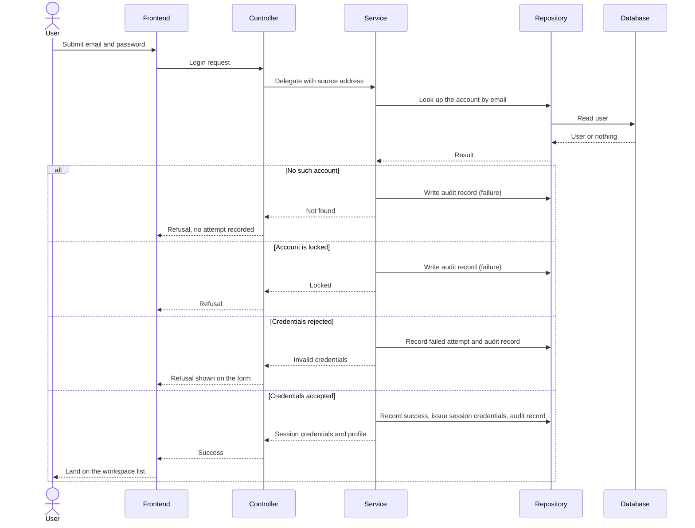

# Plan: Authentication & Authorization (Auth-US)

> **Feature:** SRS §7 Auth-US
> **Spec:** [spec.md](spec.md)
> **SDS:** [§5.2 Authentication Endpoints](../../SDS.md), [§6.2 Error Catalog](../../SDS.md)
> **Status:** Implemented

---

## Pre-flight: Spec Review Findings

Reviewed `spec.md` against the running implementation (`auth_service.py`, `routes.py`, `base-api.service.ts`).

| ID | Type | AC | Finding | Resolution |
|----|------|----|---------|------------|
| G1 | **Gap** | — | No story covers rate limiting; `RATE_LIMITED` exists in the error catalog but is never raised | Open risk R1 — spec amendment needed before it can be built |
| G2 | **Gap** | AC-10 | `users.failed_login_attempts` and `users.locked_until` columns exist but are unused; locking is decided from the `login_attempts` table | Resolved: the table is authoritative; the columns are dead and should be dropped in a later migration |
| A1 | Ambiguity | AC-08 | Telling the user "no account exists" is a user-enumeration oracle | Accepted deliberately on the product owner's instruction: a personal finance tool favours a usable message over enumeration resistance. Recorded here so the trade-off is not rediscovered as a bug |
| A2 | Ambiguity | AC-10 | Detection window and lock duration not quantified in the spec | Resolved from config: `MAX_LOGIN_ATTEMPTS=5`, `LOCKOUT_DURATION_MINUTES=15` |
| A3 | Ambiguity | AC-11 | "Does not navigate away" is a UI property with a non-obvious cause | Resolved: the HTTP client must not treat an authentication `401` as an expired session (see Frontend below) |

---

## Architecture

```text
backend/app/
├── api/routes.py                 # POST /auth/register · /auth/login · /auth/refresh · /auth/logout
│                                 # POST /auth/verify-email
├── services/auth_service.py      # AuthService: register, verify, login, refresh, logout
├── repositories/__init__.py      # get_user_by_email, create_user, login-attempt counters,
│                                 # refresh-token create/revoke, create_audit_log
├── core/jwt_utils.py             # access/refresh/verification token creation and decode
├── schemas/__init__.py           # RegisterRequest, LoginRequest, TokenRefreshRequest, …
└── models/__init__.py            # User, EmailVerificationToken, RefreshToken, LoginAttempt, AuditLog

frontend/src/
├── app/auth/login/page.tsx       # Login form (React Hook Form + Zod)
├── app/auth/register/page.tsx    # Registration form
├── app/auth/verify-email/…       # Verification landing
├── lib/api-client.ts             # login/register/logout calls
└── lib/base-api.service.ts       # Token storage, request/response interceptors
```

**Domain objects**

| Entity | Table | Key fields | Notes |
|---|---|---|---|
| `User` | `users` | `email`, `password_hash`, `is_active`, `email_verified`, `email_verified_at`, `deleted_at` | `failed_login_attempts` / `locked_until` present but unused (G2) |
| `EmailVerificationToken` | `email_verification_tokens` | `token`, `expires_at`, `used_at` | Single use; distinct expiry vs used states |
| `RefreshToken` | `refresh_tokens` | `token`, `expires_at`, `revoked_at` | Rotated on refresh, revoked on logout |
| `LoginAttempt` | `login_attempts` | `email`, `success`, `ip_address`, `created_at` | Authoritative source for locking |
| `AuditLog` | `audit_logs` | `event_name`, `action`, `result`, `error_code`, `ip_address`, `user_id` | `AUTH_AUDIT` events |

---

## Business rules and where they are enforced

| Rule | Source | Enforcement |
|---|---|---|
| Password at least 8 characters | FR-003 | `RegisterRequest.password` field constraint → 422 |
| Email must be unused | FR-002 | Service check before insert → 409 `USER_EMAIL_EXISTS` |
| Account starts inactive and unverified | FR-004 | `create_user` defaults |
| Verification link single-use and time-limited | FR-005/006 | `EmailVerificationToken.is_expired()` / `is_used()` → 410 `TOKEN_EXPIRED`, 409 `TOKEN_ALREADY_USED` |
| Unverified account cannot log in | FR-007 | Service check after credential match → 403 `EMAIL_NOT_VERIFIED` |
| Unknown address is not lockable | FR-008 | **The user is resolved before the lockout check**, and an unknown address raises `USER_NOT_FOUND` (404) without writing a `login_attempts` row |
| Wrong password counts against the account | FR-009 | `login_attempts` row with `success=false` |
| Locked account refused regardless of credentials | FR-010 | Lockout check precedes password verification for a *known* user → 423 `ACCOUNT_LOCKED` |
| Lock after 5 failures in 15 minutes | FR-011 | `MAX_LOGIN_ATTEMPTS` / `LOCKOUT_DURATION_MINUTES` from settings |
| Refresh rotates | FR-013 | Old token revoked, new one issued in the same transaction |
| Logout revokes | FR-014 | `revoked_at` stamped |
| Every attempt audited | FR-015 | `AUTH_AUDIT` written in every branch, including the failure branches |
| No secrets in logs | FR-016 | Passwords never passed to `logger.*` or to audit `details` |

**Error code → status**

| Code | Status |
|---|---|
| `USER_EMAIL_EXISTS` | 409 |
| `USER_NOT_FOUND` | 404 |
| `INVALID_CREDENTIALS` | 401 |
| `EMAIL_NOT_VERIFIED` | 403 |
| `ACCOUNT_LOCKED` | 423 |
| `TOKEN_EXPIRED` | 410 |
| `TOKEN_ALREADY_USED` | 409 |

---

## Frontend

- Both forms validate with Zod mirroring the backend DTO constraints (FE-02) and surface field errors inline.
- Error codes map to translated messages (`auth.*` in `lib/i18n.ts`), never raw server text.
- **The response interceptor must not treat an authentication `401` as an expired session.** `BaseApiService` keeps an allowlist of auth paths; a `401` from one of those is the answer to the question the form asked, so it is left to the form. Without this, a wrong password triggered `window.location.href = '/auth/login'`, reloading the page and destroying the error message the form had just rendered — the reported "error flickers and disappears" defect (A3).
- Placeholders are instructions ("Enter your email address"), never examples.

---

## Sequence — Auth-US-02 Login



---

## Tasks

| # | Task | Status |
|---|---|---|
| T1 | Registration endpoint, DTO validation, uniqueness check | Done |
| T2 | Verification link issue and redemption, expiry and reuse handling | Done |
| T3 | Login with lockout, resolving the user before the lockout check | Done |
| T4 | Refresh with rotation; logout with revocation | Done |
| T5 | `AUTH_AUDIT` records on every branch | Done |
| T6 | Login and registration forms with inline and form-level errors | Done |
| T7 | Auth-path allowlist in the HTTP client so a form `401` stays on the form | Done |
| T8 | Accept internal reserved-domain addresses | Done |
| T9 | Rate limiting on authentication endpoints | **Not started — needs a spec story first (G1)** |
| T10 | Drop the unused `failed_login_attempts` / `locked_until` columns | Not started |
| T11 | Integration tests for each branch of login | **Blocked — see R2** |

---

## Open Risks

- **R1 — No rate limiting anywhere.** `RATE_LIMITED` is in the error catalog but nothing raises it. Login is guarded only by per-account locking, so an attacker can spray one attempt each across many accounts, and registration and refresh are entirely unguarded. Needs a story, then per-IP and per-identity limits.
- **R2 — The backend test suite does not run.** `conftest.py` constructs `User(hashed_password=…)` while the model field is `password_hash`, so collection fails before any auth test executes. Nothing in this feature is covered by a passing test.
- **R3 — Enumeration oracle accepted (A1).** If the product position changes, the fix is to return `INVALID_CREDENTIALS` for an unknown address and log the distinction instead of returning it.
