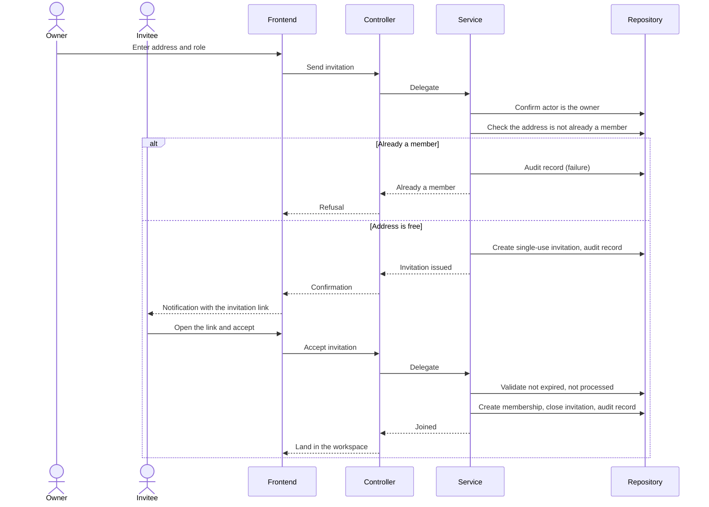

# Plan: Workspace Management (WS-US)

> **Feature:** SRS §7 WS-US
> **Spec:** [spec.md](spec.md)
> **SDS:** [§5.3 Workspace Management](../../SDS.md), [§6.2 Error Catalog](../../SDS.md)
> **Status:** Implemented

---

## Pre-flight: Spec Review Findings

Reviewed `spec.md` against `workspace_service.py`, `routes.py`, and the workspace UI.

| ID | Type | AC | Finding | Resolution |
|----|------|----|---------|------------|
| G1 | **Gap** | AC-11 | Owner demote and owner removal were implemented as ordinary operations | Resolved: both refused with `UNSUPPORTED_OPERATION`; the SRS stories WS-US-04/05 were amended to state it |
| G2 | **Gap** | — | Changing the preferred currency was silently permitted on the generic workspace update, without restating any stored rate — every summary became wrong | Resolved: currency removed from the update DTO; changing it is now its own operation (see [010-multi-currency](../010-multi-currency/plan.md)) |
| G3 | **Gap** | AC-13 | No story covers viewing the audit log, though records are written | Open — needs a story before any endpoint exposes it |
| A1 | Ambiguity | AC-03 | Invitation expiry not quantified | Resolved: 7 days |
| A2 | Ambiguity | AC-06 | Whether accepting requires the signed-in address to match the invited address | Resolved: the invitation token is authority; the accepting account is the one it is bound to |
| A3 | Ambiguity | AC-14 | "Reports the failure" — mechanism unspecified | Resolved: a toast over the retained view, plus a URL correction back to the last good workspace |

---

## Architecture

```text
backend/app/
├── api/routes.py                     # POST/GET/PUT/DELETE /workspaces …
│                                     # POST /workspaces/{id}/members/invite
│                                     # POST /invitations/accept · /invitations/decline
│                                     # PUT/DELETE /workspaces/{id}/members/{userId}
├── services/workspace_service.py     # WorkspaceService — all workspace and membership rules
├── services/access.py                # require_membership, require_owner (shared guards)
├── repositories/__init__.py          # workspace, member, invitation and category persistence
└── models/__init__.py                # Workspace, WorkspaceMember, WorkspaceInvitation

frontend/src/
├── app/app/workspaces/page.tsx                    # Workspace list
├── app/app/workspaces/[id]/settings/page.tsx      # Rename, describe, change reporting currency
├── app/app/workspaces/[id]/members/…              # Member list and invite form
├── components/workspace/create-workspace-dialog.tsx
└── components/layouts/app-layout.tsx              # Workspace context, switcher, failure handling
```

**Domain objects**

| Entity | Table | Key fields | Notes |
|---|---|---|---|
| `Workspace` | `workspaces` | `name`, `description`, `currency`, `owner_id`, `deleted_at` | `currency` is the reporting unit (FR-10) |
| `WorkspaceMember` | `workspace_members` | `workspace_id`, `user_id`, `role`, `joined_at` | Role is `OWNER` or `MEMBER` |
| `WorkspaceInvitation` | `workspace_invitations` | `email`, `role`, `token`, `expires_at`, `accepted_at`, `rejected_at` | Single use; expiry and processed states are distinct |

---

## Business rules and where they are enforced

| Rule | Source | Enforcement |
|---|---|---|
| Creator becomes OWNER, categories seeded | FR-002/003 | `WorkspaceService.create_workspace` in one transaction |
| Invite, remove, role change are OWNER-only | FR-004 | `require_owner` before any mutation → 403 `PERMISSION_DENIED` |
| Invitation single-use, 7-day expiry | FR-005/009 | `is_expired()` → 410 `INVITATION_EXPIRED`; `is_accepted()`/`is_rejected()` → 409 `INVITATION_ALREADY_USED` |
| Cannot invite an existing member | FR-006 | Membership lookup before issue → 409 `USER_ALREADY_MEMBER` |
| Membership only after acceptance | FR-007 | `accept_invitation` is the only path that inserts a member row |
| Owner cannot be removed or demoted | FR-010 | Target-is-owner check in both handlers → `UNSUPPORTED_OPERATION` |
| Access revoked immediately on removal | FR-011 | Every request re-reads membership through `require_membership`; nothing is cached |
| Records of a removed member survive | FR-012 | Removal deletes only the membership row |
| Every event audited | FR-015 | `WS_AUDIT` written on success and failure branches |

**Error code → status**

| Code | Status |
|---|---|
| `WORKSPACE_NOT_FOUND` / `MEMBER_NOT_FOUND` / `INVITATION_NOT_FOUND` | 404 |
| `PERMISSION_DENIED` | 403 |
| `WORKSPACE_NAME_EXISTS` / `USER_ALREADY_MEMBER` / `INVITATION_ALREADY_USED` | 409 |
| `INVITATION_EXPIRED` | 410 |
| `UNSUPPORTED_OPERATION` | 400 |

---

## Frontend

- **Creation is a dialog, not a page** (AC-02): the list stays mounted underneath and refreshes on success.
- **Workspace context** is loaded once by `AppLayout` and exposed through `useCurrentWorkspace`; children render only once it resolves, so no child handles a null workspace.
- **A failed switch is a toast, not a page** (AC-14, A3): `AppLayout` keeps the last good workspace in a ref; on failure it restores that workspace, shows a toast, and corrects the URL. The full-page error state is reserved for a cold load with nothing to fall back to.
- **Settings** (`settings/page.tsx`) covers rename and description for an OWNER, and hosts the reporting-currency change with its restatement warning and confirmation.

---

## Sequence — WS-US-02/03 Invite and accept



---

## Tasks

| # | Task | Status |
|---|---|---|
| T1 | Create workspace with owner membership and seeded categories | Done |
| T2 | Invite with role, single-use token, 7-day expiry | Done |
| T3 | Accept and decline, with expired vs processed distinguished | Done |
| T4 | Remove member and change role, OWNER-only | Done |
| T5 | Refuse owner removal and owner demotion | Done |
| T6 | Member list with identity, role and join date | Done |
| T7 | Create-workspace dialog over the list | Done |
| T8 | Toast-based recovery for a failed workspace switch | Done |
| T9 | Settings page: rename, describe, change reporting currency | Done |
| T10 | Ownership transfer | Not planned — no story |
| T11 | Audit-log viewing | **Not started — needs a story (G3)** |
| T12 | Integration tests per membership branch | **Blocked — see R1** |

---

## Open Risks

- **R1 — The backend test suite does not run** (`conftest.py` field mismatch), so none of these rules is covered by a passing test.
- **R2 — Invitation email delivery is unverified** in local development; SMTP settings exist but nothing asserts a message was sent.
- **R3 — No ownership transfer path.** Because the owner can be neither removed nor demoted, a workspace whose owner leaves the organisation has no remedy short of database intervention. Acceptable for now; worth a story before real use.
