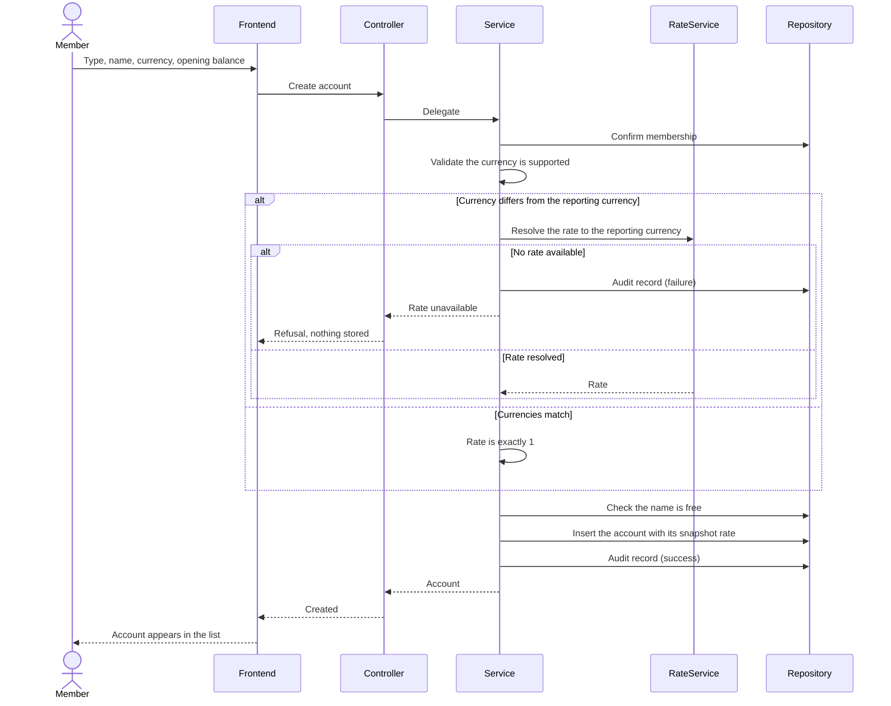

# Plan: Account Management (ACC-US)

> **Feature:** SRS §7 ACC-US
> **Spec:** [spec.md](spec.md)
> **Test Cases:** [test_cases.md](test_cases.md)
> **SDS:** [§5.4 Account Management](../../SDS.md), [§7.1 Core Tables](../../SDS.md)
> **Status:** Implemented. Nine open defects: G4, G6–G14, G16

---

## Pre-flight: Spec Review Findings

Reviewed `spec.md` against `account_service.py`, `repositories/__init__.py`, `schemas/__init__.py`, `routes.py`, the accounts page and the account dialog. AC references are to the **expanded** spec (84 ACs across four stories).

| ID | Type | AC | Finding | Resolution |
|----|------|----|---------|------------|
| G1 | **Gap** | AC-47 | `update_account` accepted a new currency and wrote it, leaving `balance`, `opening_balance` and `exchange_rate` untouched — a VND balance silently relabelled as USD, off by a factor of ~26,000 | Resolved: currency removed from the update DTO, the service signature, and the repository. A new SRS story ACC-US-03 states the rule; Archive renumbered to ACC-US-04 |
| G2 | **Gap** | AC-71/73 | Archiving ran on a single click with no confirmation, and a refusal was swallowed into a page-level error flag | Resolved: shared confirmation dialog that stays open and reports the reason on refusal |
| G3 | **Gap** | AC-43 | No edit story existed at all; the endpoint was implemented but unspecified and unreachable from the UI | Resolved: ACC-US-03 written; edit dialog wired |
| G4 | **Gap** | AC-03 | **Nothing masks the "masked" account number.** The column comment says "masked — last 4 digits only" and the frontend type says "Masked by the backend", but no code truncates or validates it: whatever is submitted is stored verbatim, so a full account number can be persisted while two layers of documentation claim it cannot | **Open.** The spec assumption has been corrected to say what is true. The fix is a decision: truncate on write, validate a mask pattern, or drop the claim. Until then the comments are misleading, which is worse than an unmasked field |
| G5 | Observation | AC-12 | The service's `UNSUPPORTED_CURRENCY` guard is unreachable through HTTP — the request DTO already constrains the currency to an enum, so an unknown code returns 422 first. Same for the account type | Documented in TC-15 so the expected status is 422, not 400. The guard remains correct for non-HTTP callers |
| G6 | **Gap** | AC-20 | **A negative opening balance is accepted by the API.** The form's Zod schema enforces `min(0)`, but `CreateAccountRequest.opening_balance` carries no lower bound and the service does not check, so the frontend is the only gate — exactly what VL-01 forbids | **Open.** TC-24 asserts the intended refusal and is marked as failing. A `ge=0` on the field is the fix |
| G7 | **Gap** | AC-32 | **The accounts total and the dashboard total disagree.** The accounts page sums active accounts only; the dashboard deliberately includes archived ones so the parts sum to the whole ([009](../009-dashboard-reporting/plan.md) A1). Any workspace with an archived account holding a balance shows two different answers to "how much do I have" on two screens | **Open.** TC-46 asserts agreement and is marked as failing. The list total should adopt the dashboard's construction, not the reverse |
| G8 | **Gap** | AC-36 | **The account list does not clamp its paging.** Unlike the transaction list, neither the route, the service nor the repository bounds `page` or `page_size`: `page_size=0` returns an empty list, and `page=0` computes a negative offset and fails in the database | **Open.** TC-50 asserts the bounded behaviour and is marked as failing |
| G9 | **Gap** | AC-40 | **There is no per-account view.** The detail endpoint returns the account's own fields and nothing else, and no screen shows one account's movements. AC-40 in the SRS reading ("balance and history") is therefore half-implemented | **Open.** TC-54 exercises the filtered transaction history as the interim contract |
| G10 | **Gap** | AC-45 | **The edit dialog shows an opening balance of zero.** Opening the dialog for an edit resets `openingBalance: 0`, and `EditableAccount` does not even carry the real value — so the field the spec requires for recognition displays a figure the account does not have | **Open.** TC-63 marked as failing. Carrying `opening_balance` into the editable shape is the fix |
| G11 | **Gap** | AC-49/75 | **Edit and archive controls are shown to every member.** Both are OWNER-only in the service, and the workspace context already carries `user_role`, but the accounts page never consults it — so a non-owner is offered two actions that always end in a refusal, against FE-03 | **Open.** TC-67 and TC-97 marked as failing |
| G12 | **Gap** | AC-59 | **An institution or masked number cannot be emptied.** `update_account` treats `None` as "leave alone", and the dialog converts an empty field to `undefined`, so there is no value a member can submit that removes a label they no longer want | **Open.** TC-78 marked as failing. This is the same asymmetry as [004](../004-transaction-management/plan.md) G7 and deserves one consistent decision across both features |
| G13 | **Gap** | AC-84 | **A repeated archive is refused without an audit record.** Every other refusal in the service writes a failure row first; the already-archived branch raises directly, so the one action a member is most likely to retry leaves no trace | **Open.** TC-109 marked as failing on that branch |
| G14 | **Gap** | AC-06 / EC-006 | **Name uniqueness has no database constraint behind it.** It is a service-layer read followed by an insert, with no unique index on `(workspace_id, lower(name))`, so two concurrent creations can both pass. VL-02 requires all three levels; only two exist | **Open.** TC-31 marked as failing. Needs a migration, and the migration will fail on any workspace that has already collided |
| G15 | Observation | EC-011 | Name comparison lowercases but does not trim, so `"  Main  "` and `"Main"` are two different names that render identically in a list | **Undecided.** TC-33 records the question rather than blessing the behaviour |
| G16 | **Gap** | EC-007 | The accounts page requests no page size, so it shows the first 25 accounts and its total covers only those. Nothing tells the member the list is truncated | **Open.** Compounds G7: past 25 accounts the total is wrong for a second reason |
| A1 | Ambiguity | AC-25 | Which rate converts a *current* balance for display | Resolved: the account's stored opening rate is used for the row-level "≈" hint, and it is labelled as an equivalent. The authoritative reported balance comes from the dashboard, which sums each movement at its own rate — see R2 |
| A2 | Ambiguity | AC-04/48/74 | SRS assigns create to MEMBER but edit and archive to OWNER | Resolved as written: `require_membership` for create, list and read; `require_owner` for edit and archive. AC-04 now states the reasoning — adding an account affects nobody else, withdrawing one does |
| A3 | Ambiguity | AC-09/54 | Whether an archived account's name is free for reuse | Resolved: yes. `get_account_by_name` filters on active accounts only, which is the right behaviour — an archived account is out of the active list, so the name is no longer ambiguous |
| A4 | Ambiguity | AC-39 | Whether an archived account stays readable | Resolved: yes. Archiving withdraws an account from *choices*, not from view — its history has to remain inspectable |
| A5 | Ambiguity | AC-81 | Whether an archived account's money still counts | Resolved: yes, consistently with [009](../009-dashboard-reporting/plan.md) A1. This is what G7 currently contradicts on the accounts screen |

---

## Architecture

```text
backend/app/
├── api/routes.py                    # POST/GET /workspaces/{id}/accounts
│                                    # GET/PUT /workspaces/{id}/accounts/{accountId}
│                                    # DELETE /workspaces/{id}/accounts/{accountId}/archive
├── services/account_service.py      # AccountService — rules, audit, currency resolution
├── services/exchange_rate_service.py# snapshot_rate for the opening balance
├── repositories/__init__.py         # create_account, update_account, archive_account, …
└── models/__init__.py               # Account

frontend/src/app/app/workspaces/[id]/accounts/
├── page.tsx                         # List, total, edit and archive controls
└── _components/account-dialog.tsx   # Create and edit in one dialog
```

**Domain object**

| Entity | Table | Key fields | Notes |
|---|---|---|---|
| `Account` | `accounts` | `type`, `name`, `currency`, `balance`, `opening_balance`, `exchange_rate`, `opening_base_balance`, `institution`, `account_number`, `deleted_at` | `opening_base_balance` is generated as `opening_balance × exchange_rate`; `deleted_at` is the archive marker |

Constraints: `currency IN ('VND','USD')`, `exchange_rate > 0`, unique name per workspace (service-enforced).

---

## Business rules and where they are enforced

| Rule | Source | Enforcement |
|---|---|---|
| Any member may create; only an owner may edit or archive | FR-010 | `require_membership` / `require_owner` → 403 `PERMISSION_DENIED` |
| Name unique within the workspace | FR-003 | `get_account_by_name` before insert and before rename → 409 `ACCOUNT_NAME_EXISTS` |
| Only supported currencies | FR-004 | `normalise_currency` → 400 `UNSUPPORTED_CURRENCY` |
| The rate is resolved server-side | FR-005 | `snapshot_rate(workspace.currency, account.currency)`; `CreateAccountRequest` has no rate field at all |
| The opening balance's reported value is fixed | FR-006 | `exchange_rate` stored on the row; `opening_base_balance` generated from it |
| Type, opening balance and currency immutable | FR-009 | Absent from `UpdateAccountRequest`, from the service signature, and from the repository setter — not merely ignored |
| Archived accounts are not offered for new transactions | FR-011 | `deleted_at` set; the transaction form lists active accounts only |
| Archive is confirmed and a refusal is visible | FR-013/014 | `ConfirmDialog` awaits the call, stays open on rejection and shows the reason |
| Everything audited | FR-015 | `ACCOUNT_AUDIT` on every branch, with old/new name on rename |

**Error code → status**

| Code | Status |
|---|---|
| `ACCOUNT_NOT_FOUND` | 404 |
| `PERMISSION_DENIED` | 403 |
| `ACCOUNT_NAME_EXISTS` / `ACCOUNT_ARCHIVED` / `ACCOUNT_HAS_PENDING_TRANSACTIONS` | 409 |
| `UNSUPPORTED_CURRENCY` | 400 |
| `EXCHANGE_RATE_UNAVAILABLE` | 503 |

---

## Frontend

- **One dialog, two modes.** `account-dialog.tsx` takes an optional `editing` prop. In edit mode the immutable fields render **disabled rather than hidden** (AC-08): a user needs to see what the account is in order to recognise it, just not change it. A note states which fields are fixed and points to workspace settings for the reporting currency.
- **Row legibility.** The name is the only field in strong type; type and currency are badges, institution and masked number are icon-labelled meta items, and archived state is a badge. This replaced a single grey `TYPE · CURRENCY · archived` string in which no field was distinguishable.
- **Money alignment.** Every figure uses tabular numerals so columns line up, and a foreign-currency row shows `≈ <reported>` beneath its own-currency balance.
- **Archive** goes through the shared `ConfirmDialog` at `warning` severity — the change is significant but recoverable in the sense that history survives.

---

## Sequence — ACC-US-01 Create account



---

## Tasks

| # | Task | Status |
|---|---|---|
| T1 | Create account with server-resolved snapshot rate | Done |
| T2 | List and detail with balances | Done |
| T3 | Edit name, institution, masked number (OWNER only) | Done |
| T4 | Make type, opening balance and currency immutable end to end | Done |
| T5 | Archive with confirmation and visible refusal | Done |
| T6 | Row layout where each field is identifiable | Done |
| T7 | Audit records on every branch, with old/new name | Done |
| T8 | `ACCOUNT_HAS_PENDING_TRANSACTIONS` — define what "pending" means and enforce it | **Not started — the code is in the catalog but never raised** |
| T9 | Integration tests for uniqueness, immutability and archive | **Blocked — see R1** |

---

## Open Risks

- **R1 — The backend test suite does not run**, so immutability and uniqueness are unverified by any automated check.
- **R2 — Two ways of reporting a foreign balance coexist.** The account row multiplies the current balance by the account's *opening* rate as a display hint, while the dashboard sums each movement at the rate it was recorded at. The dashboard figure is the correct one; the row hint drifts once rates move. Either label the row hint more weakly or have the API return the per-account reported balance for display.
- **R3 — Migrations 004–006 are applied by hand.** A database that has not received them lacks `exchange_rate`, `opening_base_balance` and `direction`, and every account and transaction endpoint fails. There is no migration runner.
