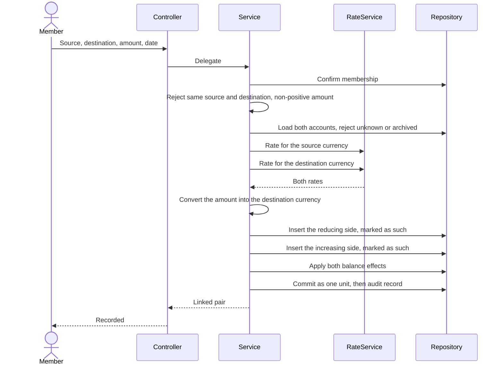

# Plan: Transaction Management (TXN-US)

> **Feature:** SRS §7 TXN-US
> **Spec:** [spec.md](spec.md)
> **Test Cases:** [test_cases.md](test_cases.md)
> **SDS:** [§4.5 Transaction Management](../../SDS.md), [§7.1 Core Tables](../../SDS.md)
> **Status:** Implemented, except the transfer UI (TXN-US-03 has no form yet). Two open defects: G6, G9

---

## Pre-flight: Spec Review Findings

Reviewed `spec.md` against `transaction_service.py`, `routes.py`, `repositories/__init__.py`, `schemas/__init__.py`, and the transactions UI. AC references below are to the **expanded** spec (130 ACs across six stories).

| ID | Type | AC | Finding | Resolution |
|----|------|----|---------|------------|
| G1 | **Gap** | AC-46 | Nothing on a row said which way it moved. Both sides of a transfer were `type=TRANSFER` with a positive amount; the debit was identified by *being the lower id in the group*. No query outside that code could reproduce it, so a per-account balance could not be rebuilt from the rows, and cancellation depended on insertion order | Resolved: a `direction` column added (migration 006), set at write time, used by cancellation and by the dashboard |
| G2 | **Gap** | AC-53 | A cross-currency transfer credited the destination with the **same numeral** — moving 100 from a USD account put 100 *VND* into the destination | Resolved: the credit is converted through the reporting currency, so both sides carry equal reported value |
| G3 | **Gap** | AC-115 | A category could be set but never cleared: the repository treated `None` as "leave unchanged" | Resolved: an explicit clear flag, driven by whether the field was present in the request body |
| G4 | **Gap** | AC-104 | Cancellation used the browser's native confirm — unstyled, untranslatable, no loading state, no stable selector for tests | Resolved: shared confirmation dialog at `destructive` severity |
| G5 | **Gap** | AC-70 | The list was one undivided column of rows | Resolved: a section per calendar day with a sticky label and per-day subtotals |
| G6 | **Gap** | AC-127 | **Editing is not restricted to the creator or an OWNER.** `cancel_transaction` checks `created_by == user_id or member.role == "OWNER"`; `update_transaction` checks membership only. Any member can therefore re-classify and re-describe another member's transaction, though they cannot cancel it — an inconsistency the spec did not previously state either way | **Open.** The spec now states the intended contract at AC-127 and `test_cases.md` TC-160 asserts it, marked as currently failing. The fix is three lines in `update_transaction`, but it is a behaviour change for existing shared workspaces, so it needs a decision rather than a quiet patch |
| G7 | **Gap** | AC-120 | **Clearing is asymmetric.** Only the category has a clear flag. `notes`, `tags` and `description` follow "`None` means leave alone", so an explicit JSON `null` cannot empty them; the UI happens to clear a description only because it sends `""` rather than `null` | **Partially open.** Empty-string clearing works and is now the documented contract (AC-119, AC-120, TC-152, TC-153). A `null` on those three fields still means "leave alone", which is defensible but undocumented in the SDS |
| G8 | **Gap** | AC-22 | **A note can be read but never written from the UI.** The row renders `notes` as a meta item and the API accepts `notes`, `tags`, `receipt_url` and `location`, but the dialog has fields for none of them | Open — the API contract is complete, the form is not. Added as T13 |
| G9 | **Gap** | EC-005 | **Cancellation is not serialised.** The already-cancelled check, the balance adjustment and the status write are not protected by a row lock, so two concurrent cancellations of the same transaction can both pass the check and reverse the balance twice | **Open.** TC-143 asserts the intended outcome and is marked as expected to fail. A `SELECT … FOR UPDATE` on the affected rows is the fix |
| G10 | Observation | AC-83 | An unsupported `sort_by` value silently falls back to `date` rather than being refused. Harmless, but a client cannot tell its sort was ignored | Accepted and documented: AC-83 states it must not fail, TC-104 asserts the fallback |
| G11 | Observation | EC-018 | Free-text search interpolates the term straight into an `ILIKE` pattern without escaping, so a `%` or `_` in the search text acts as a wildcard | **Undecided.** TC-115 records the question rather than blessing the behaviour |
| G12 | Observation | AC-12 | The `INVALID_AMOUNT` service guard is unreachable through HTTP: the request DTO already constrains `amount` to `gt=0`, so a non-positive amount returns 422 before the service runs. The guard is still correct as defence in depth for any non-HTTP caller | Documented in TC-14 so the expected status is 422, not 400 |
| A1 | Ambiguity | AC-02/26/27 | The SRS names the transaction types but never states which way each moves a balance | Resolved and documented: `INCOME`, `REFUND`, `DEBT` increase; `EXPENSE`, `INVESTMENT`, `LOAN` decrease. A `DEBT` is money borrowed in; a `LOAN` is money lent out |
| A2 | Ambiguity | AC-75 | Which field leads a row | Resolved on the product owner's instruction: category and type lead, description supports |
| A3 | Ambiguity | AC-73 | Whether cancelled rows appear in day subtotals | Resolved: visible, excluded from subtotals |
| A4 | Ambiguity | AC-28 | Whether an expense may take a balance negative. `INSUFFICIENT_BALANCE` exists in the SDS error catalog but nothing raises it | Resolved: negative balances are permitted; the system records what happened. The unused error code should be removed from the catalog (R5) |
| A5 | Ambiguity | AC-21 | Whether a future-dated transaction applies to the balance at once or on its date | Resolved: at once. The balance is a running position, not a scheduled projection; a scheduled movement is a bill reminder (feature 008, not yet specified) |

---

## Architecture

```text
backend/app/
├── api/routes.py                      # POST /workspaces/{id}/transactions
│                                      # POST /workspaces/{id}/transactions/transfer
│                                      # GET  /workspaces/{id}/transactions[/{txnId}]
│                                      # PUT  /workspaces/{id}/transactions/{txnId}
│                                      # DELETE /workspaces/{id}/transactions/{txnId}
├── services/transaction_service.py    # DIRECTION_BY_TYPE, SIGN, create/transfer/update/cancel
├── services/exchange_rate_service.py  # snapshot_rate per leg
├── repositories/__init__.py           # create_transaction, adjust_account_balance,
│                                      # update_transaction_metadata, cancel_transaction,
│                                      # list_transfer_group, list_workspace_transactions
└── models/__init__.py                 # Transaction

frontend/src/app/app/workspaces/[id]/transactions/
├── page.tsx                           # Day-grouped list, filter, edit and cancel controls
└── _components/transaction-dialog.tsx # Create and edit in one dialog, with rate preview
```

**Domain object**

| Entity | Table | Key fields | Notes |
|---|---|---|---|
| `Transaction` | `transactions` | `account_id`, `category_id`, `type`, `amount`, `direction`, `currency`, `exchange_rate`, `base_amount`, `date`, `description`, `notes`, `tags`, `transfer_group_id`, `status`, `created_by`, `cancelled_at`, `cancel_reason` | `amount` is always positive; `direction` carries the sign; `base_amount` is generated as `amount × exchange_rate` |

Constraints: `currency IN ('VND','USD')`, `exchange_rate > 0`, `direction IN ('debit','credit')`.
Indexes: `(workspace_id, date, status)` for summaries, `(account_id, direction, status)` for balance reconstruction.

---

## Business rules and where they are enforced

| Rule | Source | Enforcement |
|---|---|---|
| Direction per type | A1 | `DIRECTION_BY_TYPE`; `SIGN` turns a direction into ±1 |
| Balance and row are one unit | FR-002 | Both inside a single service transaction; any failure rolls back |
| Currency follows the account | FR-003 | Service reads `account.currency`; the DTO has no currency field |
| Rate resolved server-side and stored | FR-004 | `snapshot_rate(workspace.currency, account.currency)`; no rate field on any request DTO |
| No rate, no write | FR-005 | `EXCHANGE_RATE_UNAVAILABLE` raised before insert → 503 |
| Amount must be positive | FR-006 | DTO constraint plus a service check → `INVALID_AMOUNT` |
| Account must exist and be active | FR-007 | → 404 `ACCOUNT_NOT_FOUND`, 409 `ACCOUNT_ARCHIVED` |
| Category must be in the workspace | FR-008 | → 404 `CATEGORY_NOT_FOUND` |
| A transfer is a linked pair, indivisible | FR-009 | Two rows sharing a `transfer_group_id`, both created before one commit |
| Transfers excluded from income and expense | FR-009 | The summary buckets ignore `TRANSFER`; per-account balances still include it via `direction` |
| Cross-currency transfer preserves value | FR-010 | `credited = amount × debit_rate ÷ credit_rate`, quantised to 2 decimal places |
| No self-transfer | FR-011 | → `INVALID_TRANSFER` |
| Metadata-only edits | FR-015 | `UpdateTransactionRequest` carries category, description, notes, tags only |
| Clearing a category is explicit | FR-016 | An explicit-null check on the request body sets the clear flag |
| Cancellation is creator-or-owner | FR-017 | → 403 `PERMISSION_DENIED` |
| Cancellation reverses by direction | FR-018 | `delta = -SIGN[direction] × amount`, applied identically to plain rows and transfer legs |
| Both halves cancel together | FR-018 | `list_transfer_group` collects the still-recorded legs |
| No double cancellation | FR-019 | → 409 `TRANSACTION_ALREADY_CANCELLED` |
| Everything audited | FR-022 | `TXN_AUDIT` on every branch, with the cancellation reason where given |

---

## Frontend

- **One dialog, two modes.** In edit mode the account, type, amount and date render disabled with a note explaining that a correction is made by cancelling and re-recording — the ledger then holds both facts.
- **Rate preview, never rate entry.** When the account's currency differs from the reporting currency the dialog reads the rate from the same source the write will use and shows `1 USD = 26,183.58 VND · Equivalent: …`. If that read fails it degrades to an amber note and does not block the form, because the stored rate is resolved server-side regardless.
- **Day sections.** Rows are grouped by calendar date, newest first, each section headed with a sticky label (`Today · 31 Jul 2026`) and that day's inflow and outflow. Cancelled rows appear but are excluded from the subtotal.
- **Row hierarchy.** Category and type lead; description is secondary; date, account and note are icon-labelled meta items so no two fields look alike.
- **Cancellation** uses the shared `ConfirmDialog` at `destructive` severity, showing date, amount and description, staying open with the reason if the call fails.

---

## Sequence — TXN-US-03 Cross-currency transfer



---

## Tasks

| # | Task | Status |
|---|---|---|
| T1 | Record income and expense with server-resolved snapshot rate | Done |
| T2 | Transfer as a linked, indivisible pair | Done (API) |
| T3 | Store direction on every row; migration with backfill | Done |
| T4 | Convert the credit on a cross-currency transfer | Done |
| T5 | Cancellation by direction, both legs together | Done |
| T6 | Metadata-only edit, with explicit category clearing | Done |
| T7 | Day-grouped list with subtotals and type filter | Done |
| T8 | Confirmation dialog for cancellation | Done |
| T9 | Transfer form in the UI | **Not started — TXN-US-03 is API-only** |
| T10 | Filters beyond type: account, category, date range, search | Not started (API supports all of them; only the type filter is wired to the UI) |
| T11 | Pagination controls (the API paginates; the UI requests 50 and shows them all) | Not started |
| T12 | Integration tests: balance identity, transfer value preservation, cancellation | **Blocked — see R1** |
| T13 | Note, tags, receipt reference and location fields on the recording form | **Not started — G8** |
| T14 | Restrict editing to the creator or an OWNER | **Not started — G6, decision needed** |
| T15 | Lock the affected rows during cancellation | **Not started — G9** |
| T16 | Decide whether search escapes wildcard characters | **Not started — G11** |
| T17 | Remove `INSUFFICIENT_BALANCE` from the SDS error catalog, or give it a rule | Not started — A4/R5 |
| T18 | Execute `test_cases.md`: 116 integration and 49 e2e cases | **Blocked — see R1** |

---

## Open Risks

- **R1 — The backend test suite does not run**, so the balance identity in SC-001 and the transfer value preservation in SC-002 are unverified.
- **R2 — Migration 006 backfills direction from insertion order.** For historical transfer legs that is the only signal available, so a pair inserted in an unexpected order would be backfilled the wrong way round. New rows are unaffected.
- **R3 — Cross-currency rounding.** The converted credit is quantised to two decimal places, so a transfer can leave the workspace total off by up to one minor unit. Acceptable, but it means SC-002 is stated with a tolerance.
- **R4 — Transfers were recorded before the conversion fix.** Any pre-existing cross-currency transfer credited the raw numeral and is wrong in the data; it needs correcting by hand or by cancelling and re-recording.
- **R5 — `INSUFFICIENT_BALANCE` appears in the SDS error catalog but nothing enforces it.** Accounts may go negative by design; the code should either be removed or given a rule.
- **R6 — Two of the 165 test cases are written to fail.** TC-160 (edit restricted to creator or OWNER) and TC-143 (concurrent cancellation) assert the contract the spec now states, not what the code does. Running the suite before G6 and G9 are fixed will show two failures, and that is the intended signal — not a broken suite.
- **R7 — TXN-US-03 has no browser coverage at all.** Its 26 cases are integration-only because no transfer form exists (T9). The operation is therefore unverified end to end, including the cross-currency conversion a member would most want to see before committing.
- **R8 — The audit assertions assume the audit table is queryable in tests.** Twelve cases read audit rows directly. If the test harness does not expose that table, those cases degrade to asserting the log output instead, which is weaker.
