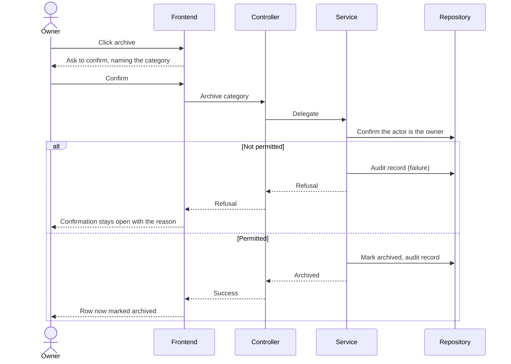

# Plan: Categories & Configuration (CAT-US)

> **Feature:** SRS §7 CAT-US
> **Spec:** [spec.md](spec.md)
> **SDS:** [§6.1 API Index](../../SDS.md), [§7.1 Core Tables](../../SDS.md)
> **Status:** Implemented

---

## Pre-flight: Spec Review Findings

Reviewed `spec.md` against `category_service.py`, `routes.py`, and the categories UI.

| ID | Type | AC | Finding | Resolution |
|----|------|----|---------|------------|
| G1 | **Gap** | AC-08 | Archiving ran on one click with no confirmation, and a refusal was folded into a page-level error flag, so a category still in use appeared to have been archived | Resolved: shared confirmation dialog that stays open and reports the reason |
| G2 | **Gap** | AC-13 | A transaction's category could be set but never cleared — the update path treated an absent value as "leave unchanged" | Resolved in [004](../004-transaction-management/plan.md): an explicit clear flag |
| A1 | Ambiguity | AC-09 | Whether an unused category may be hard-deleted | Resolved: archive is the only removal, for all categories. One rule is simpler than two, and a category with no transactions today may have some tomorrow |
| A2 | Ambiguity | AC-11 | Which categories suit which transaction types | Resolved: `INCOME`, `REFUND`, `DEBT` take income categories; `EXPENSE`, `INVESTMENT`, `LOAN` take expense categories — the same direction map the balance rules use |

---

## Architecture

```text
backend/app/
├── api/routes.py                     # GET/POST /workspaces/{id}/categories
│                                     # PUT /workspaces/{id}/categories/{categoryId}
│                                     # DELETE /workspaces/{id}/categories/{categoryId}/archive
├── services/category_service.py      # CategoryService — rules and audit
├── services/workspace_service.py     # DEFAULT_CATEGORIES seeded at workspace creation
├── repositories/__init__.py          # create_category, update_category, archive_category
└── models/__init__.py                # Category

frontend/src/app/app/workspaces/[id]/categories/
├── page.tsx                          # Grouped list, edit and archive controls
└── _components/category-dialog.tsx   # Create and rename in one dialog
```

**Domain object**

| Entity | Table | Key fields | Notes |
|---|---|---|---|
| `Category` | `categories` | `workspace_id`, `name`, `type`, `color`, `icon`, `is_default`, `deleted_at` | `type` is `INCOME` or `EXPENSE` and immutable; `deleted_at` is the archive marker |

---

## Business rules and where they are enforced

| Rule | Source | Enforcement |
|---|---|---|
| Seeded on workspace creation | FR-001 | `DEFAULT_CATEGORIES` inserted inside the create-workspace transaction |
| Manage is OWNER-only, use is any member | FR-004/005 | `require_owner` on write paths, `require_membership` on read → 403 `PERMISSION_DENIED` |
| Name unique per workspace | FR-003 | Lookup before insert and before rename → 409 `CATEGORY_NAME_EXISTS` |
| Direction immutable | FR-007 | `UpdateCategoryRequest` carries no `type`; the dialog's control is disabled when editing |
| Transactions follow a rename | FR-006 | Transactions hold `category_id`, never a copy of the name |
| Archived categories are not offered | FR-009 | `deleted_at` set; the transaction dialog filters to active |
| Archived categories stay attached | FR-010 | Archiving never touches transaction rows |
| In use means archive-only | FR-009/AC-09 | No delete endpoint exists at all; `CATEGORY_IN_USE` covers an attempted removal |
| Archive confirmed, refusal visible | FR-011/012 | `ConfirmDialog` awaits the call and stays open with the reason |
| Direction-matched choices | FR-008 | The dialog filters by the transaction type's direction |
| Everything audited | FR-014 | `CATEGORY_AUDIT` on every branch |

**Error code → status**

| Code | Status |
|---|---|
| `CATEGORY_NOT_FOUND` | 404 |
| `PERMISSION_DENIED` | 403 |
| `CATEGORY_NAME_EXISTS` / `CATEGORY_IN_USE` | 409 |

---

## Frontend

- **One dialog, two modes.** `category-dialog.tsx` takes an optional `editing` prop; the direction control is disabled when editing, since changing it would reclassify history.
- **Grouped list.** Income and expense are separate cards, each row showing the name with archived and default marked as badges.
- **Archive** uses the shared `ConfirmDialog` at `warning` severity, with copy that says explicitly that existing transactions keep the category — the most common worry at that moment.
- Error codes map to translated messages; `CATEGORY_IN_USE` gets its own sentence rather than a generic failure.

---

## Sequence — CAT-US-03 Archive category



---

## Tasks

| # | Task | Status |
|---|---|---|
| T1 | Seed categories with every new workspace | Done |
| T2 | Create with name and direction, unique per workspace | Done |
| T3 | Rename, with direction locked | Done |
| T4 | Archive, keeping history attached | Done |
| T5 | Confirmation dialog with a visible refusal | Done |
| T6 | Direction-matched choices on the transaction form | Done |
| T7 | Grouped list with archived and default badges | Done |
| T8 | Audit records on every branch | Done |
| T9 | Colour and icon pickers (fields exist, no UI) | Not started |
| T10 | Integration tests for uniqueness, direction immutability, in-use archive | **Blocked — see R1** |

---

## Open Risks

- **R1 — The backend test suite does not run**, so none of these rules is covered.
- **R2 — `CATEGORY_IN_USE` is defined but unreachable.** There is no delete endpoint, so nothing raises it. Either add a delete path that raises it for categories in use, or drop the code from the catalog.
- **R3 — Nothing prevents archiving the last category of a direction** (EC-003). A workspace can reach a state where an expense cannot be classified. Harmless because classification is optional, but worth a guard if classification ever becomes required.
