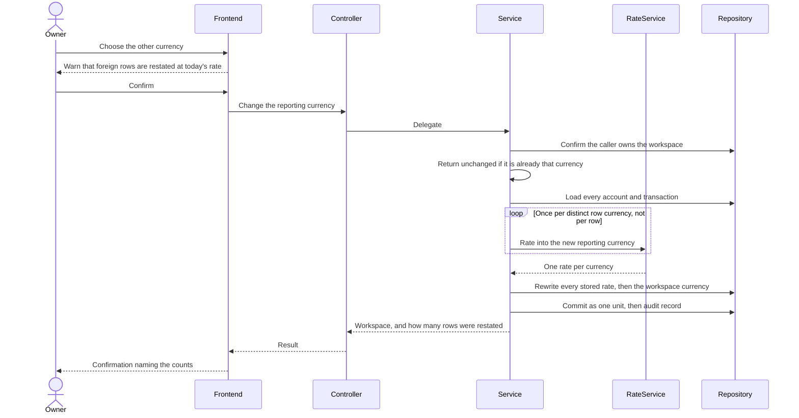

# Plan: Multi-currency reporting (cross-cutting)

> **Feature:** Cross-cutting — not an SRS §7 Feature
> **Spec:** [spec.md](spec.md)
> **SDS:** [§4.3 Exchange Rate Resolution](../../SDS.md), [§7.1 Core Tables](../../SDS.md)
> **Status:** Implemented. Consumed by [003](../003-account-management/), [004](../004-transaction-management/), [009](../009-dashboard-reporting/)

---

## Pre-flight: Spec Review Findings

Reviewed `spec.md` against `exchange_rate_service.py`, `currency.py`, `workspace_service.change_preferred_currency`, `routes.py` and the settings page.

| ID | Type | AC | Finding | Resolution |
|----|------|----|---------|------------|
| G1 | **Gap** | AC-05 | Every write path asked the client for the exchange rate: `CreateAccountRequest`, `CreateTransactionRequest` and the transfer request all carried an `exchange_rate` field, and the forms had an input for it. A member had to look up a rate and could enter any number — including one that made their own reports wrong | Resolved: no request DTO has a rate field. The rate is resolved server-side by `snapshot_rate` and stored on the row |
| G2 | **Gap** | AC-13/14 | `PUT /workspaces/{id}` accepted a new `currency`, changing the reporting currency **without touching a single stored rate**. Every figure in the workspace silently became wrong — this is what produced a USD dashboard for a workspace whose money was all in VND | Resolved: `currency` removed from the workspace update DTO; a dedicated operation re-snapshots every rate in one transaction |
| G3 | **Gap** | AC-12 | `update_account` accepted a new currency while leaving the balance, the opening balance and the stored rate denominated in the old one | Resolved: removed from the DTO, the service and the repository. An account's currency is fixed at creation |
| G4 | **Gap** | AC-18 | No way to read a rate, so a form could not show what an amount converted to before it was committed | Resolved: a read-only rate endpoint, never accepted back on a write |
| G5 | **Gap** | AC-09/10 | A provider outage had no defined behaviour | Resolved: the six-step chain below, with the outage cases logged at `WARN` |
| G6 | **Gap** | FR-018 | The rate column held 6 decimal places. One VND in USD is ≈ 0.0000382, so a rate rounded to 6 places loses roughly 1 % of the value of every VND row | Resolved: widened to `NUMERIC(18,10)` (migration 005), which required dropping and re-adding the generated reported-amount columns |
| A1 | Ambiguity | AC-02/03 | Why a workspace and an account each carry a currency, when the pair looks redundant | Resolved and documented: the account's currency is what its money **is**; the workspace's is what its figures are **reported in**. Neither can be derived from the other in a workspace holding both currencies |
| A2 | Ambiguity | AC-16 | Whether restating foreign rows at today's rate is acceptable | Resolved: acceptable and unavoidable — no historical rate archive exists — but the member must be warned before confirming, and the warning is on the settings page |
| A3 | Ambiguity | AC-10 | How stale a cached rate may be before it is worse than refusing | Resolved: 30 days. Beyond that a rate is too wrong to book money at |
| G7 | Observation | AC-14 | The restatement resolves one rate per distinct currency **before** opening the write, so a provider outage cannot half-apply the change. But that lookup sits outside the audit path: an outage raises `EXCHANGE_RATE_UNAVAILABLE` with no failure audit row, unlike the permission refusal on the same operation | Open — a missing audit line, not a data risk. Added as T8 |
| G8 | Observation | AC-14 | The restatement rewrites archived accounts and cancelled transactions too, because it queries without a soft-delete filter | Accepted deliberately: the dashboard counts archived accounts, so leaving their rates stale would make the parts stop summing to the whole |
| G9 | Observation | AC-08 | The rate cache lives in one process. Under several workers, two writes seconds apart can snapshot marginally different rates for the same pair | Accepted: both are prevailing rates at the moment of writing, which is exactly what a snapshot means |

---

## Architecture

```text
backend/app/
├── services/currency.py                # SUPPORTED_CURRENCIES, UNIT_RATE, normalise_currency
├── services/exchange_rate_service.py   # snapshot_rate, get_rate, the degradation chain, the cache
├── services/workspace_service.py       # change_preferred_currency — the restatement
├── core/config.py                      # provider URL, timeout, cache TTL, fallback
├── api/routes.py                       # GET /exchange-rates
│                                       # POST /workspaces/{id}/preferred-currency
└── models/__init__.py                  # exchange_rate NUMERIC(18,10) on Account and Transaction,
                                        # with the reported amount as a generated column

frontend/src/
├── lib/format.ts                       # formatCurrency, formatRate
├── schemas/currency.ts                 # the supported set, shared by every form
└── app/app/workspaces/[id]/settings/    # the reporting-currency change, with its warning
```

**Who owns what**

| Value | Lives on | Meaning | Mutable |
|---|---|---|---|
| Reporting currency | Workspace | What every total is expressed in | Only through the dedicated restating operation, by an OWNER |
| Currency | Account | What the money in it actually is | Never |
| Currency | Transaction | Inherited from its account | Never |
| Snapshot rate | Account, Transaction | That row's own currency → the reporting currency, at the moment it was written | Rewritten only by a restatement |
| Reported amount | Transaction (generated) | `amount × exchange_rate` — the only figure that may be summed across rows | Follows the rate |

---

## Rate resolution

`snapshot_rate(reporting_currency, row_currency)` returns exactly `1` when the two
match — no lookup, no network call, no failure mode. Otherwise `get_rate` walks a
six-step chain, and each step downward is a deliberate loss of quality that is
logged:

| # | Step | Logged | Why it is preferred to the step below |
|---|------|--------|----------------------------------------|
| 1 | Cached rate inside the TTL (default 12 h) | — | Providers publish about once a day; a shorter TTL would buy latency and failure surface, not accuracy |
| 2 | Live provider fetch | `INFO` | The true prevailing rate |
| 3 | Cached rate past its TTL but under 30 days | `WARN` | A day-old rate is far better than refusing to record what a member actually did |
| 4 | Configured static fallback | `WARN` | Explicitly chosen by an operator; unset by default |
| 5 | Refuse: `EXCHANGE_RATE_UNAVAILABLE` → 503 | `WARN` | Better than booking money at a made-up rate |

One fetch fills both directions: with only two currencies, caching the pair and its
reciprocal means a `USD` lookup also answers `VND`. The fallback setting is the
same shape — `EXCHANGE_RATE_FALLBACK_USD_VND`, with the other direction as its
reciprocal — and `0` means "refuse rather than invent", which is the default.

The cache is a module-level dict guarded by a lock, because FastAPI runs sync
endpoints on a threadpool and several requests can arrive together.

---

## Business rules and where they are enforced

| Rule | Source | Enforcement |
|---|---|---|
| Two currencies only | FR-001 | `normalise_currency` → `UNSUPPORTED_CURRENCY`; the request enums admit nothing else |
| One reporting currency per workspace | FR-002 | `workspaces.currency`; every aggregate sums only reported amounts |
| An account may hold either currency | FR-003 | `accounts.currency`, independent of the workspace |
| A transaction inherits its account's currency | FR-004 | The service reads `account.currency`; no DTO has a currency field |
| No client ever supplies a rate | FR-005 | No request DTO has a rate field — the property to check on every new write path |
| Matching currency means exactly one | FR-006 | `snapshot_rate` returns before any lookup |
| The rate is resolved server-side and stored | FR-007 | `snapshot_rate` at write time, persisted on the row |
| Aggregates use stored rates only | FR-008 | Summaries sum `base_amount` / `opening_base_balance`, never a live rate |
| No rate, no write | FR-009 | `EXCHANGE_RATE_UNAVAILABLE` raised before any insert → 503 |
| A recent rate beats a refusal | FR-010 | Steps 3 and 4 of the chain, both logged |
| The rate is readable for preview | FR-011 | `GET /api/v1/exchange-rates`, authenticated, read-only |
| An account's currency never changes | FR-012 | Absent from the update DTO, the service and the repository |
| OWNER only | FR-013 | Role check on the restating operation → 403 |
| The change is a separate operation | FR-014 | Its own endpoint; `currency` is absent from the workspace update DTO |
| Restatement is atomic | FR-015 | Every rate resolved first, then all rows and the workspace written in one commit |
| Rows already in the new currency get one | FR-016 | `snapshot_rate` returns `1` for them, losslessly |
| The member is warned first | FR-017 | The settings page states the effect and confirms through the destructive dialog |
| Enough precision for both directions | FR-018 | `NUMERIC(18,10)` — 6 places would lose ≈ 1 % of every VND row |

---

## Sequence — changing the reporting currency



Resolving the rates **before** opening the write is what makes a provider outage
safe: the operation either has every rate it needs or has changed nothing.

---

## Frontend

- **No rate input anywhere.** The only rate a member sees is a preview.
- **Preview, not entry.** Where a form records money in a foreign currency it reads the rate from the same source the write will use and shows `1 USD = 26,183.58 VND · Equivalent: …`. If the read fails it degrades to an amber note and does not block, because the stored rate is resolved server-side regardless.
- **Rate formatting.** `formatRate` uses significant digits rather than a fixed scale: a VND→USD rate of `0.0000382` renders as `0.0000382`, where the default three-decimal formatting rendered it as `0` — a rate that reads as zero destroys trust in every figure beside it.
- **The currency change lives in settings**, not on the rename form, and is confirmed through the destructive dialog with the restatement warning and the row counts in the result.

---

## Tasks

| # | Task | Status |
|---|---|---|
| T1 | Remove every rate field from every request DTO and form | Done |
| T2 | `snapshot_rate` with the unit-rate short circuit | Done |
| T3 | The six-step degradation chain, each step logged | Done |
| T4 | Widen the rate column to 10 decimal places (migration 005) | Done |
| T5 | Read-only rate endpoint for previews | Done |
| T6 | Make an account's currency immutable | Done |
| T7 | Restating reporting-currency change, OWNER only, atomic, warned | Done |
| T8 | Audit row when a restatement fails on an unavailable rate | **Not started — G7** |
| T9 | `test_cases.md` for this feature | **Not started** |
| T10 | Integration tests: unit-rate short circuit, chain fallbacks, restatement atomicity | **Blocked — see R1** |
| T11 | Correct the cross-currency transfers recorded before the conversion fix | **Not started — see [004](../004-transaction-management/plan.md) R4** |

---

## Open Risks

- **R1 — The backend test suite does not run**, so the degradation chain has never been exercised against a simulated outage. Steps 3 to 5 are reasoned, not observed.
- **R2 — Restating foreign rows at today's rate moves history.** A workspace that changes its reporting currency will see past months change. This is stated in the spec, warned about in the UI, and unavoidable without a historical rate archive — but it means a report printed before the change cannot be reproduced after it.
- **R3 — The provider is a free public service** with no contract and no availability guarantee. The chain is the whole mitigation; if the provider disappears permanently, cross-currency writes depend on the operator setting a fallback.
- **R4 — A wildly wrong but syntactically valid rate would be snapshotted** (spec EC-001). Nothing sanity-checks a rate against the last known one, so a provider glitch becomes permanent data.
- **R5 — The fallback is unset by default**, so a first cross-currency write after a restart during an outage refuses. That is the intended trade — no invented rates — but it must not be mistaken for a bug when it happens.
- **R6 — A third currency would break the reciprocal shortcut.** One fetch answers both directions only because there are two currencies; the cache, the fallback setting and the restatement would all need redesigning.
